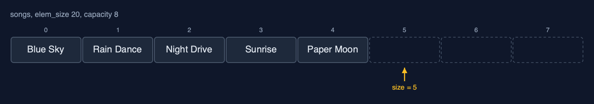

# Dynamic Array (Generic) — Cheat Sheet

**A generic dynamic array in C is a block of bytes with an element size, a size and a capacity: appending copies elem_size bytes into the next place, a full block is replaced by one twice as big with every element's bytes copied across, and comparisons go through a function pointer; the costs are those of any dynamic array.**

| | |
| --- | --- |
| **What it is** | A generic dynamic array in C is a growable byte block with an element size: it doubles when full by copying every element's bytes, halves when a quarter full, and compares through a function pointer. |
| **Everyday picture** | Moving house with boxes of any size, as long as they are all the same size |
| **Use it when** | A growing list of values of one type, in C, where the type varies from use to use; Mostly appending at the end and reading by index |
| **Avoid it when** | Only one element type is ever needed: the typed version is simpler and checked by the compiler; Frequent insertion and deletion at the front: every element shifts; use a linked list or a deque |
| **Already in C** | `realloc` in `<stdlib.h>`, which grows any block of bytes by copying it |

## Costs

| Operation | What it does | Time: best / average / worst | Extra space | In the example |
| --- | --- | --- | --- | --- |
| Traverse | Print each element with a print function | O(n) / O(n) / O(n) | O(1) | one call per element |
| Access / update | memcpy elem_size bytes at data + i x elem_size | O(1) / O(1) / O(1) | O(1) | 1 step |
| Insert at end `append` | memcpy into place size; double first when full | O(1) / O(1) amortised / O(n) when it resizes | O(1) amortised; O(n) for the new block during a resize | 1,020 elements copied over 1,000 appends |
| Resize (inside append) | A new block of twice the capacity, every element's bytes copied | O(n) / O(n) / O(n), but rare | O(n) | 4 songs, 80 bytes, at the 5th song |
| Insert `insert_at` | Shift elements pos..size-1 right, memcpy the new one in | O(1) at the end / O(n) / O(n) at the front | O(1), plus a resize when full | 9 shifts at the front of 9 songs |
| Delete at end `delete_at_end` | Copy the last element out; halve when a quarter full | O(1) / O(1) amortised / O(n) when it shrinks | O(1) amortised | 0 shifts |
| Delete `delete_at` | Copy the element out, shift the later ones left | O(1) at the end / O(n) / O(n) at the front | O(1) | 4 shifts to delete index 5 of 10 |
| Linear search | compare(element i, key) for each i in turn | O(1) / O(n) / O(n) | O(1) | 7 comparisons to find Echoes |
| Shrink to fit | Resize to exactly size places | O(n) / O(n) / O(n) | O(n) | 8 songs copied |

## Compared with related structures

The generic dynamic array against its neighbours (n elements):

| Property | Generic dynamic array | Dynamic array of char * | Generic static array |
| --- | --- | --- | --- |
| Element types | any, given its size | char * only | any, given its size |
| Access element i | O(1) | O(1) | O(1) |
| Append | O(1) amortised | O(1) amortised | overflow when full |
| Insert or delete at the front | O(n) shifts | O(n) shifts | O(n) shifts |
| Moves elements with | memcpy of elem_size bytes | pointer assignment | memcpy |
| Type checked by the compiler | no: void * | yes | no: void * |

## Watch out for

- **The wrong element size**: Pass `sizeof` of the element type itself: `create(&a, sizeof(Song))`.
- **Keeping a pointer into the block across an append**: Keep indexes, not pointers, or fetch the address again after every append.
- **Forgetting to free the old block in a resize**: `free` it after copying, as `resize` does, or use `realloc`, which does both.
- **Growing by a fixed amount**: Grow by a factor: double, or one and a half.
