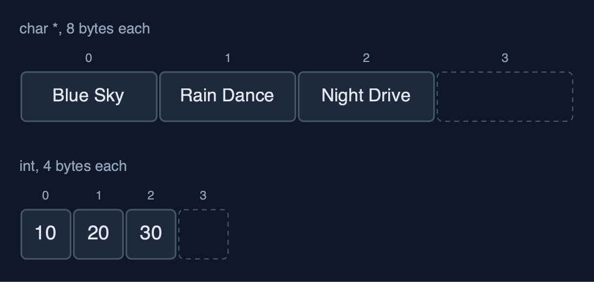
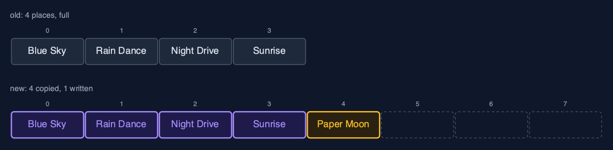

# Dynamic Array (Generic), Explained

## In one sentence

A generic dynamic array in C is a growable byte block with an element size: it doubles when full by copying every element's bytes, halves when a quarter full, and compares through a function pointer.

## The picture


*A GenericDynamicArray of Songs: 20 bytes each, size 5, capacity 8*

## The everyday idea

Picture moving house with boxes: the removals firm does not need to know what is in the boxes, only that every box is the same size, 20 centimetres, say. When the van is full, the firm brings one twice as big and carries every box across. To find "the box with the Echoes record", the firm asks you, the person who knows what is inside, to check each box.

## The 5 acts

### Act 1: One array type, any element type

Three playlists use one array type: titles as `char *` pointers (8 bytes each on a 64-bit machine), play counts as `int`s (4 bytes), and `Song` structs (a 16-character title and a length: 20 bytes). The array knows only the element size. Each starts with capacity 4 and holds 3 elements.



**Three arrays, one type: only the element size differs** Here are two of them. Titles and play counts. The same code, four places each, three in use.

What the demo printed:

```
titles (char *): [Blue Sky, Rain Dance, Night Drive]
plays (int):     [10, 20, 30]
songs (Song):    [Blue Sky (3:34), Rain Dance (3:07), Night Drive (4:03)]
elem_size 8, 4 and 20 bytes; capacity 4, size 3 each
```

### Act 2: Full? Double it, copying bytes

After the fourth song the block is full, so appending "Paper Moon" allocates a block for 8 songs and copies the 4 songs across, 4 x 20 = 80 bytes, before copying the new song in and freeing the old block. Four more songs follow; the ninth doubles the capacity again to 16.



**The resize: a block of 8, the 4 songs' bytes copied, then Paper Moon** Here is the resize. The old block of four, and the new block of eight. Four songs copied, and the new one written.

What the demo printed:

```
append(Paper Moon): full, new block of 8 songs, 4 songs copied (80 bytes)
9 songs appended, capacity 16
```

### Act 3: The middle, and comparison functions

Inserting an intro at the front shifts all 9 songs one place right, 20 bytes each; deleting "Paper Moon" at index 5 shifts the 4 after it left. Searching needs a comparison function: `compare_song` compares the title with `strcmp` and then the length. Echoes at 3:21 is found at index 6 after 7 comparisons; Echoes at 3:20 is not found, because to this comparison function it is a different song.


**linear_search with compare_song: indexes 0 to 5 differ, index 6 matches** Here is the search. Six songs that do not match. The seventh, Echoes, matches in title and length.

What the demo printed:

```
insert_at(0, Intro (0:42)): 9 songs shifted right
delete_at(5) removed Paper Moon: 4 songs shifted left
linear_search(Echoes (3:21), compare_song) = index 6 after 7 comparisons: title and length compared
linear_search(Echoes (3:20)) = -1: a different length is a different song
```

### Act 4: Deleting, and giving memory back

With 9 songs in 16 places, 7 are spare. `delete_at_end` copies "Last Train" out to the caller's variable, since the array's own bytes may be reused or freed. `shrink_to_fit` then resizes to exactly 8 places, copying 8 songs and freeing the larger block.


**After shrink_to_fit: eight songs in exactly eight places** Here is the result. Eight songs, eight places, no spare room.

What the demo printed:

```
capacity 16, size 9: 7 places spare
delete_at_end() removed Last Train; its bytes were copied out to the caller
shrink_to_fit(): capacity 8, 8 songs copied
```

### Act 5: The bill

A thousand appends of ints copy 4 + 8 + ... + 512 = 1,020 elements in total, about one per append: O(1) amortised, as in the `char *` version. Deleting from the end down to 256, a quarter of 1,024, halves the capacity to 512. `void *` changes the element type, not the algorithm or its costs; `realloc` does the grow-and-copy for any block of bytes.


**Elements copied at each resize: 4, 8, 16 ... 512, about one per append** Here are the copies at each resize. Four, eight, sixteen, doubling each time, up to five hundred and twelve.

What the demo printed:

```
1,000 appends of ints: 1,020 elements copied, about 1 per append
delete_at_end down to 256 of capacity 1024: capacity halves to 512
the same costs as the char * dynamic array: void * changes the type, not the algorithm
already in C: realloc does the grow-and-copy for any block of bytes
```

## The operations in code

### Resize: copying bytes

```c
/** A new block of new_capacity elements; the bytes of every element copied; the old block freed. O(n). */
static Status resize(GenericDynamicArray *a, int new_capacity) {
    unsigned char *new_data = malloc((size_t) (new_capacity > 0 ? new_capacity : 1) * a->elem_size);
    if (new_data == NULL) {
        return STATUS_NO_MEMORY;
    }
    for (int i = 0; i < a->size; i++) {
        memcpy(new_data + (size_t) i * a->elem_size, element_at(a, i), a->elem_size);
    }
    free(a->data);
    a->data = new_data;
    a->capacity = new_capacity;
    return STATUS_OK;
}
```

A new block of `new_capacity x elem_size` bytes, each element's bytes copied with `memcpy`, and the old block freed. The array never knows whether it is copying songs, numbers or pointers.

### Insertion at the end

```c
/** Insertion at the end: copy elem into place size, doubling first when full. O(1) amortised. */
Status append(GenericDynamicArray *a, const void *elem) {
    if (a->size == a->capacity) {
        Status s = resize(a, a->capacity == 0 ? 1 : a->capacity * 2);
        if (s != STATUS_OK) {
            return s;
        }
    }
    memcpy(element_at(a, a->size), elem, a->elem_size);
    a->size++;
    return STATUS_OK;
}
```

If `size == capacity` the block is full, so it is replaced by one twice as big first; then `elem_size` bytes are copied into place `size`. Most appends are one `memcpy`; the rare one that resizes costs O(n).

### Linear search with a comparison function

```c
/** Linear search: the first index whose element compares equal to key, or -1. O(n). */
int linear_search(const GenericDynamicArray *a, const void *key, CompareFn compare) {
    for (int i = 0; i < a->size; i++) {
        if (compare(element_at(a, i), key) == 0) {
            return i;
        }
    }
    return -1;
}
```

`compare(element_at(a, i), key) == 0` asks the function passed in whether two elements are equal. `compare_song` compares the title with `strcmp` and then the length, so a song of the same title but a different length is a different song.

## The operations, and what they cost

| Operation | What it does | Time: best / average / worst | Extra space | In the example |
| --- | --- | --- | --- | --- |
| Traverse | Print each element with a print function | O(n) / O(n) / O(n) | O(1) | one call per element |
| Access / update | memcpy elem_size bytes at data + i x elem_size | O(1) / O(1) / O(1) | O(1) | 1 step |
| Insert at end `append` | memcpy into place size; double first when full | O(1) / O(1) amortised / O(n) when it resizes | O(1) amortised; O(n) for the new block during a resize | 1,020 elements copied over 1,000 appends |
| Resize (inside append) | A new block of twice the capacity, every element's bytes copied | O(n) / O(n) / O(n), but rare | O(n) | 4 songs, 80 bytes, at the 5th song |
| Insert `insert_at` | Shift elements pos..size-1 right, memcpy the new one in | O(1) at the end / O(n) / O(n) at the front | O(1), plus a resize when full | 9 shifts at the front of 9 songs |
| Delete at end `delete_at_end` | Copy the last element out; halve when a quarter full | O(1) / O(1) amortised / O(n) when it shrinks | O(1) amortised | 0 shifts |
| Delete `delete_at` | Copy the element out, shift the later ones left | O(1) at the end / O(n) / O(n) at the front | O(1) | 4 shifts to delete index 5 of 10 |
| Linear search | compare(element i, key) for each i in turn | O(1) / O(n) / O(n) | O(1) | 7 comparisons to find Echoes |
| Shrink to fit | Resize to exactly size places | O(n) / O(n) / O(n) | O(n) | 8 songs copied |

## Compared with related structures

The generic dynamic array against its neighbours (n elements):

| Property | Generic dynamic array | Dynamic array of char * | Generic static array |
| --- | --- | --- | --- |
| Element types | any, given its size | char * only | any, given its size |
| Access element i | O(1) | O(1) | O(1) |
| Append | O(1) amortised | O(1) amortised | overflow when full |
| Insert or delete at the front | O(n) shifts | O(n) shifts | O(n) shifts |
| Moves elements with | memcpy of elem_size bytes | pointer assignment | memcpy |
| Type checked by the compiler | no: void * | yes | no: void * |

## The verdict

This is how C code builds growable containers for any type; use it when several types need the same structure, and the typed version when only one does.

## How to recognise it in code you did not write

- A struct with `unsigned char *data`, `size_t elem_size`, `size` and `capacity`.
- `memcpy(data + size * elem_size, elem, elem_size)` in an append.
- A resize that allocates, copies and frees, or calls `realloc`.

## Where you have already met this

- `realloc` growing a buffer in any C program.
- Java's `ArrayList<E>` and C++'s `std::vector<T>`, the typed equivalents in other languages.
