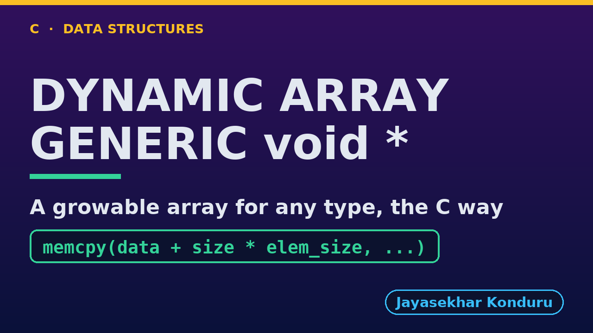

# YouTube — Dynamic Array (Generic)

Everything needed to publish `video/dynamic-array-generic-explained.mp4`. Copy the fields straight out of this file.

Chapter timings come from the video's `.srt`; they are regenerated whenever the video is rebuilt.

## Title

```
Generic Dynamic Array in C - A Growable Array for Any Type
```

58 characters (YouTube shows about 60 before cutting a title off in search).

## Description

The first two lines are what a viewer sees above the fold, so they carry the hook rather than the boilerplate.

```
Generic Dynamic Array in C, explained with a playlist of Song structs, beside the same code holding titles and play counts. We see what the array holds: a block of bytes, an element size of 8, 4 or 20 bytes, a size and a capacity. We append until the block is full and watch a resize copy 4 songs, 80 bytes, into a block twice as big. We insert at the front with 9 shifts, delete from the middle with 4, and find a song by title and length with a comparison function, while a song of a different length is not found. We shrink to fit, and finish with the bill: 1,020 elements copied for 1,000 appends, and the capacity halving when a quarter full. The char * version is the Dynamic Array project.

CHAPTERS
00:00 Introduction
00:41 The Everyday Idea
01:09 The Words
01:36 Act One — One array type, any element type
01:56 One array type, any element type
02:06 Act Two — Full? Double it, copying bytes
02:27 Full? Double it, copying bytes
02:38 Act Three — The middle, and comparison functions
03:06 The middle, and comparison functions
03:16 Act Four — Deleting, and giving memory back
03:31 Deleting, and giving memory back
03:38 Act Five — The bill
04:00 The bill
04:10 Time and Space Complexity
04:34 Compared With Related Structures
04:54 Common Mistakes
05:14 Thanks for Watching

SOURCE CODE, WRITTEN NOTES AND AN INTERACTIVE ANIMATION
https://github.com/jk-boot-up/datastructures/tree/main/dsa-c/arrays-and-lists/dynamic-array-generic

WHAT YOU NEED FIRST
C basics: variables, loops, functions, structs and pointers. No data-structures knowledge is assumed; START-HERE.md in the repository explains memory, pointers and counting steps.
```

## Chapters

YouTube shows these as chapters because there are at least three and the first is at `00:00`.

```
00:00 Introduction
00:41 The Everyday Idea
01:09 The Words
01:36 Act One — One array type, any element type
01:56 One array type, any element type
02:06 Act Two — Full? Double it, copying bytes
02:27 Full? Double it, copying bytes
02:38 Act Three — The middle, and comparison functions
03:06 The middle, and comparison functions
03:16 Act Four — Deleting, and giving memory back
03:31 Deleting, and giving memory back
03:38 Act Five — The bill
04:00 The bill
04:10 Time and Space Complexity
04:34 Compared With Related Structures
04:54 Common Mistakes
05:14 Thanks for Watching
```

## Tags

```
dynamic array in c, generic array, void pointer, memcpy, realloc, amortized, data structures, c data structures, c programming, c17, algorithms, computer science, programming tutorial, beginner, big o
```

200 characters, under YouTube's 500 limit.

## Thumbnail



Upload `docs/thumbnail.png` (1280×720) under **Details → Thumbnail → Upload file**. It is made for the small size YouTube shows in search: the name, one line of promise and one piece of code.

## Upload checklist

- [ ] Upload `video/dynamic-array-generic-explained.mp4` (1080p, H.264, 30 fps, AAC 48 kHz)
- [ ] Set the video language to **English**, then add subtitles: *Upload file → With timing* → `video/dynamic-array-generic-explained.srt`
- [ ] Upload `docs/thumbnail.png` as the thumbnail
- [ ] Paste the title, description and tags from above
- [ ] Add to the **Data Structures in C** playlist
- [ ] Wait for 1080p processing before sharing the link

## Runtime

05:58.
