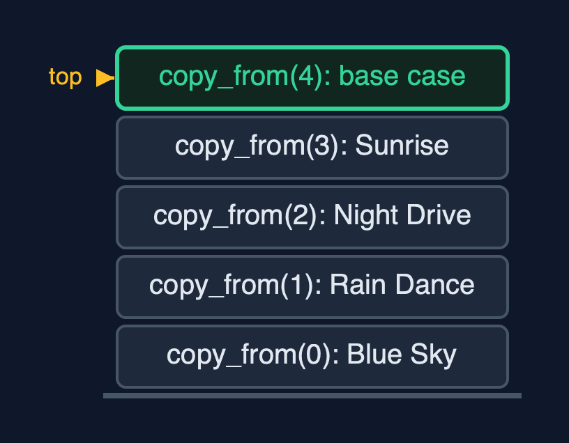
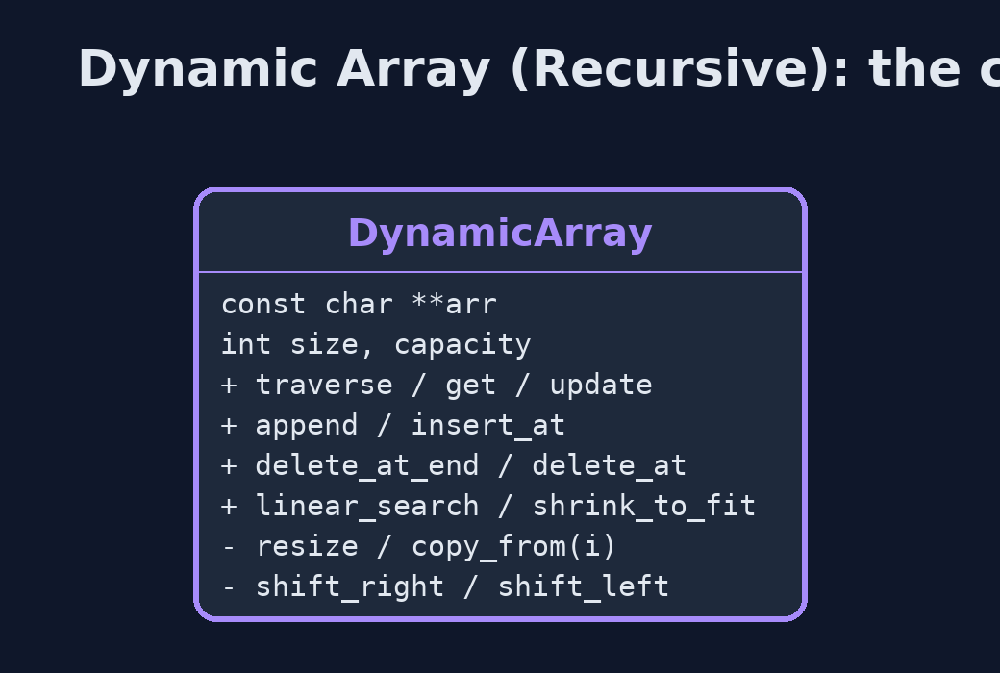
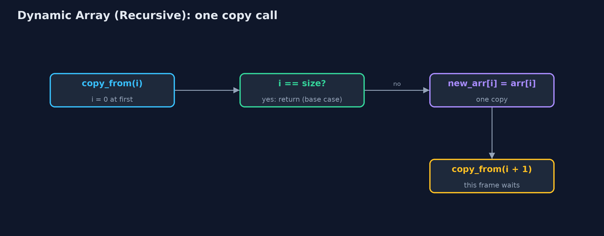
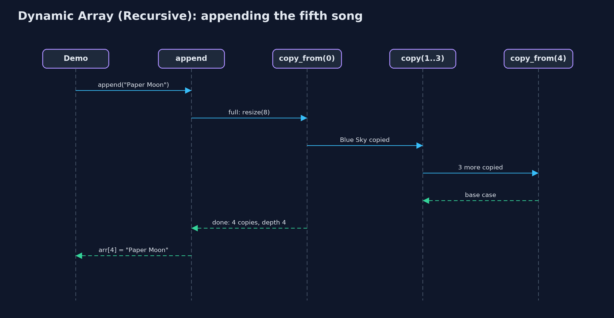

# Dynamic Array (Recursive)

**The recursive dynamic array doubles when full and halves when a quarter full, like any dynamic array, but copies, shifts, traverses and searches recursively: the time is unchanged, and the extra space is one call-stack frame per element, so a large resize can overflow the stack.**



*A recursive resize from 4 to 8: copy_from(0) waits for copy_from(1) ... down to the base case copy_from(4)*

A **dynamic array** keeps a static array inside, with a **size** (elements in use) and a **capacity** (places available): appending writes into the next spare place, a full array is **resized** to twice the capacity, and a quarter-full array is halved. This project is the `dynamic-array` project with every loop written as a **recursion**: traversal, linear search, the shifts of insertion and deletion, and the **copy inside a resize**. Each recursive function handles one element and calls itself for the rest, stopping at a **base case**. The time of every operation is unchanged. The extra space is not: each call still waiting keeps a **frame** on the **call stack**, so a resize of n elements needs n frames, and a large enough resize overflows the stack.

> New to data structures? Read [Start here](../../START-HERE.md) first: it explains memory, pointers and counting steps in ten minutes.

## The everyday idea

Picture a family moving house, carrying one box at a time down a line of helpers. The first helper carries box 0 and then asks the next helper to carry the rest, and waits there until the whole move is finished. The second helper carries box 1, asks the next, and waits too. The last helper finds no boxes left and says "done", and only then can everyone go home. With four boxes, four helpers wait at once. With a million boxes, you would need a million helpers standing in the corridor at the same time, and the corridor is not that long: that is a stack overflow.

## The worked example: A growing music playlist, with every loop written as a recursion

The playlist from the `dynamic-array` project starts with room for four songs. The demo traces the recursive copy when the fifth song arrives, grows the playlist to nine songs, inserts an intro at the front, deletes a song from the middle, searches, shrinks, and finally tries to append a million songs.

## Why it exists

Writing the loops of a dynamic array as recursions shows two things. First, how a loop becomes a recursion: the loop variable becomes a parameter, the loop condition becomes the base case, and `i++` becomes the call with `i + 1`. Second, why real code does not do this for linear passes: the resize, an operation the programmer never calls directly, suddenly needs as many stack frames as there are elements, and an ordinary `append` can crash the program.

## New words

| Word | What it means here |
| --- | --- |
| **size and capacity** | The number of elements in use, and the number of places in the array inside. |
| **resize** | A new array of a different capacity, with every element copied across; here the copy is recursive. |
| **base case** | The call that returns without calling again: `i == size`, nothing left to copy, visit or compare. |
| **call stack and frame** | One frame per call that has not yet returned, holding its parameters, such as `i`. |
| **recursion depth** | The most frames at once: 4 for a resize of 4 elements, n for a resize of n. |
| **amortised O(1)** | The average time per append, counting the rare resize: unchanged by writing the copy recursively. |

## What you will see, act by act

Run the demo and it tells the story in 5 acts; `make test` checks that it still prints exactly `tests/expected-output.txt`:

```bash
make run
```

| Act | What it shows |
| --- | --- |
| 1. A recursive copy | The fifth song needs a resize to 8: copy_from(0) copies Blue Sky and calls copy_from(1), down to the base case copy_from(4); 4 copies at depth 4. |
| 2. Growing | The ninth song resizes to 16 with 8 copies at depth 8; 9 appends make 2 resizes and 12 copies; traversal is 9 calls deep. |
| 3. The middle, recursively | insert_at(0, "Intro") shifts 9 songs at depth 9; delete_at(5) shifts 4 at depth 4; linear_search("Firefly") finds index 7 at depth 8. |
| 4. Shrinking, recursively | shrink_to_fit copies 9 songs at depth 9 into exactly 9 places; deleting 17 songs down to 8 halves 32 places to 16 with 8 copies at depth 8. |
| 5. The limit of recursion | Appending 1,000,000 songs overflows the call stack inside a resize, long before the end; the child process running it is stopped by SIGSEGV; the loop version finishes. |

Each act is drawn step by step in [the explained walkthrough](docs/dynamic-array-recursive-explained.md) and in [the animation](docs/animation.html).

## The operations, and what they cost

Time is given for the best, average and worst case in Big-O notation (START-HERE.md explains it by counting steps); the last column is what that costs in the worked example, as the demo prints it.

| Operation | What it does | Time: best / average / worst | Extra space (call stack) | Same operation as a loop | In the example |
| --- | --- | --- | --- | --- | --- |
| Traverse | Visit arr[i], then traverse from i + 1 | O(n) / O(n) / O(n) | O(n) | O(1) | depth 9 for 9 songs |
| Access `get(i)` / update | One address calculation (not recursive) | O(1) / O(1) / O(1) | O(1) | O(1) | 1 step |
| Insert at end `append(x)` | Write arr[size]; recursive resize first when full | O(1) / O(1) amortised / O(n) when it resizes | O(1), or O(n) during a resize | O(1), plus the new array | 4 copies at depth 4; 8 at depth 8 |
| Resize (inside append) | copy_from(i): new_arr[i] = arr[i], then copy_from(i + 1) | O(n) / O(n) / O(n) | O(n) | O(1), plus the new array | 12 copies over 9 appends |
| Insert `insert_at(pos, x)` | shift_right from the last element down to pos | O(1) at the end / O(n) / O(n) at the front | O(n - pos) | O(1) | 9 shifts at depth 9 |
| Delete `delete_at(pos)` | shift_left from pos, clear the freed place | O(1) at the end / O(n) / O(n) at the front | O(n - pos) | O(1) | 4 shifts at depth 4 |
| Delete at end `delete_at_end()` | Clear arr[size-1]; halve (recursive copy) when a quarter full | O(1) / O(1) amortised / O(n) when it shrinks | O(1), or O(n) during a shrink | O(1) | 8 copies at depth 8 from 32 to 16 |
| Linear search | arr[i].equals(key)? If not, search from i + 1 | O(1) / O(n) / O(n) | O(n) | O(1) | 8 comparisons at depth 8 |
| Shrink to fit | Resize to exactly size places | O(n) / O(n) / O(n) | O(n) | O(1), plus the new array | 9 copies at depth 9 |

Extra space is the memory an operation needs besides the structure itself. A loop needs a fixed amount, O(1); a recursive operation needs one call-stack frame for every call still waiting, so its extra space is the depth of the recursion.

## The operations in code

### Resize with a recursive copy

```c
/** Replaces arr with a new array of new_capacity places, copied recursively. O(n) time and stack. */
static Status resize(DynamicArray *a, int new_capacity) {
    const char **new_arr = malloc((size_t) (new_capacity > 0 ? new_capacity : 1) * sizeof(const char *));
    if (new_arr == NULL) {
        return STATUS_NO_MEMORY;
    }
    copy_from(a, new_arr, 0);
    free(a->arr);
    a->arr = new_arr;
    a->capacity = new_capacity;
    return STATUS_OK;
}

/** Copies element i into new_arr, then the rest from i + 1. */
static void copy_from(const DynamicArray *a, const char **new_arr, int i) {
    if (i == a->size) {             /* base case: every element copied */
        return;
    }
    new_arr[i] = a->arr[i];
    copy_from(a, new_arr, i + 1);
}
```

`copy_from(i)` copies element i, then calls itself for i + 1; the base case is `i == size`, nothing left to copy. The loop `for (i = 0; i < size; i++)` has become the parameter `i`, the base case `i == size`, and the call with `i + 1`. Every frame waits until the last element is copied, so a resize of n elements is n frames deep.

### Insertion at the end

```c
/** Insertion at the end: one write, after a recursive resize when full. O(1) amortised. */
Status append(DynamicArray *a, const char *value) {
    if (a->size == a->capacity) {
        Status s = resize(a, a->capacity == 0 ? 1 : a->capacity * 2);
        if (s != STATUS_OK) {
            return s;
        }
    }
    a->arr[a->size] = value;
    a->size++;
    return STATUS_OK;
}
```

Not recursive itself, but when the array is full it calls `resize`, and with it the recursive copy. That is why an ordinary append can overflow the call stack once the array is large, and the program is stopped.

### Insertion at a position

```c
/** Insertion at pos: resize when full, then shift_right from the last element down to pos. */
Status insert_at(DynamicArray *a, int pos, const char *value) {
    if (pos < 0 || pos > a->size) {
        return STATUS_OUT_OF_RANGE;
    }
    if (a->size == a->capacity) {
        Status s = resize(a, a->capacity == 0 ? 1 : a->capacity * 2);
        if (s != STATUS_OK) {
            return s;
        }
    }
    shift_right(a, a->size - 1, pos);
    a->arr[pos] = value;
    a->size++;
    return STATUS_OK;
}

/** Moves element i one place right, then shifts the elements before it, down to pos. */
static void shift_right(DynamicArray *a, int i, int pos) {
    if (i < pos) {                  /* base case: every element from pos onwards has moved */
        return;
    }
    a->arr[i + 1] = a->arr[i];
    shift_right(a, i - 1, pos);
}
```

`shift_right(i, pos)` moves `arr[i]` one place right and recurses on `i - 1`, starting at the last element so nothing is overwritten; it stops when `i < pos`.

### Linear search

```c
/** Linear search, recursively. O(n) time and stack. */
int linear_search(const DynamicArray *a, const char *key) {
    return linear_search_from(a, key, 0);
}

/** Is the key at i? If not, search from i + 1. */
static int linear_search_from(const DynamicArray *a, const char *key, int i) {
    if (i == a->size) {
        return -1;                  /* base case: searched everything */
    }
    if (strcmp(a->arr[i], key) == 0) {
        return i;                   /* base case: found */
    }
    return linear_search_from(a, key, i + 1);
}
```

Two base cases: no elements left (-1) and a match (i). Otherwise the rest of the array is searched by the next call.

## Compared with related structures

The recursive dynamic array against the loop version and the related structures (n elements):

| Operation | Recursive dynamic array | Dynamic array (loops) | Recursive static array |
| --- | --- | --- | --- |
| Access element i | O(1) | O(1) | O(1) |
| Append | O(1) amortised; a resize O(n) time and O(n) stack | O(1) amortised; a resize O(n) time, O(1) extra | overflow when full |
| Insert or delete at the front | O(n) time and stack | O(n) time, O(1) extra | O(n) time and stack |
| Linear search | O(n) time and stack | O(n) time, O(1) extra | O(n) time and stack |
| A million elements | stack overflow inside a resize | fine | stack overflow in a linear recursion |

## The code

```
src/
├── demo.c           Tells the story of the recursive dynamic array in five acts
├── dynamic_array.c  The dynamic array's operations, written recursively: each loop has become a function calling itself
└── dynamic_array.h  A dynamic array (a resizable array) of strings whose operations are written recursively
tests/
├── check.c               The test harness's counters, and main: runs the tests and reports
├── check.h               A tiny test harness: RUN(test) runs one test function, CHECK(condition) records a failure
└── test_dynamic_array.c  Every behaviour the recursive dynamic array must have, including a real stack overflow
```

## Build and test

```bash
make test
```

7 tests in `test_dynamic_array.c`, and the demo's whole output compared with `tests/expected-output.txt`, so every number the docs quote is checked. Nothing depends on the clock, so every run gives the same result.

## Common mistakes

| The mistake | What goes wrong | The fix |
| --- | --- | --- |
| A resize copy with no base case | copy_from(i) keeps calling copy_from(i + 1) past the elements, reading memory that is not the array. | Stop at `i == size`, the number of elements, not the new capacity. |
| Forgetting that resize is recursive | An append that looks O(1) crashes the program with a stack overflow on a large array. | Keep hidden, linear work such as copying as a loop. |
| Shifting from pos upwards on insertion | Each element overwrites the next before it moves, copying one value everywhere. | Start shift_right at the last element and move down to pos. |
| Forgetting to free the old array after the recursive copy | Every resize leaks the old block. | `free` the old array once the copy has returned, as `resize` does. |

## Try it yourself

1. **Easy.** Write a recursive `int count(const DynamicArray *a, const char *key, int i)` returning how many elements from index i on are equal to `key`. What is its base case, and its extra space?
2. **Medium.** Rewrite the recursive `copy_from(i)` as a loop. Which part of the recursion became the loop condition, and which became `i++`?
3. **Harder.** Write a recursive copy that needs only O(log n) stack: copy the left half and the right half of a range by calling itself on each. Why is the depth logarithmic although every element is still copied?

The answers are in [docs/exercises.md](docs/exercises.md), below the questions, so they are not given away.

## When to use it

- Learning how each loop of a dynamic array becomes a recursion, with its base case.
- Small arrays, where the depth stays far below the call-stack limit.

## When not to

- Any array that may grow large: a recursive resize of a few tens of thousands of elements can overflow the call stack. Use the loops of `dynamic-array`.
- Performance-sensitive code: each call costs a frame, a jump and a return.

## Where you have already met this

- The `dynamic-array` project: the same structure with loops.
- The `static-array-recursive` project: the same recursive shifts and search on a fixed array.
- `ArrayList.add`, which resizes with a loop inside `Arrays.copyOf`.

## Technologies and versions

| Technology | Version | Used for |
| --- | --- | --- |
| C | C17 | the code, compiled with `-std=c17 -Wall -Wextra -Wpedantic -Werror -O0 -g` |
| Compiler | Apple clang version 14.0.3 (clang-1403.0.22.14.1) | any C17 compiler works; the Makefile uses `cc` |
| make | the system `make` | build, run and test: `make run`, `make test` |
| Tests | a hand-written harness, `tests/check.h` | no test library needed |
| videokit | course tool | the narrated video and animation: Piper `en_US-amy-medium`, speed 0.8, longer pauses (the `amy-slow` voice) |

## Learning material

| Document | What it is for |
| --- | --- |
| [Start here](../../START-HERE.md) | the ideas every project relies on |
| [Problem statement](docs/problem-statement.md) | the situation and what the project must show |
| [Prerequisites](docs/prerequisites.md) | what you need to know first |
| [Dynamic Array (Recursive), explained](docs/dynamic-array-recursive-explained.md) | every act, picture by picture |
| [Animated walkthrough](docs/animation.html) | the structure changing step by step, narrated |
| [Cheat sheet](docs/cheat-sheet.md) | the whole structure on one page |
| [Exercises and answers](docs/exercises.md) | practice, easy to harder |
| [Session guide](docs/session.md) | a one-hour lesson |
| [Specification](docs/spec.md) | what this project must be true of |

### How the pieces fit

The demo appends songs; a full array calls resize, which starts the recursive copy.


### The types and functions

Public operations on the left; the private recursive helpers they call are listed with a minus sign.



### How the data moves

The loop's condition became the base case; the loop's i++ became the call on i + 1.



### Who calls whom, in order

The append triggers a resize, whose copy goes four calls deep.



### Video

`video/dynamic-array-recursive-explained.mp4` (with `.m4a` audio and `.srt` subtitles) is built by `video/build_video.sh`. Rendered media is not committed.

## Where this sits

Part of the [data structures course](../../index.md), in *arrays-and-lists*.
