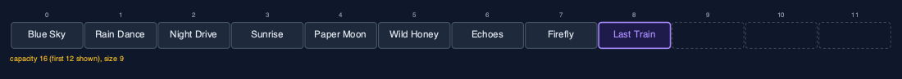
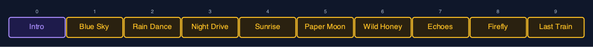
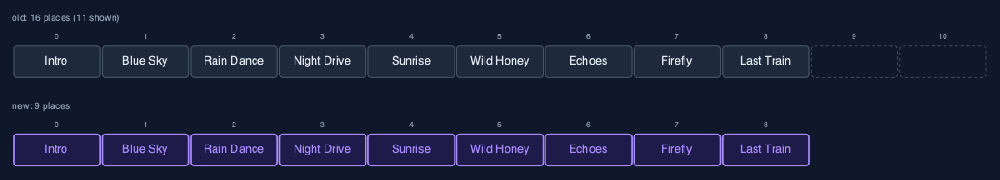
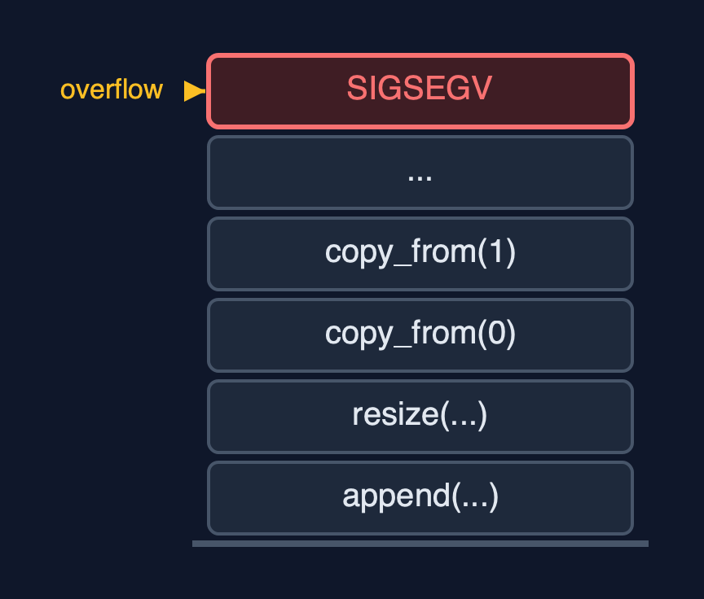

# Dynamic Array (Recursive), Explained

## In one sentence

The recursive dynamic array grows and shrinks like any dynamic array, but copies, shifts, traverses and searches by calling itself on the rest, so each operation keeps its time and gains O(n) stack, and a large resize overflows.

## The picture


*A recursive resize from 4 to 8: copy_from(0) waits for copy_from(1) ... down to the base case copy_from(4)*

## The everyday idea

Picture a family moving house, carrying one box at a time down a line of helpers. The first helper carries box 0 and then asks the next helper to carry the rest, and waits there until the whole move is finished. The second helper carries box 1, asks the next, and waits too. The last helper finds no boxes left and says "done", and only then can everyone go home. With four boxes, four helpers wait at once. With a million boxes, you would need a million helpers standing in the corridor at the same time, and the corridor is not that long: that is a stack overflow.

## The 5 acts

### Act 1: A recursive copy

With four songs the playlist is full, so appending "Paper Moon" first resizes it to eight places. The copy is recursive: `copy_from(0)` copies Blue Sky into the new array and calls `copy_from(1)`, which copies Rain Dance and calls `copy_from(2)`, and so on. `copy_from(4)` finds no elements left and returns: that is the base case. Then the four waiting calls return one by one, the new array replaces the old, and the song is written. Four copies, with four frames on the call stack at the deepest point.


**Four copy calls waiting on the stack, and the base case on top** Here is the call stack at the deepest point. Four copy calls, each waiting. On top, copy four, the base case. When it returns, the others return one by one.

What the demo printed:

```
capacity 4, size 4: full
copy_from(0): new_arr[0] = Blue Sky, then copy_from(1)
  ... Rain Dance, Night Drive, Sunrise
copy_from(4): no elements left   <- base case
4 copies, one call each, depth 4, then 1 write; capacity 8
```

### Act 2: Growing

The next three songs fill the spare places with one write each. The ninth song finds the array full again, and the resize to 16 copies 8 songs, 8 frames deep. Nine appends, two resizes, twelve copies: exactly the same counts as the loop version, because recursion does not change the time. Traversing the nine songs recursively goes 9 calls deep.



**After the second resize: 9 songs in 16 places** Here is the playlist now. Nine songs in sixteen places. The second resize copied eight songs, with eight calls waiting at once.

What the demo printed:

```
append("Last Train"): capacity 16, 8 copies at depth 8
9 songs appended, 2 resizes, 12 copies in total
traverse: [Blue Sky, ... Last Train], depth 9
```

### Act 3: The middle, recursively

Inserting "Intro" at the front calls `shift_right` from the last song down to index 0: 9 shifts, 9 frames. Deleting index 5, "Paper Moon", calls `shift_left` from index 5: 4 shifts, 4 frames, and the freed place is cleared. A recursive linear search for "Firefly" asks `equals` at indexes 0 to 7 and finds it at index 7: 8 comparisons, 8 frames. In every case the depth equals the number of elements visited.



**insert_at(0, "Intro"): shift_right moved all 9 songs, one call each** Here is the insertion. Intro, in purple, at index zero. The nine songs after it, in amber, each moved by one call of shift right.

What the demo printed:

```
insert_at(0, "Intro"): 9 shifts, depth 9
delete_at(5) removed "Paper Moon": 4 shifts, depth 4
linear_search("Firefly") = index 7: 8 comparisons, depth 8
```

### Act 4: Shrinking, recursively

With 9 songs in 16 places, `shrink_to_fit` resizes to exactly 9 places: a recursive copy of 9 songs, 9 frames deep. Shrinking also happens by itself: an array of 17 songs has 32 places, and deleting from the end down to 8 songs, a quarter of 32, halves the capacity to 16 with a recursive copy of 8 songs.



**shrink_to_fit: 16 places become 9, copied recursively** Here is the shrink. The old array had sixteen places. The new one has exactly nine, and every song was copied by its own call.

What the demo printed:

```
capacity 16, size 9
shrink_to_fit(): capacity 9, 9 copies at depth 9
17 songs in 32 places, delete_at_end down to 8: capacity 16 (a resize copying 8 songs, depth 8)
```

### Act 5: The limit of recursion

Appending a million songs works until a resize has to copy more elements than the call stack has room for frames. Then the recursive copy overflows the call stack, from inside an `append`, and the operating system stops the program with `SIGSEGV`; C cannot catch that, so the demo runs the appends in a child process and reports how it ended. This happens an operation that looks O(1) to its caller. The `dynamic-array` project copies with a loop in O(1) extra space and finishes. This is the lesson of the project: recursion is fine when the depth is small, but a linear recursion hidden inside a routine operation becomes a crash as soon as the data grows.



**A large resize needs one frame per element: the call stack runs out** Here is the problem. One copy call per element, all waiting. For a big resize, that is more frames than the call stack can hold.

What the demo printed:

```
1,000,000 appends: the child process was killed by SIGSEGV inside a resize, long before the end
a recursive copy needs one frame per element, so a large resize overflows the call stack
the dynamic-array project copies with a loop, in O(1) extra space, and finishes
```

## The operations in code

### Resize with a recursive copy

```c
/** Replaces arr with a new array of new_capacity places, copied recursively. O(n) time and stack. */
static Status resize(DynamicArray *a, int new_capacity) {
    const char **new_arr = malloc((size_t) (new_capacity > 0 ? new_capacity : 1) * sizeof(const char *));
    if (new_arr == NULL) {
        return STATUS_NO_MEMORY;
    }
    copy_from(a, new_arr, 0);
    free(a->arr);
    a->arr = new_arr;
    a->capacity = new_capacity;
    return STATUS_OK;
}

/** Copies element i into new_arr, then the rest from i + 1. */
static void copy_from(const DynamicArray *a, const char **new_arr, int i) {
    if (i == a->size) {             /* base case: every element copied */
        return;
    }
    new_arr[i] = a->arr[i];
    copy_from(a, new_arr, i + 1);
}
```

`copy_from(i)` copies element i, then calls itself for i + 1; the base case is `i == size`, nothing left to copy. The loop `for (i = 0; i < size; i++)` has become the parameter `i`, the base case `i == size`, and the call with `i + 1`. Every frame waits until the last element is copied, so a resize of n elements is n frames deep.

### Insertion at the end

```c
/** Insertion at the end: one write, after a recursive resize when full. O(1) amortised. */
Status append(DynamicArray *a, const char *value) {
    if (a->size == a->capacity) {
        Status s = resize(a, a->capacity == 0 ? 1 : a->capacity * 2);
        if (s != STATUS_OK) {
            return s;
        }
    }
    a->arr[a->size] = value;
    a->size++;
    return STATUS_OK;
}
```

Not recursive itself, but when the array is full it calls `resize`, and with it the recursive copy. That is why an ordinary append can overflow the call stack once the array is large, and the program is stopped.

### Insertion at a position

```c
/** Insertion at pos: resize when full, then shift_right from the last element down to pos. */
Status insert_at(DynamicArray *a, int pos, const char *value) {
    if (pos < 0 || pos > a->size) {
        return STATUS_OUT_OF_RANGE;
    }
    if (a->size == a->capacity) {
        Status s = resize(a, a->capacity == 0 ? 1 : a->capacity * 2);
        if (s != STATUS_OK) {
            return s;
        }
    }
    shift_right(a, a->size - 1, pos);
    a->arr[pos] = value;
    a->size++;
    return STATUS_OK;
}

/** Moves element i one place right, then shifts the elements before it, down to pos. */
static void shift_right(DynamicArray *a, int i, int pos) {
    if (i < pos) {                  /* base case: every element from pos onwards has moved */
        return;
    }
    a->arr[i + 1] = a->arr[i];
    shift_right(a, i - 1, pos);
}
```

`shift_right(i, pos)` moves `arr[i]` one place right and recurses on `i - 1`, starting at the last element so nothing is overwritten; it stops when `i < pos`.

### Linear search

```c
/** Linear search, recursively. O(n) time and stack. */
int linear_search(const DynamicArray *a, const char *key) {
    return linear_search_from(a, key, 0);
}

/** Is the key at i? If not, search from i + 1. */
static int linear_search_from(const DynamicArray *a, const char *key, int i) {
    if (i == a->size) {
        return -1;                  /* base case: searched everything */
    }
    if (strcmp(a->arr[i], key) == 0) {
        return i;                   /* base case: found */
    }
    return linear_search_from(a, key, i + 1);
}
```

Two base cases: no elements left (-1) and a match (i). Otherwise the rest of the array is searched by the next call.

## The operations, and what they cost

| Operation | What it does | Time: best / average / worst | Extra space (call stack) | Same operation as a loop | In the example |
| --- | --- | --- | --- | --- | --- |
| Traverse | Visit arr[i], then traverse from i + 1 | O(n) / O(n) / O(n) | O(n) | O(1) | depth 9 for 9 songs |
| Access `get(i)` / update | One address calculation (not recursive) | O(1) / O(1) / O(1) | O(1) | O(1) | 1 step |
| Insert at end `append(x)` | Write arr[size]; recursive resize first when full | O(1) / O(1) amortised / O(n) when it resizes | O(1), or O(n) during a resize | O(1), plus the new array | 4 copies at depth 4; 8 at depth 8 |
| Resize (inside append) | copy_from(i): new_arr[i] = arr[i], then copy_from(i + 1) | O(n) / O(n) / O(n) | O(n) | O(1), plus the new array | 12 copies over 9 appends |
| Insert `insert_at(pos, x)` | shift_right from the last element down to pos | O(1) at the end / O(n) / O(n) at the front | O(n - pos) | O(1) | 9 shifts at depth 9 |
| Delete `delete_at(pos)` | shift_left from pos, clear the freed place | O(1) at the end / O(n) / O(n) at the front | O(n - pos) | O(1) | 4 shifts at depth 4 |
| Delete at end `delete_at_end()` | Clear arr[size-1]; halve (recursive copy) when a quarter full | O(1) / O(1) amortised / O(n) when it shrinks | O(1), or O(n) during a shrink | O(1) | 8 copies at depth 8 from 32 to 16 |
| Linear search | arr[i].equals(key)? If not, search from i + 1 | O(1) / O(n) / O(n) | O(n) | O(1) | 8 comparisons at depth 8 |
| Shrink to fit | Resize to exactly size places | O(n) / O(n) / O(n) | O(n) | O(1), plus the new array | 9 copies at depth 9 |

## Compared with related structures

The recursive dynamic array against the loop version and the related structures (n elements):

| Operation | Recursive dynamic array | Dynamic array (loops) | Recursive static array |
| --- | --- | --- | --- |
| Access element i | O(1) | O(1) | O(1) |
| Append | O(1) amortised; a resize O(n) time and O(n) stack | O(1) amortised; a resize O(n) time, O(1) extra | overflow when full |
| Insert or delete at the front | O(n) time and stack | O(n) time, O(1) extra | O(n) time and stack |
| Linear search | O(n) time and stack | O(n) time, O(1) extra | O(n) time and stack |
| A million elements | stack overflow inside a resize | fine | stack overflow in a linear recursion |

## The verdict

Write these recursions to learn how loops and recursion correspond; keep the loops for real code. A dynamic array's linear passes, and above all the copy inside a resize, are exactly the kind of recursion that grows with the data and should be a loop.

## How to recognise it in code you did not write

- `copy_from(i + 1)` inside `copy`, with `if (i == size) return;` at the top.
- A public operation such as `append` whose hidden helper is recursive.

## Where you have already met this

- The `dynamic-array` project: the same structure with loops.
- The `static-array-recursive` project: the same recursive shifts and search on a fixed array.
- `ArrayList.add`, which resizes with a loop inside `Arrays.copyOf`.
