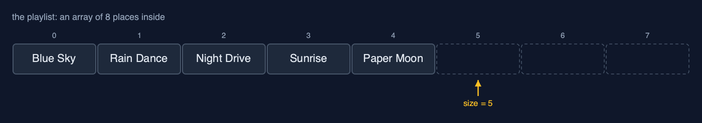
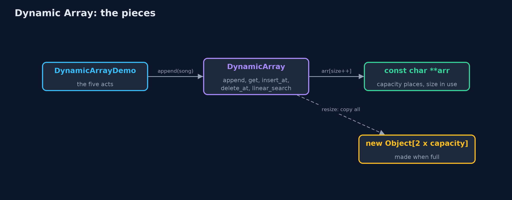
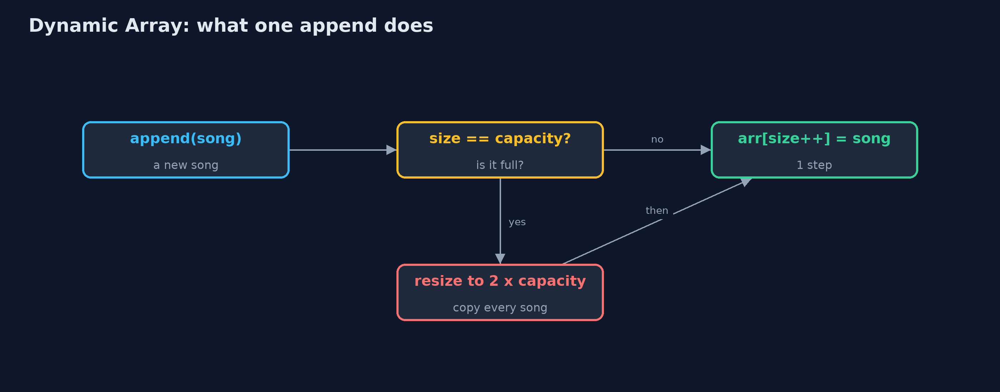

# Dynamic Array

**A dynamic array keeps a fixed array inside with some spare places; when it is full it shifts everything into a new array twice as big, so adding at the end stays cheap on average.**



*size 5, capacity 8: five songs in use and three spare places, dashed*

A **dynamic array** is an array that grows by itself. Inside, it keeps an ordinary fixed array with some spare places at the end. It remembers two numbers: the **size**, how many places are in use, and the **capacity**, how many places the inside array has. Adding a value puts it in the next spare place. When there are no spare places left, it makes a new array twice as big, copies every value across, and carries on. This is what Java's `ArrayList` and C++'s `std::vector` do, and this project builds it by hand in C.

> New to data structures? Read [Start here](../../START-HERE.md) first: it explains memory, pointers and counting steps in ten minutes.

## The everyday idea

Think of a family moving house. They buy a house with a few spare bedrooms. Each new child takes a spare room, and nothing else changes. When every room is full, they move to a house twice the size, carrying every belonging across in one big move. Moving is hard work, but because the new house is twice as big, it will be a long time before they have to move again. That is a dynamic array: cheap to add to almost every time, and an occasional big move.

## The worked example: A music playlist that grows as songs are added

A music app keeps a playlist of song titles. The listener appends songs one at a time, and nobody knows in advance how long the playlist will get. The playlist starts with room for four songs. The demo appends songs until it runs out of room, watches it grow, inserts an intro at the front, removes a song from the middle, and measures what a thousand songs cost.

## Why it exists

A static array cannot grow: a fifth song in a four-place array stops the program. The obvious fix, making a new array one place bigger every time, works but is ruinously slow: adding 1,000 songs that way copies 499,494 values, because every append copies everything already there. Doubling the capacity instead means the big copies happen rarely, and 1,000 songs cost only 1,020 copies, about one per song.

## New words

| Word | What it means here |
| --- | --- |
| **size** | How many places are in use: how many songs are in the playlist. |
| **capacity** | How many places the array inside has, used or not. Always at least the size. |
| **spare places** | Capacity minus size: room to add without growing. They are not part of the array. |
| **resize** | Making a new, bigger array inside and copying every value across. |
| **copy** | Carrying one value from the old array into the new one during a resize. The demo counts them. |
| **amortised cost** | The average cost of an operation over many uses, counting the rare expensive one. Adding is amortised one step. |

## What you will see, act by act

Run the demo and it tells the story in 5 acts; `make test` checks that it still prints exactly `tests/expected-output.txt`:

```bash
make run
```

| Act | What it shows |
| --- | --- |
| 1. A playlist in a fixed array | Four songs fill `const char *playlist[4]`; a fifth would be written past the end, and growing one place at a time would cost 499,494 copies for 1,000 songs. |
| 2. Size and capacity | The dynamic array keeps 4 places but only 3 in use: size 3, capacity 4; adding the fourth song is 1 step and fills it. |
| 3. Full? Double it | The fifth song makes an 8-place array and copies 4; the ninth makes 16 and copies 8. 1,000 songs cost 1,020 copies, not 499,494. |
| 4. The middle, and the spare places | insert_at(0) shifts 9 songs; delete_at(5) shifts 4; a spare place cannot be read; shrink_to_fit gives 7 places back. |
| 5. The bill | The one append that resizes at 512 songs copies all 512; at 513 songs 511 of 1,024 places are spare; deleting down to 256 halves the capacity. |

Each act is drawn step by step in [the explained walkthrough](docs/dynamic-array-explained.md) and in [the animation](docs/animation.html).

## The operations, and what they cost

Time is given for the best, average and worst case in Big-O notation (START-HERE.md explains it by counting steps); the last column is what that costs in the worked example, as the demo prints it.

| Operation | What it does | Time: best / average / worst | Extra space | In the example |
| --- | --- | --- | --- | --- |
| Traverse | Visit arr[0] to arr[size-1] once | O(n) / O(n) / O(n) | O(1) | one read per element |
| Access `get(i)` | Return arr[i], by address calculation | O(1) / O(1) / O(1) | O(1) | 1 step |
| Update `update(i, x)` | Replace arr[i] | O(1) / O(1) / O(1) | O(1) | 1 step |
| Insert at end `append(x)` | Store x at arr[size]; resize to double first when full | O(1) / O(1) amortised / O(n) when it resizes | O(1) amortised; O(n) for the new array during a resize | 1 write usually; 1,020 copies over 1,000 appends |
| Resize (inside append) | Allocate an array of twice the capacity and copy every element | O(n) / O(n) / O(n), but rare | O(n) | 4 copies at the 5th song, 8 at the 9th, 512 at the 513th |
| Insert `insert_at(pos, x)` | Shift arr[pos..size-1] right, store x | O(1) at the end / O(n) / O(n) at the front | O(1), plus a resize when full | 9 shifts to insert at the front of 9 songs |
| Delete at end `delete_at_end()` | Clear arr[size-1]; halve the capacity when a quarter full | O(1) / O(1) amortised / O(n) when it shrinks | O(1) amortised | 0 shifts; 1 resize going from 513 songs down to 256 |
| Delete `delete_at(pos)` | Shift arr[pos+1..size-1] left | O(1) at the end / O(n) / O(n) at the front | O(1) | 4 shifts to delete index 5 of 10 |
| Linear search | Compare each element with the key in turn | O(1) / O(n) / O(n) | O(1) | one comparison per element looked at |
| Shrink to fit | Resize to exactly size places | O(n) / O(n) / O(n) | O(n) | 9 copies for 9 songs |

Extra space is the memory an operation needs besides the structure itself. A loop needs a fixed amount, O(1); a recursive operation needs one call-stack frame for every call still waiting, so its extra space is the depth of the recursion.

## The operations in code

### Insertion at the end

```c
/** Insertion at the end: one write, after a resize when full. O(1) amortised, O(n) worst case. */
Status append(DynamicArray *a, const char *value) {
    if (a->size == a->capacity) {
        Status s = resize(a, new_capacity(a));
        if (s != STATUS_OK) {
            return s;
        }
    }
    a->arr[a->size] = value;
    a->size++;
    return STATUS_OK;
}
```

If `size == arr.length` the array is full, so it is replaced by a bigger one first; then the value goes into `arr[size]` and the size grows by one. Most appends are one write; the rare one that resizes costs O(n).

### Resize

```c
/** The capacity to grow to when full: double it, or (the costly way) one more place. */
static int new_capacity(const DynamicArray *a) {
    if (!a->doubling) {
        return a->capacity + 1;
    }
    return a->capacity == 0 ? 1 : a->capacity * 2;
}

/**
 * Replaces arr with a new array of new_capacity places, copying the elements across one by one,
 * then frees the old one. O(n). (realloc does the same job, and can sometimes grow in place; the
 * loop is written out here so the copying can be seen.)
 */
static Status resize(DynamicArray *a, int new_capacity) {
    const char **new_arr = malloc((size_t) (new_capacity > 0 ? new_capacity : 1) * sizeof(const char *));
    if (new_arr == NULL) {
        return STATUS_NO_MEMORY;
    }
    for (int i = 0; i < a->size; i++) {
        new_arr[i] = a->arr[i];
    }
    free(a->arr);
    a->arr = new_arr;
    a->capacity = new_capacity;
    return STATUS_OK;
}
```

`new_capacity` doubles (or, for the measured comparison, appends one place). `resize` allocates the new array and copies the elements one by one; the old array becomes garbage. Because each resize doubles the room, the copies over n appends add up to less than 2n: O(1) amortised per append.

### Deletion at the end, and shrinking

```c
/** Deletion at the end: O(1), apart from the occasional shrink. */
Status delete_at_end(DynamicArray *a, const char **deleted) {
    if (a->size == 0) {
        return STATUS_UNDERFLOW;
    }
    *deleted = a->arr[a->size - 1];
    a->size--;
    shrink_if_quarter_full(a);
    return STATUS_OK;
}

/** Halves the capacity when only a quarter is in use, so the next append cannot resize at once. */
static void shrink_if_quarter_full(DynamicArray *a) {
    if (a->doubling && a->size > 0 && a->size == a->capacity / 4) {
        resize(a, a->capacity / 2);
    }
}
```

When only a quarter of the array is in use, the capacity is halved. Halving at a quarter rather than at a half leaves room both ways, so appends and deletions alternating at the boundary cannot resize every time.

### Insertion at a position

```c
/** Insertion at pos: resize when full, shift arr[pos..size-1] right from the end, store. O(n - pos). */
Status insert_at(DynamicArray *a, int pos, const char *value) {
    if (pos < 0 || pos > a->size) {
        return STATUS_OUT_OF_RANGE;
    }
    if (a->size == a->capacity) {
        Status s = resize(a, new_capacity(a));
        if (s != STATUS_OK) {
            return s;
        }
    }
    for (int i = a->size - 1; i >= pos; i--) {
        a->arr[i + 1] = a->arr[i];
    }
    a->arr[pos] = value;
    a->size++;
    return STATUS_OK;
}
```

Resize first if full, then the same shift as a static array: from the end down to `pos`, so no element is overwritten before it has shifted.

## Compared with related structures

How a dynamic array compares with the structures it is usually weighed against (n elements):

| Operation | Dynamic array | Static array | Singly linked list |
| --- | --- | --- | --- |
| Access element i | O(1) | O(1) | O(n) |
| Insert at the end | O(1) amortised, O(n) on a resize | O(1), overflow when full | O(1) with a tail pointer |
| Insert or delete at the front | O(n) shifts | O(n) shifts | O(1) |
| Search (unsorted) | O(n) | O(n) | O(n) |
| Size | grows and shrinks by copying | fixed at creation | grows one node at a time |
| Extra memory | up to half the places spare after a resize | capacity - n places | one next pointer per node |
| Memory layout | consecutive | consecutive | scattered nodes |

## The code

```
src/
├── demo.c           Tells the story of the dynamic array in five acts
├── dynamic_array.c  The dynamic array's operations: a static array's loops, plus resizing when full or a quarter full
└── dynamic_array.h  A dynamic array (a resizable array) of strings: a static array inside, replaced by a bigger one when it is full
tests/
├── check.c               The test harness's counters, and main: runs the tests and reports
├── check.h               A tiny test harness: RUN(test) runs one test function, CHECK(condition) records a failure
└── test_dynamic_array.c  Every behaviour the dynamic array must have, including resizing both ways
```

## Build and test

```bash
make test
```

11 tests in `test_dynamic_array.c`, and the demo's whole output compared with `tests/expected-output.txt`, so every number the docs quote is checked. Nothing depends on the clock, so every run gives the same result.

## Common mistakes

| The mistake | What goes wrong | The fix |
| --- | --- | --- |
| Growing by one place at a time | Every add copies everything already stored: 1,000 songs cost 499,494 copies. | Grow by a factor (double, or one and a half), never by a fixed amount. |
| Treating capacity as size | Reading a spare place returns whatever garbage is in that memory: C does not check. | Only indexes 0 to size - 1 hold elements; check indexes against the size. |
| Forgetting to free the old array in a resize | Every resize leaks the old block: the program's memory grows and is never given back. | After copying into the new array, `free` the old one, as `resize` does (or use `realloc`, which does both). |
| Deleting from the front in a loop | Each remove shifts every other value: removing all 1,000 songs from the front makes about half a million shifts. | Delete from the end, or use a structure made for the front, such as a deque. |

## Try it yourself

1. **Easy.** A dynamic array starts with capacity 4 and doubles. What are its size and capacity after 10 appends, and how many resizes happened?
2. **Medium.** Write `int delete_by_key(DynamicArray *a, const char *key)`, which finds the first element equal to `key` and deletes it, returning 1 if it found one. Use the functions the file already has.
3. **Harder.** Change `new_capacity` to grow by one and a half times (`capacity + capacity / 2`, as Java's `ArrayList` does). Starting from 4 places, what capacities does it pass through for the first 20 appends, and why might a library prefer 1.5 to 2?

The answers are in [docs/exercises.md](docs/exercises.md), below the questions, so they are not given away.

## When to use it

- You do not know in advance how many values there will be.
- You mostly add at the end and read by position.
- You want one-step reads by index, like an array, without fixing the length.

## When not to

- You often insert or remove at the front or in the middle: every later value moves (a linked list or a deque suits that better).
- Every single append must be fast: the rare resize copies everything at once.
- Memory is very tight: up to half the places can sit unused.

## Where you have already met this

- `realloc` in C grows a block by copying it, exactly as a resize does.
- Java's `ArrayList` and C++'s `std::vector` are dynamic arrays.
- Python's `list` works the same way underneath.

## Technologies and versions

| Technology | Version | Used for |
| --- | --- | --- |
| C | C17 | the code, compiled with `-std=c17 -Wall -Wextra -Wpedantic -Werror -O0 -g` |
| Compiler | Apple clang version 14.0.3 (clang-1403.0.22.14.1) | any C17 compiler works; the Makefile uses `cc` |
| make | the system `make` | build, run and test: `make run`, `make test` |
| Tests | a hand-written harness, `tests/check.h` | no test library needed |
| videokit | course tool | the narrated video and animation: Piper `en_US-amy-medium`, speed 0.8, longer pauses (the `amy-slow` voice) |

## Learning material

| Document | What it is for |
| --- | --- |
| [Start here](../../START-HERE.md) | the ideas every project relies on |
| [Problem statement](docs/problem-statement.md) | the situation and what the project must show |
| [Prerequisites](docs/prerequisites.md) | what you need to know first |
| [Dynamic Array, explained](docs/dynamic-array-explained.md) | every act, picture by picture |
| [Animated walkthrough](docs/animation.html) | the structure changing step by step, narrated |
| [Cheat sheet](docs/cheat-sheet.md) | the whole structure on one page |
| [Exercises and answers](docs/exercises.md) | practice, easy to harder |
| [Session guide](docs/session.md) | a one-hour lesson |
| [Specification](docs/spec.md) | what this project must be true of |

### How the pieces fit

The demo appends songs to `DynamicArray`, which keeps a `malloc`ed array of `const char *` and swaps it for a bigger one when full.



### The types and functions

`DynamicArray` is the data structure: the array, its size and capacity, and whether it doubles.


### How the data moves

An append either writes into a spare place, or, when there is none, resizes first.



### Who calls whom, in order

The array is full, so the append resizes: a new array of 8, four copies, then the write.


### Video

`video/dynamic-array-explained.mp4` (with `.m4a` audio and `.srt` subtitles) is built by `video/build_video.sh`. Rendered media is not committed.

## Where this sits

Part of the [data structures course](../../index.md), in *arrays-and-lists*.
