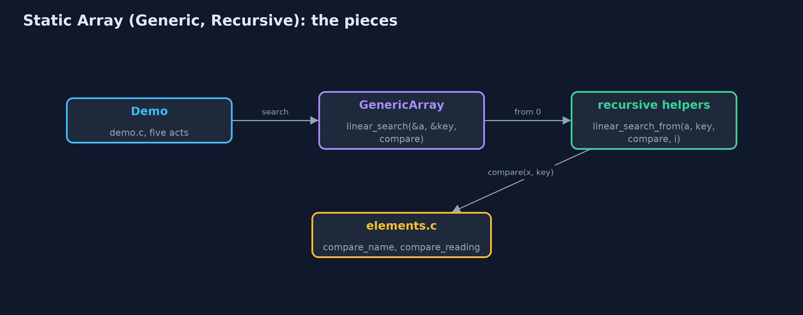
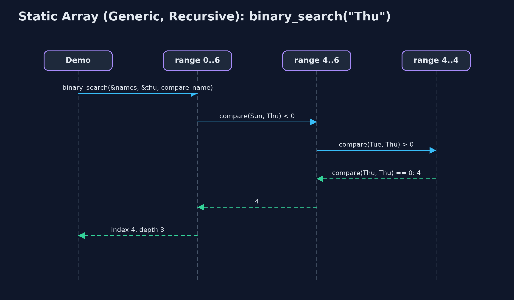

# Static Array (Generic, Recursive)

**The generic recursive static array in C holds any type as a block of bytes with an element size, compares through comparison functions, and writes every walk as a function that handles one element or one half and calls itself for the rest; the time is unchanged and the extra space is the recursion depth.**


*linear_search for "Thu": one call per element, each asking the comparison function*

This project combines the two variations of the **static array** in C. Like `static-array-generic`, it holds **any type** as a block of bytes with an **element size**, copies elements with **`memcpy`**, and compares them through **comparison functions**, `int compare(const void *, const void *)`, as `qsort` and `bsearch` do. Like `static-array-recursive`, every walk is a **recursion**: a function handles one element or one half, **calls itself** for the rest, and stops at a **base case**, while each call still waiting keeps a **frame** on the **call stack**. Every operation takes the same time as in the plain static array; the extra space of each recursive operation is its **recursion depth**: O(n) for traversal, linear search, maximum and shifting, O(log n) for binary search.

> New to data structures? Read [Start here](../../START-HERE.md) first: it explains memory, pointers and counting steps in ten minutes.

## The everyday idea

Picture a queue of seven helpers, each standing by one box. You hand the first helper a card describing what you are looking for, and a rule for comparing a box with the card. If the helper's box does not match, the helper passes the card and the rule to the next helper, and waits. The boxes could hold anything; the rule is what knows how to compare them. When someone finds a match, or the queue runs out, the answer travels back to you.

## The worked example: One week held as day names, ints and readings, every operation recursive

The weather station's week is stored three ways by the same code: day names as `char *`, temperatures as `int`, and `Reading` structs ordered by temperature. The demo traces a recursive search for "Thu", traverses all three arrays, binary searches the sorted day names, finds the hottest reading and the last day name with one recursive `find_max`, inserts, deletes and reverses recursively, and finally overflows the call stack on a million elements, in a child process.

## Why it exists

The generic version answers "how do I write the structure once for every type in C?"; the recursive version answers "how do the textbook's recursive definitions run?". Much of real C code needs both: recursive functions over data they do not own the type of, driven by callbacks, as in tree and sorting libraries. Seeing the two together on the simplest structure prepares for the trees and heaps later in the course.

## New words

| Word | What it means here |
| --- | --- |
| **void * and elem_size** | The array stores bytes; element i starts at `data + i x elem_size`. |
| **comparison function** | `int compare(const void *a, const void *b)`: negative, zero or positive. The only code that knows the element type. |
| **base case** | The input answered without another call: no elements left, a match found, or an empty range. |
| **recursive case** | One element's work, then a call on the rest: `linear_search_from(a, key, compare, i + 1)`. |
| **call stack and frame** | C keeps one frame, holding a call's parameters and local variables, for every call that has not returned. |
| **recursion depth** | The most frames on the stack at once: the extra space of a recursive operation. |

## What you will see, act by act

Run the demo and it tells the story in 5 acts; `make test` checks that it still prints exactly `tests/expected-output.txt`:

```bash
make run
```

| Act | What it shows |
| --- | --- |
| 1. Recursion, for any element type | A recursive linear search for "Thu": Mon, Tue and Wed are not it, each passing the rest to the next call; Thu is found at index 3, 4 comparisons, depth 4. |
| 2. The same recursion, three types | The same recursive traverse prints ints, day names and readings, 7 calls deep for each. |
| 3. Comparison functions, recursively | Recursive binary search finds "Thu" in the sorted names with 3 comparisons, 3 calls deep; recursive find_max gives Thu 25 C for readings (6 comparisons) and Wed for names. |
| 4. Insertion, deletion and reversal, recursively | insert_at(2) shifts 5 readings at depth 5; delete_at(0) shifts 7 at depth 7; reverse swaps 3 at depth 3. |
| 5. The limit of recursion | On 1,000,000 ints, recursive binary search makes 20 comparisons, 20 calls deep; recursive linear search overflows the call stack, and the child process running it is stopped by SIGSEGV. |

Each act is drawn step by step in [the explained walkthrough](docs/static-array-generic-recursive-explained.md) and in [the animation](docs/animation.html).

## The operations, and what they cost

Time is given for the best, average and worst case in Big-O notation (START-HERE.md explains it by counting steps); the last column is what that costs in the worked example, as the demo prints it.

| Operation | What it does | Time: best / average / worst | Extra space (call stack) | Same operation as a loop | In the example |
| --- | --- | --- | --- | --- | --- |
| Traverse | Print element i, then traverse from i + 1 | O(n) / O(n) / O(n) | O(n) | O(1) | depth 7, for each type |
| Access `get` / `update` | One address calculation and a memcpy (not recursive) | O(1) / O(1) / O(1) | O(1) | O(1) | 1 step |
| Insert `insert_at` | shift_right from the last element down to pos, then memcpy in | O(1) at the end / O(n) / O(n) at the front | O(n - pos) | O(1) | 5 shifts at depth 5 |
| Delete `delete_at` | memcpy the element out, then shift_left from pos | O(1) at the end / O(n) / O(n) at the front | O(n - pos) | O(1) | 7 shifts at depth 7 |
| Linear search | compare(element i, key) == 0? If not, search from i + 1 | O(1) / O(n) / O(n) | O(n) | O(1) | 4 comparisons at depth 4 to find "Thu" |
| Binary search (sorted) | compare with the middle, search one half | O(1) / O(log n) / O(log n) | O(log n) | O(1) | 3 calls for "Thu"; 20 on 1,000,000 |
| Find maximum | compare element i with the maximum of the rest | O(n) / O(n) / O(n) | O(n) | O(1) | 6 comparisons at depth 6 |
| Reverse | Swap the ends byte by byte, reverse the middle | O(n) / O(n) / O(n) | O(n / 2) | O(1) | 3 swaps at depth 3 |

Extra space is the memory an operation needs besides the structure itself. A loop needs a fixed amount, O(1); a recursive operation needs one call-stack frame for every call still waiting, so its extra space is the depth of the recursion.

## The operations in code

### Linear search with a comparison function

```c
/** Linear search, recursively. O(n) time and stack. */
int linear_search(const GenericArray *a, const void *key, CompareFn compare) {
    return linear_search_from(a, key, compare, 0);
}

/** Does element i compare equal to key? If not, search from i + 1. */
static int linear_search_from(const GenericArray *a, const void *key, CompareFn compare, int i) {
    if (i == a->n) {
        return -1;                  /* base case: searched everything */
    }
    if (compare(element_at(a, i), key) == 0) {
        return i;                   /* base case: found */
    }
    return linear_search_from(a, key, compare, i + 1);
}
```

Two base cases: no elements left (-1), and a match, found by `compare(...) == 0`. Otherwise the call passes the rest of the array, `i + 1`, to the next call. One frame per element examined.

### Binary search

```c
/** Binary search on an array sorted by compare, recursively. O(log n) time and stack. */
int binary_search(const GenericArray *a, const void *key, CompareFn compare) {
    return binary_search_range(a, key, compare, 0, a->n - 1);
}

/** Compare with the middle of the range, then search only the half that can hold key. */
static int binary_search_range(const GenericArray *a, const void *key, CompareFn compare, int low, int high) {
    if (low > high) {
        return -1;                  /* base case: the range is empty */
    }
    int mid = low + (high - low) / 2;
    int c = compare(element_at(a, mid), key);
    if (c == 0) {
        return mid;
    } else if (c < 0) {
        return binary_search_range(a, key, compare, mid + 1, high);
    } else {
        return binary_search_range(a, key, compare, low, mid - 1);
    }
}
```

The comparison function's sign decides the half. The base case is an empty range. Each call halves the range, so the depth is at most about log2(n) + 1: 3 for 7 names, 20 for a million.

### Find maximum

```c
/** The index of the largest element by compare, compared on the way back up. O(n) time and stack. */
int find_max(const GenericArray *a, CompareFn compare) {
    return a->n == 0 ? -1 : find_max_from(a, compare, 0);
}

/** The index of the larger of element i and the largest of the rest. */
static int find_max_from(const GenericArray *a, CompareFn compare, int i) {
    if (i == a->n - 1) {
        return i;                   /* base case: one element is its own maximum */
    }
    int rest_max = find_max_from(a, compare, i + 1);
    return compare(element_at(a, i), element_at(a, rest_max)) >= 0 ? i : rest_max;
}
```

The base case is the last element. Every other call first finds the maximum of the rest, then compares it with its own element on the way back up. The comparison function decides the order: temperature for readings, alphabetical for names.

### Insertion

```c
/** Insertion at pos: shift recursively from the last element, then copy elem in. O(n - pos) time and stack. */
Status insert_at(GenericArray *a, int pos, const void *elem) {
    if (a->n == a->capacity) {
        return STATUS_OVERFLOW;
    }
    if (pos < 0 || pos > a->n) {
        return STATUS_OUT_OF_RANGE;
    }
    shift_right(a, a->n - 1, pos);
    memcpy(element_at(a, pos), elem, a->elem_size);
    a->n++;
    return STATUS_OK;
}

/** Moves element i one place right, then shifts the elements before it, down to pos. */
static void shift_right(GenericArray *a, int i, int pos) {
    if (i < pos) {                  /* base case: every element from pos onwards has moved */
        return;
    }
    memcpy(element_at(a, i + 1), element_at(a, i), a->elem_size);
    shift_right(a, i - 1, pos);
}
```

`shift_right` copies element i one place right with `memcpy` and recurses on `i - 1`, starting at the last element, so nothing is overwritten before it has moved.

## Compared with related structures

The four static-array projects side by side (n elements):

| Property | Generic, recursive (this) | Generic, loops | int, recursive | int, loops |
| --- | --- | --- | --- | --- |
| Element types | any, by elem_size | any, by elem_size | int | int |
| Compares with | a comparison function | a comparison function | ==, < | ==, < |
| Traverse, linear search | O(n) time, O(n) stack | O(n) time, O(1) space | O(n) time, O(n) stack | O(n) time, O(1) space |
| Binary search | O(log n) time and stack | O(log n) time, O(1) space | O(log n) time and stack | O(log n) time, O(1) space |
| Type checked by the compiler | no | no | yes | yes |
| A million elements | linear recursion overflows | fine | linear recursion overflows | fine |

## The code

```
src/
├── demo.c           Tells the story of the generic, recursive static array in five acts
├── elements.c       Comparison and print functions: the only code that knows what the elements really are
├── elements.h       The element types of the demo, and the comparison and print functions for each
├── generic_array.c  The generic array's operations, written recursively: each handles one element or one half
└── generic_array.h  A static (fixed-capacity) array that holds elements of any type, as a block of bytes with an element size and comparison functions, whose operations are written recursively
tests/
├── check.c               The test harness's counters, and main: runs the tests and reports
├── check.h               A tiny test harness: RUN(test) runs one test function, CHECK(condition) records a failure
└── test_generic_array.c  Every behaviour the generic recursive static array must have, including a real stack overflow
```

## Build and test

```bash
make test
```

6 tests in `test_generic_array.c`, and the demo's whole output compared with `tests/expected-output.txt`, so every number the docs quote is checked. Nothing depends on the clock, so every run gives the same result.

## Common mistakes

| The mistake | What goes wrong | The fix |
| --- | --- | --- |
| No base case, or no progress towards it | The function calls itself until the stack overflows and the program is stopped. | Write the base case first; make every call work on `i + 1` or a smaller half. |
| Comparing strings or structs with `==` | `==` compares addresses, or does not compile for structs. | Compare through the comparison function. |
| The wrong element size | Elements overlap or are cut short. | Pass `sizeof` of the element type itself. |
| Linear recursion on large data | One frame per element: a million elements overflow the call stack. | Recurse where the depth is logarithmic; loop over long linear passes. |

## Try it yourself

1. **Easy.** Write a recursive `int count_equal(const GenericArray *a, const void *key, CompareFn compare, int i)`. Name its base case and its extra space.
2. **Medium.** Write a recursive `int is_sorted(const GenericArray *a, CompareFn compare, int i)`. How deep does it go on the day names in week order, [Mon, Tue, Wed, Thu, Fri, Sat, Sun]?
3. **Harder.** Write a recursive `int find_min(const GenericArray *a, CompareFn compare, int i)`. Then write a comparison function that orders readings by day name, and say what `find_min` returns on the readings without changing `generic_array.c`.

The answers are in [docs/exercises.md](docs/exercises.md), below the questions, so they are not given away.

## When to use it

- The structure must hold several element types, and the algorithm is naturally recursive.
- The recursion depth is logarithmic, as in binary search.
- Learning: this is the shape of generic recursive C code for trees and divide-and-conquer.

## When not to

- Linear recursion over large arrays: a million elements overflow the call stack; use the loops of `static-array-generic`.
- Only one element type is needed: the typed version is simpler and checked by the compiler.

## Where you have already met this

- `qsort` and `bsearch` in `<stdlib.h>`: a block, an element size and a comparison function.
- Recursive functions in textbooks, such as a recursive binary search.
- A program stopped by `SIGSEGV` after a function called itself too deeply.

## Technologies and versions

| Technology | Version | Used for |
| --- | --- | --- |
| C | C17 | the code, compiled with `-std=c17 -Wall -Wextra -Wpedantic -Werror -O0 -g` |
| Compiler | Apple clang version 14.0.3 (clang-1403.0.22.14.1) | any C17 compiler works; the Makefile uses `cc` |
| make | the system `make` | build, run and test: `make run`, `make test` |
| Tests | a hand-written harness, `tests/check.h` | no test library needed |
| videokit | course tool | the narrated video and animation: Piper `en_US-amy-medium`, speed 0.8, longer pauses (the `amy-slow` voice) |

## Learning material

| Document | What it is for |
| --- | --- |
| [Start here](../../START-HERE.md) | the ideas every project relies on |
| [Problem statement](docs/problem-statement.md) | the situation and what the project must show |
| [Prerequisites](docs/prerequisites.md) | what you need to know first |
| [Static Array (Generic, Recursive), explained](docs/static-array-generic-recursive-explained.md) | every act, picture by picture |
| [Animated walkthrough](docs/animation.html) | the structure changing step by step, narrated |
| [Cheat sheet](docs/cheat-sheet.md) | the whole structure on one page |
| [Exercises and answers](docs/exercises.md) | practice, easy to harder |
| [Session guide](docs/session.md) | a one-hour lesson |
| [Specification](docs/spec.md) | what this project must be true of |

### How the pieces fit

Each public function starts a recursive helper; the helpers call the comparison function passed in.



### The types and functions

`GenericArray` knows only bytes; the recursive helpers are `static` inside generic_array.c.


### How the data moves

Two base cases, then a call on the rest.


### Who calls whom, in order

Three calls, each on half the range; the index returns through every frame.



### Video

`video/static-array-generic-recursive-explained.mp4` (with `.m4a` audio and `.srt` subtitles) is built by `video/build_video.sh`. Rendered media is not committed.

## Where this sits

Part of the [data structures course](../../index.md), in *arrays-and-lists*.
