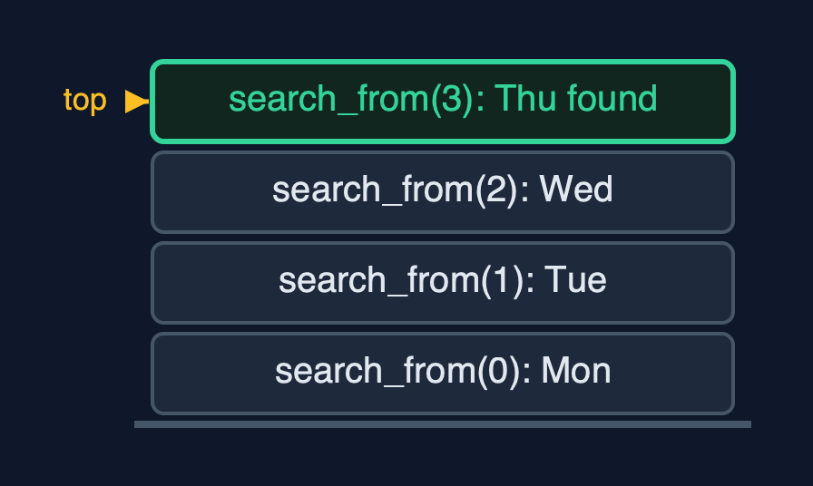
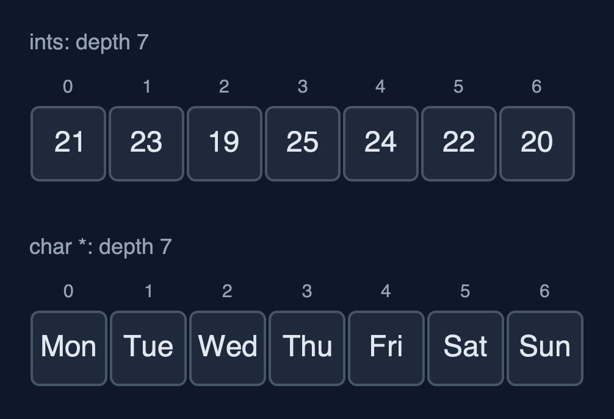
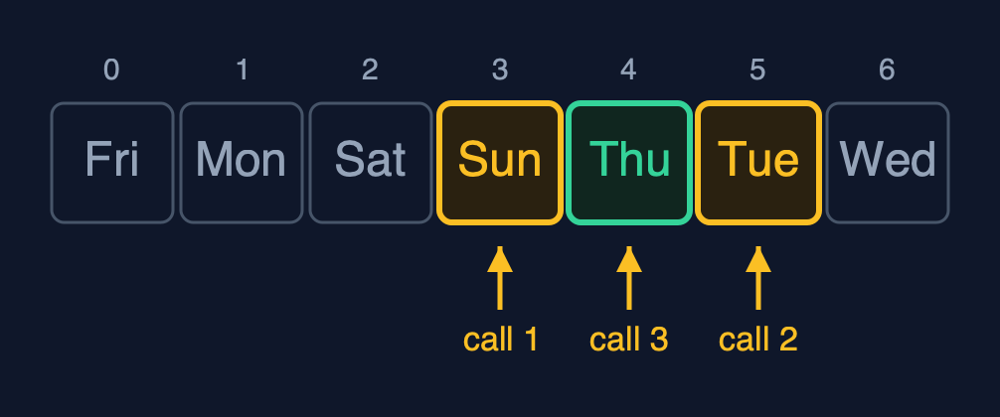
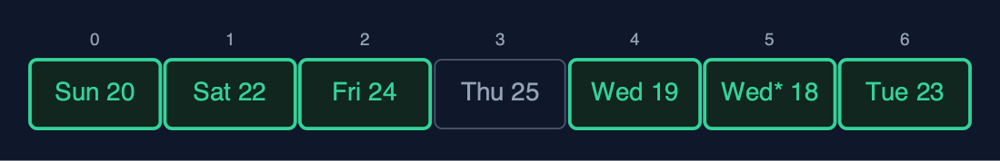
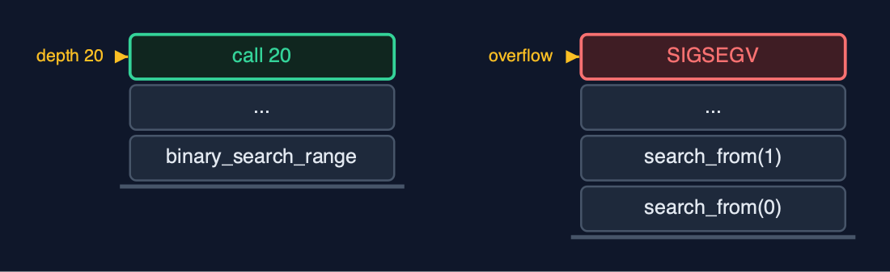

# Static Array (Generic, Recursive), Explained

## In one sentence

The generic recursive static array holds any type as bytes with an element size, compares through comparison functions, and writes each operation as one element's work plus a call on the rest; the time is unchanged and the extra space is the recursion depth.

## The picture


*linear_search for "Thu": one call per element, each asking the comparison function*

## The everyday idea

Picture a queue of seven helpers, each standing by one box. You hand the first helper a card describing what you are looking for, and a rule for comparing a box with the card. If the helper's box does not match, the helper passes the card and the rule to the next helper, and waits. The boxes could hold anything; the rule is what knows how to compare them. When someone finds a match, or the queue runs out, the answer travels back to you.

## The 5 acts

### Act 1: Recursion, for any element type

The recursive linear search asks one question per call: does element i compare equal to the key? The demo traces it on the day names. The call for index 0 finds "Mon" is not "Thu", calls itself for index 1, and waits. "Tue", no; "Wed", no; "Thu", yes: that call returns index 3 without calling again, a base case. Running the real search with a comparison function that counts its calls confirms it: 4 comparisons, one per call, so 4 calls deep.



**Four calls waiting; the top one found "Thu"** Here is the call stack at the match. Three calls that did not match, waiting. And the fourth, which found Thursday.

What the demo printed:

```
linear_search(0): Mon is not Thu -> linear_search(1)
  ... Tue, no; Wed, no
    linear_search(3): Thu equals Thu -> found, index 3   <- base case
linear_search("Thu") = index 3: 4 comparisons, one call each, depth 4
```

### Act 2: The same recursion, three types

The same recursive `traverse` runs on the three arrays, each with its own print function. It prints one element and calls itself for the rest, so it goes 7 calls deep for 7 elements whatever the element type: the recursion depends on the number of elements, not on what they are.



**Two of the three arrays, traversed by the same recursive function** Here are two of the arrays. Numbers and names. Seven calls deep, in both.

What the demo printed:

```
ints:     [21, 23, 19, 25, 24, 22, 20]
names:    [Mon, Tue, Wed, Thu, Fri, Sat, Sun]
readings: [Mon 21 C, Tue 23 C, Wed 19 C, Thu 25 C, Fri 24 C, Sat 22 C, Sun 20 C]
each traversal is 7 calls deep, whatever the element type
```

### Act 3: Comparison functions, recursively

Recursive binary search compares the key with the middle element through the comparison function and calls itself on one half. On the sorted names [Fri, Mon, Sat, Sun, Thu, Tue, Wed] it compares with "Sun", then "Tue", then "Thu": 3 comparisons, one per call, so 3 calls deep. Recursive `find_max` goes all the way to the last element, its base case, and compares on the way back up: 6 comparisons. With `compare_reading` the answer is "Thu 25 C"; with `compare_name` the same function returns "Wed".



**Recursive binary search: call 1 at Sun, call 2 at Tue, call 3 finds Thu** Here are the three calls. Each looks at the middle of its range, and calls itself on one half.

What the demo printed:

```
sorted: [Fri, Mon, Sat, Sun, Thu, Tue, Wed]
binary_search("Thu") = index 4: 3 comparisons, one call each, depth 3
find_max(compare_reading) = Thu 25 C: 6 comparisons on the way back up, depth 6
find_max(compare_name) = Wed: the same function, alphabetical order
```

### Act 4: Insertion, deletion and reversal, recursively

`insert_at(2, Wed* 18 C)` calls `shift_right` from the last reading down to index 2: 5 shifts with `memcpy`, one call each, so 5 deep. `delete_at(0)` copies "Mon 21 C" out and calls `shift_left` from index 0: 7 shifts, 7 deep. `reverse` swaps the two ends byte by byte and calls itself on the middle: 3 swaps, 3 deep.



**reverse: swap the ends, then reverse the middle; the centre stays** Here is the reversed array. Three calls swapped three pairs. The middle reading stayed where it was.

What the demo printed:

```
insert_at(2, Wed* 18 C): 5 shifts, depth 5
delete_at(0) removed Mon 21 C: 7 shifts, depth 7
reverse: 3 swaps, depth 3; [Sun 20 C, Sat 22 C, Fri 24 C, Thu 25 C, Wed 19 C, Wed* 18 C, Tue 23 C]
```

### Act 5: The limit of recursion

Generics do not change the depth. Binary search on a million sorted ints makes 20 comparisons, 20 calls deep, and is always safe. Linear search on the same array needs one frame per element, and the call stack runs out long before a million: the operating system stops the program with `SIGSEGV`. C cannot catch that, so the demo runs the search in a child process and reports how the child ended. The loop version in `static-array-generic` searches the million with O(1) extra space. `void *` changes what is stored; recursion changes how much stack is used; neither changes the time.



**Depth 20 fits on the call stack; depth 1,000,000 does not** Here are the two depths. Twenty frames for binary search. A million frames for linear search, far beyond what the stack can hold.

What the demo printed:

```
binary_search on 1,000,000 ints: index 666666, 20 comparisons, depth 20
linear_search on 1,000,000: the child process was killed by SIGSEGV: the call stack overflowed
void * changes what is stored; recursion changes how much stack is used; neither changes the time
```

## The operations in code

### Linear search with a comparison function

```c
/** Linear search, recursively. O(n) time and stack. */
int linear_search(const GenericArray *a, const void *key, CompareFn compare) {
    return linear_search_from(a, key, compare, 0);
}

/** Does element i compare equal to key? If not, search from i + 1. */
static int linear_search_from(const GenericArray *a, const void *key, CompareFn compare, int i) {
    if (i == a->n) {
        return -1;                  /* base case: searched everything */
    }
    if (compare(element_at(a, i), key) == 0) {
        return i;                   /* base case: found */
    }
    return linear_search_from(a, key, compare, i + 1);
}
```

Two base cases: no elements left (-1), and a match, found by `compare(...) == 0`. Otherwise the call passes the rest of the array, `i + 1`, to the next call. One frame per element examined.

### Binary search

```c
/** Binary search on an array sorted by compare, recursively. O(log n) time and stack. */
int binary_search(const GenericArray *a, const void *key, CompareFn compare) {
    return binary_search_range(a, key, compare, 0, a->n - 1);
}

/** Compare with the middle of the range, then search only the half that can hold key. */
static int binary_search_range(const GenericArray *a, const void *key, CompareFn compare, int low, int high) {
    if (low > high) {
        return -1;                  /* base case: the range is empty */
    }
    int mid = low + (high - low) / 2;
    int c = compare(element_at(a, mid), key);
    if (c == 0) {
        return mid;
    } else if (c < 0) {
        return binary_search_range(a, key, compare, mid + 1, high);
    } else {
        return binary_search_range(a, key, compare, low, mid - 1);
    }
}
```

The comparison function's sign decides the half. The base case is an empty range. Each call halves the range, so the depth is at most about log2(n) + 1: 3 for 7 names, 20 for a million.

### Find maximum

```c
/** The index of the largest element by compare, compared on the way back up. O(n) time and stack. */
int find_max(const GenericArray *a, CompareFn compare) {
    return a->n == 0 ? -1 : find_max_from(a, compare, 0);
}

/** The index of the larger of element i and the largest of the rest. */
static int find_max_from(const GenericArray *a, CompareFn compare, int i) {
    if (i == a->n - 1) {
        return i;                   /* base case: one element is its own maximum */
    }
    int rest_max = find_max_from(a, compare, i + 1);
    return compare(element_at(a, i), element_at(a, rest_max)) >= 0 ? i : rest_max;
}
```

The base case is the last element. Every other call first finds the maximum of the rest, then compares it with its own element on the way back up. The comparison function decides the order: temperature for readings, alphabetical for names.

### Insertion

```c
/** Insertion at pos: shift recursively from the last element, then copy elem in. O(n - pos) time and stack. */
Status insert_at(GenericArray *a, int pos, const void *elem) {
    if (a->n == a->capacity) {
        return STATUS_OVERFLOW;
    }
    if (pos < 0 || pos > a->n) {
        return STATUS_OUT_OF_RANGE;
    }
    shift_right(a, a->n - 1, pos);
    memcpy(element_at(a, pos), elem, a->elem_size);
    a->n++;
    return STATUS_OK;
}

/** Moves element i one place right, then shifts the elements before it, down to pos. */
static void shift_right(GenericArray *a, int i, int pos) {
    if (i < pos) {                  /* base case: every element from pos onwards has moved */
        return;
    }
    memcpy(element_at(a, i + 1), element_at(a, i), a->elem_size);
    shift_right(a, i - 1, pos);
}
```

`shift_right` copies element i one place right with `memcpy` and recurses on `i - 1`, starting at the last element, so nothing is overwritten before it has moved.

## The operations, and what they cost

| Operation | What it does | Time: best / average / worst | Extra space (call stack) | Same operation as a loop | In the example |
| --- | --- | --- | --- | --- | --- |
| Traverse | Print element i, then traverse from i + 1 | O(n) / O(n) / O(n) | O(n) | O(1) | depth 7, for each type |
| Access `get` / `update` | One address calculation and a memcpy (not recursive) | O(1) / O(1) / O(1) | O(1) | O(1) | 1 step |
| Insert `insert_at` | shift_right from the last element down to pos, then memcpy in | O(1) at the end / O(n) / O(n) at the front | O(n - pos) | O(1) | 5 shifts at depth 5 |
| Delete `delete_at` | memcpy the element out, then shift_left from pos | O(1) at the end / O(n) / O(n) at the front | O(n - pos) | O(1) | 7 shifts at depth 7 |
| Linear search | compare(element i, key) == 0? If not, search from i + 1 | O(1) / O(n) / O(n) | O(n) | O(1) | 4 comparisons at depth 4 to find "Thu" |
| Binary search (sorted) | compare with the middle, search one half | O(1) / O(log n) / O(log n) | O(log n) | O(1) | 3 calls for "Thu"; 20 on 1,000,000 |
| Find maximum | compare element i with the maximum of the rest | O(n) / O(n) / O(n) | O(n) | O(1) | 6 comparisons at depth 6 |
| Reverse | Swap the ends byte by byte, reverse the middle | O(n) / O(n) / O(n) | O(n / 2) | O(1) | 3 swaps at depth 3 |

## Compared with related structures

The four static-array projects side by side (n elements):

| Property | Generic, recursive (this) | Generic, loops | int, recursive | int, loops |
| --- | --- | --- | --- | --- |
| Element types | any, by elem_size | any, by elem_size | int | int |
| Compares with | a comparison function | a comparison function | ==, < | ==, < |
| Traverse, linear search | O(n) time, O(n) stack | O(n) time, O(1) space | O(n) time, O(n) stack | O(n) time, O(1) space |
| Binary search | O(log n) time and stack | O(log n) time, O(1) space | O(log n) time and stack | O(log n) time, O(1) space |
| Type checked by the compiler | no | no | yes | yes |
| A million elements | linear recursion overflows | fine | linear recursion overflows | fine |

## The verdict

This is the shape of generic recursive C code for trees and heaps. On arrays, keep recursion for logarithmic depth such as binary search, and use loops for linear passes over large data.

## How to recognise it in code you did not write

- A `static` helper that calls itself with `i + 1` and a `CompareFn` parameter.
- `compare(element_at(a, i), key) == 0` inside a recursive function.
- A base case such as `if (i == a->n) return -1;` at the top.

## Where you have already met this

- `qsort` and `bsearch` in `<stdlib.h>`: a block, an element size and a comparison function.
- Recursive functions in textbooks, such as a recursive binary search.
- A program stopped by `SIGSEGV` after a function called itself too deeply.
