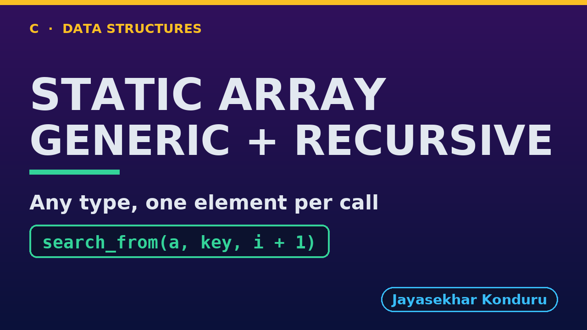

# YouTube — Static Array (Generic, Recursive)

Everything needed to publish `video/static-array-generic-recursive-explained.mp4`. Copy the fields straight out of this file.

Chapter timings come from the video's `.srt`; they are regenerated whenever the video is rebuilt.

## Title

```
Generic Recursive Static Array in C - void *, Comparison Functions and the Call Stack
```

85 characters (YouTube shows about 60 before cutting a title off in search).

## Description

The first two lines are what a viewer sees above the fold, so they carry the hook rather than the boilerplate.

```
Generic Recursive Static Array in C, explained with one week held as day names, ints and Reading structs by the same code. We trace a recursive linear search for "Thu" call by call, each call asking the comparison function and passing the rest of the array to the next call, until the match at depth 4. We traverse all three element types at depth 7, binary search the sorted day names in 3 comparisons and 3 calls, and find the hottest reading with a comparison on the way back up the call stack. We insert, delete and reverse recursively, moving whole elements with memcpy, and finish at the limit: binary search on a million ints goes only 20 calls deep, while linear search overflows the call stack and the child process running it is stopped.

CHAPTERS
00:00 Introduction
00:50 The Everyday Idea
01:24 The Words
01:53 Act One — Recursion, for any element type
02:21 Recursion, for any element type
02:31 Act Two — The same recursion, three types
02:48 The same recursion, three types
02:57 Act Three — Comparison functions, recursively
03:24 Comparison functions, recursively
03:33 Act Four — Insertion, deletion and reversal, recursively
03:55 Insertion, deletion and reversal, recursively
04:05 Act Five — The limit of recursion
04:34 The limit of recursion
04:46 Time and Space Complexity
05:16 The Four Static Arrays
05:46 Common Mistakes
06:08 Thanks for Watching

SOURCE CODE, WRITTEN NOTES AND AN INTERACTIVE ANIMATION
https://github.com/jk-boot-up/datastructures/tree/main/dsa-c/arrays-and-lists/static-array-generic-recursive

WHAT YOU NEED FIRST
C basics: variables, loops, functions, structs and pointers. No data-structures knowledge is assumed; START-HERE.md in the repository explains memory, pointers and counting steps.
```

## Chapters

YouTube shows these as chapters because there are at least three and the first is at `00:00`.

```
00:00 Introduction
00:50 The Everyday Idea
01:24 The Words
01:53 Act One — Recursion, for any element type
02:21 Recursion, for any element type
02:31 Act Two — The same recursion, three types
02:48 The same recursion, three types
02:57 Act Three — Comparison functions, recursively
03:24 Comparison functions, recursively
03:33 Act Four — Insertion, deletion and reversal, recursively
03:55 Insertion, deletion and reversal, recursively
04:05 Act Five — The limit of recursion
04:34 The limit of recursion
04:46 Time and Space Complexity
05:16 The Four Static Arrays
05:46 Common Mistakes
06:08 Thanks for Watching
```

## Tags

```
recursion in c, generic array in c, void pointer, function pointer, call stack, stack overflow, data structures, c data structures, c programming, c17, algorithms, computer science, programming tutorial, beginner, big o
```

219 characters, under YouTube's 500 limit.

## Thumbnail



Upload `docs/thumbnail.png` (1280×720) under **Details → Thumbnail → Upload file**. It is made for the small size YouTube shows in search: the name, one line of promise and one piece of code.

## Upload checklist

- [ ] Upload `video/static-array-generic-recursive-explained.mp4` (1080p, H.264, 30 fps, AAC 48 kHz)
- [ ] Set the video language to **English**, then add subtitles: *Upload file → With timing* → `video/static-array-generic-recursive-explained.srt`
- [ ] Upload `docs/thumbnail.png` as the thumbnail
- [ ] Paste the title, description and tags from above
- [ ] Add to the **Data Structures in C** playlist
- [ ] Wait for 1080p processing before sharing the link

## Runtime

06:55.
