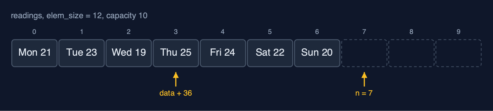
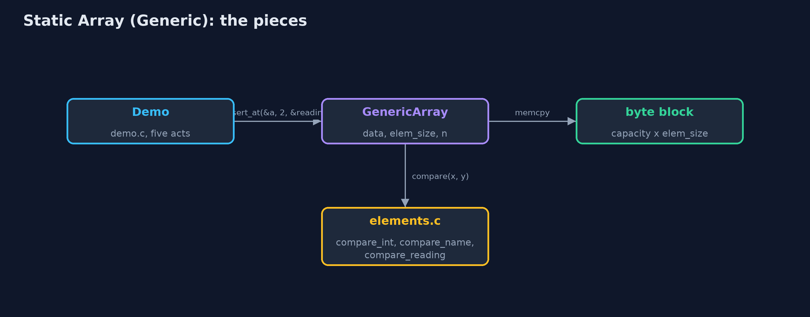
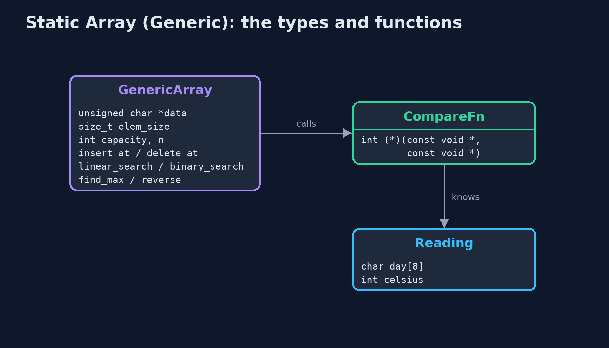
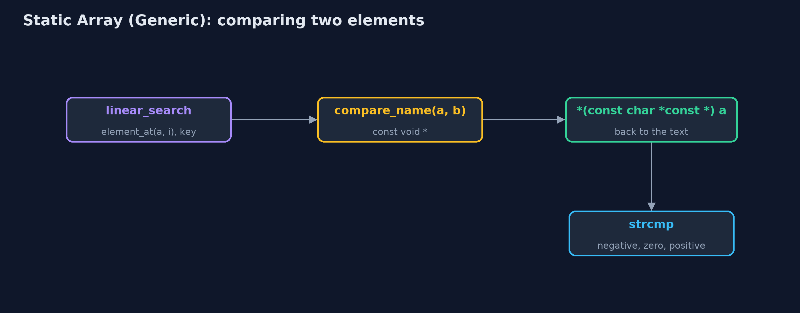
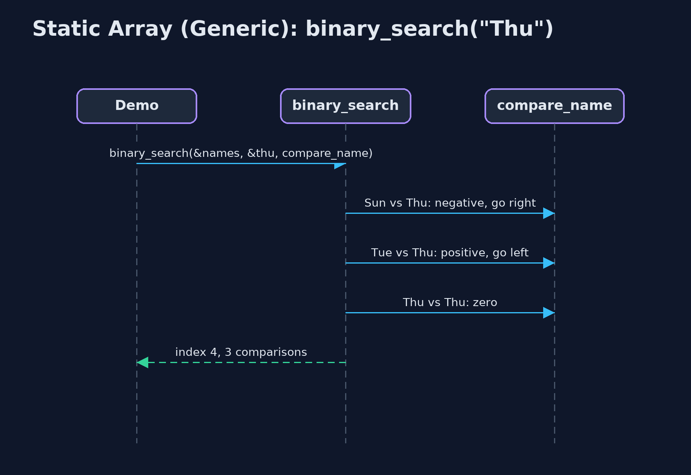

# Static Array (Generic)

**A generic static array in C is a block of bytes and an element size: element i starts at data + i x elem_size, elements are copied in and out with memcpy, and comparisons are done by a function pointer, exactly as qsort and bsearch work; every cost of the static array is unchanged, and the price is that the compiler can no longer check the element type.**



*A GenericArray of Readings: 12 bytes each, element i at data + i x 12*

A **generic static array** in C holds elements of **any type** with one set of functions. C has no type parameters, so it does what the C standard library itself does in `qsort` and `bsearch`: the array is a block of **bytes** with an **element size**, `elem_size`, given when it is created (`sizeof(int)`, `sizeof(Reading)`). Element i starts at `data + i x elem_size`, so access is still one address calculation. Elements are copied in and out with **`memcpy`**, and anything that must compare two elements is given a **comparison function**, `int compare(const void *a, const void *b)`, which returns negative, zero or positive. The array's structure and every cost are those of the `static-array` project. What changes is who knows the type: only the comparison and print functions do. The compiler cannot check that the right type is passed through `void *`, and that loss of type safety is the price of the approach.

> New to data structures? Read [Start here](../../START-HERE.md) first: it explains memory, pointers and counting steps in ten minutes.

## The everyday idea

Picture a row of identical lockers where the caretaker is told only one thing: every box stored here is 12 centimetres wide. The caretaker can find locker 3 at once, 3 x 12 centimetres from the start, and can move boxes along, without ever knowing what is inside them. To answer "is this the box of the fountain?" the caretaker needs someone who knows the contents: a helper you hand over, who compares two boxes. Hand over the wrong helper, or a box of the wrong size, and the caretaker cannot tell.

## The worked example: One week of temperatures held as ints, as day names and as readings

The weather station stores its week three ways with the same functions: the temperatures as `int`s, the day names as `char *` pointers to text, and each day as a `Reading` struct with a day name and a temperature. The demo computes an element's address by hand, searches each array with its own comparison function, inserts and deletes readings, and runs the same `find_max` with two different comparison functions.

## Why it exists

Without a generic array, a C program needs one array implementation per element type, all with the same loops. With `void *`, an element size and comparison functions, one implementation serves every type, which is exactly why `qsort` and `bsearch` are written that way. Understanding it explains the standard library, callback functions, and why C code must be careful about types.

## New words

| Word | What it means here |
| --- | --- |
| **void *** | A pointer to memory of unknown type. Any object pointer converts to it; to use the memory, it must be converted back to the right type. |
| **element size** | `elem_size`: how many bytes one element takes, from `sizeof`. Element i starts at `data + i x elem_size`. |
| **memcpy** | Copies a given number of bytes from one place to another; used to move elements whose type the array does not know. |
| **comparison function** | `int compare(const void *a, const void *b)`: negative if a comes first, zero if equal, positive if a comes after, as `qsort` expects. |
| **function pointer** | A variable holding the address of a function, such as `CompareFn compare`; calling `compare(x, y)` runs whichever function was passed. |
| **type safety** | The compiler checking that values have the types the code expects. Through `void *`, it cannot. |

## What you will see, act by act

Run the demo and it tells the story in 5 acts; `make test` checks that it still prints exactly `tests/expected-output.txt`:

```bash
make run
```

| Act | What it shows |
| --- | --- |
| 1. One array type, any element type | The same functions hold ints, day names and Reading structs; passing the wrong type would compile, because void * is never checked. |
| 2. Inside: bytes and an element size | Sizes are 4, 8 and 12 bytes; element 3 of the readings is at data + 36; copying the names copies pointers, so both arrays share the text. |
| 3. Searching with comparison functions | Linear search finds 24 with compare_int in 5 comparisons; compare_name finds a day name typed by the user because strcmp compares text, while == compares addresses; binary search takes 3 comparisons for 24 and for "Thu". |
| 4. Insertion, deletion, overflow | Inserting a reading at index 2 is 5 shifts of 12 bytes; deleting index 0 is 7 shifts; at 10 of 10 the next insertion is an overflow. |
| 5. One algorithm, many orders | find_max with compare_reading gives Thu 25 C; with compare_name it gives Wed; reverse swaps 3 elements byte by byte; qsort and bsearch work the same way. |

Each act is drawn step by step in [the explained walkthrough](docs/static-array-generic-explained.md) and in [the animation](docs/animation.html).

## The operations, and what they cost

Time is given for the best, average and worst case in Big-O notation (START-HERE.md explains it by counting steps); the last column is what that costs in the worked example, as the demo prints it.

| Operation | What it does | Time: best / average / worst | Extra space | In the example |
| --- | --- | --- | --- | --- |
| Traverse | Print each element with a print function | O(n) / O(n) / O(n) | O(1) | 7 reads for the week |
| Access `get(a, i, &out)` | Copy elem_size bytes from data + i x elem_size | O(1) / O(1) / O(1) | O(1) | 1 step |
| Update `update(a, i, &x)` | Copy elem_size bytes over element i | O(1) / O(1) / O(1) | O(1) | 1 step |
| Insert `insert_at(a, pos, &x)` | Shift elements pos..n-1 right, from the end, then copy x in | O(1) at the end / O(n) / O(n) at the front | O(1) | 5 shifts of 12 bytes to insert a reading at index 2 |
| Delete `delete_at(a, pos, &out)` | Copy the element out, shift the later elements left | O(1) at the end / O(n) / O(n) at the front | O(1) | 7 shifts to delete index 0 of 8 |
| Linear search | Call compare(element, key) for each element in turn | O(1) / O(n) / O(n) | O(1) | 5 comparisons to find 24 |
| Binary search (sorted) | compare with the middle, discard half, repeat | O(1) / O(log n) / O(log n) | O(1) | 3 comparisons for 24, and 3 for "Thu" |
| Find maximum | compare each element with the largest so far | O(n) / O(n) / O(n) | O(1) | 6 comparisons for 7 readings |
| Reverse | Swap elements from both ends inward, byte by byte | O(n) / O(n) / O(n) | O(1) | 3 swaps of 12 bytes |
| Grow `copy_with_capacity` | A new block; every element's bytes copied | O(n) / O(n) / O(n) | O(n) | 7 elements copied |

Extra space is the memory an operation needs besides the structure itself. A loop needs a fixed amount, O(1); a recursive operation needs one call-stack frame for every call still waiting, so its extra space is the depth of the recursion.

## The operations in code

### The address of element i

```c
/** The address of element i: the start of the block plus i elements of elem_size bytes. O(1). */
void *element_at(const GenericArray *a, int i) {
    return a->data + (size_t) i * a->elem_size;
}
```

The whole idea in one line. `data` is an `unsigned char *`, so adding to it counts in bytes: element i is `i x elem_size` bytes from the start. This is what the compiler does for you with `arr[i]` when it knows the type; here the code does it by hand.

### Insertion

```c
/** Insertion at pos: shift elements pos..n-1 one place right, from the end, then copy elem in. O(n - pos). */
Status insert_at(GenericArray *a, int pos, const void *elem) {
    if (a->n == a->capacity) {
        return STATUS_OVERFLOW;
    }
    if (pos < 0 || pos > a->n) {
        return STATUS_OUT_OF_RANGE;
    }
    for (int i = a->n - 1; i >= pos; i--) {
        memcpy(element_at(a, i + 1), element_at(a, i), a->elem_size);
    }
    memcpy(element_at(a, pos), elem, a->elem_size);
    a->n++;
    return STATUS_OK;
}
```

The same shift as the int version, from the end down to `pos`, but each shift is a `memcpy` of `elem_size` bytes, because the array does not know what the bytes mean.

### Linear search with a comparison function

```c
/** Linear search: the first index whose element compares equal to key, or -1. O(n). */
int linear_search(const GenericArray *a, const void *key, CompareFn compare) {
    for (int i = 0; i < a->n; i++) {
        if (compare(element_at(a, i), key) == 0) {
            return i;
        }
    }
    return -1;
}
```

`compare(element_at(a, i), key) == 0` asks the function that was passed in whether the two are equal. The array never looks inside an element itself.

### Comparing day names

```c
/* Each element is a char * (a pointer to text), so a and b point at pointers. */
int compare_name(const void *a, const void *b) {
    const char *x = *(const char *const *) a;
    const char *y = *(const char *const *) b;
    return strcmp(x, y);
}
```

Each element of the names array is a `char *`, so `a` and `b` point at pointers: convert to `const char *const *` and dereference once to reach the text, then `strcmp` compares the characters. Comparing the pointers with `==` would only ask whether they are the same address.

## Compared with related structures

The generic static array against the int-only static array and the generic dynamic array (n elements):

| Property | Generic static array (void *) | Static array of int | Generic dynamic array |
| --- | --- | --- | --- |
| Element types | any, given its size | int only | any, given its size |
| Access element i | O(1): data + i x elem_size | O(1): arr[i] | O(1) |
| Insert or delete at the front | O(n) shifts of elem_size bytes | O(n) shifts | O(n) shifts |
| Comparing elements | a function pointer per comparison | == and < directly | a function pointer |
| Type checked by the compiler | no: void * | yes | no: void * |
| Size | fixed at creation | fixed at creation | grows by copying |

## The code

```
src/
├── demo.c           Tells the story of the generic static array in five acts
├── elements.c       Comparison and print functions: the only code that knows what the elements really are
├── elements.h       The element types of the demo, and the comparison and print functions for each
├── generic_array.c  The generic array's operations: the static-array loops, moving elem_size bytes at a time
└── generic_array.h  A static (fixed-capacity) array that holds elements of any type, the way C's own qsort and bsearch handle any type: a block of bytes, an element size, and comparison functions
tests/
├── check.c               The test harness's counters, and main: runs the tests and reports
├── check.h               A tiny test harness: RUN(test) runs one test function, CHECK(condition) records a failure
└── test_generic_array.c  Every behaviour the generic static array must have, for more than one element type
```

## Build and test

```bash
make test
```

11 tests in `test_generic_array.c`, and the demo's whole output compared with `tests/expected-output.txt`, so every number the docs quote is checked. Nothing depends on the clock, so every run gives the same result.

## Common mistakes

| The mistake | What goes wrong | The fix |
| --- | --- | --- |
| The wrong element size | `create(&a, 10, sizeof(Reading *))` instead of `sizeof(Reading)` makes every element 8 bytes: structs are cut short and neighbours overwrite each other. | Pass `sizeof` of the element type itself. |
| One dereference too few in a comparison of pointers | In an array of `char *`, treating `a` as the text (`strcmp(a, b)`) compares the bytes of the pointers, not the strings. | Convert to `const char *const *` and dereference once: `strcmp(*(const char *const *) a, *(const char *const *) b)`. |
| Returning x - y from a comparison | For large values of opposite sign, `x - y` overflows `int` and the sign is wrong. | Return `(x > y) - (x < y)`. |
| Comparing strings with `==` | `==` compares addresses, so equal text stored in two places is reported as different. | Use `strcmp`, through the comparison function. |

## Try it yourself

1. **Easy.** Write `int count_equal(GenericArray *a, const void *key, CompareFn compare)`, which counts the elements equal to `key`. Why does it need the comparison function?
2. **Medium.** Write `int compare_reading_by_day(const void *a, const void *b)` that orders readings by day name. What does `find_max` then return on the week, and did you change `generic_array.c`?
3. **Harder.** Sort the readings by temperature with the standard library's `qsort`, then find 24 C with `bsearch`. What do `qsort` and `bsearch` need that `GenericArray` already has?

The answers are in [docs/exercises.md](docs/exercises.md), below the questions, so they are not given away.

## When to use it

- The same structure is needed for several element types, in C.
- The element types are plain data that can be copied with `memcpy`, such as numbers, structs, or pointers.
- You are calling `qsort` or `bsearch` and want to know what they do inside.

## When not to

- Only one element type is ever used: the plain `static-array` version is simpler and type-checked.
- Speed on large amounts of plain numbers matters most: a call through a function pointer for every comparison costs time.
- The number of elements changes: use a dynamic array (`dynamic-array-generic`).

## Where you have already met this

- `qsort(base, n, size, compare)` and `bsearch(key, base, n, size, compare)` in `<stdlib.h>`.
- `memcpy(dest, src, n)` in `<string.h>`.
- Callbacks: any function that takes another function as a parameter.

## Technologies and versions

| Technology | Version | Used for |
| --- | --- | --- |
| C | C17 | the code, compiled with `-std=c17 -Wall -Wextra -Wpedantic -Werror -O0 -g` |
| Compiler | Apple clang version 14.0.3 (clang-1403.0.22.14.1) | any C17 compiler works; the Makefile uses `cc` |
| make | the system `make` | build, run and test: `make run`, `make test` |
| Tests | a hand-written harness, `tests/check.h` | no test library needed |
| videokit | course tool | the narrated video and animation: Piper `en_US-amy-medium`, speed 0.8, longer pauses (the `amy-slow` voice) |

## Learning material

| Document | What it is for |
| --- | --- |
| [Start here](../../START-HERE.md) | the ideas every project relies on |
| [Problem statement](docs/problem-statement.md) | the situation and what the project must show |
| [Prerequisites](docs/prerequisites.md) | what you need to know first |
| [Static Array (Generic), explained](docs/static-array-generic-explained.md) | every act, picture by picture |
| [Animated walkthrough](docs/animation.html) | the structure changing step by step, narrated |
| [Cheat sheet](docs/cheat-sheet.md) | the whole structure on one page |
| [Exercises and answers](docs/exercises.md) | practice, easy to harder |
| [Session guide](docs/session.md) | a one-hour lesson |
| [Specification](docs/spec.md) | what this project must be true of |

### How the pieces fit

The demo calls the array's functions with element pointers and comparison functions; only the helpers in elements.c know what the bytes mean.



### The types and functions

`GenericArray` knows only bytes; `CompareFn` and `PrintFn` are the function-pointer types; `Reading` is one element type.



### How the data moves

The array passes addresses; the comparison function converts them to the real type.



### Who calls whom, in order

Three calls to the comparison function on the sorted names.



### Video

`video/static-array-generic-explained.mp4` (with `.m4a` audio and `.srt` subtitles) is built by `video/build_video.sh`. Rendered media is not committed.

## Where this sits

Part of the [data structures course](../../index.md), in *arrays-and-lists*.
