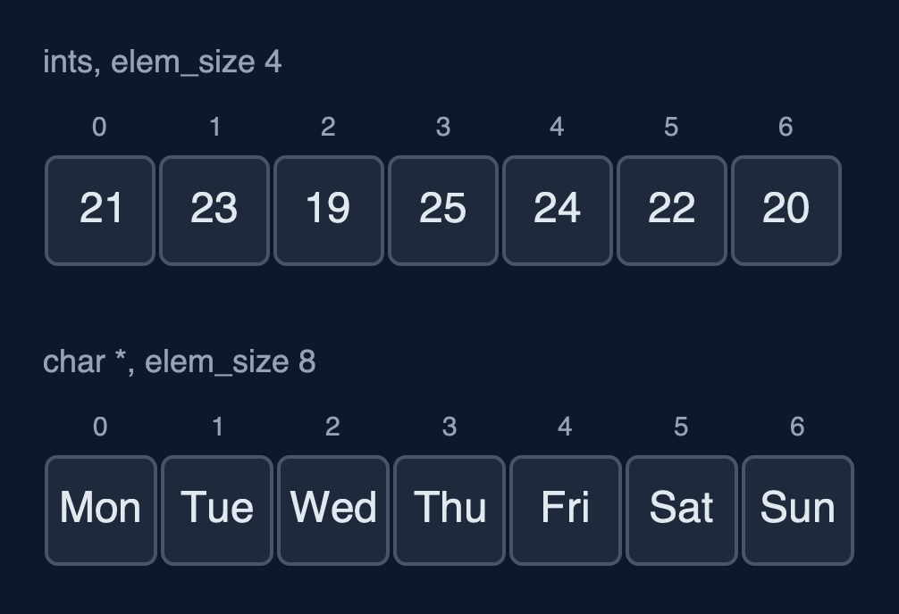
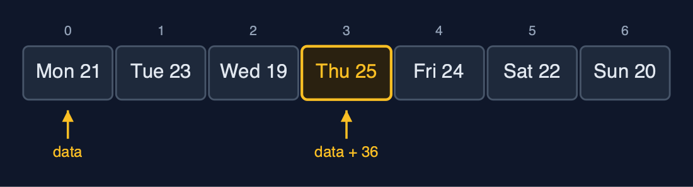
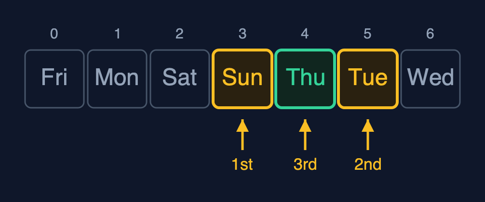
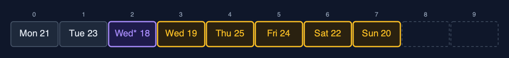

# Static Array (Generic), Explained

## In one sentence

A generic static array in C is a byte block with an element size: element i is at data + i x elem_size, elements move with memcpy, and comparisons go through a function pointer, as in qsort and bsearch.

## The picture


*A GenericArray of Readings: 12 bytes each, element i at data + i x 12*

## The everyday idea

Picture a row of identical lockers where the caretaker is told only one thing: every box stored here is 12 centimetres wide. The caretaker can find locker 3 at once, 3 x 12 centimetres from the start, and can move boxes along, without ever knowing what is inside them. To answer "is this the box of the fountain?" the caretaker needs someone who knows the contents: a helper you hand over, who compares two boxes. Hand over the wrong helper, or a box of the wrong size, and the caretaker cannot tell.

## The 5 acts

### Act 1: One array type, any element type

One `GenericArray` type and one set of functions are used three times: for the temperatures as `int`s, for the day names as `char *`, and for `Reading` structs of our own. Traversal prints all three, each through its own print function. There is a catch that Java's generics do not have: `insert_at(&temps, 0, &DAYS[0])` would compile without a warning, because every pointer converts to `void *`. The array would then store the first 4 bytes of a pointer as if they were a temperature.



**Three arrays, one set of functions: ints and day names** Here are two of the arrays. The same functions, the same loops. Only the element size and the helper functions differ.

What the demo printed:

```
ints:     [21, 23, 19, 25, 24, 22, 20]
names:    [Mon, Tue, Wed, Thu, Fri, Sat, Sun]
readings: [Mon 21 C, Tue 23 C, Wed 19 C, Thu 25 C, Fri 24 C, Sat 22 C, Sun 20 C]
the same functions for all three; insert_at(&temps, 0, &DAYS[0]) would compile too: void * is never checked
```

### Act 2: Inside: bytes and an element size

The array knows only the element size: 4 bytes for an `int`, 8 for a `char *` on a 64-bit machine, 12 for a `Reading`. Element 3 of the readings is at `data + 3 x 12 = data + 36`: the address calculation that `arr[3]` does automatically, done here by hand. Copying an array copies bytes. For the names, those bytes are pointers, so after `copy_with_capacity` both arrays point at the very same text: 7 elements copied, and no string was duplicated.



**Element 3 starts at byte 36: 3 elements of 12 bytes from the start** Here are the readings. Each takes twelve bytes. Element three starts at byte thirty six: one calculation, as for any array.

What the demo printed:

```
elem_size: int 4, char * 8, Reading 12 bytes
element 3 of the readings is at data + 3 x 12 = data + 36
copy_with_capacity(31): 7 elements copied; the names are pointers, so both arrays point at the same text: yes
```

### Act 3: Searching with comparison functions

Every search is given a comparison function. `linear_search(&temps, &key, compare_int)` finds 24 at index 4 after 5 comparisons. For the names, the key is "Fri" typed by the user: the same letters, stored somewhere else. `compare_name` uses `strcmp`, which compares the characters, and finds it at index 4. Comparing the two pointers with `==` says false, because they are different addresses. Binary search needs an order, which the comparison function also gives: 3 comparisons for 24 among the sorted temperatures, and 3 for "Thu" among the sorted names.



**Binary search on the sorted names: Sun (go right), Tue (go left), Thu** Binary search on the sorted names. Sunday, then Tuesday, then Thursday. Three calls to the comparison function.

What the demo printed:

```
linear_search(24, compare_int) = index 4: 5 comparisons
linear_search("Fri" typed by the user, compare_name) = index 4: strcmp compares the text
the stored "Fri" == the typed "Fri" is false: == compares addresses
binary_search(24) = index 4, 3 comparisons
binary_search("Thu") = index 4, 3 comparisons
```

### Act 4: Insertion, deletion, overflow

Insertion and deletion are the loops of the int version, moving whole elements with `memcpy`. A corrected reading, "Wed* 18 C", goes in at index 2: five shifts of 12 bytes each. Deleting index 0 copies "Mon 21 C" out to the caller and shifts the seven later readings left. Three more readings fill the array to 10 of 10, and the next insertion is refused as an overflow.



**insert_at(2): the readings from index 2 on each shifted 12 bytes right** Here is the array after the insertion. The new reading, in purple, at index two. Five readings, in amber, each moved one place right.

What the demo printed:

```
insert_at(2, Wed* 18 C): 5 shifts of 12 bytes each, n = 8
delete_at(0) removed Mon 21 C: 7 shifts
[Tue 23 C, Wed* 18 C, Wed 19 C, Thu 25 C, Fri 24 C, Sat 22 C, Sun 20 C]
n = 10, insert_at(0, Thu 30 C): overflow: the array is full
```

### Act 5: One algorithm, many orders

`find_max` is written once. Given `compare_reading`, which compares temperatures, it returns "Thu 25 C" after 6 comparisons. Given `compare_name`, which compares text, the same function returns "Wed". `reverse` swaps whole elements byte by byte, 3 swaps of 12 bytes. There is no `sum`, because adding needs numbers and a `void *` element can be anything. The C standard library's `qsort` and `bsearch` take exactly what this array keeps: the block, the count, the element size and a comparison function.


**find_max with compare_reading: Thu 25 C is the largest** Here is find max with the temperature comparison. Thursday, at twenty five degrees.

What the demo printed:

```
readings, find_max(compare_reading): Thu 25 C, 6 comparisons
day names, find_max(compare_name): Wed
reverse: 3 swaps of 12 bytes; [Sun 20 C, Sat 22 C, Fri 24 C, Thu 25 C, Wed 19 C, Tue 23 C, Mon 21 C]
no sum(): adding needs numbers, and a void * element can be anything
already in C: qsort and bsearch take exactly this: a void * block, an element size and a compare function
```

## The operations in code

### The address of element i

```c
/** The address of element i: the start of the block plus i elements of elem_size bytes. O(1). */
void *element_at(const GenericArray *a, int i) {
    return a->data + (size_t) i * a->elem_size;
}
```

The whole idea in one line. `data` is an `unsigned char *`, so adding to it counts in bytes: element i is `i x elem_size` bytes from the start. This is what the compiler does for you with `arr[i]` when it knows the type; here the code does it by hand.

### Insertion

```c
/** Insertion at pos: shift elements pos..n-1 one place right, from the end, then copy elem in. O(n - pos). */
Status insert_at(GenericArray *a, int pos, const void *elem) {
    if (a->n == a->capacity) {
        return STATUS_OVERFLOW;
    }
    if (pos < 0 || pos > a->n) {
        return STATUS_OUT_OF_RANGE;
    }
    for (int i = a->n - 1; i >= pos; i--) {
        memcpy(element_at(a, i + 1), element_at(a, i), a->elem_size);
    }
    memcpy(element_at(a, pos), elem, a->elem_size);
    a->n++;
    return STATUS_OK;
}
```

The same shift as the int version, from the end down to `pos`, but each shift is a `memcpy` of `elem_size` bytes, because the array does not know what the bytes mean.

### Linear search with a comparison function

```c
/** Linear search: the first index whose element compares equal to key, or -1. O(n). */
int linear_search(const GenericArray *a, const void *key, CompareFn compare) {
    for (int i = 0; i < a->n; i++) {
        if (compare(element_at(a, i), key) == 0) {
            return i;
        }
    }
    return -1;
}
```

`compare(element_at(a, i), key) == 0` asks the function that was passed in whether the two are equal. The array never looks inside an element itself.

### Comparing day names

```c
/* Each element is a char * (a pointer to text), so a and b point at pointers. */
int compare_name(const void *a, const void *b) {
    const char *x = *(const char *const *) a;
    const char *y = *(const char *const *) b;
    return strcmp(x, y);
}
```

Each element of the names array is a `char *`, so `a` and `b` point at pointers: convert to `const char *const *` and dereference once to reach the text, then `strcmp` compares the characters. Comparing the pointers with `==` would only ask whether they are the same address.

## The operations, and what they cost

| Operation | What it does | Time: best / average / worst | Extra space | In the example |
| --- | --- | --- | --- | --- |
| Traverse | Print each element with a print function | O(n) / O(n) / O(n) | O(1) | 7 reads for the week |
| Access `get(a, i, &out)` | Copy elem_size bytes from data + i x elem_size | O(1) / O(1) / O(1) | O(1) | 1 step |
| Update `update(a, i, &x)` | Copy elem_size bytes over element i | O(1) / O(1) / O(1) | O(1) | 1 step |
| Insert `insert_at(a, pos, &x)` | Shift elements pos..n-1 right, from the end, then copy x in | O(1) at the end / O(n) / O(n) at the front | O(1) | 5 shifts of 12 bytes to insert a reading at index 2 |
| Delete `delete_at(a, pos, &out)` | Copy the element out, shift the later elements left | O(1) at the end / O(n) / O(n) at the front | O(1) | 7 shifts to delete index 0 of 8 |
| Linear search | Call compare(element, key) for each element in turn | O(1) / O(n) / O(n) | O(1) | 5 comparisons to find 24 |
| Binary search (sorted) | compare with the middle, discard half, repeat | O(1) / O(log n) / O(log n) | O(1) | 3 comparisons for 24, and 3 for "Thu" |
| Find maximum | compare each element with the largest so far | O(n) / O(n) / O(n) | O(1) | 6 comparisons for 7 readings |
| Reverse | Swap elements from both ends inward, byte by byte | O(n) / O(n) / O(n) | O(1) | 3 swaps of 12 bytes |
| Grow `copy_with_capacity` | A new block; every element's bytes copied | O(n) / O(n) / O(n) | O(n) | 7 elements copied |

## Compared with related structures

The generic static array against the int-only static array and the generic dynamic array (n elements):

| Property | Generic static array (void *) | Static array of int | Generic dynamic array |
| --- | --- | --- | --- |
| Element types | any, given its size | int only | any, given its size |
| Access element i | O(1): data + i x elem_size | O(1): arr[i] | O(1) |
| Insert or delete at the front | O(n) shifts of elem_size bytes | O(n) shifts | O(n) shifts |
| Comparing elements | a function pointer per comparison | == and < directly | a function pointer |
| Type checked by the compiler | no: void * | yes | no: void * |
| Size | fixed at creation | fixed at creation | grows by copying |

## The verdict

Use this technique when C code must hold several types with one implementation, and whenever you call qsort or bsearch; keep the plain typed version when only one type is needed, because the compiler can then check it.

## How to recognise it in code you did not write

- A struct with `void *` or `unsigned char *data` and a `size_t elem_size`.
- `memcpy(dest, src, elem_size)` where an assignment would be.
- A parameter of type `int (*compare)(const void *, const void *)`.

## Where you have already met this

- `qsort(base, n, size, compare)` and `bsearch(key, base, n, size, compare)` in `<stdlib.h>`.
- `memcpy(dest, src, n)` in `<string.h>`.
- Callbacks: any function that takes another function as a parameter.
