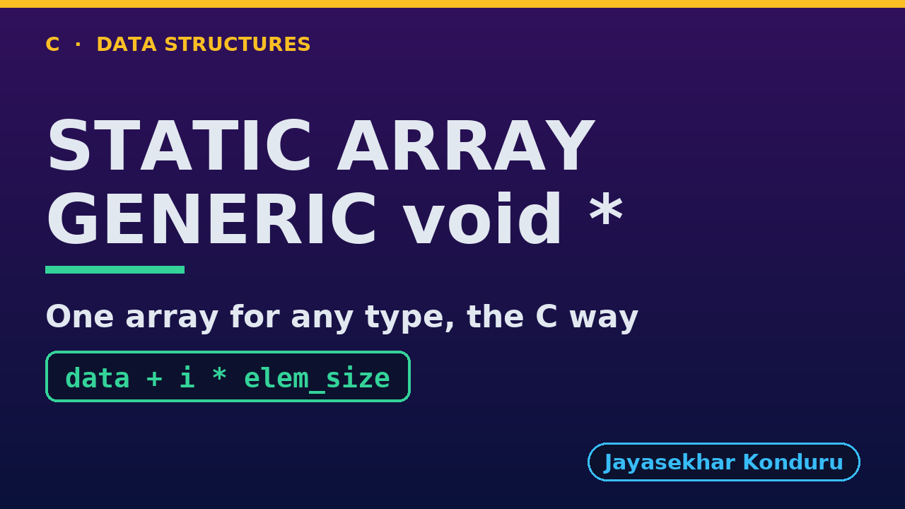

# YouTube — Static Array (Generic)

Everything needed to publish `video/static-array-generic-explained.mp4`. Copy the fields straight out of this file.

Chapter timings come from the video's `.srt`; they are regenerated whenever the video is rebuilt.

## Title

```
Generic Static Array in C - void *, Element Size and Comparison Functions
```

73 characters (YouTube shows about 60 before cutting a title off in search).

## Description

The first two lines are what a viewer sees above the fold, so they carry the hook rather than the boilerplate.

```
Generic Static Array in C, explained with one week of temperatures stored three ways by the same code: as ints, as day names (char pointers), and as Reading structs of our own. We see what the array really is, a block of bytes and an element size, and compute the address of element 3 by hand: data + 3 x 12. We search with comparison functions, the way qsort and bsearch do, and see why strcmp finds a day name typed by the user while == compares addresses and fails. We insert and delete with shifts of whole elements, hit the overflow, and finish with one find_max giving the hottest reading or the last day name, depending only on the comparison function passed in. The int-only version is the Static Array project.

CHAPTERS
00:00 Introduction
00:46 The Everyday Idea
01:18 The Words
01:45 Act One — One array type, any element type
02:13 One array type, any element type
02:24 Act Two — Inside: bytes and an element size
02:52 Inside: bytes and an element size
03:03 Act Three — Searching with comparison functions
03:36 Searching with comparison functions
03:47 Act Four — Insertion, deletion, overflow
04:11 Insertion, deletion, overflow
04:23 Act Five — One algorithm, many orders
04:49 One algorithm, many orders
04:58 Time and Space Complexity
05:26 Compared With Related Structures
05:50 Common Mistakes
06:14 Thanks for Watching

SOURCE CODE, WRITTEN NOTES AND AN INTERACTIVE ANIMATION
https://github.com/jk-boot-up/datastructures/tree/main/dsa-c/arrays-and-lists/static-array-generic

WHAT YOU NEED FIRST
C basics: variables, loops, functions, structs and pointers. No data-structures knowledge is assumed; START-HERE.md in the repository explains memory, pointers and counting steps.
```

## Chapters

YouTube shows these as chapters because there are at least three and the first is at `00:00`.

```
00:00 Introduction
00:46 The Everyday Idea
01:18 The Words
01:45 Act One — One array type, any element type
02:13 One array type, any element type
02:24 Act Two — Inside: bytes and an element size
02:52 Inside: bytes and an element size
03:03 Act Three — Searching with comparison functions
03:36 Searching with comparison functions
03:47 Act Four — Insertion, deletion, overflow
04:11 Insertion, deletion, overflow
04:23 Act Five — One algorithm, many orders
04:49 One algorithm, many orders
04:58 Time and Space Complexity
05:26 Compared With Related Structures
05:50 Common Mistakes
06:14 Thanks for Watching
```

## Tags

```
generic array in c, void pointer, function pointer, qsort, memcpy, static array, data structures, c data structures, c programming, c17, algorithms, computer science, programming tutorial, beginner, big o
```

204 characters, under YouTube's 500 limit.

## Thumbnail



Upload `docs/thumbnail.png` (1280×720) under **Details → Thumbnail → Upload file**. It is made for the small size YouTube shows in search: the name, one line of promise and one piece of code.

## Upload checklist

- [ ] Upload `video/static-array-generic-explained.mp4` (1080p, H.264, 30 fps, AAC 48 kHz)
- [ ] Set the video language to **English**, then add subtitles: *Upload file → With timing* → `video/static-array-generic-explained.srt`
- [ ] Upload `docs/thumbnail.png` as the thumbnail
- [ ] Paste the title, description and tags from above
- [ ] Add to the **Data Structures in C** playlist
- [ ] Wait for 1080p processing before sharing the link

## Runtime

07:01.
