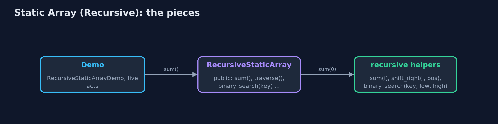
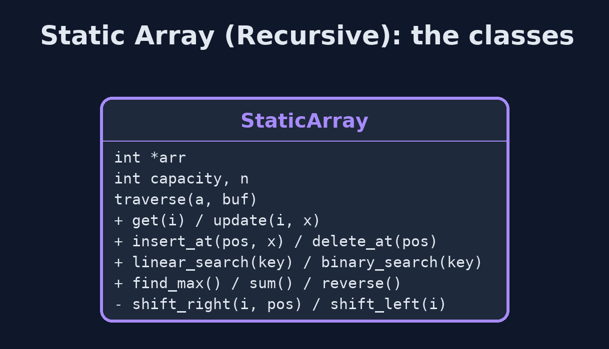
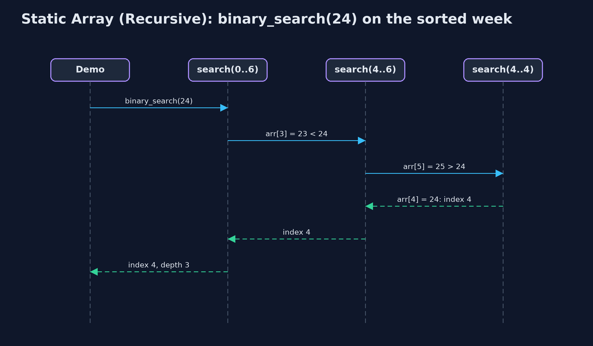

# Static Array (Recursive)

**A recursive operation solves the problem for one element and calls itself for the rest, stopping at a base case; it does the same work as the loop, but every call still waiting uses a frame on the call stack, so its extra space is the depth of the recursion: O(n) for traversal and search, O(log n) for binary search.**


*sum(0) waits for sum(1), which waits for sum(2) ... down to the base case sum(7) = 0*

A **static array** stores elements of one type in **consecutive memory locations**, with a fixed **capacity**, and keeps `n` elements in `arr[0..n-1]`. This project is the same array as the `static-array` project, but every operation that can be written **recursively** is: the function handles one element (or one half), then **calls itself** for the rest, and stops at a **base case** where there is nothing left to do. The answers are the same as the loops' answers, and the number of steps is the same too. What changes is memory: every call that is still waiting for the call below it keeps a **frame** on the **call stack**, so a recursive operation's extra space is its **recursion depth**: O(n) for traversal, search, sum, maximum and shifting, n / 2 for reversal, and only O(log n) for binary search. Access and update are one address calculation and stay non-recursive.

> New to data structures? Read [Start here](../../START-HERE.md) first: it explains memory, pointers and counting steps in ten minutes.

## The everyday idea

Picture a queue of seven people, and you want the total of the money in their pockets. You ask the first person. They do not count everyone; they ask the person behind them "what is the total from you to the end?", and wait. That person asks the next, and waits too. The last person has nobody behind, so they answer straight away with their own amount: that is the base case. Then the answers travel back up the queue, each person adding their own amount before passing it on. While the question travels down, everyone is standing there waiting: seven people waiting is seven frames on the call stack.

## The worked example: A week of daily temperatures, every operation written recursively

The same weather station as the `static-array` project stores one whole-number temperature a day in `int arr[10]`: Monday at index 0 through Sunday at index 6, so n = 7. The demo first traces `sum(0)` call by call to the base case, then runs every operation recursively and works out, from what each one did, how many steps it took and how deep the recursion went. Finally it runs binary search and linear search on an array of a million elements, and linear search runs out of call stack.

## Why it exists

Many textbook algorithms are defined recursively: "the sum is the first element plus the sum of the rest", "binary search searches one half". Writing them that way makes the code match the definition, and it is the only practical way to write the tree, graph and divide-and-conquer algorithms later in the course. The array is the simplest place to learn how recursion runs: the base case, the recursive case, the call stack, the depth, and the cost in memory that a loop does not pay.

## New words

| Word | What it means here |
| --- | --- |
| **recursion** | A function solving a problem by calling itself on a smaller part of the same problem. |
| **base case** | The smallest input, answered directly without another call: `i == n`, no elements left. Without it the recursion never stops. |
| **recursive case** | The part that handles one element and calls the function again for the rest: `arr[i] + sum(i + 1)`. |
| **call stack** | The memory where C keeps one frame for every function call that has not yet returned. |
| **stack frame** | One call's parameters and local variables, pushed when the call starts and popped when it returns. |
| **recursion depth** | The largest number of calls waiting on the stack at once. The extra space of a recursive operation is proportional to it. |
| **stack overflow** | Too many frames for the call stack. C cannot catch it: the operating system stops the program with a signal, usually `SIGSEGV`. |
| **tail recursion** | The recursive call is the last thing the function does. An optimising C compiler may then reuse the frame (tail-call elimination); at `-O0`, as these projects are compiled, it does not. |

## What you will see, act by act

Run the demo and it tells the story in 5 acts; `make test` checks that it still prints exactly `tests/expected-output.txt`:

```bash
make run
```

| Act | What it shows |
| --- | --- |
| 1. Thinking recursively | sum(0) = 21 + sum(1), and so on down to the base case sum(7) = 0: the answer is 154, with 7 calls waiting at once. |
| 2. The call stack | Traversal goes 7 calls deep, one frame per element; find_max finds index 3 (25 C) at depth 6, comparing on the way back up. |
| 3. Searching recursively | Recursive linear search finds 24 at index 4 with 5 comparisons at depth 5; recursive binary search on the sorted week finds it with 3 comparisons at depth 3. |
| 4. Insertion, deletion and reversal, recursively | insert_at(2, 18) shifts 5 elements at depth 5; delete_at(0) shifts 7 at depth 7; reverse swaps 3 pairs at depth 3. |
| 5. The limit of recursion | On 1,000,000 elements, recursive binary search goes only 20 calls deep; recursive linear search overflows the stack, and the child process running it is stopped. |

Each act is drawn step by step in [the explained walkthrough](docs/static-array-recursive-explained.md) and in [the animation](docs/animation.html).

## The operations, and what they cost

Time is given for the best, average and worst case in Big-O notation (START-HERE.md explains it by counting steps); the last column is what that costs in the worked example, as the demo prints it.

| Operation | What it does | Time: best / average / worst | Extra space (call stack) | Same operation as a loop | In the example |
| --- | --- | --- | --- | --- | --- |
| Traverse | Visit arr[i], then traverse from i + 1 | O(n) / O(n) / O(n) | O(n): depth n | O(1) | 7 reads, depth 7 |
| Access `get(i)` | Return arr[i], by address calculation (not recursive) | O(1) / O(1) / O(1) | O(1) | O(1) | 1 step |
| Update `update(i, x)` | Replace arr[i] (not recursive) | O(1) / O(1) / O(1) | O(1) | O(1) | 1 step |
| Insert `insert_at(pos, x)` | shift_right from the last element down to pos, then store x | O(1) at the end / O(n) / O(n) at the front | O(n - pos) | O(1) | 5 shifts at depth 5 to insert at index 2 of 7 |
| Delete `delete_at(pos)` | shift_left from pos up to the end | O(1) at the end / O(n) / O(n) at the front | O(n - pos) | O(1) | 7 shifts at depth 7 to delete index 0 of 8 |
| Linear search | Is the key at i? If not, search from i + 1 | O(1) / O(n) / O(n) | O(n) | O(1) | 5 comparisons at depth 5 to find 24 |
| Binary search (sorted) | Compare with the middle, search one half | O(1) / O(log n) / O(log n) | O(log n) | O(1) | at most 3 calls for 7 elements; at most 20 on 1,000,000 |
| Find maximum | The larger of arr[i] and the maximum of the rest | O(n) / O(n) / O(n) | O(n) | O(1) | 6 comparisons at depth 6 |
| Sum | arr[i] plus the sum of the rest; 0 when none are left | O(n) / O(n) / O(n) | O(n) | O(1) | 154 at depth 7 |
| Reverse | Swap the two ends, reverse what is between them | O(n) / O(n) / O(n) | O(n / 2) = O(n) | O(1) | 3 swaps at depth 3 |

Extra space is the memory an operation needs besides the structure itself. A loop needs a fixed amount, O(1); a recursive operation needs one call-stack frame for every call still waiting, so its extra space is the depth of the recursion.

## The operations in code

### Sum: the simplest recursion

```c
/** The sum, recursively. O(n) time and stack. */
long sum(const StaticArray *a) {
    return sum_from(a, 0);
}

/** arr[i] plus the sum of the rest; the sum of no elements is 0. */
static long sum_from(const StaticArray *a, int i) {
    if (i == a->n) {
        return 0;                   /* base case */
    }
    long result = a->arr[i] + sum_from(a, i + 1);
    return result;
}
```

The base case is `i == n`: the sum of no elements is 0. The recursive case adds `arr[i]` to the sum of the rest. The addition cannot happen until `sum(i + 1)` returns, so all seven calls wait on the stack together: depth 7, O(n) extra space, where the loop needed one variable.

### Traversal

```c
void traverse(const StaticArray *a) {
    printf("[");
    traverse_from(a, 0);
    printf("]\n");
}

/** Traversal: print element i, then traverse the rest from i + 1. O(n) time, O(n) stack. */
static void traverse_from(const StaticArray *a, int i) {
    if (i == a->n) {                /* base case: no elements left */
        return;
    }
    printf(i > 0 ? ", %d" : "%d", a->arr[i]);
    traverse_from(a, i + 1);        /* recursive case: the rest of the array */
}
```

The same shape as sum: visit element i, then traverse the rest. The recursive call is the last statement (tail recursion). An optimising compiler could turn it into a loop; compiled with `-O0`, as here, every frame is kept, so the depth you see is the depth the code describes.

### Insertion at a position

```c
/**
 * Insertion at pos: shift arr[pos..n-1] right recursively, starting at the last element, then
 * store the value. O(n - pos) time and stack.
 */
Status insert_at(StaticArray *a, int pos, int value) {
    if (a->n == a->capacity) {
        return STATUS_OVERFLOW;
    }
    if (pos < 0 || pos > a->n) {
        return STATUS_OUT_OF_RANGE;
    }
    shift_right(a, a->n - 1, pos);
    a->arr[pos] = value;
    a->n++;
    return STATUS_OK;
}

/** Moves arr[i] one place right, then shifts the elements before it, down to pos. */
static void shift_right(StaticArray *a, int i, int pos) {
    if (i < pos) {                  /* base case: every element from pos onwards has moved */
        return;
    }
    a->arr[i + 1] = a->arr[i];
    shift_right(a, i - 1, pos);
}
```

`shift_right(i, pos)` moves `arr[i]` one place right and then shifts the elements before it; it starts at the last element, `n - 1`, so every element moves before its old place is overwritten, just as the loop runs from the end. The base case is `i < pos`: everything from `pos` onwards has moved. n - pos shifts, n - pos frames deep.

### Deletion at a position

```c
/** Deletion at pos: shift arr[pos+1..n-1] left recursively. O(n - pos) time and stack. */
Status delete_at(StaticArray *a, int pos, int *deleted) {
    if (a->n == 0) {
        return STATUS_UNDERFLOW;
    }
    if (pos < 0 || pos >= a->n) {
        return STATUS_OUT_OF_RANGE;
    }
    *deleted = a->arr[pos];
    shift_left(a, pos);
    a->n--;
    return STATUS_OK;
}

/** Moves arr[i + 1] into arr[i], then does the same from i + 1. */
static void shift_left(StaticArray *a, int i) {
    if (i >= a->n - 1) {            /* base case: reached the last element */
        return;
    }
    a->arr[i] = a->arr[i + 1];
    shift_left(a, i + 1);
}
```

The mirror image: `shift_left(i)` moves `arr[i + 1]` into `arr[i]` and recurses on `i + 1`, stopping at the last element.

### Linear search

```c
/** Linear search, recursively. O(n) time, O(n) stack. */
int linear_search(const StaticArray *a, int key) {
    return linear_search_from(a, key, 0);
}

/** Is the key at i? If not, search from i + 1. */
static int linear_search_from(const StaticArray *a, int key, int i) {
    if (i == a->n) {
        return -1;                  /* base case: searched everything */
    }
    int result = a->arr[i] == key ? i : linear_search_from(a, key, i + 1);
    return result;
}
```

Two base cases: `i == n` (searched everything, return -1), and a match (return i). Otherwise search from i + 1. Finding 24 at index 4 takes 5 calls; searching a million elements needs a million frames, and overflows.

### Binary search

```c
/** Binary search on a sorted array, recursively. O(log n) time and stack. */
int binary_search(const StaticArray *a, int key) {
    return binary_search_range(a, key, 0, a->n - 1);
}

/** Compare with the middle of arr[low..high], then search only the half that can hold the key. */
static int binary_search_range(const StaticArray *a, int key, int low, int high) {
    if (low > high) {
        return -1;                  /* base case: the range is empty */
    }
    int mid = low + (high - low) / 2;
    int result;
    if (a->arr[mid] == key) {
        result = mid;
    } else if (a->arr[mid] < key) {
        result = binary_search_range(a, key, mid + 1, high);
    } else {
        result = binary_search_range(a, key, low, mid - 1);
    }
    return result;
}
```

The base case is an empty range, `low > high`. Each call compares with the middle and calls itself on one half only, so the depth is at most about log2(n) + 1: 20 for a million elements. This is the recursion that is always safe to use.

### Find maximum

```c
/** The index of the largest element, compared on the way back up. O(n) time and stack. */
int find_max(const StaticArray *a) {
    return a->n == 0 ? -1 : find_max_from(a, 0);
}

/** The index of the larger of arr[i] and the largest of the rest. */
static int find_max_from(const StaticArray *a, int i) {
    if (i == a->n - 1) {
        return i;                   /* base case: one element is its own maximum */
    }
    int rest_max = find_max_from(a, i + 1);
    int result = a->arr[i] >= a->arr[rest_max] ? i : rest_max;
    return result;
}
```

The base case is the last element, which is its own maximum. Every other call first finds the maximum of the rest, then compares it with its own element on the way back up, so the comparisons happen as the calls return.

### Reversal

```c
/** Reverses in place, recursively. O(n) time, O(n / 2) stack. */
void reverse(StaticArray *a) {
    reverse_range(a, 0, a->n - 1);
}

/** Swap the two ends, then reverse what is between them. */
static void reverse_range(StaticArray *a, int i, int j) {
    if (i >= j) {
        return;                     /* base case: zero or one element in the middle */
    }
    int t = a->arr[i];
    a->arr[i] = a->arr[j];
    a->arr[j] = t;
    reverse_range(a, i + 1, j - 1);
}
```

Swap the two ends, then reverse the part between them. The base case is `i >= j`: zero or one element left in the middle. n / 2 swaps, n / 2 frames.

## Compared with related structures

The recursive array against the same array written with loops (the `static-array` project), and against the related structures (n elements):

| Operation | Recursive static array | Iterative static array | Singly linked list |
| --- | --- | --- | --- |
| Access element i | O(1) time, O(1) space | O(1) time, O(1) space | O(n) time |
| Traverse, sum, maximum | O(n) time, O(n) stack | O(n) time, O(1) space | O(n) time |
| Linear search | O(n) time, O(n) stack | O(n) time, O(1) space | O(n) time |
| Binary search (sorted) | O(log n) time, O(log n) stack | O(log n) time, O(1) space | not possible: no middle to jump to |
| Insert or delete at the front | O(n) shifts, O(n) stack | O(n) shifts, O(1) space | O(1) |
| A million elements | linear recursion: stack overflow | fine | fine with loops |
| Code | matches the textbook definition | slightly longer, no stack cost |  |

## The code

```
src/
├── demo.c          Tells the story of the recursive static array in five acts
├── static_array.c  The static array's operations, written recursively, each with a base case
└── static_array.h  A static (fixed-capacity) array of integers whose operations are written recursively
tests/
├── check.c              The test harness's counters, and main: runs the tests and reports
├── check.h              A tiny test harness: RUN(test) runs one test function, CHECK(condition) records a failure
└── test_static_array.c  Every behaviour the recursive static array must have, including a real stack overflow
```

## Build and test

```bash
make test
```

7 tests in `test_static_array.c`, and the demo's whole output compared with `tests/expected-output.txt`, so every number the docs quote is checked. Nothing depends on the clock, so every run gives the same result.

## Common mistakes

| The mistake | What goes wrong | The fix |
| --- | --- | --- |
| No base case, or one that is never reached | The function calls itself for ever until the stack overflows and the program is stopped with `SIGSEGV`. | Write the base case first, and check that every recursive call moves towards it (`i + 1`, a smaller half). |
| Making no progress: `sum(i)` calling `sum(i)` | Same as no base case: infinite recursion. | Each call must work on a smaller problem than the one it was given. |
| Base case `i == n - 1` in sum, with n = 0 | An empty array starts at i = 0, which never equals -1, and reads past the end. | Use `i == n`, which also handles the empty array. |
| Shifting from pos upwards on insertion | Each element overwrites the next before it has moved, copying one value into every place. | Start the recursion at the last element and move down to pos. |
| Linear recursion on large data | One frame per element: a million elements overflows the call stack. | Use recursion where the depth is O(log n), and loops for linear passes over big arrays. |

## Try it yourself

1. **Easy.** Write a recursive `int count_above(StaticArray *a, int limit, int i)` that returns how many elements from index i onwards are greater than `limit`. What are its base case, its time and its extra space?
2. **Medium.** Write a recursive `int is_sorted(StaticArray *a, int i)`, returning 1 or 0, that returns true when `arr[i..n-1]` is in ascending order. How deep does it go on the week, and how deep on [5, 3, 8, 9]?
3. **Harder.** Rewrite the recursive `binary_search_range(a, key, low, high)` as a loop. Why can every tail-recursive function be rewritten like this, and what does it save?

The answers are in [docs/exercises.md](docs/exercises.md), below the questions, so they are not given away.

## When to use it

- The problem is naturally defined in terms of a smaller copy of itself, such as binary search on one half.
- The recursion depth is small: O(log n), as in binary search, is always safe.
- Learning: tracing a recursion on an array is the best preparation for trees and divide-and-conquer.

## When not to

- The recursion depth grows with n, as in linear search or traversal, and n can be large: a million elements overflow the call stack (compiled without optimisation, as here, every call keeps its frame). Use the loops of the `static-array` project.
- Performance matters: each call costs a frame, a jump and a return, which a loop does not.

## Where you have already met this

- The definition of factorial: n! = n x (n - 1)!, with 0! = 1 as the base case.
- A program stopped by `SIGSEGV` because a function called itself with no base case.
- Merge sort and quicksort, which recurse on halves of an array.

## Technologies and versions

| Technology | Version | Used for |
| --- | --- | --- |
| C | C17 | the code, compiled with `-std=c17 -Wall -Wextra -Wpedantic -Werror -O0 -g` |
| Compiler | Apple clang version 14.0.3 (clang-1403.0.22.14.1) | any C17 compiler works; the Makefile uses `cc` |
| make | the system `make` | build, run and test: `make run`, `make test` |
| Tests | a hand-written harness, `tests/check.h` | no test library needed |
| videokit | course tool | the narrated video and animation: Piper `en_US-amy-medium`, speed 0.8, longer pauses (the `amy-slow` voice) |

## Learning material

| Document | What it is for |
| --- | --- |
| [Start here](../../START-HERE.md) | the ideas every project relies on |
| [Problem statement](docs/problem-statement.md) | the situation and what the project must show |
| [Prerequisites](docs/prerequisites.md) | what you need to know first |
| [Static Array (Recursive), explained](docs/static-array-recursive-explained.md) | every act, picture by picture |
| [Animated walkthrough](docs/animation.html) | the structure changing step by step, narrated |
| [Cheat sheet](docs/cheat-sheet.md) | the whole structure on one page |
| [Exercises and answers](docs/exercises.md) | practice, easy to harder |
| [Session guide](docs/session.md) | a one-hour lesson |
| [Specification](docs/spec.md) | what this project must be true of |

### How the pieces fit

The demo calls the public operations in `static_array.c`; each starts a `static` recursive helper that works on `arr`.



### The types and functions

`StaticArray` is the data structure: public functions in `static_array.h`, recursive `static` helpers inside `static_array.c`.



### How the data moves

Base case first; otherwise one element's work and a call on the rest, then the addition as the call returns.


### Who calls whom, in order

Three calls, each on half the range; the answer returns through every frame.



### Video

`video/static-array-recursive-explained.mp4` (with `.m4a` audio and `.srt` subtitles) is built by `video/build_video.sh`. Rendered media is not committed.

## Where this sits

Part of the [data structures course](../../index.md), in *arrays-and-lists*.
