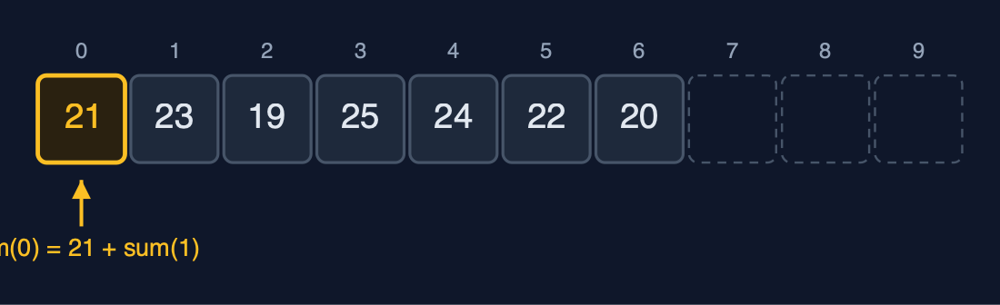
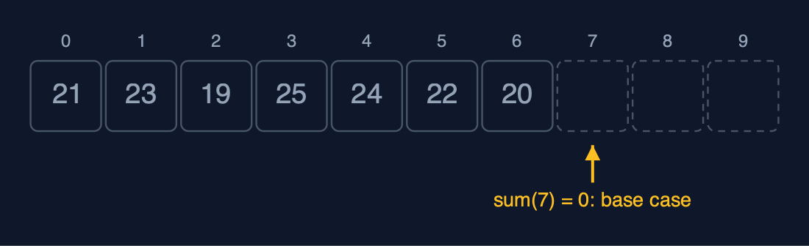
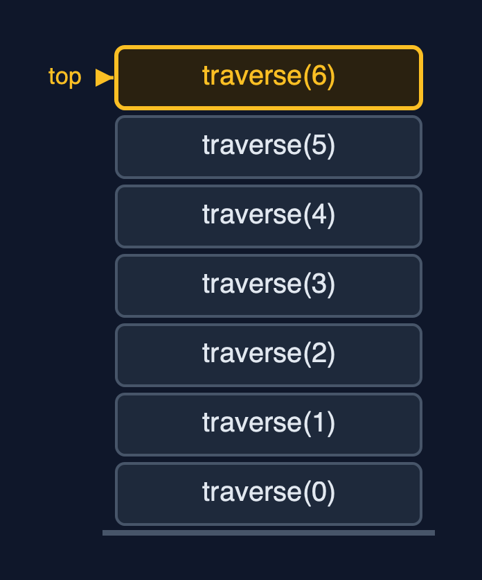
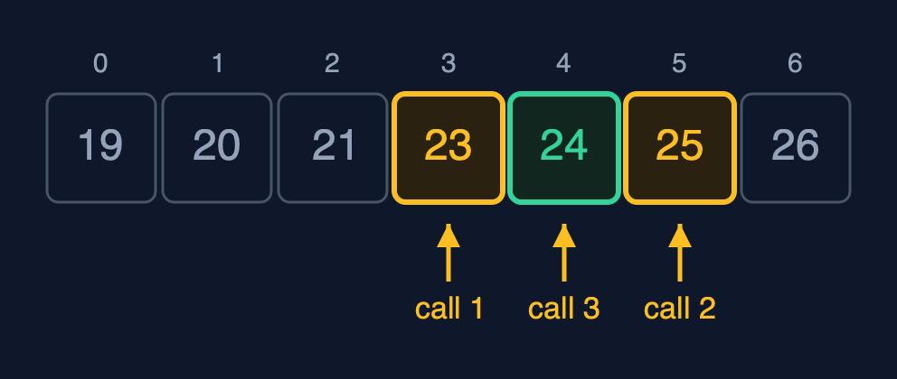
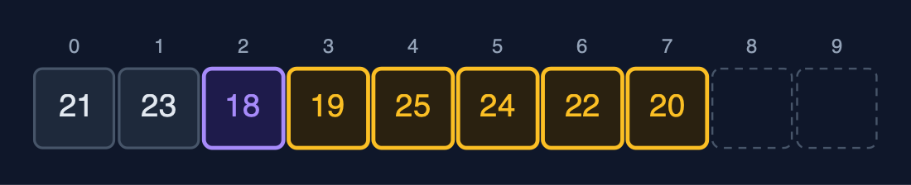
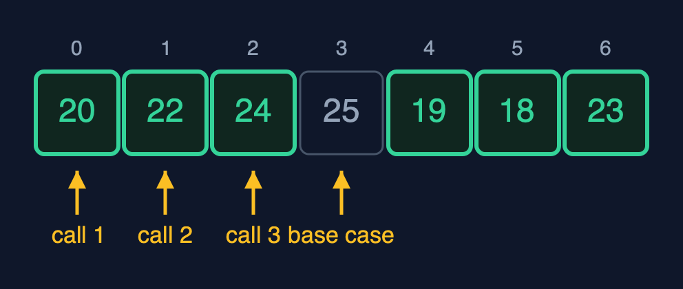
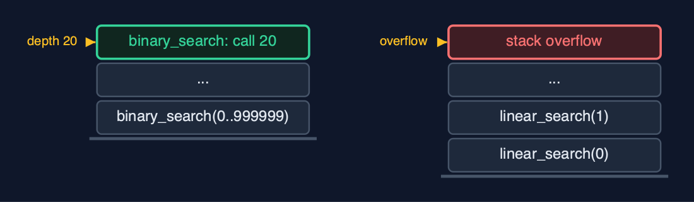

# Static Array (Recursive), Explained

## In one sentence

A recursive array operation handles one element, or one half, and calls itself for the rest until a base case; it does the same work as the loop but keeps one stack frame per waiting call, so its extra space is the recursion depth: O(n) for linear passes and O(log n) for binary search.

## The picture


*sum(0) waits for sum(1), which waits for sum(2) ... down to the base case sum(7) = 0*

## The everyday idea

Picture a queue of seven people, and you want the total of the money in their pockets. You ask the first person. They do not count everyone; they ask the person behind them "what is the total from you to the end?", and wait. That person asks the next, and waits too. The last person has nobody behind, so they answer straight away with their own amount: that is the base case. Then the answers travel back up the queue, each person adding their own amount before passing it on. While the question travels down, everyone is standing there waiting: seven people waiting is seven frames on the call stack.

## The 5 acts

### Act 1: Thinking recursively

The sum of the week can be defined in terms of a smaller sum: the sum from index i is `arr[i]` plus the sum from index i + 1. That definition needs a place to stop, the **base case**: when i reaches n there are no elements left, and their sum is 0. The demo prints each call as it happens: `sum(0) = 21 + sum(1)`, `sum(1) = 23 + sum(2)`, and so on until `sum(7) = 0`. Only then can the additions happen, from the bottom back up: 20 + 0, 22 + 20, and so on, to 154.



**Going down: each call handles one element and asks for the sum of the rest** Here are the calls going down. Sum of zero is twenty one, plus sum of one. But it cannot add yet. It must wait for sum of one. Sum of one waits for sum of two, and so on.



**The base case: sum(7) = 0, because no elements are left** At index seven there are no elements left. So sum of seven returns zero, without another call. That is the base case, and it is what stops the recursion. Now the answers travel back up, and each call adds its own element.

What the demo printed:

```
sum(0) = 21 + sum(1)
  sum(1) = 23 + sum(2) ... sum(6) = 20 + sum(7)
    sum(7) = 0   <- base case: no elements left
sum() = 154, with 7 calls waiting on the stack at once, one per element
```

### Act 2: The call stack

Every call that has not returned keeps a **stack frame**: its own `i` and its own place in the code. Traversal visits `arr[i]` and calls itself for i + 1, so when it reaches the end, 7 frames are on the stack: the **recursion depth** is 7, one frame per element. That is the memory cost of recursion: O(n) extra space, where the loop used O(1). `find_max` shows the other direction of work: its base case is the last element, which is its own maximum, and each call compares its element with the maximum of the rest **as the calls return**. It finds 25 C at index 3, with 6 comparisons at depth 6.



**Seven frames on the call stack, the newest on top** Here is the call stack. The first call is at the bottom. Each new call is pushed on top. Seven calls, seven frames. When the top one returns, it is popped, and the one below continues.

What the demo printed:

```
traverse: [21, 23, 19, 25, 24, 22, 20]
call-stack depth 7: one frame per element, each waiting for the rest
find_max = index 3 (25 C): depth 6, 6 comparisons on the way back up
```

### Act 3: Searching recursively

Linear search written recursively: if the element at i is the key, return i; otherwise search from i + 1; if i reaches n, return -1. Finding 24 at index 4 takes 5 comparisons and 5 frames. Binary search is naturally recursive: compare with the middle element, then search only the half that can hold the key; an empty range, `low > high`, is the base case. On the sorted week [19, 20, 21, 23, 24, 25, 26] it compares with 23, then 25, then 24: 3 comparisons, 3 frames. Binary search's depth is its number of comparisons, about log2(n).



**Recursive binary search for 24: search(0..6) at 23, search(4..6) at 25, search(4..4) finds it** Binary search for twenty four. The first call looks at the middle, twenty three. Too small, so it calls itself on the right half. The second call looks at twenty five. Too big, so it calls itself on the left part. The third call finds twenty four. Three calls deep.

What the demo printed:

```
linear_search(24) = index 4: 5 comparisons, one call each, depth 5
binary_search(24) = index 4: at most 3 calls deep, one comparison each
```

### Act 4: Insertion, deletion and reversal, recursively

Shifting can be recursive too. `insert_at(2, 18)` calls `shift_right(6, 2)`, which moves `arr[6]` one place right and calls `shift_right(5, 2)`, and so on down to index 2; the base case is an index below the insertion position. Starting from the end keeps every element safe from being overwritten: 5 shifts at depth 5, and 18 is stored at index 2. `delete_at(0)` calls `shift_left(0)`, moving each later element one place left: 7 shifts at depth 7. `reverse` swaps the two ends and calls itself on the part between them; with 7 elements it swaps 3 pairs, 3 frames deep, and the middle element stays where it is.



**insert_at(2, 18): shift_right moved indexes 6 down to 2, one call each** Here is the array after the insertion. Eighteen, in purple, is at index two. The five elements after it, in amber, were each moved by one call of shift right. Five calls, five frames.



**reverse: swap the ends, then reverse the middle; the centre element stays** Here is reverse. The first call swaps the two ends. The second call swaps the next pair in. The third call swaps the pair next to the middle. The middle element has nothing to swap with. That is the base case.

What the demo printed:

```
insert_at(2, 18): 5 shifts, one call each, depth 5; [21, 23, 18, 19, 25, 24, 22, 20]
delete_at(0): 7 shifts, depth 7; [23, 18, 19, 25, 24, 22, 20]
reverse: 3 swaps, depth 3; [20, 22, 24, 25, 19, 18, 23]
```

### Act 5: The limit of recursion

The depth decides whether recursion is safe. On a sorted array of a million elements, recursive binary search needs 20 comparisons and 20 frames, because each call halves the range: O(log n) depth is always safe. Recursive linear search on the same array needs one frame per element, a million frames, and the call stack runs out first: the operating system stops the program with the signal `SIGSEGV`. C cannot catch that, so the demo runs this search in a child process (made with `fork`) and reports how the child ended, while the demo itself carries on. The loop in the `static-array` project searches the million with O(1) extra space and finishes. The rule: recurse when the depth is logarithmic; loop over long linear passes.



**Depth 20 against depth 1,000,000: the call stack holds the first, not the second** Here are the two depths side by side. Binary search, twenty frames. Linear search, a million frames, far more than the call stack can hold. The work is similar in style. The depth is what matters.

What the demo printed:

```
binary_search on 1,000,000: index 666666, at most 20 calls deep: halving keeps the stack small
linear_search on 1,000,000: the child process was killed by SIGSEGV: the call stack overflowed
the same loop in the static-array project needs O(1) extra space and finishes
C cannot catch a stack overflow: the program is stopped, so this ran in a child process
```

## The operations in code

### Sum: the simplest recursion

```c
/** The sum, recursively. O(n) time and stack. */
long sum(const StaticArray *a) {
    return sum_from(a, 0);
}

/** arr[i] plus the sum of the rest; the sum of no elements is 0. */
static long sum_from(const StaticArray *a, int i) {
    if (i == a->n) {
        return 0;                   /* base case */
    }
    long result = a->arr[i] + sum_from(a, i + 1);
    return result;
}
```

The base case is `i == n`: the sum of no elements is 0. The recursive case adds `arr[i]` to the sum of the rest. The addition cannot happen until `sum(i + 1)` returns, so all seven calls wait on the stack together: depth 7, O(n) extra space, where the loop needed one variable.

### Traversal

```c
void traverse(const StaticArray *a) {
    printf("[");
    traverse_from(a, 0);
    printf("]\n");
}

/** Traversal: print element i, then traverse the rest from i + 1. O(n) time, O(n) stack. */
static void traverse_from(const StaticArray *a, int i) {
    if (i == a->n) {                /* base case: no elements left */
        return;
    }
    printf(i > 0 ? ", %d" : "%d", a->arr[i]);
    traverse_from(a, i + 1);        /* recursive case: the rest of the array */
}
```

The same shape as sum: visit element i, then traverse the rest. The recursive call is the last statement (tail recursion). An optimising compiler could turn it into a loop; compiled with `-O0`, as here, every frame is kept, so the depth you see is the depth the code describes.

### Insertion at a position

```c
/**
 * Insertion at pos: shift arr[pos..n-1] right recursively, starting at the last element, then
 * store the value. O(n - pos) time and stack.
 */
Status insert_at(StaticArray *a, int pos, int value) {
    if (a->n == a->capacity) {
        return STATUS_OVERFLOW;
    }
    if (pos < 0 || pos > a->n) {
        return STATUS_OUT_OF_RANGE;
    }
    shift_right(a, a->n - 1, pos);
    a->arr[pos] = value;
    a->n++;
    return STATUS_OK;
}

/** Moves arr[i] one place right, then shifts the elements before it, down to pos. */
static void shift_right(StaticArray *a, int i, int pos) {
    if (i < pos) {                  /* base case: every element from pos onwards has moved */
        return;
    }
    a->arr[i + 1] = a->arr[i];
    shift_right(a, i - 1, pos);
}
```

`shift_right(i, pos)` moves `arr[i]` one place right and then shifts the elements before it; it starts at the last element, `n - 1`, so every element moves before its old place is overwritten, just as the loop runs from the end. The base case is `i < pos`: everything from `pos` onwards has moved. n - pos shifts, n - pos frames deep.

### Deletion at a position

```c
/** Deletion at pos: shift arr[pos+1..n-1] left recursively. O(n - pos) time and stack. */
Status delete_at(StaticArray *a, int pos, int *deleted) {
    if (a->n == 0) {
        return STATUS_UNDERFLOW;
    }
    if (pos < 0 || pos >= a->n) {
        return STATUS_OUT_OF_RANGE;
    }
    *deleted = a->arr[pos];
    shift_left(a, pos);
    a->n--;
    return STATUS_OK;
}

/** Moves arr[i + 1] into arr[i], then does the same from i + 1. */
static void shift_left(StaticArray *a, int i) {
    if (i >= a->n - 1) {            /* base case: reached the last element */
        return;
    }
    a->arr[i] = a->arr[i + 1];
    shift_left(a, i + 1);
}
```

The mirror image: `shift_left(i)` moves `arr[i + 1]` into `arr[i]` and recurses on `i + 1`, stopping at the last element.

### Linear search

```c
/** Linear search, recursively. O(n) time, O(n) stack. */
int linear_search(const StaticArray *a, int key) {
    return linear_search_from(a, key, 0);
}

/** Is the key at i? If not, search from i + 1. */
static int linear_search_from(const StaticArray *a, int key, int i) {
    if (i == a->n) {
        return -1;                  /* base case: searched everything */
    }
    int result = a->arr[i] == key ? i : linear_search_from(a, key, i + 1);
    return result;
}
```

Two base cases: `i == n` (searched everything, return -1), and a match (return i). Otherwise search from i + 1. Finding 24 at index 4 takes 5 calls; searching a million elements needs a million frames, and overflows.

### Binary search

```c
/** Binary search on a sorted array, recursively. O(log n) time and stack. */
int binary_search(const StaticArray *a, int key) {
    return binary_search_range(a, key, 0, a->n - 1);
}

/** Compare with the middle of arr[low..high], then search only the half that can hold the key. */
static int binary_search_range(const StaticArray *a, int key, int low, int high) {
    if (low > high) {
        return -1;                  /* base case: the range is empty */
    }
    int mid = low + (high - low) / 2;
    int result;
    if (a->arr[mid] == key) {
        result = mid;
    } else if (a->arr[mid] < key) {
        result = binary_search_range(a, key, mid + 1, high);
    } else {
        result = binary_search_range(a, key, low, mid - 1);
    }
    return result;
}
```

The base case is an empty range, `low > high`. Each call compares with the middle and calls itself on one half only, so the depth is at most about log2(n) + 1: 20 for a million elements. This is the recursion that is always safe to use.

### Find maximum

```c
/** The index of the largest element, compared on the way back up. O(n) time and stack. */
int find_max(const StaticArray *a) {
    return a->n == 0 ? -1 : find_max_from(a, 0);
}

/** The index of the larger of arr[i] and the largest of the rest. */
static int find_max_from(const StaticArray *a, int i) {
    if (i == a->n - 1) {
        return i;                   /* base case: one element is its own maximum */
    }
    int rest_max = find_max_from(a, i + 1);
    int result = a->arr[i] >= a->arr[rest_max] ? i : rest_max;
    return result;
}
```

The base case is the last element, which is its own maximum. Every other call first finds the maximum of the rest, then compares it with its own element on the way back up, so the comparisons happen as the calls return.

### Reversal

```c
/** Reverses in place, recursively. O(n) time, O(n / 2) stack. */
void reverse(StaticArray *a) {
    reverse_range(a, 0, a->n - 1);
}

/** Swap the two ends, then reverse what is between them. */
static void reverse_range(StaticArray *a, int i, int j) {
    if (i >= j) {
        return;                     /* base case: zero or one element in the middle */
    }
    int t = a->arr[i];
    a->arr[i] = a->arr[j];
    a->arr[j] = t;
    reverse_range(a, i + 1, j - 1);
}
```

Swap the two ends, then reverse the part between them. The base case is `i >= j`: zero or one element left in the middle. n / 2 swaps, n / 2 frames.

## The operations, and what they cost

| Operation | What it does | Time: best / average / worst | Extra space (call stack) | Same operation as a loop | In the example |
| --- | --- | --- | --- | --- | --- |
| Traverse | Visit arr[i], then traverse from i + 1 | O(n) / O(n) / O(n) | O(n): depth n | O(1) | 7 reads, depth 7 |
| Access `get(i)` | Return arr[i], by address calculation (not recursive) | O(1) / O(1) / O(1) | O(1) | O(1) | 1 step |
| Update `update(i, x)` | Replace arr[i] (not recursive) | O(1) / O(1) / O(1) | O(1) | O(1) | 1 step |
| Insert `insert_at(pos, x)` | shift_right from the last element down to pos, then store x | O(1) at the end / O(n) / O(n) at the front | O(n - pos) | O(1) | 5 shifts at depth 5 to insert at index 2 of 7 |
| Delete `delete_at(pos)` | shift_left from pos up to the end | O(1) at the end / O(n) / O(n) at the front | O(n - pos) | O(1) | 7 shifts at depth 7 to delete index 0 of 8 |
| Linear search | Is the key at i? If not, search from i + 1 | O(1) / O(n) / O(n) | O(n) | O(1) | 5 comparisons at depth 5 to find 24 |
| Binary search (sorted) | Compare with the middle, search one half | O(1) / O(log n) / O(log n) | O(log n) | O(1) | at most 3 calls for 7 elements; at most 20 on 1,000,000 |
| Find maximum | The larger of arr[i] and the maximum of the rest | O(n) / O(n) / O(n) | O(n) | O(1) | 6 comparisons at depth 6 |
| Sum | arr[i] plus the sum of the rest; 0 when none are left | O(n) / O(n) / O(n) | O(n) | O(1) | 154 at depth 7 |
| Reverse | Swap the two ends, reverse what is between them | O(n) / O(n) / O(n) | O(n / 2) = O(n) | O(1) | 3 swaps at depth 3 |

## Compared with related structures

The recursive array against the same array written with loops (the `static-array` project), and against the related structures (n elements):

| Operation | Recursive static array | Iterative static array | Singly linked list |
| --- | --- | --- | --- |
| Access element i | O(1) time, O(1) space | O(1) time, O(1) space | O(n) time |
| Traverse, sum, maximum | O(n) time, O(n) stack | O(n) time, O(1) space | O(n) time |
| Linear search | O(n) time, O(n) stack | O(n) time, O(1) space | O(n) time |
| Binary search (sorted) | O(log n) time, O(log n) stack | O(log n) time, O(1) space | not possible: no middle to jump to |
| Insert or delete at the front | O(n) shifts, O(n) stack | O(n) shifts, O(1) space | O(1) |
| A million elements | linear recursion: stack overflow | fine | fine with loops |
| Code | matches the textbook definition | slightly longer, no stack cost |  |

## The verdict

Learn recursion here, where it is easiest to trace, because trees, graphs and divide-and-conquer algorithms depend on it. In real code on arrays, use recursion when the depth is logarithmic, as in binary search, and loops for linear passes, which would overflow the stack on large inputs.

## How to recognise it in code you did not write

- A function that calls itself with `i + 1`, or with `low` and `high` for half the range.
- An `if` at the top returning without a call: the base case.
- A public function with fewer parameters that starts the recursion, such as `sum(a)` calling `sum_from(a, 0)`.

## Where you have already met this

- The definition of factorial: n! = n x (n - 1)!, with 0! = 1 as the base case.
- A program stopped by `SIGSEGV` because a function called itself with no base case.
- Merge sort and quicksort, which recurse on halves of an array.
