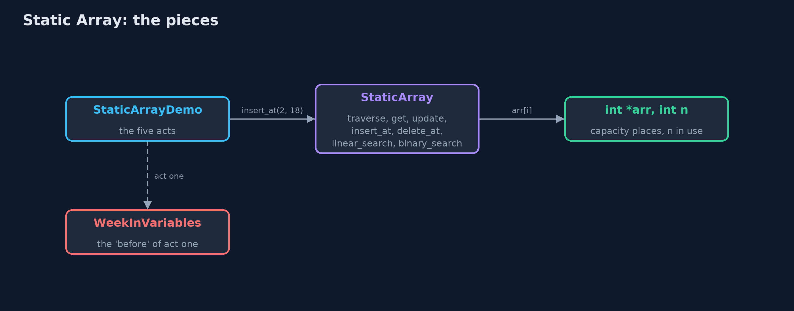
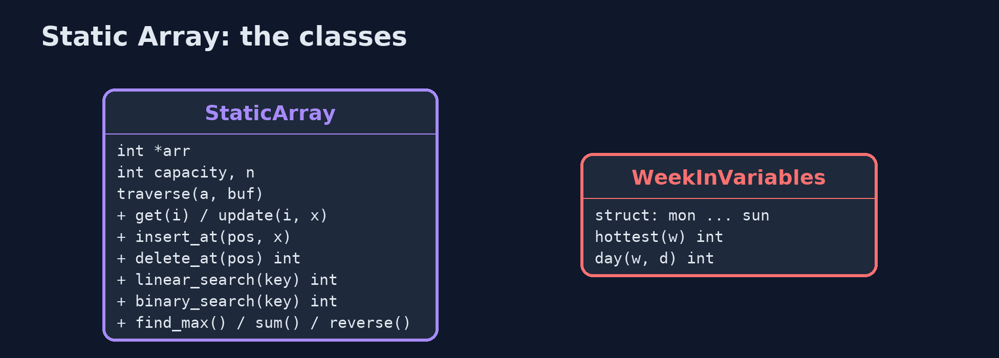
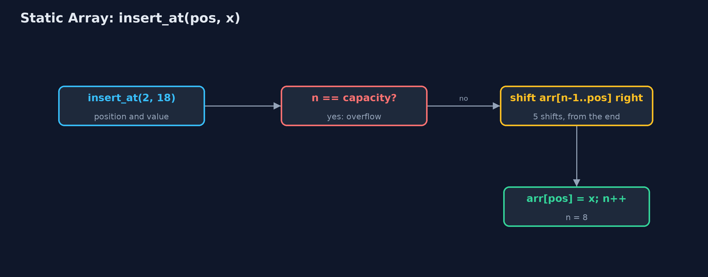
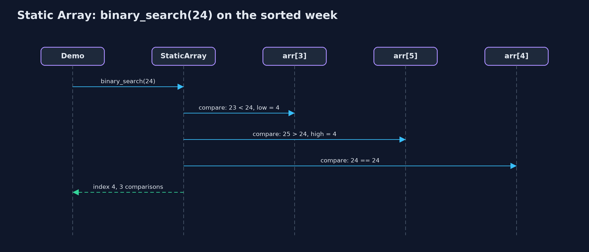

# Static Array

**A static array stores its elements in consecutive memory locations, so arr[i] is found by one address calculation in O(1); its capacity is fixed when it is created, so insertion and deletion shift elements and a full array overflows.**

![int arr[10] with n = 7: elements at indexes 0 to 6, three free places](docs/images/structure.png)

*int arr[10] with n = 7: elements at indexes 0 to 6, three free places*

A **static array** is a collection of elements of the same type stored in **consecutive memory locations**, each identified by an **index** from 0 to `capacity - 1`. In C it is `int arr[MAX]`, or a block of `capacity` ints taken once with `malloc`. Because the elements are consecutive, the address of `arr[i]` is computed as `base address + i x element size`, so any element is reached in O(1). The capacity is fixed when the array is created. This project keeps `n` elements in `arr[0..n-1]` and implements the operations a data-structures textbook lists for arrays: traversal, access, update, insertion, deletion, linear search, binary search, finding the maximum, and reversal. Every operation is written iteratively, with loops; the `static-array-recursive` project writes the same operations recursively.

> New to data structures? Read [Start here](../../START-HERE.md) first: it explains memory, pointers and counting steps in ten minutes.

## The everyday idea

Picture a row of numbered lockers in a school corridor: locker 0, locker 1, locker 2, all the same size and all touching. If someone says "open locker 3", you do not search; you walk straight to it, because you know where locker 3 is. That is array access by index. To fit a new locker into the middle, every locker after it would have to move one place along, and the corridor has a fixed length: when it is full, there is no room for another.

## The worked example: A week of daily temperatures, one element per day

A weather station records one temperature a day, in whole degrees Celsius. The week is stored in `int arr[10]`: Monday at index 0 through Sunday at index 6, so n = 7, with 3 spare places for corrections. The demo asks the station's questions: the temperature on a given day, correcting a reading, whether it ever reached 24 or 30 degrees, inserting a late reading, deleting a wrong one, and what happens when the array fills up.

## Why it exists

Without an array, seven days are seven separate variables, and every question has to name them all: finding the maximum needs six comparisons written out by hand, and "the temperature on day 3" needs a switch with a branch for each day. An array gives the seven values one name and an index, so one loop answers every question for 7 values or 7 million, and any single value is one address calculation away.

## New words

| Word | What it means here |
| --- | --- |
| **array** | A collection of elements of the same type in consecutive memory locations, accessed by index. |
| **element** | One value stored in the array; `arr[i]` is the element at index i. |
| **index** | The position of an element, from 0 to capacity - 1. The first element is at index 0. |
| **base address** | The memory address of `arr[0]`. The address of `arr[i]` is base address + i x element size. |
| **capacity (MAX)** | The number of places the array has, fixed when it is created: 10 here. |
| **size (n)** | The number of elements actually stored, in `arr[0]` to `arr[n-1]`: 7 here. |
| **traversal** | Visiting every element once, from index 0 to n - 1. |
| **shift** | Moving an element one position left or right to open or close a gap during insertion or deletion. |
| **overflow and underflow** | Inserting into a full array (overflow) or deleting from an empty one (underflow). |

## What you will see, act by act

Run the demo and it tells the story in 5 acts; `make test` checks that it still prints exactly `tests/expected-output.txt`:

```bash
make run
```

| Act | What it shows |
| --- | --- |
| 1. Seven separate variables | Without an array: six hand-written comparisons to find the maximum, and a seven-branch switch for 'day number 3'. |
| 2. One array: int arr[10], n = 7 | The week in consecutive memory: capacity 10, n = 7, 40 bytes, and the address of arr[3] computed as base + 3 x 4. |
| 3. Access, update, search | get(3) and update(5, 26) take 1 step each; linear search finds 24 after 5 comparisons and misses 30 after 7; binary search on the sorted week finds 24 in 3. |
| 4. Insertion, deletion, overflow | insert_at(2, 18) shifts 5 elements right; delete_at(0) shifts 7 left; at n = 10 the next insertion is an overflow. |
| 5. The bill | Binary search on 1,000,000 elements: 20 comparisons; linear search: 1,000,000, with O(1) extra space; growing from 7 to 31 places means a new array and 7 copies. |

Each act is drawn step by step in [the explained walkthrough](docs/static-array-explained.md) and in [the animation](docs/animation.html).

## The operations, and what they cost

Time is given for the best, average and worst case in Big-O notation (START-HERE.md explains it by counting steps); the last column is what that costs in the worked example, as the demo prints it.

| Operation | What it does | Time: best / average / worst | Extra space | In the example |
| --- | --- | --- | --- | --- |
| Traverse | Visit arr[0] to arr[n-1] once | O(n) / O(n) / O(n) | O(1) | 7 reads for the week |
| Access `get(i)` | Return arr[i], by address calculation | O(1) / O(1) / O(1) | O(1) | 1 step, for any i and any n |
| Update `update(i, x)` | Replace arr[i] | O(1) / O(1) / O(1) | O(1) | 1 step |
| Insert `insert_at(pos, x)` | Shift arr[pos..n-1] right, store x | O(1) at the end / O(n) / O(n) at the front | O(1) | 5 shifts to insert at index 2 of 7 |
| Delete `delete_at(pos)` | Shift arr[pos+1..n-1] left | O(1) at the end / O(n) / O(n) at the front | O(1) | 7 shifts to delete index 0 of 8 |
| Linear search | Compare with each element in turn | O(1) / O(n) / O(n) | O(1) | 5 comparisons to find 24; 7 to learn 30 is absent |
| Binary search (sorted) | Compare with the middle, discard half, repeat | O(1) / O(log n) / O(log n) | O(1) | 3 comparisons on the sorted week; 20 on 1,000,000 |
| Find maximum | Compare each element with the largest so far | O(n) / O(n) / O(n) | O(1) | n - 1 comparisons |
| Reverse | Swap arr[i] and arr[n-1-i] moving inward | O(n) / O(n) / O(n) | O(1) | n / 2 swaps |
| Grow | Impossible in place: allocate a bigger array and copy | O(n) / O(n) / O(n) | O(n) | 7 copies to grow the week to 31 places |

Extra space is the memory an operation needs besides the structure itself. A loop needs a fixed amount, O(1); a recursive operation needs one call-stack frame for every call still waiting, so its extra space is the depth of the recursion.

## The operations in code

### Traversal

```c
/** Traversal: visits arr[0] to arr[n - 1] once, printing each. O(n) time, O(1) space. */
void traverse(const StaticArray *a) {
    printf("[");
    for (int i = 0; i < a->n; i++) {
        printf(i > 0 ? ", %d" : "%d", a->arr[i]);
    }
    printf("]\n");
}
```

One loop from 0 to n - 1: every element is visited exactly once, so traversal is O(n) time and O(1) space.

### Insertion at a position

```c
/**
 * Insertion at position pos (0 <= pos <= n): shift arr[pos..n-1] one place right, starting from
 * the end, then store the value. n - pos shifts.
 */
Status insert_at(StaticArray *a, int pos, int value) {
    if (a->n == a->capacity) {
        return STATUS_OVERFLOW;
    }
    if (pos < 0 || pos > a->n) {
        return STATUS_OUT_OF_RANGE;
    }
    for (int i = a->n - 1; i >= pos; i--) {
        a->arr[i + 1] = a->arr[i];
    }
    a->arr[pos] = value;
    a->n++;
    return STATUS_OK;
}
```

The loop runs from the last element down to `pos`, so each element moves into the empty place to its right; running it from `pos` upwards would overwrite elements before they are moved. The number of shifts is n - pos: the whole array for pos = 0, nothing for pos = n.

### Deletion at a position

```c
/** Deletion at position pos (0 <= pos < n): shift arr[pos+1..n-1] one place left. n - pos - 1 shifts. */
Status delete_at(StaticArray *a, int pos, int *deleted) {
    if (a->n == 0) {
        return STATUS_UNDERFLOW;
    }
    if (pos < 0 || pos >= a->n) {
        return STATUS_OUT_OF_RANGE;
    }
    *deleted = a->arr[pos];
    for (int i = pos; i < a->n - 1; i++) {
        a->arr[i] = a->arr[i + 1];
    }
    a->n--;
    return STATUS_OK;
}
```

The mirror image of insertion: the loop runs upwards from `pos`, each element moving into the place to its left, n - pos - 1 shifts.

### Linear search

```c
/** Linear search: the index of the first element equal to key, or -1. O(n), O(1) space. */
int linear_search(const StaticArray *a, int key) {
    for (int i = 0; i < a->n; i++) {
        if (a->arr[i] == key) {
            return i;
        }
    }
    return -1;
}
```

Compare with each element in turn and stop at the first match: 1 comparison in the best case, n in the worst, and n when the key is absent.

### Binary search

```c
/**
 * Binary search, for an array sorted in ascending order: compare with the middle element and
 * discard the half that cannot hold key. O(log n) comparisons, O(1) space.
 */
int binary_search(const StaticArray *a, int key) {
    int low = 0;
    int high = a->n - 1;
    while (low <= high) {
        int mid = low + (high - low) / 2;     /* not (low + high) / 2, which can overflow */
        if (a->arr[mid] == key) {
            return mid;
        } else if (a->arr[mid] < key) {
            low = mid + 1;
        } else {
            high = mid - 1;
        }
    }
    return -1;
}
```

Only for a sorted array. Each comparison with the middle element discards half of the remaining range, so at most about log2(n) + 1 comparisons: 20 for a million elements. `mid` is computed as `low + (high - low) / 2`, because `(low + high) / 2` can overflow when both are large.

## Compared with related structures

How a static array compares with the structures it is usually weighed against (n elements):

| Operation | Static array | Dynamic array | Singly linked list |
| --- | --- | --- | --- |
| Access element i | O(1) | O(1) | O(n) |
| Insert or delete at the front | O(n) shifts | O(n) shifts | O(1) |
| Insert or delete at the end | O(1), until full | O(1) amortised | O(n), or O(1) with a tail pointer |
| Search (unsorted) | O(n) | O(n) | O(n) |
| Search (sorted) | O(log n), binary search | O(log n), binary search | O(n): no middle to jump to |
| Size | fixed at creation | grows by copying | grows one node at a time |
| Extra memory per element | none | spare capacity | one next pointer per node |
| Memory layout | consecutive | consecutive | scattered nodes |

## The code

```
src/
├── demo.c          Tells the story of the static array in five acts
├── static_array.c  The static array's operations, each a loop using O(1) extra space
├── static_array.h  A static (fixed-capacity) array of integers with the operations of a data-structures textbook, written with loops
├── week.c          Seven variables and no index: every question must name all seven days
└── week.h          The week kept in seven separate variables: act one's "before", with nothing to loop over
tests/
├── check.c              The test harness's counters, and main: runs the tests and reports
├── check.h              A tiny test harness: RUN(test) runs one test function, CHECK(condition) records a failure
└── test_static_array.c  Every behaviour the static array must have, including its edge cases
```

## Build and test

```bash
make test
```

13 tests in `test_static_array.c`, and the demo's whole output compared with `tests/expected-output.txt`, so every number the docs quote is checked. Nothing depends on the clock, so every run gives the same result.

## Common mistakes

| The mistake | What goes wrong | The fix |
| --- | --- | --- |
| Counting indexes from 1 | Monday is read from `arr[1]` and skipped, and the last read goes past the end. | The first index is 0 and the last is n - 1. |
| Looping with `i <= n` | The last pass reads `arr[n]`, beyond the elements (or beyond the array, which in C is undefined behaviour: it may read garbage or crash). | Loop with `i < n`. |
| Shifting in the wrong direction on insertion | Shifting from `pos` upwards copies `arr[pos]` into every later place, overwriting the data. | Insertion shifts from the end down to `pos`; deletion shifts from `pos` up to the end. |
| Binary search on unsorted data | It discards the half that actually holds the key and reports -1. | Sort first, or use linear search. |
| `mid = (low + high) / 2` | For very large arrays `low + high` overflows `int` and becomes negative. | `mid = low + (high - low) / 2`. |

## Try it yourself

1. **Easy.** Write `int count_above(StaticArray *a, int limit)` that returns how many elements are greater than `limit`. What is its time and space complexity?
2. **Medium.** Write `Status insert_sorted(StaticArray *a, int x)`, which inserts `x` into an array that is sorted ascending so that it stays sorted. How many shifts does inserting 22 into [19, 20, 21, 23, 24, 25, 26] take?
3. **Harder.** Binary search in this project returns any index holding the key. Write `int first_occurrence(StaticArray *a, int key)` that returns the lowest index holding `key` in a sorted array with duplicates, still in O(log n).

The answers are in [docs/exercises.md](docs/exercises.md), below the questions, so they are not given away.

## When to use it

- The number of elements is known in advance and does not change much.
- You access elements by index, and need that access to be O(1).
- Memory must be compact: an array stores nothing but the elements.
- The data is sorted and searched often: binary search needs O(1) access to the middle.

## When not to

- The number of elements grows without a known limit: use a dynamic array.
- You insert or delete at the front or middle often: every later element shifts; a linked list does it in O(1) once positioned.
- Elements are looked up by a key rather than an index: use a hash table.

## Where you have already met this

- `char *argv[]` in every C `main` function.
- Pixels of an image, the squares of a chess board, the days of a month.
- Inside C's `ArrayList`, `HashMap` and `ArrayDeque`, which all store their data in arrays.

## Technologies and versions

| Technology | Version | Used for |
| --- | --- | --- |
| C | C17 | the code, compiled with `-std=c17 -Wall -Wextra -Wpedantic -Werror -O0 -g` |
| Compiler | Apple clang version 14.0.3 (clang-1403.0.22.14.1) | any C17 compiler works; the Makefile uses `cc` |
| make | the system `make` | build, run and test: `make run`, `make test` |
| Tests | a hand-written harness, `tests/check.h` | no test library needed |
| videokit | course tool | the narrated video and animation: Piper `en_US-amy-medium`, speed 0.8, longer pauses (the `amy-slow` voice) |

## Learning material

| Document | What it is for |
| --- | --- |
| [Start here](../../START-HERE.md) | the ideas every project relies on |
| [Problem statement](docs/problem-statement.md) | the situation and what the project must show |
| [Prerequisites](docs/prerequisites.md) | what you need to know first |
| [Static Array, explained](docs/static-array-explained.md) | every act, picture by picture |
| [Animated walkthrough](docs/animation.html) | the structure changing step by step, narrated |
| [Cheat sheet](docs/cheat-sheet.md) | the whole structure on one page |
| [Exercises and answers](docs/exercises.md) | practice, easy to harder |
| [Session guide](docs/session.md) | a one-hour lesson |
| [Specification](docs/spec.md) | what this project must be true of |

### How the pieces fit

The demo calls the textbook operations on `StaticArray`, which keeps a block of `int`s of fixed capacity and a count n.



### The types and functions

`StaticArray` is the data structure; `WeekInVariables` is act one's 'before'.



### How the data moves

Check for overflow, shift from the end down to pos, store, increase n.



### Who calls whom, in order

Three comparisons, each halving the range.



### Video

`video/static-array-explained.mp4` (with `.m4a` audio and `.srt` subtitles) is built by `video/build_video.sh`. Rendered media is not committed.

## Where this sits

Part of the [data structures course](../../index.md), in *arrays-and-lists*.
