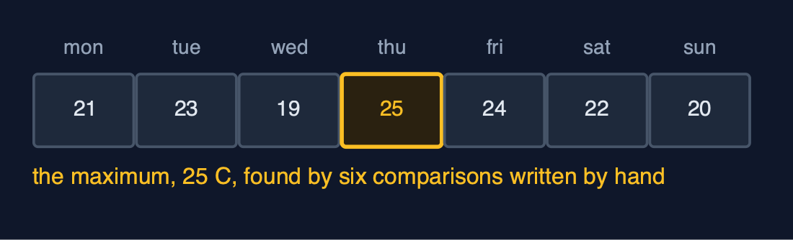
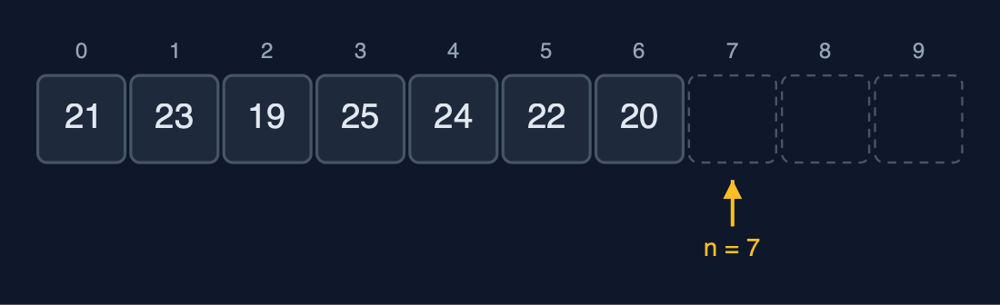
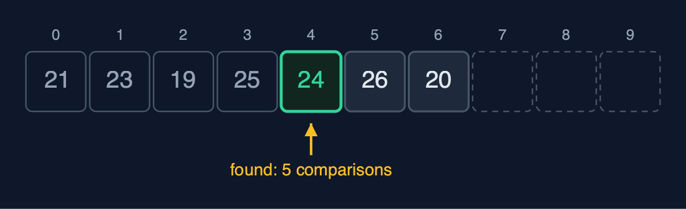
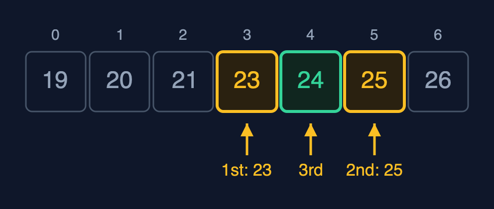
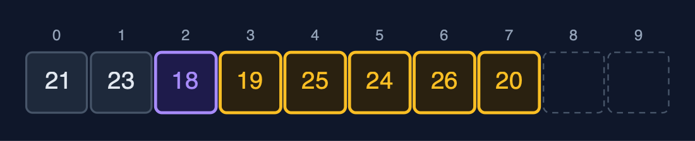
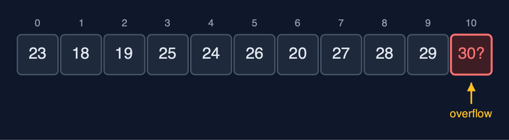
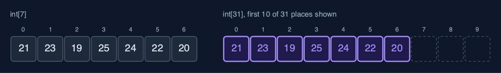

# Static Array, Explained

## In one sentence

A static array stores elements of one type in consecutive memory locations, so arr[i] is found in O(1) by base address + i x element size, while its capacity is fixed, insertion and deletion shift elements in O(n), and a full array overflows.

## The picture

![int arr[10] with n = 7: elements at indexes 0 to 6, three free places](images/structure.png)

*int arr[10] with n = 7: elements at indexes 0 to 6, three free places*

## The everyday idea

Picture a row of numbered lockers in a school corridor: locker 0, locker 1, locker 2, all the same size and all touching. If someone says "open locker 3", you do not search; you walk straight to it, because you know where locker 3 is. That is array access by index. To fit a new locker into the middle, every locker after it would have to move one place along, and the corridor has a fixed length: when it is full, there is no room for another.

## The 5 acts

### Act 1: Seven separate variables

The week is first stored in seven variables, `mon` to `sun`. It works, but nothing connects them: finding the maximum means writing six comparisons one after another, and asking for "the temperature on day 3" needs a `switch` with a branch for each day. A second week would need seven more variables and all of this code again.



**Seven separate variables: no index, so no loop** Here are the seven variables. Each has its own name, and there is no index. Without an index, a loop cannot visit them, so every question names all seven days.

What the demo printed:

```
mon=21 tue=23 wed=19 thu=25 fri=24 sat=22 sun=20
the maximum, by hand: 6 comparisons written out one by one, answer 25 C
"day number 3" needs a switch with 7 cases: 25 C
```

### Act 2: One array: int arr[10], n = 7

`int arr[10]` reserves ten consecutive `int` places, 40 bytes in one block; the week fills the first seven, so n = 7. Traversal visits `arr[0]` to `arr[6]`. The important property is the address calculation: every element is 4 bytes, so `arr[3]` is at base address + 3 x 4 = base + 12. The computer does not search for element 3; it calculates where it is. That is why access by index is O(1), for 7 elements or 7 million.



**Capacity 10, n = 7: indexes 0 to 6 in use, 7 to 9 free** Here is the array. The small numbers above are the indexes, from zero to nine. The first seven hold the week. The last three, dashed, are free. n, the number of elements, points at the first free place.

![arr[3] is at base + 3 x 4: one calculation, no search](images/act-2-2.png)

**arr[3] is at base + 3 x 4: one calculation, no search** How does the computer find element three? It takes the base address, where element zero starts, and adds three times four bytes. One calculation. Element three, or element three million, costs the same single step. That is order one access.

What the demo printed:

```
traverse: [21, 23, 19, 25, 24, 22, 20]
capacity 10, n = 7, 40 bytes in one block
&arr[3] - &arr[0] = 3 ints = 12 bytes: arr[3] is computed, not searched
```

### Act 3: Access, update, search

Access and update use the address calculation: `get(3)` returns 25 in one step, and `update(5, 26)` corrects Saturday in one step. Searching for a value is different, because the array does not know where a value is. Linear search compares with `arr[0]`, `arr[1]` and so on: 24 is found at index 4 after 5 comparisons, and 30 is reported absent only after all 7. If the array is sorted, binary search does much better: compare with the middle element and discard the half that cannot contain the key. On the sorted week, [19, 20, 21, 23, 24, 25, 26], it finds 24 at index 4 after 3 comparisons.



**Linear search for 24: indexes 0 to 3 compared and passed, index 4 matches: 5 comparisons** Linear search for twenty four. Index zero, no. One, no. Two, no. Three, no. Index four matches. Five comparisons.



**Binary search for 24 on the sorted week: middle 23 (go right), 25 (go left), 24: 3 comparisons** Binary search, on the sorted week. The middle element is twenty three: too small, so the left half is discarded. The middle of what is left is twenty five: too big. Then twenty four. Three comparisons. Each comparison halves the range, so a million elements need only twenty.

What the demo printed:

```
get(3) = 25 C (Thursday): 1 step, one address calculation
update(5, 26) (Saturday): 1 step
linear_search(24): index 4, so 5 comparisons (indexes 0 to 4)
linear_search(30): -1, so all 7 elements compared
binary_search(24) = index 4, at most 3 comparisons for 7 elements
```

### Act 4: Insertion, deletion, overflow

A late reading of 18 degrees must go at index 2. Insertion shifts `arr[2]` to `arr[6]` one place right, starting from the end so nothing is overwritten: five shifts, and n becomes 8. Deleting the element at index 0 shifts the remaining seven elements one place left: seven shifts. The nearer the front, the more shifts. Three more readings fill the array to n = 10, the capacity, and the next insertion is refused as an **overflow**: a static array cannot grow. Reading `get(10)` is refused too, because only indexes 0 to n - 1 hold elements.



**insert_at(2, 18): the elements at indexes 2 to 6 each shifted one place right** Here is the array after the insertion. Eighteen, in purple, is at index two. The five elements after it, in amber, each shifted one place to the right, starting from the end. Five shifts for one insertion.



**n = 10 = capacity: the next insertion is an overflow** Now the array is full. Ten elements, in ten places. There is no eleventh place, so the next insertion is refused. That is an overflow. A static array cannot grow.

What the demo printed:

```
insert_at(2, 18): 5 elements shifted right (n - pos = 7 - 2), n = 8
[21, 23, 18, 19, 25, 24, 26, 20]
delete_at(0) removed 21: 7 elements shifted left (n - pos - 1), n = 7
n = 10, insert_at(0, 30): overflow: the array is full
get(10): out of range: no element at that index
```

### Act 5: The bill

The strengths and the costs show at scale. On a million sorted elements, binary search needs only 20 comparisons, while linear search needs a million; both use O(1) extra space, because they are loops that keep only a few index variables. The capacity is the cost: to hold a month instead of a week, the array cannot grow in place, so a new array of 31 places is allocated and the 7 elements copied across. C's own `int arr[n]` is this structure; the standard library's `realloc` does the grow-by-copying above for memory taken with `malloc`, and `qsort` and `bsearch` sort and binary search. The same operations written recursively are in the `static-array-recursive` project.



**Growing is copying: a new array of 31 places, the 7 elements copied across** Here is the grow. The old array of seven, and a new array of thirty one. The seven elements are copied across, in purple. The old array is discarded. Growing a static array always costs one copy per element.

What the demo printed:

```
binary_search on 1,000,000 sorted elements: index 666666, at most 20 comparisons
linear_search on 1,000,000: -1, so 1,000,000 comparisons, with O(1) extra space
growing 7 to 31: a new block and 7 copies; capacity 31
every loop here uses O(1) extra space; the static-array-recursive project writes them recursively
already in C: int arr[n] itself, and qsort and bsearch in <stdlib.h>
```

## The operations in code

### Traversal

```c
/** Traversal: visits arr[0] to arr[n - 1] once, printing each. O(n) time, O(1) space. */
void traverse(const StaticArray *a) {
    printf("[");
    for (int i = 0; i < a->n; i++) {
        printf(i > 0 ? ", %d" : "%d", a->arr[i]);
    }
    printf("]\n");
}
```

One loop from 0 to n - 1: every element is visited exactly once, so traversal is O(n) time and O(1) space.

### Insertion at a position

```c
/**
 * Insertion at position pos (0 <= pos <= n): shift arr[pos..n-1] one place right, starting from
 * the end, then store the value. n - pos shifts.
 */
Status insert_at(StaticArray *a, int pos, int value) {
    if (a->n == a->capacity) {
        return STATUS_OVERFLOW;
    }
    if (pos < 0 || pos > a->n) {
        return STATUS_OUT_OF_RANGE;
    }
    for (int i = a->n - 1; i >= pos; i--) {
        a->arr[i + 1] = a->arr[i];
    }
    a->arr[pos] = value;
    a->n++;
    return STATUS_OK;
}
```

The loop runs from the last element down to `pos`, so each element moves into the empty place to its right; running it from `pos` upwards would overwrite elements before they are moved. The number of shifts is n - pos: the whole array for pos = 0, nothing for pos = n.

### Deletion at a position

```c
/** Deletion at position pos (0 <= pos < n): shift arr[pos+1..n-1] one place left. n - pos - 1 shifts. */
Status delete_at(StaticArray *a, int pos, int *deleted) {
    if (a->n == 0) {
        return STATUS_UNDERFLOW;
    }
    if (pos < 0 || pos >= a->n) {
        return STATUS_OUT_OF_RANGE;
    }
    *deleted = a->arr[pos];
    for (int i = pos; i < a->n - 1; i++) {
        a->arr[i] = a->arr[i + 1];
    }
    a->n--;
    return STATUS_OK;
}
```

The mirror image of insertion: the loop runs upwards from `pos`, each element moving into the place to its left, n - pos - 1 shifts.

### Linear search

```c
/** Linear search: the index of the first element equal to key, or -1. O(n), O(1) space. */
int linear_search(const StaticArray *a, int key) {
    for (int i = 0; i < a->n; i++) {
        if (a->arr[i] == key) {
            return i;
        }
    }
    return -1;
}
```

Compare with each element in turn and stop at the first match: 1 comparison in the best case, n in the worst, and n when the key is absent.

### Binary search

```c
/**
 * Binary search, for an array sorted in ascending order: compare with the middle element and
 * discard the half that cannot hold key. O(log n) comparisons, O(1) space.
 */
int binary_search(const StaticArray *a, int key) {
    int low = 0;
    int high = a->n - 1;
    while (low <= high) {
        int mid = low + (high - low) / 2;     /* not (low + high) / 2, which can overflow */
        if (a->arr[mid] == key) {
            return mid;
        } else if (a->arr[mid] < key) {
            low = mid + 1;
        } else {
            high = mid - 1;
        }
    }
    return -1;
}
```

Only for a sorted array. Each comparison with the middle element discards half of the remaining range, so at most about log2(n) + 1 comparisons: 20 for a million elements. `mid` is computed as `low + (high - low) / 2`, because `(low + high) / 2` can overflow when both are large.

## The operations, and what they cost

| Operation | What it does | Time: best / average / worst | Extra space | In the example |
| --- | --- | --- | --- | --- |
| Traverse | Visit arr[0] to arr[n-1] once | O(n) / O(n) / O(n) | O(1) | 7 reads for the week |
| Access `get(i)` | Return arr[i], by address calculation | O(1) / O(1) / O(1) | O(1) | 1 step, for any i and any n |
| Update `update(i, x)` | Replace arr[i] | O(1) / O(1) / O(1) | O(1) | 1 step |
| Insert `insert_at(pos, x)` | Shift arr[pos..n-1] right, store x | O(1) at the end / O(n) / O(n) at the front | O(1) | 5 shifts to insert at index 2 of 7 |
| Delete `delete_at(pos)` | Shift arr[pos+1..n-1] left | O(1) at the end / O(n) / O(n) at the front | O(1) | 7 shifts to delete index 0 of 8 |
| Linear search | Compare with each element in turn | O(1) / O(n) / O(n) | O(1) | 5 comparisons to find 24; 7 to learn 30 is absent |
| Binary search (sorted) | Compare with the middle, discard half, repeat | O(1) / O(log n) / O(log n) | O(1) | 3 comparisons on the sorted week; 20 on 1,000,000 |
| Find maximum | Compare each element with the largest so far | O(n) / O(n) / O(n) | O(1) | n - 1 comparisons |
| Reverse | Swap arr[i] and arr[n-1-i] moving inward | O(n) / O(n) / O(n) | O(1) | n / 2 swaps |
| Grow | Impossible in place: allocate a bigger array and copy | O(n) / O(n) / O(n) | O(n) | 7 copies to grow the week to 31 places |

## Compared with related structures

How a static array compares with the structures it is usually weighed against (n elements):

| Operation | Static array | Dynamic array | Singly linked list |
| --- | --- | --- | --- |
| Access element i | O(1) | O(1) | O(n) |
| Insert or delete at the front | O(n) shifts | O(n) shifts | O(1) |
| Insert or delete at the end | O(1), until full | O(1) amortised | O(n), or O(1) with a tail pointer |
| Search (unsorted) | O(n) | O(n) | O(n) |
| Search (sorted) | O(log n), binary search | O(log n), binary search | O(n): no middle to jump to |
| Size | fixed at creation | grows by copying | grows one node at a time |
| Extra memory per element | none | spare capacity | one next pointer per node |
| Memory layout | consecutive | consecutive | scattered nodes |

## The verdict

Use a static array when the number of elements is known and access by index matters: it is the fastest and smallest structure there is, and binary search makes sorted data quick to search. When the size changes, use a dynamic array; when you insert and delete at the front often, a linked list; when you look things up by key, a hash table.

## How to recognise it in code you did not write

- `int arr[MAX];` (or a block from `malloc`) with a separate count `n` of elements in use.
- Loops `for (int i = n - 1; i >= pos; i--) arr[i + 1] = arr[i];` (insertion) and the mirror loop (deletion).
- `low`, `high` and `mid` variables: binary search.

## Where you have already met this

- `char *argv[]` in every C `main` function.
- Pixels of an image, the squares of a chess board, the days of a month.
- Inside C's `ArrayList`, `HashMap` and `ArrayDeque`, which all store their data in arrays.
