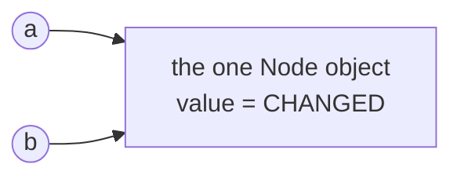
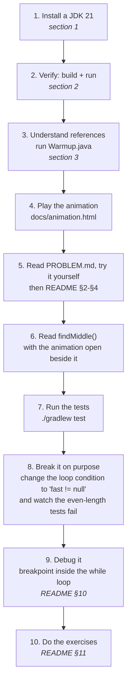

# Prerequisites — what to know before you start

Read this **before** [`PROBLEM.md`](PROBLEM.md) and [`README.md`](README.md).

You do not need to be good at Java. You need about six specific ideas, and one
of them (**references**) matters more than all the others put together. This
page tells you exactly what those ideas are, how to check whether you already
have them, and where to go if you do not.

**Time to work through this page:** 30–60 minutes if most of it is new to you.
This project is a good **first** two-pointer problem, so no prior linked-list
project is required.

---

## Table of contents

1. [Software you must install](#1-software-you-must-install)
2. [Verify your setup in 3 commands](#2-verify-your-setup-in-3-commands)
3. [The one idea that matters most: references](#3-the-one-idea-that-matters-most-references)
4. [Java checklist](#4-java-checklist)
5. [Big-O in five minutes](#5-big-o-in-five-minutes)
6. [Command-line basics](#6-command-line-basics)
7. [What you do NOT need to know](#7-what-you-do-not-need-to-know)
8. [Self-check quiz](#8-self-check-quiz)
9. [Suggested learning path](#9-suggested-learning-path)

---

## 1. Software you must install

| Tool | Version | Why | Where |
| --- | --- | --- | --- |
| **JDK** (Java Development Kit) | **21** or newer | compiles and runs the code | [Adoptium Temurin](https://adoptium.net/) — pick "JDK 21 LTS" |
| **A terminal** | any | to type `./gradlew ...` | macOS: Terminal · Windows: PowerShell · Linux: your shell |
| **A web browser** | any modern one | to open the animation | you already have one |
| **An IDE** *(optional but strongly recommended)* | current | to debug and step through code | [IntelliJ IDEA Community](https://www.jetbrains.com/idea/download/) (free) or VS Code + Extension Pack for Java |
| **Git** *(optional)* | any | only if you want to clone/commit | [git-scm.com](https://git-scm.com/) |

**You do NOT need to install Gradle.** This project ships the *Gradle Wrapper*
(`gradlew`), which downloads the correct Gradle version by itself. That is
explained in [README section 7.2](README.md#72-the-wrapper--why-you-do-not-install-gradle).

**You do NOT need to install Lombok or JUnit.** Gradle downloads both. You *do*
need the Lombok IDE plugin if you use an IDE — see
[README section 7.7](README.md#77-lombok-annotation-processing).

> **JDK vs JRE:** a JRE only *runs* Java; a JDK also *compiles* it. You need the
> JDK. If `javac -version` fails but `java -version` works, you installed the
> wrong one.

---

## 2. Verify your setup in 3 commands

Open a terminal, `cd` into this project folder, and run these. If all three
work, you are ready.

```bash
# 1. Do I have a JDK 21+?
java -version
# expect something containing:  openjdk version "21..."  (or 22, 23, ...)

# 2. Can the wrapper build the project?
./gradlew build          # Windows: gradlew.bat build
# expect:  BUILD SUCCESSFUL

# 3. Does the demo run?
./gradlew run -q         # Windows: gradlew.bat run -q
# expect:  odd  [A -> B -> C -> D -> E]   findMiddle() -> C
```

The **first** run downloads Gradle, JUnit and Lombok, so it needs an internet
connection and may take a couple of minutes. Every run after that is offline and
fast.

If any step fails, check the
[troubleshooting table](README.md#12-troubleshooting) — `permission denied` on
`./gradlew` and "command not found" are both covered there.

---

## 3. The one idea that matters most: references

**If you learn only one thing from this page, learn this.** Linked lists are
*made of* references. Almost every linked-list bug a beginner writes comes from
misunderstanding this single point.

In Java, a variable of a class type does **not** hold the object. It holds a
*reference* — an arrow pointing at an object that lives elsewhere in memory.

```java
Node<String> a = new Node<>("A");   // creates an object, `a` points at it
Node<String> b = a;                 // b points at THE SAME object. No copy!
b.value = "CHANGED";
System.out.println(a.value);        // prints CHANGED, not A
```



Two consequences that drive this whole project:

**(a) Assigning a variable moves the arrow, it does not move the object.**

```java
slow = slow.next;         // `slow` now points somewhere else.
fast = fast.next.next;    // so does `fast` -- twice as far.
                           // No node was created, moved or destroyed.
```

**(b) Two variables can walk the SAME chain independently, at different
speeds, without ever interfering with each other.**

That is the entire trick behind
[`findMiddle()`](src/main/java/org/jk/dsa/learning/SinglyLinkedList.java#L460):
`slow` and `fast` are two separate arrows into the same list. Moving one never
moves the other, and neither of them changes `head`, `tail` or any node's
`next` field — this method only *reads* the list. When you get to
[README section 4](README.md#4-the-star-operation-findmiddle), this will
already make sense.

### Prove it to yourself (2 minutes)

Save this as `Warmup.java` **anywhere** — you do not need this project or Gradle
for it. Java 11+ can run a single file directly:

```java
public class Warmup {
    static class Box { String label; Box next; }

    public static void main(String[] args) {
        Box a = new Box(); a.label = "A";
        Box b = new Box(); b.label = "B";
        Box c = new Box(); c.label = "C";
        Box d = new Box(); d.label = "D";
        a.next = b; b.next = c; c.next = d;

        Box slow = a;
        Box fast = a;
        while (fast != null && fast.next != null) {
            slow = slow.next;
            fast = fast.next.next;
            System.out.println("slow=" + slow.label
                    + "  fast=" + (fast == null ? "null" : fast.label));
        }
        System.out.println("middle is " + slow.label);   // middle is C

        // Prove the original chain is untouched: it still prints A B C D.
        StringBuilder sb = new StringBuilder();
        for (Box cursor = a; cursor != null; cursor = cursor.next) {
            sb.append(cursor.label).append(" ");
        }
        System.out.println("chain still: " + sb);
    }
}
```

```bash
java Warmup.java
```

If every line of that output makes sense to you, you are ready for this project.
If not, re-read this section — it is worth the time.

> **Note on `==` vs `.equals()`:** `==` asks "are these the same object?";
> `.equals()` asks "do these have equal contents?". The list uses
> `Objects.equals(...)` in
> [`indexOf`](src/main/java/org/jk/dsa/learning/SinglyLinkedList.java#L207) for
> contents, and `==` in
> [`removeAt`](src/main/java/org/jk/dsa/learning/SinglyLinkedList.java#L374)
> when it asks "is this node literally the tail node?". Both usages are
> deliberate.

---

## 4. Java checklist

Tick these off honestly. **Must know** = you will be lost without it.
**Nice to have** = the code comments will carry you.

### Must know

| Concept | You should be able to… | Used in |
| --- | --- | --- |
| Variables & types | declare `int x = 5;`, `String s = "hi";` | everywhere |
| **References vs values** | explain [section 3](#3-the-one-idea-that-matters-most-references) | the entire project |
| `null` | say what `NullPointerException` means and when it happens | end of every chain |
| Classes & objects | write a class with fields and use `new` | [`Node`](src/main/java/org/jk/dsa/learning/Node.java) |
| Fields, constructors, methods | know what `this.value = value;` does | `Node`, `SinglyLinkedList` |
| `if` / `while` / `for` | write a loop that walks until a condition | `findMiddle`, `nodeAt`, `indexOf` |
| Access modifiers | know roughly what `public` / `private` mean | the whole API |

### Nice to have (the README explains these as it goes)

| Concept | One-line summary | Used in |
| --- | --- | --- |
| **Generics** `<T>` | a placeholder for "whatever type the caller picks" | `SinglyLinkedList<T>` — [README §3](README.md#3-why-generics) |
| `static` | belongs to the class, not to one object | `SinglyLinkedList.of(...)`, `main` |
| Interfaces | a contract a class promises to fulfil | `implements Iterable<T>` |
| Enhanced `for` loop | `for (String s : list) { ... }` | works because of `Iterable` |
| Exceptions | `throw new ...`, and what a stack trace is | index/empty guards |
| **Two pointers, different speeds** | one cursor advances faster than another over the same sequence | `findMiddle` — [README §4](README.md#4-the-star-operation-findmiddle) |
| `toString()` / `equals()` | how objects print and compare | list printing, `indexOf` |
| Annotations | `@Test`, `@Getter` — metadata tools react to | JUnit and Lombok |
| Generic arrays / `@SafeVarargs` | why varargs + generics needs a promise | `SinglyLinkedList.of` |

**If several "must know" rows are unfamiliar,** work through a beginner Java
course first — the official
[Java Tutorials: Classes and Objects](https://docs.oracle.com/javase/tutorial/java/javaOO/index.html)
is free and covers every one of them.

**Nothing else is required first.** This project does not assume you have
built or studied another linked-list project before — a single `while` loop
you are comfortable writing by hand is enough of a starting point.

---

## 5. Big-O in five minutes

Big-O describes **how the cost grows as the input grows**, ignoring constants
and hardware.

| Notation | Means | Example here |
| --- | --- | --- |
| **O(1)** | cost does not change with list length | `addFirst` — always the same three assignments |
| **O(n)** | double the list, double the work | `findMiddle` — the fast pointer visits every node (or every other one) |
| **O(index)** | proportional to how far in you go | `get(i)` — walks `i` arrows |

Two rules that cover everything in this project:

1. **A loop over the whole list is O(n).** Nested loops would be O(n²) — there
   are none here.
2. **"Space" means *extra* memory you allocate, beyond the data itself.**
   `findMiddle()` is O(1) space because it only ever uses two reference
   variables, no matter how long the list is. Counting the nodes into a
   separate `ArrayList` first would be O(n) space.

One subtlety worth knowing before you read the README: **O(n) time does not
mean "one cost".** `findMiddle()`, `findMiddleTwoPass()` and
`findMiddleFromSize()` are *all* O(n) time and O(1) space, yet they do
noticeably different amounts of work — roughly `1.5n`, `2n` and `0.5n` node
visits respectively. Big-O hides constant factors on purpose; that is exactly
why [README section 4.6](README.md#46-three-ways-one-answer) compares them by
something other than their complexity class.

That is genuinely all you need. Every method in the code carries its own
complexity comment, and there is a full table in
[README section 6](README.md#6-complexity-summary).

---

## 6. Command-line basics

You need four things.

```bash
pwd                       # where am I?
ls                        # what is here?           (Windows: dir)
cd path/to/folder         # go somewhere
cd ..                     # go up one level
```

Then, **from inside this project folder** (the one containing
`build.gradle.kts`):

```bash
./gradlew build           # macOS / Linux
gradlew.bat build         # Windows
```

The `./` matters on macOS and Linux: it means "the `gradlew` in *this* folder",
not a program installed system-wide. If you get `permission denied`, run
`chmod +x gradlew` once.

---

## 7. What you do NOT need to know

Do not let any of these stop you starting:

- **Gradle.** [README section 7](README.md#7-how-gradle-works-and-how-to-build-this-project)
  teaches it from zero. You only ever type `./gradlew` plus a word.
- **JUnit.** [README section 9](README.md#9-how-to-run-the-tests) explains the
  handful of annotations used.
- **Lombok.** [README section 7.7](README.md#77-lombok-annotation-processing)
  explains it, and the data structure itself deliberately does not use it.
- **Other data structures.** Arrays, stacks, trees, hash maps — none are needed.
- **Threads, I/O, networking, Spring, build pipelines, Maven.** None. This
  project has exactly one dependency (JUnit) and one compile-time tool (Lombok).
- **Cycle detection, palindrome checking, or any other two-pointer problem.**
  This project is the *simplest* place to learn the technique, not a follow-up
  to something else — see [PROBLEM.md section 9](PROBLEM.md#9-follow-up-problems)
  for where it leads next.
- **Any maths beyond counting.** Big-O here never goes past O(n).

---

## 8. Self-check quiz

Answer these before you start. Answers are below — no peeking.

1. After `Node<String> b = a;`, how many `Node` objects exist?
2. What does `cursor = cursor.next;` change — the object, or the variable?
3. If `slow` and `fast` both start at `head`, and `fast` always moves twice as
   far as `slow` in the same loop iteration, roughly what fraction of the list
   has `slow` covered when `fast` reaches the end?
4. What is the difference between `==` and `.equals()`?
5. A method loops over every element of a list of length n. Time complexity?
6. Why does the loop condition need to check `fast.next != null` in addition
   to `fast != null`, before doing `fast = fast.next.next`?
7. What is the middle of a 6-element list, using the "return the second
   middle" convention?
8. Why is `findMiddleTwoPass()` still O(n) time even though it walks the list
   twice?

<details>
<summary><b>Answers</b></summary>

1. **One.** Both `a` and `b` are arrows pointing at the same object.
2. **The variable.** It moves the arrow to a different existing node. No object
   is created, changed or destroyed.
3. **About half.** `fast` covers roughly twice the distance `slow` does in the
   same number of iterations, so when `fast` has covered the whole list,
   `slow` has covered about half of it — landing on the middle.
4. `==` compares references ("the same object?"); `.equals()` compares contents
   ("equal values?").
5. **O(n).**
6. Because the very next line reads `fast.next.next`. If `fast.next` were
   `null`, that would throw a `NullPointerException` — you must confirm both
   steps are safe *before* taking them.
7. **Index 3** (zero-based) — the second of the two candidate middles at
   indexes 2 and 3.
8. Big-O ignores constant factors. Two passes over n nodes is `2n` node
   visits, and `2n` is still O(n) — the same complexity *class* as one pass,
   even though it does measurably more work.

</details>

**Scored 6+?** Go straight to the README.
**Scored below 6?** Re-read [section 3](#3-the-one-idea-that-matters-most-references)
and run `Warmup.java`. Questions 1, 2 and 3 are all the same idea wearing
different hats.

---

## 9. Suggested learning path



Step 8 is not optional decoration — deliberately breaking working code and
watching a test catch you is the fastest way to see exactly which lists the
buggy condition gets wrong (every even-length one) and which it does not
(every odd-length one), which is precisely the trap this problem sets.

When you finish step 10, the real test of understanding is this: open a blank
file and write `findMiddle()` again from scratch, without looking. If you can
explain out loud why the loop stops where it does, you have learned it.

---

**Ready?** Go to [`PROBLEM.md`](PROBLEM.md) — try the problem yourself first —
then [`README.md`](README.md) for the worked solution.
