# Reversing a Generic Singly Linked List (Java 21 + Gradle + JUnit 5)

A **stand-alone, study-oriented** Gradle project that implements a singly linked
list with Java generics and shows — in code, in diagrams, and in an animation —
how to reverse it.

This guide assumes you have **never used Gradle before** and are still getting
comfortable with Java. Nothing is skipped.

> **New to Java, or not sure you are ready?** Start with
> [`PREREQUISITES.md`](PREREQUISITES.md). It lists exactly what to install, the
> handful of Java ideas you actually need (mostly just one — **references**),
> and a short quiz to check yourself. About an hour, and it makes this document
> far easier.

| I want to… | Do this |
| --- | --- |
| Check I am ready | read [`PREREQUISITES.md`](PREREQUISITES.md) |
| Watch the 12-minute explainer | [`docs/linkedlist-reverse-explained.mp4`](docs/linkedlist-reverse-explained.mp4) |
| See it run | `./gradlew run` |
| Run the tests | `./gradlew test` |
| Watch the animation | open [`docs/animation.html`](docs/animation.html) in a browser |
| Read the reversal code | [`SinglyLinkedList.reverse()`](src/main/java/org/jk/dsa/learning/SinglyLinkedList.java#L442-L457) |

---

## Table of contents

1. [Project layout](#1-project-layout)
2. [What is a singly linked list?](#2-what-is-a-singly-linked-list)
3. [Why generics?](#3-why-generics)
4. [The star operation: reverse](#4-the-star-operation-reverse)
5. [Every operation, explained with diagrams](#5-every-operation-explained-with-diagrams)
6. [Complexity summary](#6-complexity-summary)
7. [How Gradle works (and how to build this project)](#7-how-gradle-works-and-how-to-build-this-project)
8. [How to run the demo](#8-how-to-run-the-demo)
9. [How to run the tests](#9-how-to-run-the-tests)
10. [How to debug the code](#10-how-to-debug-the-code)
11. [Exercises](#11-exercises)
12. [Troubleshooting](#12-troubleshooting)

---

## 1. Project layout

```
linkedlist-reverse-generic/
├── build.gradle.kts          ← the build recipe (plugins, Java 21, JUnit 5, Lombok)
├── settings.gradle.kts       ← names the build
├── lombok.config             ← how Lombok generates code (see section 7.7)
├── gradlew / gradlew.bat     ← the Gradle "wrapper" scripts (see section 7)
├── gradle/wrapper/           ← the wrapper's jar + which Gradle version to use
├── PREREQUISITES.md          ← read this FIRST if you are new to Java
├── README.md                 ← this document
├── docs/
│   ├── animation.html                    ← interactive, step-by-step animation
│   ├── linkedlist-reverse-explained.mp4  ← narrated 12-minute walkthrough
│   ├── linkedlist-reverse-explained.srt  ← subtitles for the video
│   └── linkedlist-reverse-explained.txt  ← video description + chapter times
└── src/
    ├── main/java/org/jk/dsa/learning/
    │   ├── Node.java                 ← one box in the chain
    │   ├── SinglyLinkedList.java     ← the data structure (all operations)
    │   └── Main.java                 ← console demo
    └── test/java/org/jk/dsa/learning/
        └── SinglyLinkedListTest.java ← JUnit 5 tests
```

> **Rule to remember:** Gradle expects production code under `src/main/java`
> and test code under `src/test/java`. The folders after that must match the
> `package` line at the top of each `.java` file. Our package is
> `org.jk.dsa.learning`, so the folders are `org/jk/dsa/learning`.

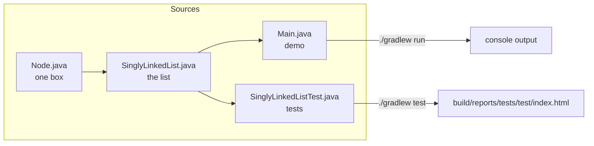

Source files:
[`Node.java`](src/main/java/org/jk/dsa/learning/Node.java) ·
[`SinglyLinkedList.java`](src/main/java/org/jk/dsa/learning/SinglyLinkedList.java) ·
[`Main.java`](src/main/java/org/jk/dsa/learning/Main.java) ·
[`SinglyLinkedListTest.java`](src/test/java/org/jk/dsa/learning/SinglyLinkedListTest.java)

---

## 2. What is a singly linked list?

An **array** stores its elements next to each other in memory, so it can jump
straight to element 7. A **linked list** does not: it stores each element in its
own little object called a **node**, and every node holds an arrow (a reference)
to the next node. The only way to reach element 7 is to start at the front and
follow six arrows.

Each node is [`Node.java`](src/main/java/org/jk/dsa/learning/Node.java) and has
exactly two fields:

* `value` — the data ([`Node.java#L43`](src/main/java/org/jk/dsa/learning/Node.java#L43))
* `next` — the arrow to the following node, or `null` at the end
  ([`Node.java#L46`](src/main/java/org/jk/dsa/learning/Node.java#L46))

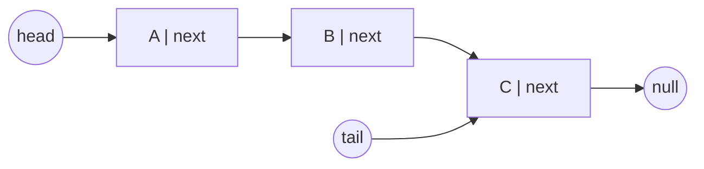

The list itself
([`SinglyLinkedList`](src/main/java/org/jk/dsa/learning/SinglyLinkedList.java#L56))
only remembers three things:

| Field | Line | Why it exists |
| --- | --- | --- |
| `head` | [L59](src/main/java/org/jk/dsa/learning/SinglyLinkedList.java#L59) | the entrance to the chain; without it the whole list is lost |
| `tail` | [L62](src/main/java/org/jk/dsa/learning/SinglyLinkedList.java#L62) | lets `addLast` be O(1) instead of O(n) |
| `size` | [L65](src/main/java/org/jk/dsa/learning/SinglyLinkedList.java#L65) | lets `size()` be O(1) instead of counting nodes |

> **The rule that causes 90% of linked-list bugs:** *every* method that changes
> the shape of the list must leave `head`, `tail` **and** `size` correct. The
> test [`fixesHeadAndTailPointers`](src/test/java/org/jk/dsa/learning/SinglyLinkedListTest.java#L73)
> exists precisely to catch a `reverse()` that forgets `tail`.

**Singly** means each node knows only its *successor*. It has no arrow back to
its predecessor. That is why `removeLast()` is slow — see
[section 5.7](#57-removelast--on).

---

## 3. Why generics?

Look at the class declaration
([L56](src/main/java/org/jk/dsa/learning/SinglyLinkedList.java#L56)):

```java
public class SinglyLinkedList<T> implements Iterable<T> {
```

`<T>` is a **type parameter** — a placeholder that you fill in when you create
the list. One class then serves every element type:

```java
SinglyLinkedList<String>  names   = new SinglyLinkedList<>();
SinglyLinkedList<Integer> numbers = new SinglyLinkedList<>();
SinglyLinkedList<Student> class10 = new SinglyLinkedList<>();  // your own type!
```

Two things you get for free:

1. **Compile-time safety.** `names.addLast(42)` will not compile. Without
   generics the list would store `Object` and that mistake would only blow up at
   runtime.
2. **No casting.** `String s = names.get(0);` just works — see the test
   [`retrievedElementsAreTyped`](src/test/java/org/jk/dsa/learning/SinglyLinkedListTest.java#L219).

Demo 3 in [`Main.demoCustomType()`](src/main/java/org/jk/dsa/learning/Main.java#L70)
puts a `Student` class into the very same list to prove the point. `Student` is
written with **Lombok** — see [section 7.7](#77-lombok-annotation-processing) —
while the `Point` and `Book` types in the tests show the two alternatives, a
plain `record` and a Lombok `@Data` bean.

> **Small print (worth knowing):** Java generics use *type erasure*. At runtime
> the JVM only sees `Object`; the type checks happen at compile time. That is why
> the factory method
> [`of(E... values)`](src/main/java/org/jk/dsa/learning/SinglyLinkedList.java#L90)
> is annotated `@SafeVarargs` — it promises the compiler we do not abuse the
> generic array it creates for the varargs.

---

## 4. The star operation: reverse

### 4.1 The idea

Reversing does **not** move data around and does **not** build a second list. It
only **flips the direction of every arrow**, then swaps `head` and `tail`.

To do that we need three cursors, all in
[`reverse()`](src/main/java/org/jk/dsa/learning/SinglyLinkedList.java#L442-L457):

| Cursor | Line | Meaning |
| --- | --- | --- |
| `previous` | [L443](src/main/java/org/jk/dsa/learning/SinglyLinkedList.java#L443) | the part already reversed. Starts as `null` because the old head must end up pointing at nothing. |
| `current` | [L444](src/main/java/org/jk/dsa/learning/SinglyLinkedList.java#L444) | the node whose arrow we are flipping right now |
| `nextHop` | [L447](src/main/java/org/jk/dsa/learning/SinglyLinkedList.java#L447) | a saved copy of `current.next` |

**Why `nextHop` matters:** line
[L448](src/main/java/org/jk/dsa/learning/SinglyLinkedList.java#L448) overwrites
`current.next`. The instant that happens, the rest of the list is unreachable —
unless we saved it first. Deleting that one line is the classic bug; try it and
watch the tests fail.

### 4.2 The loop, line by line

```java
public void reverse() {                        // L442
    Node<T> previous = null;                   // L443
    Node<T> current  = head;                   // L444

    while (current != null) {                  // L446
        Node<T> nextHop = current.next;        // L447  1. remember where to go next
        current.next    = previous;            // L448  2. flip this node's arrow
        previous        = current;             // L449  3. grow the reversed part
        current         = nextHop;             // L450  4. move on
    }

    Node<T> oldHead = head;                    // L454
    head = previous;                           // L455  last node processed = new head
    tail = oldHead;                            // L456  old first node = new tail
}
```

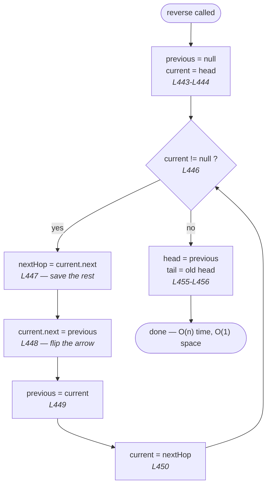

### 4.3 Watch the pointers move

For `A -> B -> C`:

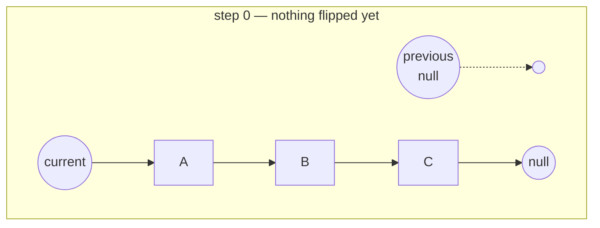

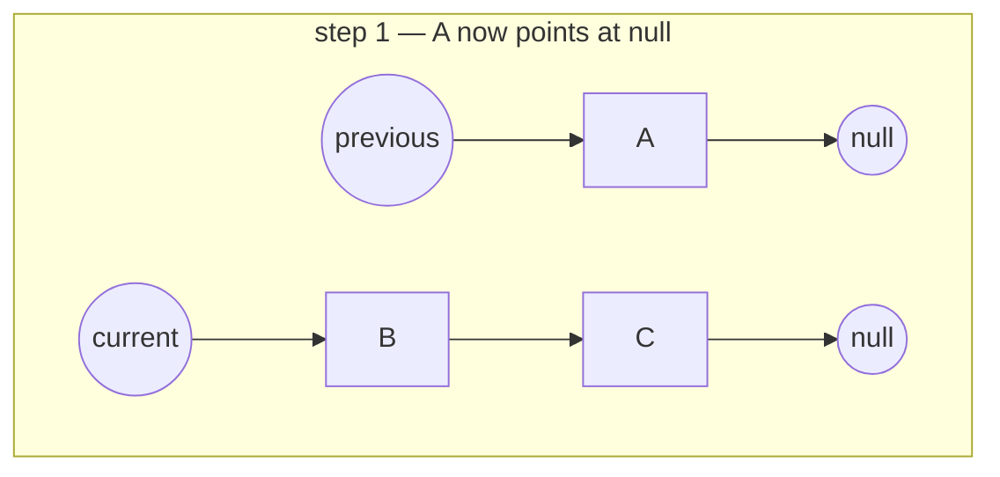

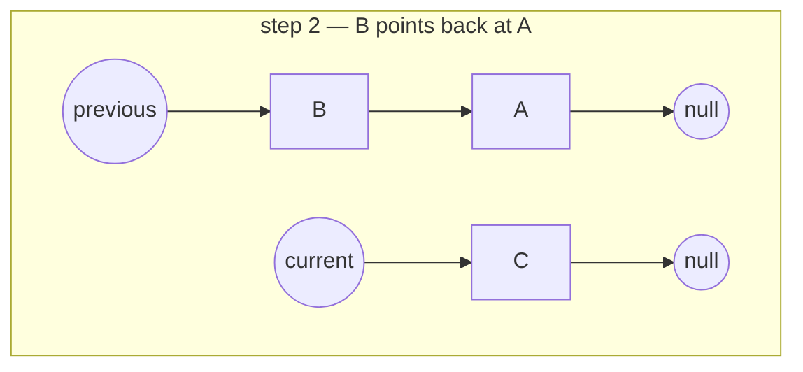

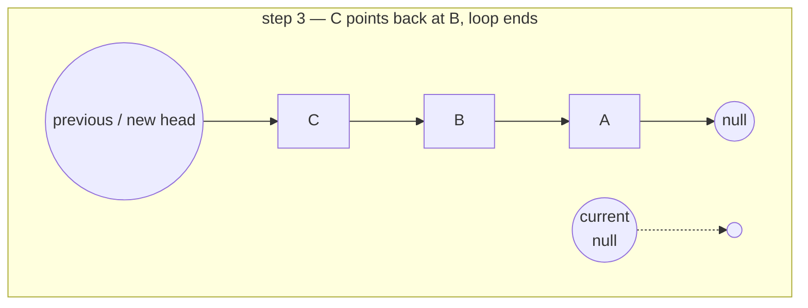

The same trace is printed by
[`Main.demoReverseTrace()`](src/main/java/org/jk/dsa/learning/Main.java#L102) when
you run `./gradlew run`, and animated in
[`docs/animation.html`](docs/animation.html).

### 4.4 The recursive version

[`reverseRecursive()`](src/main/java/org/jk/dsa/learning/SinglyLinkedList.java#L473)
delegates to the private helper
[`reverseFrom(node)`](src/main/java/org/jk/dsa/learning/SinglyLinkedList.java#L496).
The recursion dives all the way to the last node — which becomes the new head —
and flips arrows while the calls unwind.

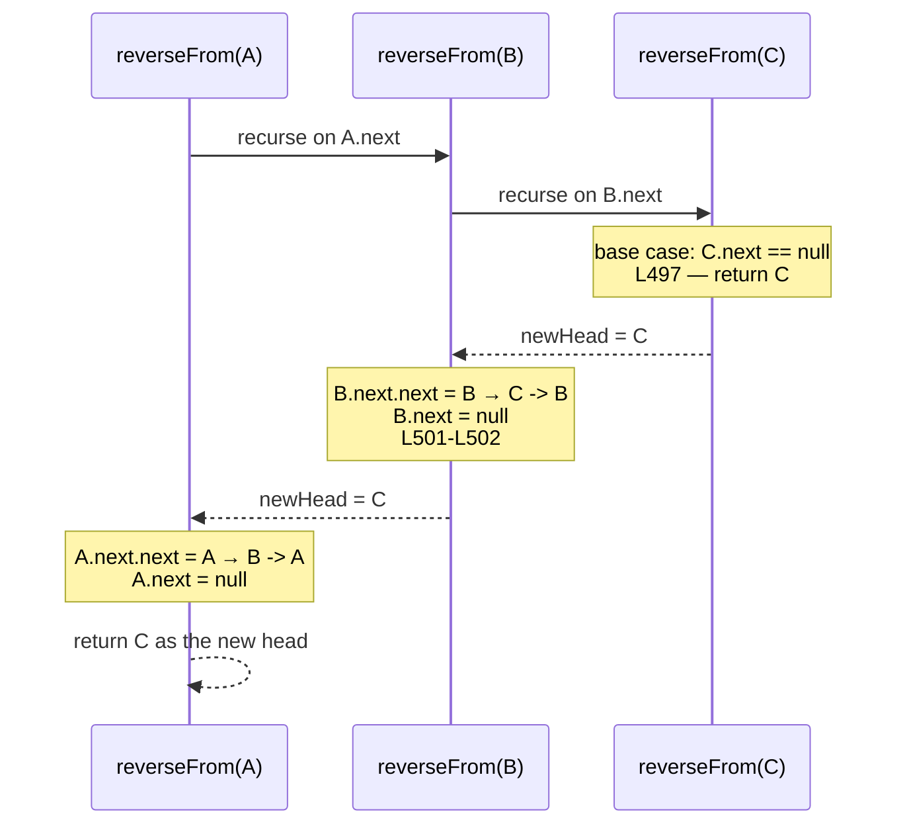

**Trade-off:** identical O(n) time, but O(n) *space*, because the JVM keeps one
stack frame per pending call. A few hundred thousand nodes and you get a
`StackOverflowError`. **Prefer the iterative version.**

### 4.5 The non-destructive version

Sometimes you must keep the original order. Use
[`reversedCopy()`](src/main/java/org/jk/dsa/learning/SinglyLinkedList.java#L518):
it walks the original front to back and `addFirst`s each value into a new list,
which naturally comes out reversed — O(n) time and O(n) space, original
untouched. Proven by
[`doesNotMutateTheOriginal`](src/test/java/org/jk/dsa/learning/SinglyLinkedListTest.java#L172).

### 4.6 Watch it move: `docs/animation.html`

Open [`docs/animation.html`](docs/animation.html) in any browser — no server, no
build step, just double-click it. Pick an operation on the left, press **Play**
(or tap `←` / `→` to step by hand), and the source panel underneath highlights
the **exact line** that is executing. Every line number in that panel is a link
into the real `SinglyLinkedList.java`.

You can also deep-link to a single moment as `animation.html#<operation>:<step>`:

| Link | What you see |
| --- | --- |
| [`#reverse:9`](docs/animation.html#reverse:9) | the `nextHop` rescue at line 447 |
| [`#reverse:11`](docs/animation.html#reverse:11) | the first arrow being flipped, line 448 |
| [`#reverseRecursive:12`](docs/animation.html#reverseRecursive:12) | the recursion at its deepest, call stack visible |
| [`#removeLast:6`](docs/animation.html#removeLast:6) | the O(n) walk that a singly linked list cannot avoid |
| [`#get:5`](docs/animation.html#get:5) | why there is no random access |

Change the **List contents** box to `10,20,30` or `cat,dog,emu` — same code, any
type. That is generics.

### 4.7 Prefer to be talked through it? Watch the video

[`docs/linkedlist-reverse-explained.mp4`](docs/linkedlist-reverse-explained.mp4)
is a narrated, 11-minute walkthrough of everything on this page and in the
animation. Subtitles are in
[`linkedlist-reverse-explained.srt`](docs/linkedlist-reverse-explained.srt), and
[`linkedlist-reverse-explained.txt`](docs/linkedlist-reverse-explained.txt) holds
a ready-made description with chapter timestamps if you want to upload it.

| Chapter | Starts | Covers |
| --- | --- | --- |
| 1 | 00:32 | what a singly linked list actually is |
| 2 | 01:24 | a tour of the animation's four panels |
| 3 | 02:12 | **`reverse()` line by line** — the core of the video |
| 4 | 06:38 | the recursive version and its O(n) stack |
| 5 | 07:44 | every other operation, briefly |
| 6 | 09:42 | why the list is generic |
| 7 | 10:14 | running, testing and debugging it yourself |

It is 1920×1080, H.264/AAC, so it plays anywhere and uploads to YouTube as is.

---

## 5. Every operation, explained with diagrams

### 5.1 `addFirst(value)` — O(1)
[Code → L238](src/main/java/org/jk/dsa/learning/SinglyLinkedList.java#L238)

Make a node, point it at the old head, call it the new head. If the list was
empty, it is also the new tail.

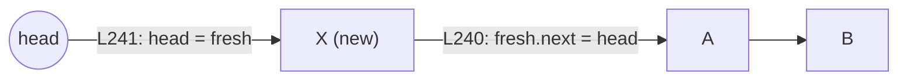

### 5.2 `addLast(value)` — O(1)
[Code → L257](src/main/java/org/jk/dsa/learning/SinglyLinkedList.java#L257)

Because we cache `tail`, appending needs no walk at all.

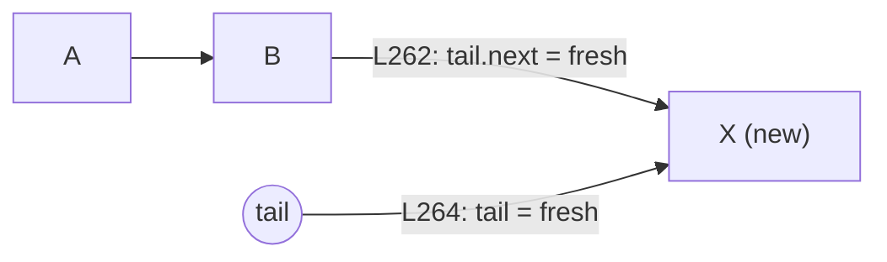

### 5.3 `insertAt(index, value)` — O(index)
[Code → L280](src/main/java/org/jk/dsa/learning/SinglyLinkedList.java#L280)

Walk to the node *before* the target slot, then re-hook two arrows. Index `0`
delegates to `addFirst`, index `size` to `addLast`.

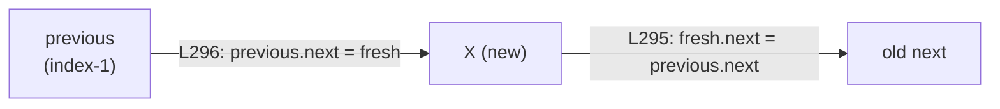

### 5.4 `get(index)` / `set(index, value)` — O(index)
[get → L139](src/main/java/org/jk/dsa/learning/SinglyLinkedList.java#L139) ·
[set → L153](src/main/java/org/jk/dsa/learning/SinglyLinkedList.java#L153) ·
[walker → nodeAt, L608](src/main/java/org/jk/dsa/learning/SinglyLinkedList.java#L608)

There is no random access. `nodeAt` starts at `head` and follows `index` arrows.
This is the single biggest practical difference from `ArrayList`.

### 5.5 `indexOf(value)` / `contains(value)` — O(n)
[indexOf → L200](src/main/java/org/jk/dsa/learning/SinglyLinkedList.java#L200) ·
[contains → L219](src/main/java/org/jk/dsa/learning/SinglyLinkedList.java#L219)

Uses `Objects.equals(a, b)` rather than `a.equals(b)` so that `null` elements do
not cause a `NullPointerException` — see
[`indexOfAndContainsHandleNulls`](src/test/java/org/jk/dsa/learning/SinglyLinkedListTest.java#L388).

### 5.6 `removeFirst()` — O(1)
[Code → L312](src/main/java/org/jk/dsa/learning/SinglyLinkedList.java#L312)

Move `head` one step forward and unlink the old node so the garbage collector
can reclaim it (line
[L316](src/main/java/org/jk/dsa/learning/SinglyLinkedList.java#L316)).

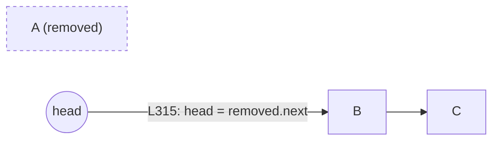

### 5.7 `removeLast()` — O(n)
[Code → L337](src/main/java/org/jk/dsa/learning/SinglyLinkedList.java#L337)

**This is the operation a singly linked list is bad at.** A node has no arrow
back to its predecessor, so to delete the tail we must walk from `head` to the
*second-last* node (loop at
[L343](src/main/java/org/jk/dsa/learning/SinglyLinkedList.java#L343)). A
*doubly* linked list does this in O(1) — that is its whole reason for existing.

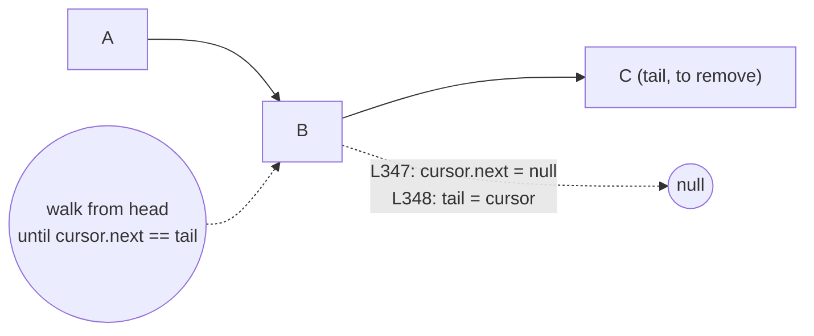

### 5.8 `removeAt(index)` / `remove(value)` — O(index) / O(n)
[removeAt → L362](src/main/java/org/jk/dsa/learning/SinglyLinkedList.java#L362) ·
[remove → L386](src/main/java/org/jk/dsa/learning/SinglyLinkedList.java#L386)

Walk to `index - 1`, then skip over the doomed node. Note the `tail` fix-up at
[L370](src/main/java/org/jk/dsa/learning/SinglyLinkedList.java#L370) for when the
removed node was the last one.

### 5.9 `clear()` — O(1)
[Code → L403](src/main/java/org/jk/dsa/learning/SinglyLinkedList.java#L403)

Dropping `head` and `tail` is enough: nothing references the chain any more, so
the whole thing becomes garbage. No loop needed.

### 5.10 `iterator()` and `toString()` / `toList()`
[iterator → L557](src/main/java/org/jk/dsa/learning/SinglyLinkedList.java#L557) ·
[toString → L587](src/main/java/org/jk/dsa/learning/SinglyLinkedList.java#L587) ·
[toList → L537](src/main/java/org/jk/dsa/learning/SinglyLinkedList.java#L537)

Implementing `Iterable<T>` is what lets you write
`for (String s : list) { ... }`. The iterator holds a single cursor and follows
`next` arrows — O(1) memory. `toString()` renders `[A -> B -> C]`, which makes
`System.out.println(list)` genuinely useful while studying.

---

## 6. Complexity summary

| Operation | Time | Space | Why |
| --- | --- | --- | --- |
| [`addFirst`](src/main/java/org/jk/dsa/learning/SinglyLinkedList.java#L238) | O(1) | O(1) | only touches `head` |
| [`addLast`](src/main/java/org/jk/dsa/learning/SinglyLinkedList.java#L257) | O(1) | O(1) | only because we cache `tail` |
| [`insertAt(i)`](src/main/java/org/jk/dsa/learning/SinglyLinkedList.java#L280) | O(i) | O(1) | walk to `i-1` |
| [`get`/`set(i)`](src/main/java/org/jk/dsa/learning/SinglyLinkedList.java#L139) | O(i) | O(1) | no random access |
| [`indexOf`/`contains`](src/main/java/org/jk/dsa/learning/SinglyLinkedList.java#L200) | O(n) | O(1) | linear scan |
| [`removeFirst`](src/main/java/org/jk/dsa/learning/SinglyLinkedList.java#L312) | O(1) | O(1) | move `head` |
| [`removeLast`](src/main/java/org/jk/dsa/learning/SinglyLinkedList.java#L337) | O(n) | O(1) | no back-arrows |
| [`removeAt(i)`](src/main/java/org/jk/dsa/learning/SinglyLinkedList.java#L362) | O(i) | O(1) | walk to `i-1` |
| [`clear`](src/main/java/org/jk/dsa/learning/SinglyLinkedList.java#L403) | O(1) | O(1) | drop the references |
| **[`reverse`](src/main/java/org/jk/dsa/learning/SinglyLinkedList.java#L442)** | **O(n)** | **O(1)** | three cursors, one pass |
| [`reverseRecursive`](src/main/java/org/jk/dsa/learning/SinglyLinkedList.java#L473) | O(n) | O(n) | one stack frame per node |
| [`reversedCopy`](src/main/java/org/jk/dsa/learning/SinglyLinkedList.java#L518) | O(n) | O(n) | allocates n new nodes |
| [`toList`/`toString`](src/main/java/org/jk/dsa/learning/SinglyLinkedList.java#L537) | O(n) | O(n) | builds a new object |

**Reading Big-O:** it describes how the cost grows as the list grows, ignoring
constants. O(1) = same cost no matter the size. O(n) = double the list, double
the work. "Space" here means *extra* memory beyond the list itself — which is
why in-place `reverse()` is O(1) space even though the list holds n nodes.

---

## 7. How Gradle works (and how to build this project)

### 7.1 What Gradle is

Gradle is a **build tool**. It automates the boring steps: find the sources,
download libraries, compile, run tests, package a jar. You describe *what* you
want in `build.gradle.kts`; Gradle figures out *how*.

### 7.2 The wrapper — why you do **not** install Gradle

The files `gradlew` (macOS/Linux), `gradlew.bat` (Windows) and
`gradle/wrapper/` are the **Gradle Wrapper**. The first time you run
`./gradlew`, it reads
[`gradle-wrapper.properties`](gradle/wrapper/gradle-wrapper.properties), downloads
exactly that Gradle version, caches it in `~/.gradle`, and uses it. Everyone who
clones the project therefore builds with the *identical* Gradle version.

> **Always type `./gradlew`, never `gradle`.** On Windows use `gradlew.bat`.
> If you get `permission denied` on macOS/Linux, run `chmod +x gradlew` once.

### 7.3 Reading `build.gradle.kts`

Open [`build.gradle.kts`](build.gradle.kts) and match it to this table:

| Block | What it does |
| --- | --- |
| `plugins { id("java") }` | teaches Gradle to compile Java and run JUnit |
| `plugins { id("application") }` | adds the `run` task |
| `compileOnly` + `annotationProcessor` | Lombok (section 7.7) |
| `java { toolchain { … 21 } }` | compiles against **Java 21**; Gradle downloads a JDK 21 if yours is older |
| `application { mainClass = … }` | which class `run` executes |
| `repositories { mavenCentral() }` | where to download JUnit from |
| `dependencies { testImplementation(…) }` | JUnit 5, available **only** to test code |
| `tasks.test { useJUnitPlatform() }` | run JUnit 5 (without it, Gradle looks for JUnit 4 and finds nothing) |

### 7.4 Tasks and the build lifecycle

A **task** is one unit of work. Tasks depend on other tasks, so asking for
`test` automatically compiles first.

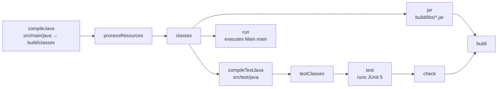

Useful commands (run them from this project folder):

```bash
./gradlew tasks            # list every task available
./gradlew compileJava      # just compile the main sources
./gradlew build            # compile + test + package a jar
./gradlew clean            # delete the build/ folder and start fresh
./gradlew run              # run the demo
./gradlew test             # run the tests
./gradlew clean build      # the "when in doubt" command
./gradlew showGenerated    # print the methods Lombok generated (section 7.7)
```

### 7.5 Where the output goes

Everything Gradle produces lands in `build/` (which is git-ignored):

```
build/
├── classes/java/main/…      compiled .class files
├── classes/java/test/…      compiled test classes
├── libs/linkedlist-reverse-generic-1.0-SNAPSHOT.jar
├── reports/tests/test/index.html   ← pretty HTML test report
└── test-results/test/*.xml         ← machine-readable results
```

### 7.6 Incremental builds

Run `./gradlew test` twice. The second run prints `UP-TO-DATE`: Gradle noticed
nothing changed and skipped the work. That is a feature, not a bug. Use
`./gradlew clean test` if you ever want to force a full rebuild.

### 7.7 Lombok (annotation processing)

**What it is.** [Lombok](https://projectlombok.org) is an *annotation
processor*: a plugin that runs **inside the Java compiler** and writes ordinary
Java code for you. You annotate a class, and the generated constructors,
getters, `equals`, `hashCode` and `toString` appear in the compiled `.class`
file. This is the single most important thing to understand about it:

> **The code you read is not the code that runs.** There is no `getName()`
> anywhere in `Main.java`, but there is one in `Main$Student.class`.

**Seeing it with your own eyes.** Do not take that on faith — run:

```bash
./gradlew showGenerated
```

which uses the JDK's own `javap` tool to list what is really in the class files:

```
final class org.jk.dsa.learning.Node<T> {
  T value;
  org.jk.dsa.learning.Node<T> next;
  org.jk.dsa.learning.Node(T);                              ← written by hand
  public org.jk.dsa.learning.Node(T, Node<T>);              ← @AllArgsConstructor
  public java.lang.String toString();                       ← @ToString
}
class org.jk.dsa.learning.Main$Student {
  private java.lang.String name;
  private int marks;
  public java.lang.String toString();                       ← written by hand
  public java.lang.String getName();                        ← @Getter
  public int getMarks();                                    ← @Getter
  public void setName(java.lang.String);                    ← @Setter
  public void setMarks(int);                                ← @Setter
  public Main$Student(java.lang.String, int);               ← @AllArgsConstructor
}
```

**How it is wired up.** Four lines in
[`build.gradle.kts`](build.gradle.kts), and both halves of each pair matter:

| Line | Why |
| --- | --- |
| `compileOnly("org.projectlombok:lombok")` | needed to **compile**, not to run — so it never ships inside our jar |
| `annotationProcessor(...)` | what actually **switches the generation on** |
| `testCompileOnly` / `testAnnotationProcessor` | the same again for `src/test/java`; without these the `Book` class in the tests would not compile |

> **The classic beginner error:** declaring only `compileOnly` and forgetting
> `annotationProcessor`. Everything looks right, but nothing is generated and
> you get a wall of `cannot find symbol: method getName()`.

[`lombok.config`](lombok.config) then controls *how* it generates:
`config.stopBubbling = true` keeps the project self-contained, and
`lombok.addLombokGeneratedAnnotation = true` marks generated methods so coverage
tools skip code you did not write.

**Where this project uses it — and where it deliberately does not.**

| File | Lombok? | Why |
| --- | --- | --- |
| [`Node.java`](src/main/java/org/jk/dsa/learning/Node.java) | `@AllArgsConstructor`, `@ToString(of = "value")` | removes a constructor body and a `toString` |
| [`Main.Student`](src/main/java/org/jk/dsa/learning/Main.java#L216) | `@Getter @Setter @AllArgsConstructor` | a realistic mutable bean |
| `Book` in the tests | `@Data` | one annotation for getters, setters, `equals`, `hashCode`, `toString` |
| [`SinglyLinkedList.java`](src/main/java/org/jk/dsa/learning/SinglyLinkedList.java) | **none** | this is the code you are here to study. Every assignment stays visible, because the diagrams, the animation and the debugger all step through these exact lines. |

**A trap worth learning from.** `Node` is annotated
`@ToString(of = "value")`, not a plain `@ToString`. A plain one would include
the `next` field, whose `toString` prints *its* `next`, and so on — one debugger
hover would render the entire list, or loop forever if the chain ever contains a
cycle. Excluding the link field is the standard fix for linked structures, and
the test `nodeToStringDoesNotFollowTheChain` locks the behaviour in.

**The honest trade-off.** Lombok removes real boilerplate from domain classes,
which is why it is everywhere in Spring codebases. The cost is that your source
is no longer the whole truth: the debugger steps into methods that do not exist
in the file, and your IDE needs a plugin before it stops showing red squiggles
on code that compiles perfectly. For a *data-structure* class, where reading
every line is the entire point, plain Java wins — which is exactly why
`SinglyLinkedList` has no annotations on it.

---

## 8. How to run the demo

From this folder:

```bash
# macOS / Linux
./gradlew run

# Windows (Command Prompt or PowerShell)
gradlew.bat run
```

Add `-q` (quiet) to hide Gradle's own chatter and see only the program output:

```bash
./gradlew run -q
```

The demo lives in [`Main.java`](src/main/java/org/jk/dsa/learning/Main.java) and
prints five sections. Expected output (abridged):

```
======================================================================
1. Reversing a list of Strings
======================================================================
before reverse : [A -> B -> C -> D]
after  reverse : [D -> C -> B -> A]
first = D, last = A

...

======================================================================
4. Step-by-step trace of the three-pointer reversal
======================================================================
step 0  previous=null current=A    reversed=null
step 1  previous=A    current=B    reversed=A -> null
step 2  previous=B    current=C    reversed=B -> A -> null
step 3  previous=C    current=null reversed=C -> B -> A -> null
done    new head = C, new tail = A
```

Compare that trace with the loop at
[`SinglyLinkedList.java#L446-L451`](src/main/java/org/jk/dsa/learning/SinglyLinkedList.java#L446-L451)
— it is the same four steps.

### Running the jar directly (optional)

```bash
./gradlew build
java -cp build/classes/java/main org.jk.dsa.learning.Main
```

---

## 9. How to run the tests

```bash
./gradlew test
```

Because [`build.gradle.kts`](build.gradle.kts) turns on `testLogging`, you get a
line per test:

```
SinglyLinkedList > reverse() -- iterative, O(n) time / O(1) space > reverses a three element list PASSED
SinglyLinkedList > reverse() -- iterative, O(n) time / O(1) space > handles null elements PASSED
...
BUILD SUCCESSFUL
```

An HTML report is written to `build/reports/tests/test/index.html` — open it in
a browser for a clickable summary.

### Running just some tests

```bash
# one test method
./gradlew test --tests "*reversesAThreeElementList"

# one nested group
./gradlew test --tests "*SinglyLinkedListTest\$Reverse"

# force a re-run even if nothing changed
./gradlew test --rerun-tasks
```

### How a test is written

Every test in
[`SinglyLinkedListTest.java`](src/test/java/org/jk/dsa/learning/SinglyLinkedListTest.java)
follows **arrange → act → assert**:

```java
@Test
@DisplayName("reverses a three element list")
void reversesAThreeElementList() {
    SinglyLinkedList<String> list = SinglyLinkedList.of("A", "B", "C"); // arrange
    list.reverse();                                                     // act
    assertEquals(List.of("C", "B", "A"), list.toList());                // assert
}
```

JUnit 5 pieces used here:

| Annotation / method | Meaning |
| --- | --- |
| `@Test` | this method is a test |
| `@DisplayName` | a readable name for the report |
| `@Nested` | groups related tests (see the `Reverse`, `Removals`, … inner classes) |
| `@ParameterizedTest` + `@ValueSource` | runs the *same* test for sizes 0, 1, 2, 3, 10 and 1000 — see [L106](src/test/java/org/jk/dsa/learning/SinglyLinkedListTest.java#L97) |
| `assertEquals(expected, actual)` | fails if they differ (**expected comes first**) |
| `assertThrows(Type.class, () -> …)` | fails unless that exception is thrown |

### Prove the tests actually test something

Open
[`SinglyLinkedList.java#L456`](src/main/java/org/jk/dsa/learning/SinglyLinkedList.java#L456)
and delete `tail = oldHead;`. Run `./gradlew test`. You should see
`fixesHeadAndTailPointers` fail. Put the line back. **Do this once — it is the
fastest way to understand why `tail` matters.**

---

## 10. How to debug the code

Debugging means pausing the program and inspecting variables. For a linked list
this is the best way to *see* the pointers move.

### 10.1 In IntelliJ IDEA (easiest)

1. **Open the project:** *File → Open* and select this folder (the one with
   `build.gradle.kts`). IntelliJ detects Gradle and imports it. Wait for the
   bottom progress bar to finish.
2. **Set a breakpoint:** open
   [`SinglyLinkedList.java`](src/main/java/org/jk/dsa/learning/SinglyLinkedList.java)
   and click in the left gutter next to **line 447**
   (`Node<T> nextHop = current.next;`). A red dot appears.
3. **Start debugging:** open
   [`Main.java`](src/main/java/org/jk/dsa/learning/Main.java), right-click inside
   `main` → **Debug 'Main.main()'**.
4. **When it pauses**, look at the *Variables* pane. You will see `previous`,
   `current` and `nextHop`. Expand `current` to see `value` and `next` — you can
   literally unfold the whole chain.
5. **Step through** with these keys:
   * `F8` **Step Over** — run the current line, stay in this method
   * `F7` **Step Into** — jump inside the method being called
   * `Shift+F8` **Step Out** — finish this method and come back
   * `F9` **Resume** — run until the next breakpoint hit
6. Press `F9` repeatedly and watch `previous` grow while `current` shrinks. That
   is exactly the animation in [`docs/animation.html`](docs/animation.html).

**Debugging a test instead:** open
[`SinglyLinkedListTest.java`](src/test/java/org/jk/dsa/learning/SinglyLinkedListTest.java),
click the green arrow next to `reversesAThreeElementList` and choose **Debug**.
Tests are usually the nicest thing to debug because the setup is tiny.

> **Conditional breakpoints** are great for long lists: right-click the red dot
> and enter a condition such as `current.value.equals("C")`. Execution pauses
> only on that node.

### 10.2 In VS Code

1. Install the **Extension Pack for Java** (Microsoft).
2. Open this folder. Click the gutter to set a breakpoint at line 447.
3. Open `Main.java`; a **Run | Debug** CodeLens appears above `main`. Click
   **Debug**.
4. Use the floating toolbar: Step Over `F10`, Step Into `F11`, Continue `F5`.

### 10.3 From the command line (no IDE)

Gradle can pause and wait for a debugger to attach on port 5005:

```bash
./gradlew run --debug-jvm       # then attach your IDE to localhost:5005
./gradlew test --debug-jvm      # same, but for the tests
```

In IntelliJ: *Run → Edit Configurations → + → Remote JVM Debug*, port `5005`,
then press Debug.

### 10.4 Poor-man's debugging: print statements

Perfectly legitimate while learning. Temporarily add a line inside the loop in
[`reverse()`](src/main/java/org/jk/dsa/learning/SinglyLinkedList.java#L446):

```java
while (current != null) {
    System.out.println("previous=" + previous + " current=" + current);
    ...
}
```

Then `./gradlew run -q`. (This is exactly what
[`Main.demoReverseTrace()`](src/main/java/org/jk/dsa/learning/Main.java#L102)
does permanently, without polluting the data structure.)

### 10.5 Reading a failing test

```
expected: <[C, B, A]> but was: <[A, B, C]>
    at SinglyLinkedListTest.reversesAThreeElementList(SinglyLinkedListTest.java:43)
```

Read it as: *"at line 43 of the test, I wanted `[C, B, A]` and got `[A, B, C]`."*
Click the file:line in the console — IntelliJ and VS Code both make it a
hyperlink — then debug that test.

---

## 11. Exercises

Try these in order; each one has a test you can write yourself.

1. **Break it on purpose.** Delete `Node<T> nextHop = current.next;` at
   [L447](src/main/java/org/jk/dsa/learning/SinglyLinkedList.java#L447) and make
   the loop use `current.next` directly. Run the tests and explain the failure.
2. **`reverseFirstK(int k)`** — reverse only the first `k` nodes and re-attach
   the rest. Watch out for the `tail` pointer.
3. **`isPalindrome()`** — return `true` when the list reads the same both ways.
   Can you do it in O(n) time and O(1) space? (Hint: reverse the second half.)
4. **`middle()`** — find the middle element in a *single* pass using the
   slow/fast pointer trick.
5. **`hasCycle()`** — detect whether the chain loops back on itself (Floyd's
   tortoise and hare).
6. **Make it a doubly linked list** — add a `previous` field to
   [`Node`](src/main/java/org/jk/dsa/learning/Node.java) and see how
   `removeLast()` drops from O(n) to O(1).

---

## 12. Troubleshooting

| Symptom | Fix |
| --- | --- |
| `zsh: permission denied: ./gradlew` | `chmod +x gradlew` |
| `gradle: command not found` | use `./gradlew`, not `gradle` |
| Downloads hang on first run | the wrapper is fetching Gradle + JUnit; you need internet **once**. After that it works offline (`--offline`). |
| `invalid source release: 21` | Gradle's toolchain should download JDK 21 automatically. If it cannot, install a JDK 21 (e.g. Temurin) and re-run. |
| Tests say `UP-TO-DATE` and nothing runs | nothing changed. Use `./gradlew test --rerun-tasks`. |
| `StackOverflowError` in `reverseRecursive` | expected on very long lists — that is the O(n) space cost. Use `reverse()`. |
| Mermaid diagrams show as raw text | view this file on GitHub, or in an editor with a Mermaid preview plugin. |
| IDE shows red errors on `getName()` / `getTitle()` but `./gradlew build` succeeds | you are missing the **Lombok IDE plugin**. IntelliJ: it is bundled — just enable *Settings → Build → Compiler → Annotation Processors → Enable annotation processing*. VS Code: the Extension Pack for Java handles it after a *Java: Clean Language Server Workspace*. |
| `cannot find symbol: method getMarks()` from Gradle | an `annotationProcessor(...)` line is missing in `build.gradle.kts` — `compileOnly` alone generates nothing (section 7.7) |
| Debugger steps into a constructor that is not in the file | that is Lombok-generated code. Run `./gradlew showGenerated` to see what exists. |
| Weird, unexplainable build errors | `./gradlew clean build` |

---

## License / intent

Written for **demo and study purposes**. Read it, break it, fix it, and then
write it again from a blank file — that last step is where the learning happens.
