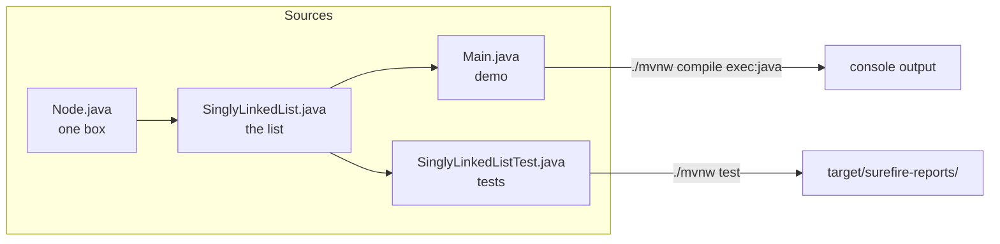
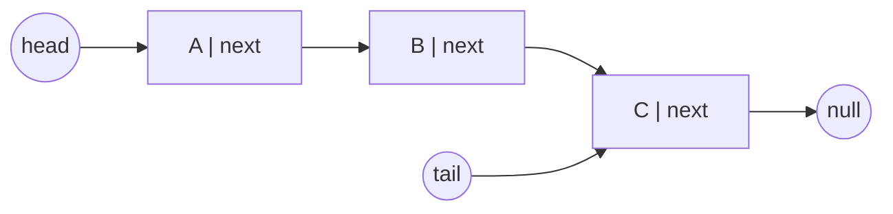
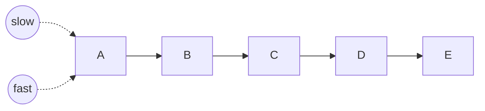
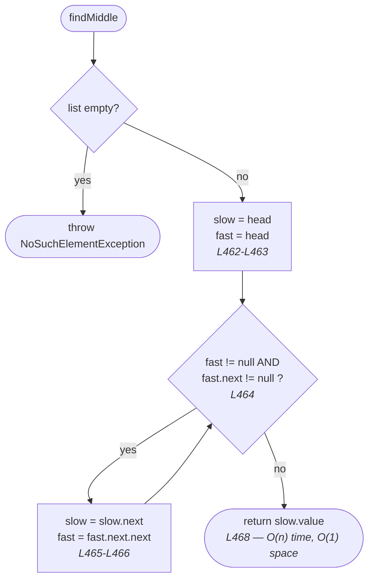
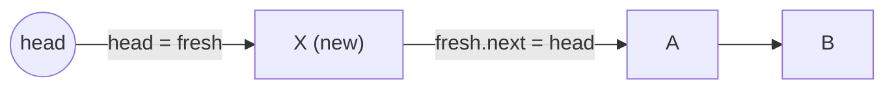
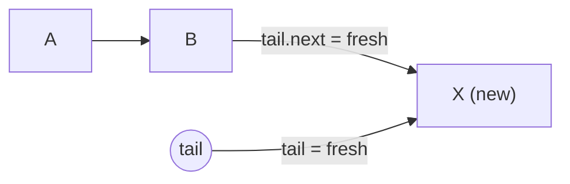
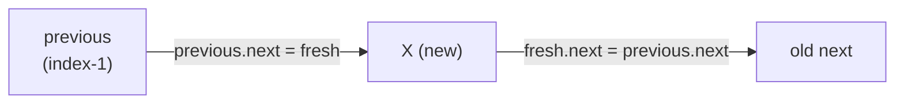
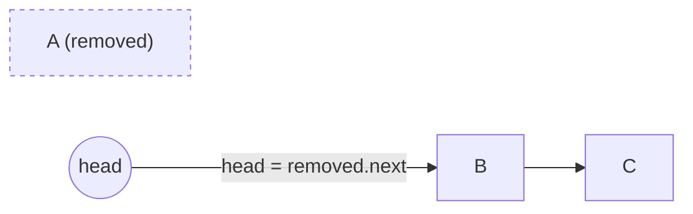
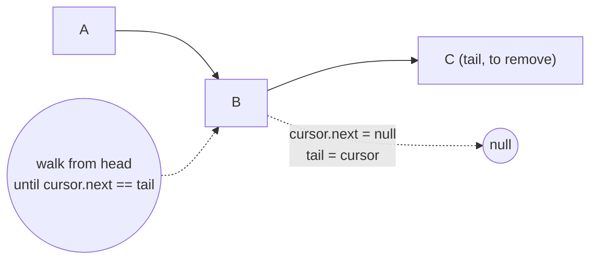
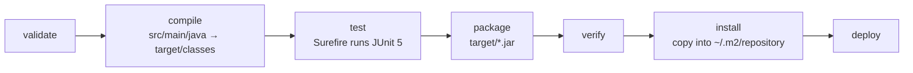

# Finding the Middle of a Singly Linked List — `findMiddle()`

*(Java 21 + Maven + JUnit 5 + Lombok)*

A **stand-alone, study-oriented** Maven project that implements a generic
singly linked list and solves the classic **find the middle node** problem in
a single pass, using two pointers moving at different speeds — the "tortoise
and hare" technique.

```
A → B → C → D → E      findMiddle()      C
```

The idea is famously simple to *state* and easy to get subtly wrong. This
project's job is to make sure you get it exactly right, understand why it
works, and know what it costs compared to the more obvious two-pass approach.

This guide assumes you have **never used Maven before** and are still getting
comfortable with Java. Nothing is skipped.

> **Want to try it yourself first?** [`PROBLEM.md`](PROBLEM.md) states the
> problem properly — examples, constraints, edge cases and progressive hints —
> without giving the solution away. Attempting it before reading section 4 is
> worth far more than reading section 4 twice.

> **New to Java, or not sure you are ready?** Start with
> [`PREREQUISITES.md`](PREREQUISITES.md). It lists exactly what to install, the
> handful of Java ideas you actually need, and a short quiz to check yourself.
> About 30–60 minutes, and this is a good **first** two-pointer problem — no
> other linked-list project is required beforehand.

| I want to… | Do this |
| --- | --- |
| Check I am ready | read [`PREREQUISITES.md`](PREREQUISITES.md) |
| **Read the problem first** | [`PROBLEM.md`](PROBLEM.md) — statement, examples, hints |
| Watch the explainer video | [`demo-videos/linkedlist-find-middle-explained.mp4`](demo-videos/linkedlist-find-middle-explained.mp4) |
| See it run | `./mvnw compile exec:java` |
| Run the tests | `./mvnw test` |
| Watch the animation | open [`docs/animation.html`](docs/animation.html) in a browser |
| Read the star method | [`findMiddle()`](src/main/java/org/jk/dsa/learning/SinglyLinkedList.java#L460) |

---

## Table of contents

1. [Project layout](#1-project-layout)
2. [What is a singly linked list?](#2-what-is-a-singly-linked-list)
3. [Why generics?](#3-why-generics)
4. [The star operation: `findMiddle()`](#4-the-star-operation-findmiddle)
5. [Every operation, explained with diagrams](#5-every-operation-explained-with-diagrams)
6. [Complexity summary](#6-complexity-summary)
7. [How Maven works (and how to build this project)](#7-how-maven-works-and-how-to-build-this-project)
8. [How to run the demo](#8-how-to-run-the-demo)
9. [How to run the tests](#9-how-to-run-the-tests)
10. [How to debug the code](#10-how-to-debug-the-code)
11. [Exercises](#11-exercises)
12. [Troubleshooting](#12-troubleshooting)

---

## 1. Project layout

```
linkedlist-find-middle/
├── pom.xml                   ← the build: Java 21, JUnit 5, Lombok, plugins
├── lombok.config             ← how Lombok generates code (see section 7.7)
├── mvnw / mvnw.cmd           ← the Maven "wrapper" scripts (see section 7)
├── .mvn/wrapper/             ← which Maven version the wrapper downloads
├── PREREQUISITES.md          ← read this FIRST if you are new to Java
├── PROBLEM.md                ← the problem statement, examples and hints
├── README.md                 ← this document (the worked solution)
├── docs/
│   └── animation.html        ← interactive, step-by-step animation
├── demo-videos/              (git-ignored — large media)
│   ├── linkedlist-find-middle-explained.mp4   ← narrated walkthrough
│   └── linkedlist-find-middle-explained.txt   ← description + section times
└── src/
    ├── main/java/org/jk/dsa/learning/
    │   ├── Node.java                 ← one box in the chain
    │   ├── SinglyLinkedList.java     ← the data structure (all operations)
    │   └── Main.java                 ← console demo
    └── test/java/org/jk/dsa/learning/
        └── SinglyLinkedListTest.java ← JUnit 5 tests
```

> **Rule to remember:** Maven expects production code under `src/main/java`
> and test code under `src/test/java`. That is *convention over configuration* —
> put the files where Maven looks and `pom.xml` stays short. The folders after that must match the
> `package` line at the top of each `.java` file. Our package is
> `org.jk.dsa.learning`, so the folders are `org/jk/dsa/learning`.



Source files:
[`Node.java`](src/main/java/org/jk/dsa/learning/Node.java) ·
[`SinglyLinkedList.java`](src/main/java/org/jk/dsa/learning/SinglyLinkedList.java) ·
[`Main.java`](src/main/java/org/jk/dsa/learning/Main.java) ·
[`SinglyLinkedListTest.java`](src/test/java/org/jk/dsa/learning/SinglyLinkedListTest.java)

---

## 2. What is a singly linked list?

An **array** stores its elements next to each other in memory, so it can jump
straight to element 7. A **linked list** does not: it stores each element in its
own little object called a **node**, and every node holds an arrow (a reference)
to the next node. The only way to reach element 7 is to start at the front and
follow six arrows.

Each node is [`Node.java`](src/main/java/org/jk/dsa/learning/Node.java) and has
exactly two fields:

* `value` — the data ([`Node.java#L43`](src/main/java/org/jk/dsa/learning/Node.java#L43))
* `next` — the arrow to the following node, or `null` at the end
  ([`Node.java#L46`](src/main/java/org/jk/dsa/learning/Node.java#L46))



The list itself
([`SinglyLinkedList`](src/main/java/org/jk/dsa/learning/SinglyLinkedList.java#L60))
only remembers three things:

| Field | Line | Why it exists |
| --- | --- | --- |
| `head` | [L63](src/main/java/org/jk/dsa/learning/SinglyLinkedList.java#L63) | the entrance to the chain; without it the whole list is lost |
| `tail` | [L66](src/main/java/org/jk/dsa/learning/SinglyLinkedList.java#L66) | lets `addLast` be O(1) instead of O(n) |
| `size` | [L69](src/main/java/org/jk/dsa/learning/SinglyLinkedList.java#L69) | lets `size()` be O(1) instead of counting nodes |

> **The subtlety this project is built around:** `size` is a **convenience**
> this particular class happens to offer. The classic definition of a singly
> linked list does not cache a length at all, and plenty of sequences you meet
> outside a textbook (files, streams, one-shot iterators) genuinely cannot tell
> you "how many are left" without consuming themselves to find out.
> [`findMiddle()`](src/main/java/org/jk/dsa/learning/SinglyLinkedList.java#L460)
> is written as if that cached field did not exist — see
> [section 4.6](#46-three-ways-one-answer) for exactly why that restriction is
> the whole point of the exercise.

**Singly** means each node knows only its *successor*. It has no arrow back to
its predecessor. That is why `removeLast()` is slow — see
[section 5.7](#57-removelast--on).

---

## 3. Why generics?

Look at the class declaration
([L60](src/main/java/org/jk/dsa/learning/SinglyLinkedList.java#L60)):

```java
public class SinglyLinkedList<T> implements Iterable<T> {
```

`<T>` is a **type parameter** — a placeholder that you fill in when you create
the list. One class then serves every element type:

```java
SinglyLinkedList<String>  names   = new SinglyLinkedList<>();
SinglyLinkedList<Integer> numbers = new SinglyLinkedList<>();
SinglyLinkedList<Student> class10 = new SinglyLinkedList<>();  // your own type!
```

Two things you get for free:

1. **Compile-time safety.** `names.addLast(42)` will not compile. Without
   generics the list would store `Object` and that mistake would only blow up at
   runtime.
2. **No casting.** `String s = names.get(0);` just works, and so does
   `String middle = names.findMiddle();` — see the test
   [`matchesReferenceForEveryLength`](src/test/java/org/jk/dsa/learning/SinglyLinkedListTest.java).

Demo 3 in [`Main.demoCustomType()`](src/main/java/org/jk/dsa/learning/Main.java#L75)
puts a `Student` class into the very same list and finds its middle, proving the
point. `Student` is written with **Lombok** — see
[section 7.7](#77-lombok-annotation-processing) — while the `Book` type in the
tests shows a Lombok `@Data` bean used the same way.

> **Small print (worth knowing):** Java generics use *type erasure*. At runtime
> the JVM only sees `Object`; the type checks happen at compile time. That is why
> the factory method
> [`of(E... values)`](src/main/java/org/jk/dsa/learning/SinglyLinkedList.java#L94)
> is annotated `@SafeVarargs` — it promises the compiler we do not abuse the
> generic array it creates for the varargs.

---

## 4. The star operation: `findMiddle()`

### 4.1 The problem

Return the value of the **middle node** of a linked list, walking the list
**once**, without knowing its length in advance.

```
A → B → C → D → E      findMiddle()      C

A → B → C → D          findMiddle()      C   (the SECOND of two middles)
```

If the list has an even number of nodes, there are two candidate middles; this
class returns the **second** one, matching the classic interview phrasing of
this problem.

### 4.2 Why not just count and walk?

If you already know the length `n`, the middle is simply index `n / 2` — no
cleverness required. This class happens to cache `size`, so that shortcut is
right there:
[`findMiddleFromSize()`](src/main/java/org/jk/dsa/learning/SinglyLinkedList.java#L524).

The interesting version of the problem assumes you **don't** get the length for
free — because you often don't. A file read line by line, a network socket, an
iterator that can only move forward once: none of these will tell you "how many
values remain" without consuming themselves in the process. If you can only
traverse the sequence once, counting first and walking second is not an option.

That constraint is what makes the two-pointer technique worth learning, rather
than a clever trick for its own sake.

### 4.3 The idea: two pointers, different speeds

Start two pointers, `slow` and `fast`, both at `head`. On every iteration,
`slow` takes **one** step and `fast` takes **two**:



Because `fast` always covers exactly twice the ground `slow` does, the moment
`fast` reaches the end of the list, `slow` has covered exactly half of it. The
length of the list is never looked up — it falls out of the race itself.

### 4.4 The code, phase by phase

```java
public T findMiddle() {
    requireNonEmpty();                       // L461
    Node<T> slow = head;                     // L462
    Node<T> fast = head;                     // L463
    while (fast != null && fast.next != null) {  // L464
        slow = slow.next;                    // L465  tortoise: one step
        fast = fast.next.next;               // L466  hare: two steps
    }
    return slow.value;                       // L468
}
```



The loop condition is doing two jobs at once, and both matter:

* `fast != null` — stop once the hare has run off the end.
* `fast.next != null` — checked **before** `fast.next.next` executes, because
  otherwise that line would throw a `NullPointerException` the moment
  `fast.next` is `null`.

### 4.5 Walking through both parities by hand

**Odd length**, `A B C D E` (5 nodes):

```
start   slow=A  fast=A
step 1  slow=B  fast=C        (fast: A -> B -> C)
step 2  slow=C  fast=E        (fast: C -> D -> E)
loop ends: E.next is null, so fast cannot take 2 more steps
answer: slow = C   (the true middle)
```

**Even length**, `A B C D` (4 nodes):

```
start   slow=A  fast=A
step 1  slow=B  fast=C        (fast: A -> B -> C)
loop check: fast=C, fast.next=D is not null -> continue
step 2  slow=C  fast=null     (fast: C -> D -> null)
loop ends: fast itself is null
answer: slow = C   (the SECOND of the two middles, B and C)
```

The same four lines produce the correct answer for both parities, with no `if`
for "is the length even?" anywhere. That is the payoff of getting the loop
condition exactly right.

### 4.6 Three ways, one answer

This project deliberately ships **three** correct implementations, so you can
compare their cost rather than just their correctness:

| Method | Passes | Approx. node visits | Needs the sequence traversable twice? | Needs a cached length? |
| --- | --- | --- | --- | --- |
| [`findMiddle()`](src/main/java/org/jk/dsa/learning/SinglyLinkedList.java#L460) — **the star** | 1 | `~1.5n` | no | no |
| [`findMiddleTwoPass()`](src/main/java/org/jk/dsa/learning/SinglyLinkedList.java#L490) | 2 | `~2n` | **yes** | no |
| [`findMiddleFromSize()`](src/main/java/org/jk/dsa/learning/SinglyLinkedList.java#L524) | 1 (plus a free length lookup) | `~0.5n` | no | **yes** |

All three are **O(n) time and O(1) space** — the same complexity class. The
table exists precisely because that fact hides real differences: `findMiddle()`
is the only one that works when you truly cannot look ahead or rewind, which is
the situation the classic problem statement is testing. `findMiddleFromSize()`
is the fastest of the three in this class only because `size` happens to be
free here; take that cache away (as a plain textbook linked list would) and it
is not available at all.

[`middleIndex()`](src/main/java/org/jk/dsa/learning/SinglyLinkedList.java#L546)
runs the identical race as `findMiddle()`, just counting steps instead of
discarding them, so you can verify `list.get(list.middleIndex())` equals
`list.findMiddle()`.

### 4.7 Complexity

**Time: O(n)** for all three methods — see the table above for why that single
label hides a real difference in cost.

**Space: O(1)** for all three — a fixed, small number of reference or `int`
variables, no matter how long the list is.

### 4.8 The edge cases

| Case | Why it is tricky | Test |
| --- | --- | --- |
| Even-length list | a naive loop condition silently returns the *first* middle instead of the second | [`returnsTheSecondOfTwoMiddles`](src/test/java/org/jk/dsa/learning/SinglyLinkedListTest.java) |
| Two-node list | the smallest case that actually exercises the even-length rule | [`twoNodeListReturnsSecondNode`](src/test/java/org/jk/dsa/learning/SinglyLinkedListTest.java) |
| Single-node list | must return that one node, not throw | [`singleNodeIsItsOwnMiddle`](src/test/java/org/jk/dsa/learning/SinglyLinkedListTest.java) |
| Empty list | must throw a clear exception, not `NullPointerException` | [`emptyListThrows`](src/test/java/org/jk/dsa/learning/SinglyLinkedListTest.java) |

The test
[`matchesReferenceForEveryLength`](src/test/java/org/jk/dsa/learning/SinglyLinkedListTest.java)
goes further: for twelve list sizes spread between 1 and 50 — `1, 2, 3, 4, 5, 8,
9, 16, 17, 32, 33, 50`, deliberately pairing each power of two with its
successor, where off-by-one bugs like to hide — it compares all three
implementations against a reference built with a plain `java.util.ArrayList`.

### 4.9 Watch it move: `docs/animation.html`

Open [`docs/animation.html`](docs/animation.html) in any browser — no server, no
build step, just double-click it. Type any list contents into the box on the
left and step through with `←` / `→`. The two pointers are drawn as separate
coloured markers racing along the same chain, and the source panel underneath
highlights the exact line executing.

You can deep-link to a single moment as `animation.html#<operation>:<step>`:

| Link | What you see |
| --- | --- |
| [`#findMiddle:4`](docs/animation.html#findMiddle:4) | `slow` and `fast` both standing on `head`, before the first step |
| [`#findMiddle:7`](docs/animation.html#findMiddle:7) | one pair of steps done — `fast` already twice as far along as `slow` |
| [`#findMiddle:11`](docs/animation.html#findMiddle:11) | the loop condition refusing a third pair of steps |
| [`#findMiddle:12`](docs/animation.html#findMiddle:12) | `slow` standing on the answer |

The step numbers above assume the list the page starts with, `A,B,C,D,E`
(a deep link selects the operation and the step, but does not change the
contents box). Type `A,B,C,D` into it and step to the end to watch the
even-length "second middle" rule instead.

### 4.10 Prefer to be talked through it? Watch the video

[`demo-videos/linkedlist-find-middle-explained.mp4`](demo-videos/linkedlist-find-middle-explained.mp4)
is a narrated walkthrough of this whole page. It opens with a plain-language
introduction to linked lists and to the problem, so it works even if you have
never met either before.
[`linkedlist-find-middle-explained.txt`](demo-videos/linkedlist-find-middle-explained.txt)
holds a ready-made description with section timestamps if you want to upload it.

| Starts | Covers |
| --- | --- |
| 00:00 | what a linked list is, and how it differs from an array |
| 01:04 | **the problem** — what "the middle" means, and the second-middle rule |
| 01:46 | **the slow/fast race, step by step** — the core of the video |
| 03:50 | three implementations, one answer — and their trade-offs |
| 04:57 | the edge cases |
| 05:56 | why the list is generic |
| 06:11 | running it yourself |

The video deliberately stays on this one problem — the data structure itself and
the three ways of finding the middle. The other operations in section 5 below are
not in it; step through them in [`docs/animation.html`](docs/animation.html)
instead.

It is 1920×1080, H.264/AAC, so it plays anywhere and uploads to YouTube as is.

---

## 5. Every operation, explained with diagrams

### 5.1 `addFirst(value)` — O(1)
[Code → L242](src/main/java/org/jk/dsa/learning/SinglyLinkedList.java#L242)

Make a node, point it at the old head, call it the new head. If the list was
empty, it is also the new tail.



### 5.2 `addLast(value)` — O(1)
[Code → L261](src/main/java/org/jk/dsa/learning/SinglyLinkedList.java#L261)

Because we cache `tail`, appending needs no walk at all.



### 5.3 `insertAt(index, value)` — O(index)
[Code → L284](src/main/java/org/jk/dsa/learning/SinglyLinkedList.java#L284)

Walk to the node *before* the target slot, then re-hook two arrows. Index `0`
delegates to `addFirst`, index `size` to `addLast`.



### 5.4 `get(index)` / `set(index, value)` — O(index)
[get → L143](src/main/java/org/jk/dsa/learning/SinglyLinkedList.java#L143) ·
[set → L157](src/main/java/org/jk/dsa/learning/SinglyLinkedList.java#L157) ·
[walker → nodeAt](src/main/java/org/jk/dsa/learning/SinglyLinkedList.java#L641)

There is no random access. `nodeAt` starts at `head` and follows `index` arrows.
This is the single biggest practical difference from `ArrayList`, and exactly
why `findMiddle()` cannot just call `get(size() / 2)` and call it a one-pass
solution — `get` itself is a walk.

### 5.5 `indexOf(value)` / `contains(value)` — O(n)
[indexOf → L204](src/main/java/org/jk/dsa/learning/SinglyLinkedList.java#L204) ·
[contains → L223](src/main/java/org/jk/dsa/learning/SinglyLinkedList.java#L223)

Uses `Objects.equals(a, b)` rather than `a.equals(b)` so that `null` elements do
not cause a `NullPointerException` — see
[`indexOfAndContainsHandleNulls`](src/test/java/org/jk/dsa/learning/SinglyLinkedListTest.java).

### 5.6 `removeFirst()` — O(1)
[Code → L316](src/main/java/org/jk/dsa/learning/SinglyLinkedList.java#L316)

Move `head` one step forward and unlink the old node so the garbage collector
can reclaim it.



### 5.7 `removeLast()` — O(n)
[Code → L341](src/main/java/org/jk/dsa/learning/SinglyLinkedList.java#L341)

**This is the operation a singly linked list is bad at.** A node has no arrow
back to its predecessor, so to delete the tail we must walk from `head` to the
*second-last* node. A *doubly* linked list does this in O(1) — that is its whole
reason for existing.



### 5.8 `removeAt(index)` / `remove(value)` — O(index) / O(n)
[removeAt → L366](src/main/java/org/jk/dsa/learning/SinglyLinkedList.java#L366) ·
[remove → L390](src/main/java/org/jk/dsa/learning/SinglyLinkedList.java#L390)

Walk to `index - 1`, then skip over the doomed node. Note the `tail` fix-up for
when the removed node was the last one.

### 5.9 `clear()` — O(1)
[Code → L407](src/main/java/org/jk/dsa/learning/SinglyLinkedList.java#L407)

Dropping `head` and `tail` is enough: nothing references the chain any more, so
the whole thing becomes garbage. No loop needed.

### 5.10 `iterator()` and `toString()` / `toList()`
[iterator → L590](src/main/java/org/jk/dsa/learning/SinglyLinkedList.java#L590) ·
[toString → L620](src/main/java/org/jk/dsa/learning/SinglyLinkedList.java#L620) ·
[toList → L570](src/main/java/org/jk/dsa/learning/SinglyLinkedList.java#L570)

Implementing `Iterable<T>` is what lets you write
`for (String s : list) { ... }`. The iterator holds a single cursor and follows
`next` arrows — O(1) memory. `toString()` renders `[A -> B -> C]`, which makes
`System.out.println(list)` genuinely useful while studying.

---

## 6. Complexity summary

| Operation | Time | Space | Why |
| --- | --- | --- | --- |
| [`addFirst`](src/main/java/org/jk/dsa/learning/SinglyLinkedList.java#L242) | O(1) | O(1) | only touches `head` |
| [`addLast`](src/main/java/org/jk/dsa/learning/SinglyLinkedList.java#L261) | O(1) | O(1) | only because we cache `tail` |
| [`insertAt(i)`](src/main/java/org/jk/dsa/learning/SinglyLinkedList.java#L284) | O(i) | O(1) | walk to `i-1` |
| [`get`/`set(i)`](src/main/java/org/jk/dsa/learning/SinglyLinkedList.java#L143) | O(i) | O(1) | no random access |
| [`indexOf`/`contains`](src/main/java/org/jk/dsa/learning/SinglyLinkedList.java#L204) | O(n) | O(1) | linear scan |
| [`removeFirst`](src/main/java/org/jk/dsa/learning/SinglyLinkedList.java#L316) | O(1) | O(1) | move `head` |
| [`removeLast`](src/main/java/org/jk/dsa/learning/SinglyLinkedList.java#L341) | O(n) | O(1) | no back-arrows |
| [`removeAt(i)`](src/main/java/org/jk/dsa/learning/SinglyLinkedList.java#L366) | O(i) | O(1) | walk to `i-1` |
| [`clear`](src/main/java/org/jk/dsa/learning/SinglyLinkedList.java#L407) | O(1) | O(1) | drop the references |
| **[`findMiddle`](src/main/java/org/jk/dsa/learning/SinglyLinkedList.java#L460)** | **O(n)** | **O(1)** | one pass, `~1.5n` node visits |
| [`findMiddleTwoPass`](src/main/java/org/jk/dsa/learning/SinglyLinkedList.java#L490) | O(n) | O(1) | two passes, `~2n` node visits |
| [`findMiddleFromSize`](src/main/java/org/jk/dsa/learning/SinglyLinkedList.java#L524) | O(n) | O(1) | one walk of `size/2`, only because `size` is cached |
| [`middleIndex`](src/main/java/org/jk/dsa/learning/SinglyLinkedList.java#L546) | O(n) | O(1) | identical race to `findMiddle`, returns the index |
| [`toList`/`toString`](src/main/java/org/jk/dsa/learning/SinglyLinkedList.java#L570) | O(n) | O(n) | builds a new object |

**Reading Big-O:** it describes how the cost grows as the list grows, ignoring
constants. O(1) = same cost no matter the size. O(n) = double the list, double
the work. "Space" here means *extra* memory beyond the list itself. Note the
three `findMiddle*` rows: identical time and space complexity **class**, yet a
3-to-4x difference in actual node visits between the cheapest and the most
expensive — Big-O is deliberately blind to that, which is exactly the point
made in [section 4.6](#46-three-ways-one-answer).

---

## 7. How Maven works (and how to build this project)

### 7.1 What Maven is

Maven is a **build tool**. It automates the boring steps: find the sources,
download libraries, compile, run tests, package a jar. Its guiding idea is
**convention over configuration** — if you put your files where Maven expects
them, you barely have to configure anything. That is why `src/main/java` and
`src/test/java` are not arbitrary: they are *the* convention, and following it
is what keeps [`pom.xml`](pom.xml) short.

### 7.2 The wrapper — why you do **not** install Maven

The files `mvnw` (macOS/Linux), `mvnw.cmd` (Windows) and `.mvn/wrapper/` are the
**Maven Wrapper**. The first time you run `./mvnw`, it reads
[`maven-wrapper.properties`](.mvn/wrapper/maven-wrapper.properties), downloads
exactly that Maven version, caches it in `~/.m2/wrapper`, and uses it. Everyone
who clones the project therefore builds with the *identical* Maven version, even
if they have no Maven installed at all.

> **Always type `./mvnw`, never `mvn`.** On Windows use `mvnw.cmd`.
> If you get `permission denied` on macOS/Linux, run `chmod +x mvnw` once.

Downloaded libraries go to `~/.m2/repository`, your **local repository**. It is
shared by every Maven project on your machine, which is why the second project
you ever build is much faster than the first.

### 7.3 Reading `pom.xml`

`pom.xml` stands for **P**roject **O**bject **M**odel, and it is the entire
build. Open [`pom.xml`](pom.xml) and match it to this table:

| Block | What it does |
| --- | --- |
| `<groupId>` / `<artifactId>` / `<version>` | the **coordinates** that name this project — the same three things you use to depend on any library |
| `<packaging>jar</packaging>` | build a jar (the default) |
| `<maven.compiler.release>21</...>` | compile for **Java 21**, and check we use no newer APIs |
| `<project.build.sourceEncoding>` | UTF-8, so the build is identical on every machine |
| `<dependencies>` | the libraries we need: JUnit 5 and Lombok |
| `<scope>test</scope>` | JUnit is visible **only** to `src/test/java` and never shipped |
| `<scope>provided</scope>` | Lombok is needed to compile but not at runtime (section 7.7) |
| `maven-compiler-plugin` | compiles, and switches Lombok on via `annotationProcessorPaths` |
| `maven-surefire-plugin` | runs the JUnit 5 tests |
| `exec-maven-plugin` | gives us `exec:java`, because Maven has no built-in "run my main class" |

**Dependency scopes** are the concept most worth learning here:

| Scope | Available when compiling `main` | Available in tests | Shipped in the jar |
| --- | --- | --- | --- |
| `compile` (default) | yes | yes | **yes** |
| `provided` | yes | yes | no |
| `test` | **no** | yes | no |

Getting these wrong is a classic beginner mistake: leave the scope off JUnit and
your test framework ends up inside your production jar.

### 7.4 The build lifecycle — phases, not tasks

Maven has a fixed, ordered list of **phases**. You name a phase, and Maven runs
that phase *and every phase before it*. You never ask for one isolated step.



So `./mvnw test` **also** compiles, and `./mvnw package` **also** compiles and
tests. `clean` belongs to a separate lifecycle, which is why you often see the
two combined as `./mvnw clean package`.

Useful commands (run them from this project folder):

```bash
./mvnw compile                      # compile the main sources
./mvnw test                         # compile + run the tests
./mvnw package                      # compile + test + build the jar
./mvnw clean                        # delete the target/ folder
./mvnw clean package                # the "when in doubt" command
./mvnw compile exec:java            # run the demo
./mvnw compile exec:exec@show-generated   # print what Lombok generated (7.7)
./mvnw dependency:tree              # show every library and why it is here
./mvnw help:effective-pom           # your pom PLUS everything Maven defaults
```

The last two are genuinely useful when learning: `dependency:tree` explains
where a library came from, and `effective-pom` reveals just how much Maven is
doing for you that is not written in your file.

> **Phases vs goals.** `test` is a *phase*. `exec:java` is a *goal* —
> `plugin:goal` — which you can invoke directly without running a lifecycle.
> That is why the demo command is `compile exec:java`: a phase to build the
> classes, then a goal to run them.

### 7.5 Where the output goes

Everything Maven produces lands in `target/` (which is git-ignored):

```
target/
├── classes/…                       compiled .class files
├── test-classes/…                  compiled test classes
├── linkedlist-find-middle-1.0-SNAPSHOT.jar
├── surefire-reports/*.txt          human-readable test results
└── surefire-reports/*.xml          machine-readable results
```

Maven does not write an HTML test report by default. If you want one:

```bash
./mvnw surefire-report:report       # then open target/reports/surefire.html
```

### 7.6 Rebuilds

Maven is far less clever about skipping work than some tools: `./mvnw test`
generally re-runs your tests every time, which is simple and predictable. It
does skip *recompiling* files that have not changed. When anything looks stale
or inexplicable, `./mvnw clean package` gives you a guaranteed-fresh build.

### 7.7 Lombok (annotation processing)

**What it is.** [Lombok](https://projectlombok.org) is an *annotation
processor*: a plugin that runs **inside the Java compiler** and writes ordinary
Java code for you. You annotate a class, and the generated constructors,
getters, `equals`, `hashCode` and `toString` appear in the compiled `.class`
file. This is the single most important thing to understand about it:

> **The code you read is not the code that runs.** There is no `getName()`
> anywhere in `Main.java`, but there is one in `Main$Student.class`.

**Seeing it with your own eyes.** Do not take that on faith — run:

```bash
./mvnw compile exec:exec@show-generated
```

which uses the JDK's own `javap` tool to list what is really in the class files:

```
final class org.jk.dsa.learning.Node<T> {
  T value;
  org.jk.dsa.learning.Node<T> next;
  org.jk.dsa.learning.Node(T);                              ← written by hand
  public org.jk.dsa.learning.Node(T, Node<T>);              ← @AllArgsConstructor
  public java.lang.String toString();                       ← @ToString
}
class org.jk.dsa.learning.Main$Student {
  private java.lang.String name;
  private int marks;
  public java.lang.String toString();                       ← written by hand
  public java.lang.String getName();                        ← @Getter
  public int getMarks();                                    ← @Getter
  public void setName(java.lang.String);                    ← @Setter
  public void setMarks(int);                                ← @Setter
  public Main$Student(java.lang.String, int);               ← @AllArgsConstructor
}
```

**How it is wired up.** Two places in [`pom.xml`](pom.xml), and **both** are
required:

| Where | Why |
| --- | --- |
| the `<dependency>` with `<scope>provided</scope>` | puts the Lombok jar on the **compile** classpath, but keeps it out of the finished jar — Maven's equivalent of "compile only" |
| `<annotationProcessorPaths>` inside `maven-compiler-plugin` | what actually **switches the generation on** |

Unlike some build tools, Maven needs no separate test-side wiring: the same
compiler plugin configuration applies to `src/test/java`, which is why the
`Book` class in the tests compiles too.

> **The classic beginner error:** declaring the dependency and forgetting
> `<annotationProcessorPaths>`. Everything looks right, but nothing is generated
> and you get a wall of `cannot find symbol: method getName()`.
>
> A second, subtler trap: if you *also* leave the dependency at the default
> `compile` scope, Lombok gets packaged into your jar and shipped to users who
> have no use for it.

[`lombok.config`](lombok.config) then controls *how* it generates:
`config.stopBubbling = true` keeps the project self-contained, and
`lombok.addLombokGeneratedAnnotation = true` marks generated methods so coverage
tools skip code you did not write.

**Where this project uses it — and where it deliberately does not.**

| File | Lombok? | Why |
| --- | --- | --- |
| [`Node.java`](src/main/java/org/jk/dsa/learning/Node.java) | `@AllArgsConstructor`, `@ToString(of = "value")` | removes a constructor body and a `toString` |
| [`Main.Student`](src/main/java/org/jk/dsa/learning/Main.java#L209) | `@Getter @Setter @AllArgsConstructor` | a realistic mutable bean |
| `Book` in the tests | `@Data` | one annotation for getters, setters, `equals`, `hashCode`, `toString` |
| [`SinglyLinkedList.java`](src/main/java/org/jk/dsa/learning/SinglyLinkedList.java) | **none** | this is the code you are here to study. Every assignment stays visible, because the diagrams, the animation and the debugger all step through these exact lines. |

**A trap worth learning from.** `Node` is annotated
`@ToString(of = "value")`, not a plain `@ToString`. A plain one would include
the `next` field, whose `toString` prints *its* `next`, and so on — one debugger
hover would render the entire list, or loop forever if the chain ever contains a
cycle. Excluding the link field is the standard fix for linked structures, and
the test `nodeToStringDoesNotFollowTheChain` locks the behaviour in.

**The honest trade-off.** Lombok removes real boilerplate from domain classes,
which is why it is everywhere in Spring codebases. The cost is that your source
is no longer the whole truth: the debugger steps into methods that do not exist
in the file, and your IDE needs a plugin before it stops showing red squiggles
on code that compiles perfectly. For a *data-structure* class, where reading
every line is the entire point, plain Java wins — which is exactly why
`SinglyLinkedList` has no annotations on it.

---

## 8. How to run the demo

From this folder:

```bash
# macOS / Linux
./mvnw compile exec:java

# Windows (Command Prompt or PowerShell)
mvnw.cmd compile exec:java
```

Remember from [section 7.4](#74-the-build-lifecycle--phases-not-tasks) why there
are two words: `compile` is a lifecycle *phase* that produces the class files,
and `exec:java` is a plugin *goal* that runs them.

Add `-q` (quiet) to hide Maven's own chatter and see only the program output:

```bash
./mvnw -q compile exec:java
```

The demo lives in [`Main.java`](src/main/java/org/jk/dsa/learning/Main.java) and
prints six sections. Expected output (abridged):

```
======================================================================
1. The middle of an odd-length and an even-length list
======================================================================
odd  [A -> B -> C -> D -> E]   findMiddle() -> C
even [A -> B -> C -> D]   findMiddle() -> C   (the SECOND of the two middle nodes)

======================================================================
4. Step-by-step trace of the slow/fast race on A B C D E
======================================================================
step 0   slow=A    fast=A
step 1   slow=B    fast=C
step 2   slow=C    fast=E
fast ran out of room for two more steps -- slow is the answer: C
```

Section 2 prints a table comparing all three implementations across list
lengths 1 through 8, which is the quickest way to see them agree. Compare the
trace in section 4 with the loop at
[`SinglyLinkedList.java#L464-L467`](src/main/java/org/jk/dsa/learning/SinglyLinkedList.java#L464-L467)
— it is the same two lines, repeated.

### Running the jar directly (optional)

```bash
./mvnw package
java -cp target/classes org.jk.dsa.learning.Main
```

The jar Maven builds (`target/linkedlist-find-middle-1.0-SNAPSHOT.jar`) has no
`Main-Class` entry, so `java -jar` will not work on it. Adding one is a job for
`maven-jar-plugin` — a good exercise once you are comfortable with the pom.

---

## 9. How to run the tests

```bash
./mvnw test
```

Surefire prints one summary line per test class, and a total at the end:

```
[INFO] Tests run: 18, Failures: 0, Errors: 0, Skipped: 0 -- in ...SinglyLinkedListTest$FindMiddle
[INFO] Tests run:  8, Failures: 0, Errors: 0, Skipped: 0 -- in ...SinglyLinkedListTest$Removals
[INFO] Tests run:  6, Failures: 0, Errors: 0, Skipped: 0 -- in ...SinglyLinkedListTest$Queries
[INFO] Tests run:  3, Failures: 0, Errors: 0, Skipped: 0 -- in ...SinglyLinkedListTest$AlternativeImplementations
...
[INFO] Tests run: 45, Failures: 0, Errors: 0, Skipped: 0
[INFO] BUILD SUCCESS
```

Per-test detail is written to `target/surefire-reports/` — a `.txt` file per
test class (readable) and a `.xml` file (for tools). For a browsable HTML
report, run `./mvnw surefire-report:report`.

### Running just some tests

```bash
# one test method
./mvnw test -Dtest='SinglyLinkedListTest$FindMiddle#returnsTheSecondOfTwoMiddles'

# one nested group (the $ separates the outer class from the @Nested class)
./mvnw test -Dtest='SinglyLinkedListTest$FindMiddle'

# several at once, comma-separated
./mvnw test -Dtest='SinglyLinkedListTest$FindMiddle,SinglyLinkedListTest$AlternativeImplementations'
```

**Quote the argument.** In bash and zsh an unquoted `$FindMiddle` is read as an
empty shell variable, and Surefire then reports "No tests were executed".

### How a test is written

Every test in
[`SinglyLinkedListTest.java`](src/test/java/org/jk/dsa/learning/SinglyLinkedListTest.java)
follows **arrange → act → assert**:

```java
@Test
@DisplayName("returns the SECOND of the two middles of an even-length list")
void returnsTheSecondOfTwoMiddles() {
    SinglyLinkedList<String> list = SinglyLinkedList.of("A", "B", "C", "D"); // arrange
    assertEquals("C", list.findMiddle());                                    // act + assert
}
```

JUnit 5 pieces used here:

| Annotation / method | Meaning |
| --- | --- |
| `@Test` | this method is a test |
| `@DisplayName` | a readable name for the report |
| `@Nested` | groups related tests (see the `FindMiddle`, `Removals`, … inner classes) |
| `@ParameterizedTest` + `@ValueSource` | runs the *same* test once per list size in the `ints = {…}` list |
| `assertEquals(expected, actual)` | fails if they differ (**expected comes first**) |
| `assertThrows(Type.class, () -> …)` | fails unless that exception is thrown |

### Prove the tests actually test something

Open
[`SinglyLinkedList.java#L464`](src/main/java/org/jk/dsa/learning/SinglyLinkedList.java#L464)
and change the loop condition from `fast != null && fast.next != null` to just
`fast != null`. Run `./mvnw test`. You will see a `NullPointerException` the
moment `fast.next` is `null` and the code tries `fast.next.next` anyway. Now try
the more interesting mistake: change it to `fast != null && fast != tail` — you
will see `returnsTheSecondOfTwoMiddles` and every other even-length case in
`matchesReferenceForEveryLength` fail, while every odd-length case keeps
passing. Put the line back afterwards.

---

## 10. How to debug the code

Debugging means pausing the program and inspecting variables. For a linked list
this is the best way to *see* the pointers move.

### 10.1 In IntelliJ IDEA (easiest)

1. **Open the project:** *File → Open* and select this folder (the one with
   `pom.xml`). IntelliJ detects Maven and imports it. Wait for the
   bottom progress bar to finish.
2. **Set a breakpoint:** open
   [`SinglyLinkedList.java`](src/main/java/org/jk/dsa/learning/SinglyLinkedList.java)
   and click in the left gutter next to the line reading
   `while (fast != null && fast.next != null) {` inside `findMiddle()`. A red
   dot appears. That is the single most important line to watch.
3. **Start debugging:** open
   [`Main.java`](src/main/java/org/jk/dsa/learning/Main.java), right-click inside
   `main` → **Debug 'Main.main()'**.
4. **When it pauses**, look at the *Variables* pane. You will see `slow` and
   `fast`. Expand either of them to see `value` and `next`.
5. **Step through** with these keys:
   * `F8` **Step Over** — run the current line, stay in this method
   * `F7` **Step Into** — jump inside the method being called
   * `Shift+F8` **Step Out** — finish this method and come back
   * `F9` **Resume** — run until the next breakpoint hit
6. Press `F9` repeatedly and watch `fast` visibly outrun `slow` by exactly
   twice the distance every iteration. That is exactly the animation in
   [`docs/animation.html`](docs/animation.html).

**Debugging a test instead:** open
[`SinglyLinkedListTest.java`](src/test/java/org/jk/dsa/learning/SinglyLinkedListTest.java),
click the green arrow next to `returnsTheSecondOfTwoMiddles` and choose
**Debug**. Tests are usually the nicest thing to debug because the setup is
tiny.

> **Conditional breakpoints** are great for long lists: right-click the red dot
> and enter a condition such as `slow.value.equals("C")`. Execution pauses only
> when the tortoise reaches that node.

### 10.2 In VS Code

1. Install the **Extension Pack for Java** (Microsoft).
2. Open this folder. Click the gutter to set a breakpoint on the `while` line
   inside `findMiddle()`.
3. Open `Main.java`; a **Run | Debug** CodeLens appears above `main`. Click
   **Debug**.
4. Use the floating toolbar: Step Over `F10`, Step Into `F11`, Continue `F5`.

### 10.3 From the command line (no IDE)

Maven can pause and wait for a debugger to attach on port 5005:

```bash
# debug the TESTS (Surefire has a dedicated switch for exactly this)
./mvnw test -Dmaven.surefire.debug

# debug the DEMO
./mvnw compile exec:exec -Dexec.executable=java \
  -Dexec.args="-agentlib:jdwp=transport=dt_socket,server=y,suspend=y,address=5005 \
               -cp target/classes org.jk.dsa.learning.Main"
```

Both print `Listening for transport dt_socket at address: 5005` and then wait.

In IntelliJ: *Run → Edit Configurations → + → Remote JVM Debug*, port `5005`,
then press Debug.

### 10.4 Poor-man's debugging: print statements

Perfectly legitimate while learning. Temporarily add a line inside the loop in
[`findMiddle()`](src/main/java/org/jk/dsa/learning/SinglyLinkedList.java#L464):

```java
while (fast != null && fast.next != null) {
    System.out.println("slow=" + slow.value + " fast=" + fast.value);
    ...
}
```

Then `./mvnw -q compile exec:java`. (This is exactly what
[`Main.demoRace()`](src/main/java/org/jk/dsa/learning/Main.java#L103)
does permanently, without polluting the data structure.)

### 10.5 Reading a failing test

```
expected: <C> but was: <B>
    at SinglyLinkedListTest.returnsTheSecondOfTwoMiddles(SinglyLinkedListTest.java:52)
```

Read it as: *"at line 52 of the test, I wanted `C` and got `B` instead"* — the
classic symptom of a loop that stops one iteration too early on even-length
lists.
Click the file:line in the console — IntelliJ and VS Code both make it a
hyperlink — then debug that test.

---

## 11. Exercises

Try these in order; each one has a test you can write yourself.

1. **Break it on purpose.** Change the loop condition in
   [`findMiddle()`](src/main/java/org/jk/dsa/learning/SinglyLinkedList.java#L464)
   to `fast != null` only, run the tests, and explain exactly which cases fail
   and why the odd-length ones do not.
2. **Find the node *before* the middle.** Add a method that returns the value
   just before the middle node — the natural first step toward deleting it.
   Hint: track a third pointer, one step behind `slow`.
3. **Detect a cycle.** Reuse the same slow/fast race: if the two pointers ever
   point at the *same node*, the list has a cycle. What does the loop condition
   need to become, now that the list might never end?
4. **Find where a cycle begins.** Once you can detect one, reset one pointer to
   `head`, keep the other where the pointers met, and advance both one step at
   a time. Where they meet again is the start of the cycle — this is the
   celebrated second half of Floyd's algorithm, and it is worth proving to
   yourself with algebra why it works, not just trusting it.
5. **Palindrome check.** Use `findMiddle()` to locate the halfway point, reverse
   the second half in place, then compare the two halves value by value.
6. **`reorderList()`** — turn `A B C D E` into `A E B D C`. Find the middle,
   reverse the second half, then merge the two halves alternately.
7. **One-pass vs two-pass, measured.** Add a counter field to a *copy* of this
   class that increments on every `.next` access, and print the actual counts
   for `findMiddle()` versus `findMiddleTwoPass()` on a list of a few thousand
   elements. Confirm the ratio is close to the `1.5n` vs `2n` claimed in
   [section 4.6](#46-three-ways-one-answer).
8. **Make it a doubly linked list** — add a `previous` field to
   [`Node`](src/main/java/org/jk/dsa/learning/Node.java) and consider whether
   `findMiddle()` gets any easier. (It does not — the slow/fast technique does
   not need `previous` at all, which is worth noticing.)

---

## 12. Troubleshooting

| Symptom | Fix |
| --- | --- |
| `zsh: permission denied: ./mvnw` | `chmod +x mvnw` |
| `mvn: command not found` | use `./mvnw`, not `mvn` — the wrapper needs no installed Maven |
| Downloads hang on first run | the wrapper is fetching Maven, JUnit and Lombok into `~/.m2`; you need internet **once**. After that it works offline (`-o`). |
| `invalid target release: 21` or `release version 21 not supported` | your JDK is older than 21. Maven uses whatever `JAVA_HOME` points at — install a JDK 21+ (e.g. Temurin) and set `JAVA_HOME`. Check with `./mvnw -version`. |
| `No tests were executed!` with `-Dtest=...` | your shell ate the `$`. Quote it: `-Dtest='SinglyLinkedListTest$FindMiddle'`. |
| `NullPointerException` inside `findMiddle()` | you (or an exercise) changed the loop condition to check only `fast != null`; put back `fast != null && fast.next != null`. |
| Returns the first middle instead of the second on even lists | the loop is stopping one iteration too early — re-check the loop condition against [section 4.5](#45-walking-through-both-parities-by-hand). |
| Mermaid diagrams show as raw text | view this file on GitHub, or in an editor with a Mermaid preview plugin. |
| IDE shows red errors on `getName()` / `getTitle()` but `./mvnw package` succeeds | you are missing the **Lombok IDE plugin**. IntelliJ: it is bundled — just enable *Settings → Build → Compiler → Annotation Processors → Enable annotation processing*. VS Code: the Extension Pack for Java handles it after a *Java: Clean Language Server Workspace*. |
| `cannot find symbol: method getMarks()` from Maven | the `<annotationProcessorPaths>` block is missing from `pom.xml` — the Lombok dependency alone generates nothing (section 7.7) |
| Debugger steps into a constructor that is not in the file | that is Lombok-generated code. Run `./mvnw compile exec:exec@show-generated` to see what exists. |
| Weird, unexplainable build errors | `./mvnw clean package` |

---

## License / intent

Written for **demo and study purposes**. Read it, break it, fix it, and then
write it again from a blank file — that last step is where the learning happens.
