# Reversing a Slice of a Singly Linked List — `reverseBetween(from, to)`

*(Java 21 + Maven + JUnit 5 + Lombok)*

A **stand-alone, study-oriented** Maven project that implements a generic
singly linked list and solves the classic **reverse-between** problem: reverse
only the nodes from index `from` to index `to`, in place, leaving the rest of
the list untouched.

```
A → B → C → D → E      reverseBetween(1, 3)      A → D → C → B → E
```

The reversal loop is the one you already know. What makes this problem worth
studying is the **bookkeeping** around it — and the **sentinel node** that makes
the nastiest edge case disappear.

This guide assumes you have **never used Maven before** and are still getting
comfortable with Java. Nothing is skipped.

> **Want to try it yourself first?** [`PROBLEM.md`](PROBLEM.md) states the
> problem properly — examples, constraints, edge cases and progressive hints —
> without giving the solution away. Attempting it before reading section 4 is
> worth far more than reading section 4 twice.

> **New to Java, or not sure you are ready?** Start with
> [`PREREQUISITES.md`](PREREQUISITES.md). It lists exactly what to install, the
> handful of Java ideas you actually need (mostly just one — **references**),
> and a short quiz to check yourself. About an hour, and it makes this document
> far easier.

| I want to… | Do this |
| --- | --- |
| Check I am ready | read [`PREREQUISITES.md`](PREREQUISITES.md) |
| **Read the problem first** | [`PROBLEM.md`](PROBLEM.md) — statement, examples, hints |
| Watch the 14-minute explainer | [`videos/linkedlist-reverse-between-explained.mp4`](demo-videos/linkedlist-reverse-between-explained.mp4) |
| See it run | `./mvnw compile exec:java` |
| Run the tests | `./mvnw test` |
| Watch the animation | open [`docs/animation.html`](docs/animation.html) in a browser |
| Read the star method | [`reverseBetween(from, to)`](src/main/java/org/jk/dsa/learning/SinglyLinkedList.java#L481-L525) |

---

## Table of contents

1. [Project layout](#1-project-layout)
2. [What is a singly linked list?](#2-what-is-a-singly-linked-list)
3. [Why generics?](#3-why-generics)
4. [The star operation: `reverseBetween(from, to)`](#4-the-star-operation-reversebetweenfrom-to)
5. [Every operation, explained with diagrams](#5-every-operation-explained-with-diagrams)
6. [Complexity summary](#6-complexity-summary)
7. [How Maven works (and how to build this project)](#7-how-maven-works-and-how-to-build-this-project)
8. [How to run the demo](#8-how-to-run-the-demo)
9. [How to run the tests](#9-how-to-run-the-tests)
10. [How to debug the code](#10-how-to-debug-the-code)
11. [Exercises](#11-exercises)
12. [Troubleshooting](#12-troubleshooting)

---

## 1. Project layout

```
linkedlist-reverse-between/
├── pom.xml                   ← the whole build: Java 21, JUnit 5, Lombok, plugins
├── lombok.config             ← how Lombok generates code (see section 7.7)
├── mvnw / mvnw.cmd           ← the Maven "wrapper" scripts (see section 7.2)
├── .mvn/wrapper/             ← which Maven version the wrapper downloads
├── PREREQUISITES.md          ← read this FIRST if you are new to Java
├── PROBLEM.md                ← the problem statement, examples and hints
├── README.md                 ← this document (the worked solution)
├── docs/
│   └── animation.html                             ← interactive animation
├── videos/                   (git-ignored — large media)
│   ├── linkedlist-reverse-between-explained.mp4   ← narrated 14-min walkthrough
│   └── linkedlist-reverse-between-explained.txt   ← description + chapter times
└── src/
    ├── main/java/org/jk/dsa/learning/
    │   ├── Node.java                 ← one box in the chain
    │   ├── SinglyLinkedList.java     ← the data structure (all operations)
    │   └── Main.java                 ← console demo
    └── test/java/org/jk/dsa/learning/
        └── SinglyLinkedListTest.java ← JUnit 5 tests
```

> **Rule to remember:** Maven expects production code under `src/main/java`
> and test code under `src/test/java`. The folders after that must match the
> `package` line at the top of each `.java` file. Our package is
> `org.jk.dsa.learning`, so the folders are `org/jk/dsa/learning`.

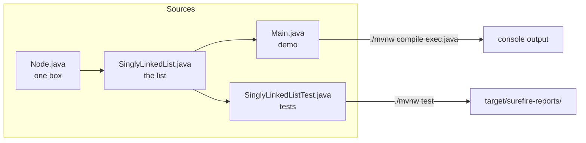

Source files:
[`Node.java`](src/main/java/org/jk/dsa/learning/Node.java) ·
[`SinglyLinkedList.java`](src/main/java/org/jk/dsa/learning/SinglyLinkedList.java) ·
[`Main.java`](src/main/java/org/jk/dsa/learning/Main.java) ·
[`SinglyLinkedListTest.java`](src/test/java/org/jk/dsa/learning/SinglyLinkedListTest.java)

---

## 2. What is a singly linked list?

An **array** stores its elements next to each other in memory, so it can jump
straight to element 7. A **linked list** does not: it stores each element in its
own little object called a **node**, and every node holds an arrow (a reference)
to the next node. The only way to reach element 7 is to start at the front and
follow six arrows.

Each node is [`Node.java`](src/main/java/org/jk/dsa/learning/Node.java) and has
exactly two fields:

* `value` — the data ([`Node.java#L43`](src/main/java/org/jk/dsa/learning/Node.java#L43))
* `next` — the arrow to the following node, or `null` at the end
  ([`Node.java#L46`](src/main/java/org/jk/dsa/learning/Node.java#L46))

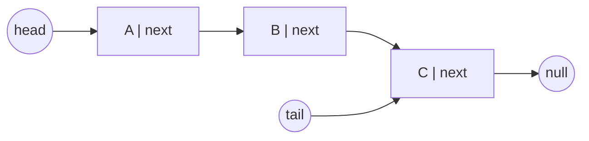

The list itself
([`SinglyLinkedList`](src/main/java/org/jk/dsa/learning/SinglyLinkedList.java#L71))
only remembers three things:

| Field | Line | Why it exists |
| --- | --- | --- |
| `head` | [L59](src/main/java/org/jk/dsa/learning/SinglyLinkedList.java#L74) | the entrance to the chain; without it the whole list is lost |
| `tail` | [L62](src/main/java/org/jk/dsa/learning/SinglyLinkedList.java#L77) | lets `addLast` be O(1) instead of O(n) |
| `size` | [L65](src/main/java/org/jk/dsa/learning/SinglyLinkedList.java#L80) | lets `size()` be O(1) instead of counting nodes |

> **The rule that causes 90% of linked-list bugs:** *every* method that changes
> the shape of the list must leave `head`, `tail` **and** `size` correct. The
> test [`sliceAtTailFixesTail`](src/test/java/org/jk/dsa/learning/SinglyLinkedListTest.java#L62)
> exists precisely to catch a `reverseBetween()` that forgets `tail`.

**Singly** means each node knows only its *successor*. It has no arrow back to
its predecessor. That is why `removeLast()` is slow — see
[section 5.7](#57-removelast--on).

---

## 3. Why generics?

Look at the class declaration
([L56](src/main/java/org/jk/dsa/learning/SinglyLinkedList.java#L71)):

```java
public class SinglyLinkedList<T> implements Iterable<T> {
```

`<T>` is a **type parameter** — a placeholder that you fill in when you create
the list. One class then serves every element type:

```java
SinglyLinkedList<String>  names   = new SinglyLinkedList<>();
SinglyLinkedList<Integer> numbers = new SinglyLinkedList<>();
SinglyLinkedList<Student> class10 = new SinglyLinkedList<>();  // your own type!
```

Two things you get for free:

1. **Compile-time safety.** `names.addLast(42)` will not compile. Without
   generics the list would store `Object` and that mistake would only blow up at
   runtime.
2. **No casting.** `String s = names.get(0);` just works — see the test
   [`retrievedElementsAreTyped`](src/test/java/org/jk/dsa/learning/SinglyLinkedListTest.java#L219).

Demo 5 in [`Main.demoCustomType()`](src/main/java/org/jk/dsa/learning/Main.java#L109)
puts a `Student` class into the very same list to prove the point. `Student` is
written with **Lombok** — see [section 7.7](#77-lombok-annotation-processing) —
while the `Point` and `Book` types in the tests show the two alternatives, a
plain `record` and a Lombok `@Data` bean.

> **Small print (worth knowing):** Java generics use *type erasure*. At runtime
> the JVM only sees `Object`; the type checks happen at compile time. That is why
> the factory method
> [`of(E... values)`](src/main/java/org/jk/dsa/learning/SinglyLinkedList.java#L105)
> is annotated `@SafeVarargs` — it promises the compiler we do not abuse the
> generic array it creates for the varargs.

---

## 4. The star operation: `reverseBetween(from, to)`

### 4.1 The problem

Reverse **only a slice** of the list, and leave everything outside it exactly
where it was.

```
before:   A → B → C → D → E          reverseBetween(1, 3)
               ↑         ↑
             from        to

after:    A → D → C → B → E
```

`A` and `E` never move. Only `B C D` flip.

> **A note on indexing.** This class is **zero-based** and `to` is **inclusive**,
> to match [`get(int)`](src/main/java/org/jk/dsa/learning/SinglyLinkedList.java#L154)
> and [`insertAt`](src/main/java/org/jk/dsa/learning/SinglyLinkedList.java#L295).
> The classic textbook/interview version of this problem numbers positions from
> **one**. The algorithm is identical; only the arithmetic on the bounds changes.

### 4.2 Why it is harder than reversing everything

A whole-list reversal owns the entire chain, so it only has to swap `head` and
`tail` at the end. A slice reversal has to **cut a segment out, flip it, and
stitch it back in** — and there are two connection points that must both be
right:


The loop in the middle is *exactly* the three-pointer reversal. Everything else
is bookkeeping — and the bookkeeping is the whole lesson.

### 4.3 The four phases

| Phase | What it does | Line |
| --- | --- | --- |
| Sentinel | put a throwaway node in front of the list | [L489](src/main/java/org/jk/dsa/learning/SinglyLinkedList.java#L489) |
| 1. Walk | find the node **before** the slice | [L492-L495](src/main/java/org/jk/dsa/learning/SinglyLinkedList.java#L492-L495) |
| 2. Remember | save the slice's first node — it becomes the **last** | [L500](src/main/java/org/jk/dsa/learning/SinglyLinkedList.java#L500) |
| 3. Flip | the ordinary reversal loop, run a **fixed** number of times | [L506-L511](src/main/java/org/jk/dsa/learning/SinglyLinkedList.java#L506-L511) |
| 4. Stitch | re-attach both ends, then repair `head`/`tail` | [L516-L523](src/main/java/org/jk/dsa/learning/SinglyLinkedList.java#L516-L523) |

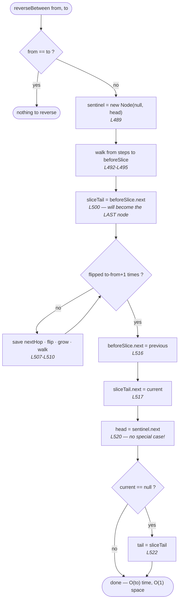

### 4.4 The sentinel trick

Phase 1 has one awkward case. When `from == 0` there **is no node before the
slice**, so `beforeSlice` would be `null` and the list's `head` itself has to
change.

Instead of writing an `if` for it, we put a temporary throwaway node — a
**sentinel**, also called a *dummy head* — in front of the list
([L489](src/main/java/org/jk/dsa/learning/SinglyLinkedList.java#L489)):

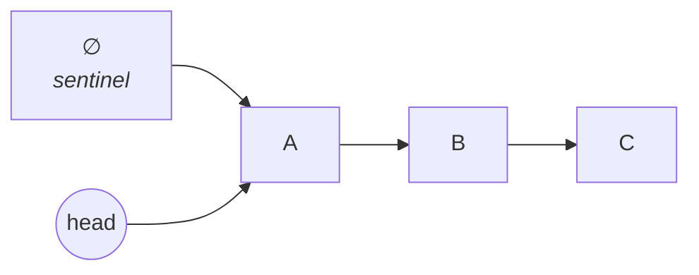

Now "the node before the slice" always exists, even for index 0. At the end we
just read the real head back out
([L520](src/main/java/org/jk/dsa/learning/SinglyLinkedList.java#L520)):

```java
head = sentinel.next;   // correct whether or not from == 0
```

and drop the sentinel. It was only ever a local variable, so it costs one object
and disappears the moment the method returns — still **O(1) space**.

**See the difference for yourself.**
[`reverseBetweenWithoutSentinel`](src/main/java/org/jk/dsa/learning/SinglyLinkedList.java#L543)
is the identical algorithm written the hard way. Compare them:

| | with sentinel | without |
| --- | --- | --- |
| find `beforeSlice` | one loop | `if (from > 0)` **plus** a loop that runs `from - 1` times |
| find `sliceTail` | `beforeSlice.next` | a ternary on whether `beforeSlice` is null |
| re-attach the front | `beforeSlice.next = previous` | `if (beforeSlice == null) head = … else …` |

Two extra branches, both of which exist *only* because there was nothing in
front of the list. Those branches are where the bugs live.

### 4.5 Why `sliceTail` must be saved

This is the second thing people get wrong. The node that **starts** the slice is
the node that will **end** it — so it is the one that must point at whatever
follows the slice:

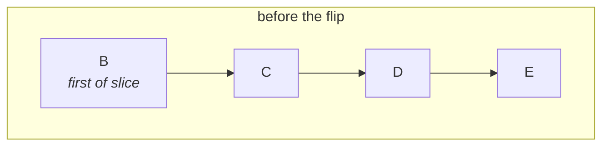

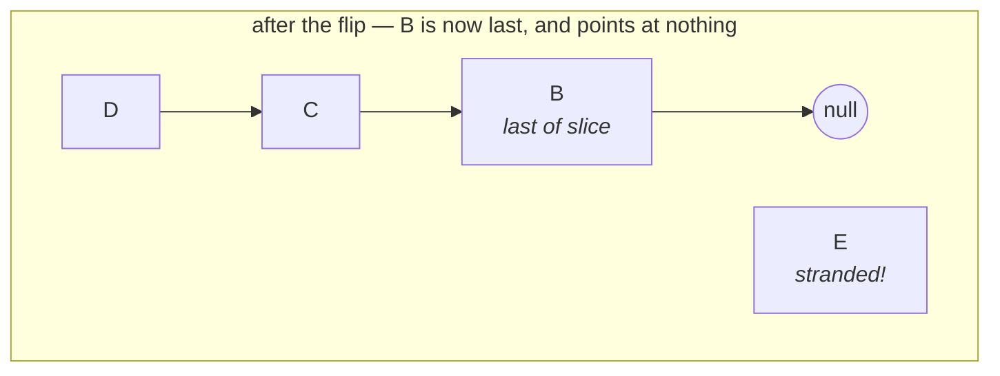

If you have not kept a handle on `B`, you cannot re-attach `E` and the tail of
the list is lost. Saving it at
[L500](src/main/java/org/jk/dsa/learning/SinglyLinkedList.java#L500), *before*
the loop runs, is what prevents that.

### 4.6 The loop is the same loop

Put the two side by side. This is the reversal you already know:

```java
Node<T> previous = null;                        // L504
Node<T> current  = sliceTail;                   // L505
for (int i = 0; i <= to - from; i++) {          // L506  <- runs a FIXED number of times
    Node<T> nextHop = current.next;             // L507  save the rest
    current.next    = previous;                 // L508  flip the arrow
    previous        = current;                  // L509  grow the reversed part
    current         = nextHop;                  // L510  walk forward
}
```

The *only* difference from a whole-list reversal is the loop condition: a
counter instead of `while (current != null)`. That is why
[`reverse()`](src/main/java/org/jk/dsa/learning/SinglyLinkedList.java#L592) in
this class is a one-liner — reversing everything is just the slice
`[0, size-1]`:

```java
public void reverse() {
    if (size > 1) {
        reverseBetween(0, size - 1);
    }
}
```

### 4.7 Complexity

**Time: O(to)** — one walk of `from` steps to reach the slice, then one pass of
`to - from + 1` flips. Added together that is at most a single pass over the
list, so **O(n)** in the worst case.

**Space: O(1)** — five reference variables and one sentinel node, no matter how
long the list or the slice is. Nothing is copied.

### 4.8 The edge cases

These four are what the tests hammer, and what a naive implementation gets wrong:

| Case | Why it is tricky | Test |
| --- | --- | --- |
| `from == 0` | `head` must change; there is no node before the slice | [`sliceAtHeadMovesHead`](src/test/java/org/jk/dsa/learning/SinglyLinkedListTest.java#L51) |
| `to == size-1` | `tail` must change, or the next `addLast` corrupts the list | [`sliceAtTailFixesTail`](src/test/java/org/jk/dsa/learning/SinglyLinkedListTest.java#L63) |
| `from == to` | a one-node slice — must be a no-op, not a crash | [`singleNodeSliceIsANoOp`](src/test/java/org/jk/dsa/learning/SinglyLinkedListTest.java#L40) |
| the whole range | must equal a plain `reverse()` | [`wholeRangeIsAPlainReverse`](src/test/java/org/jk/dsa/learning/SinglyLinkedListTest.java#L76) |

The test [`everySliceMatchesAReferenceImplementation`](src/test/java/org/jk/dsa/learning/SinglyLinkedListTest.java#L169)
goes further: for list sizes 1, 2, 3, 5 and 8 it tries **every possible
`(from, to)` pair** and compares against an obviously-correct implementation
built with `java.util.Collections.reverse`. That is 100+ slices checked
automatically, which is far more convincing than a handful of hand-written
examples.

### 4.9 Watch it move: `docs/animation.html`

Open [`docs/animation.html`](docs/animation.html) in any browser — no server, no
build step, just double-click it. Type any `from,to` into the box on the left
and step through with `←` / `→`. The sentinel appears as a dashed box in front
of the list, the slice is highlighted with a blue band, and the source panel
underneath highlights the exact line executing.

You can deep-link to a single moment as `animation.html#<operation>:<step>`:

| Link | What you see |
| --- | --- |
| [`#reverseBetween:8`](docs/animation.html#reverseBetween:8) | the sentinel being created |
| [`#reverseBetween:12`](docs/animation.html#reverseBetween:12) | `sliceTail` being saved — the key bookkeeping step |
| [`#reverseBetween:24`](docs/animation.html#reverseBetween:24) | mid-flip, backwards arrows inside the slice band |
| [`#reverseBetween:31`](docs/animation.html#reverseBetween:31) | the two stitches re-attaching the slice |
| [`#reverseBetweenWithoutSentinel:6`](docs/animation.html#reverseBetweenWithoutSentinel:6) | the special case the sentinel removes |

### 4.10 Prefer to be talked through it? Watch the video

[`videos/linkedlist-reverse-between-explained.mp4`](demo-videos/linkedlist-reverse-between-explained.mp4)
is a narrated, 14-minute walkthrough of this whole page. It opens with a
plain-language introduction to linked lists and to the problem, so it works even
if you have never met either before.
[`linkedlist-reverse-between-explained.txt`](demo-videos/linkedlist-reverse-between-explained.txt)
holds a ready-made description with chapter timestamps if you want to upload it.

| Chapter | Starts | Covers |
| --- | --- | --- |
| — | 00:00 | what a linked list is, and how it differs from an array |
| 1 | 01:16 | **the problem** — what reverse-between actually asks for |
| 2 | 02:20 | meeting the list, and the animation's panels |
| 3 | 03:43 | **the algorithm, step by step** — the core of the video |
| 4 | 08:16 | what the sentinel actually saves |
| 5 | 09:32 | the four edge cases |
| 6 | 10:11 | the rest of the list operations |
| 7 | 11:34 | why the list is generic |
| 8 | 11:58 | running, testing and debugging it |

It is 1920×1080, H.264/AAC, so it plays anywhere and uploads to YouTube as is.

---

## 5. Every operation, explained with diagrams

### 5.1 `addFirst(value)` — O(1)
[Code → L238](src/main/java/org/jk/dsa/learning/SinglyLinkedList.java#L253)

Make a node, point it at the old head, call it the new head. If the list was
empty, it is also the new tail.

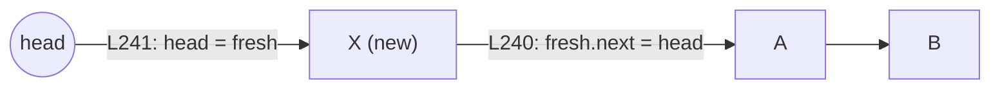

### 5.2 `addLast(value)` — O(1)
[Code → L257](src/main/java/org/jk/dsa/learning/SinglyLinkedList.java#L272)

Because we cache `tail`, appending needs no walk at all.

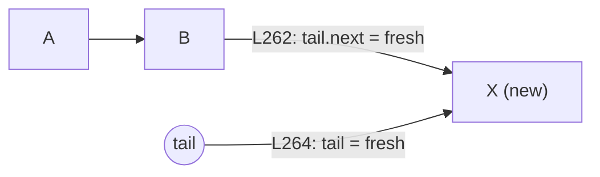

### 5.3 `insertAt(index, value)` — O(index)
[Code → L280](src/main/java/org/jk/dsa/learning/SinglyLinkedList.java#L295)

Walk to the node *before* the target slot, then re-hook two arrows. Index `0`
delegates to `addFirst`, index `size` to `addLast`.

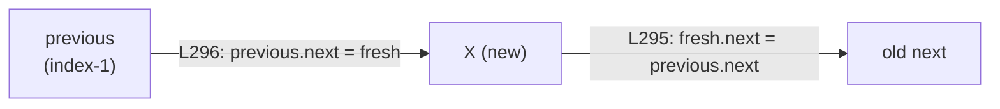

### 5.4 `get(index)` / `set(index, value)` — O(index)
[get → L139](src/main/java/org/jk/dsa/learning/SinglyLinkedList.java#L154) ·
[set → L153](src/main/java/org/jk/dsa/learning/SinglyLinkedList.java#L168) ·
[walker → nodeAt, L608](src/main/java/org/jk/dsa/learning/SinglyLinkedList.java#L730)

There is no random access. `nodeAt` starts at `head` and follows `index` arrows.
This is the single biggest practical difference from `ArrayList`.

### 5.5 `indexOf(value)` / `contains(value)` — O(n)
[indexOf → L200](src/main/java/org/jk/dsa/learning/SinglyLinkedList.java#L215) ·
[contains → L219](src/main/java/org/jk/dsa/learning/SinglyLinkedList.java#L234)

Uses `Objects.equals(a, b)` rather than `a.equals(b)` so that `null` elements do
not cause a `NullPointerException` — see
[`indexOfAndContainsHandleNulls`](src/test/java/org/jk/dsa/learning/SinglyLinkedListTest.java#L388).

### 5.6 `removeFirst()` — O(1)
[Code → L312](src/main/java/org/jk/dsa/learning/SinglyLinkedList.java#L327)

Move `head` one step forward and unlink the old node so the garbage collector
can reclaim it (line
[L316](src/main/java/org/jk/dsa/learning/SinglyLinkedList.java#L331)).

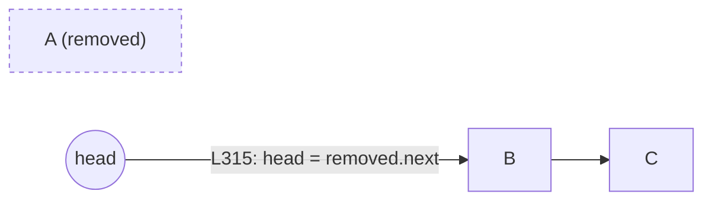

### 5.7 `removeLast()` — O(n)
[Code → L337](src/main/java/org/jk/dsa/learning/SinglyLinkedList.java#L352)

**This is the operation a singly linked list is bad at.** A node has no arrow
back to its predecessor, so to delete the tail we must walk from `head` to the
*second-last* node (loop at
[L343](src/main/java/org/jk/dsa/learning/SinglyLinkedList.java#L358)). A
*doubly* linked list does this in O(1) — that is its whole reason for existing.

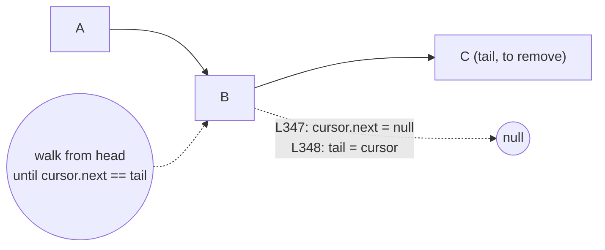

### 5.8 `removeAt(index)` / `remove(value)` — O(index) / O(n)
[removeAt → L362](src/main/java/org/jk/dsa/learning/SinglyLinkedList.java#L377) ·
[remove → L386](src/main/java/org/jk/dsa/learning/SinglyLinkedList.java#L401)

Walk to `index - 1`, then skip over the doomed node. Note the `tail` fix-up at
[L370](src/main/java/org/jk/dsa/learning/SinglyLinkedList.java#L385) for when the
removed node was the last one.

### 5.9 `clear()` — O(1)
[Code → L403](src/main/java/org/jk/dsa/learning/SinglyLinkedList.java#L418)

Dropping `head` and `tail` is enough: nothing references the chain any more, so
the whole thing becomes garbage. No loop needed.

### 5.10 `iterator()` and `toString()` / `toList()`
[iterator → L557](src/main/java/org/jk/dsa/learning/SinglyLinkedList.java#L679) ·
[toString → L587](src/main/java/org/jk/dsa/learning/SinglyLinkedList.java#L709) ·
[toList → L537](src/main/java/org/jk/dsa/learning/SinglyLinkedList.java#L659)

Implementing `Iterable<T>` is what lets you write
`for (String s : list) { ... }`. The iterator holds a single cursor and follows
`next` arrows — O(1) memory. `toString()` renders `[A -> B -> C]`, which makes
`System.out.println(list)` genuinely useful while studying.

---

## 6. Complexity summary

| Operation | Time | Space | Why |
| --- | --- | --- | --- |
| [`addFirst`](src/main/java/org/jk/dsa/learning/SinglyLinkedList.java#L253) | O(1) | O(1) | only touches `head` |
| [`addLast`](src/main/java/org/jk/dsa/learning/SinglyLinkedList.java#L272) | O(1) | O(1) | only because we cache `tail` |
| [`insertAt(i)`](src/main/java/org/jk/dsa/learning/SinglyLinkedList.java#L295) | O(i) | O(1) | walk to `i-1` |
| [`get`/`set(i)`](src/main/java/org/jk/dsa/learning/SinglyLinkedList.java#L154) | O(i) | O(1) | no random access |
| [`indexOf`/`contains`](src/main/java/org/jk/dsa/learning/SinglyLinkedList.java#L215) | O(n) | O(1) | linear scan |
| [`removeFirst`](src/main/java/org/jk/dsa/learning/SinglyLinkedList.java#L327) | O(1) | O(1) | move `head` |
| [`removeLast`](src/main/java/org/jk/dsa/learning/SinglyLinkedList.java#L352) | O(n) | O(1) | no back-arrows |
| [`removeAt(i)`](src/main/java/org/jk/dsa/learning/SinglyLinkedList.java#L377) | O(i) | O(1) | walk to `i-1` |
| [`clear`](src/main/java/org/jk/dsa/learning/SinglyLinkedList.java#L418) | O(1) | O(1) | drop the references |
| **[`reverseBetween(f,t)`](src/main/java/org/jk/dsa/learning/SinglyLinkedList.java#L481)** | **O(t)** | **O(1)** | walk to the slice, then one pass over it |
| [`reverseBetweenWithoutSentinel`](src/main/java/org/jk/dsa/learning/SinglyLinkedList.java#L543) | O(t) | O(1) | same, with two extra branches |
| [`reverse()`](src/main/java/org/jk/dsa/learning/SinglyLinkedList.java#L592) | O(n) | O(1) | the slice `[0, size-1]` |
| [`reversedBetweenCopy`](src/main/java/org/jk/dsa/learning/SinglyLinkedList.java#L611) | O(n) | O(n) | allocates n new nodes |
| [`toList`/`toString`](src/main/java/org/jk/dsa/learning/SinglyLinkedList.java#L659) | O(n) | O(n) | builds a new object |

**Reading Big-O:** it describes how the cost grows as the list grows, ignoring
constants. O(1) = same cost no matter the size. O(n) = double the list, double
the work. "Space" here means *extra* memory beyond the list itself — which is
why in-place `reverseBetween()` is O(1) space even though the list holds n
nodes — the one sentinel node it allocates does not grow with the input.

---

## 7. How Maven works (and how to build this project)

### 7.1 What Maven is

Maven is a **build tool**. It automates the boring steps: find the sources,
download libraries, compile, run tests, package a jar. Its guiding idea is
**convention over configuration** — if you put your files where Maven expects
them, you barely have to configure anything. That is why `src/main/java` and
`src/test/java` are not arbitrary: they are *the* convention, and following it
is what keeps [`pom.xml`](pom.xml) short.

### 7.2 The wrapper — why you do **not** install Maven

The files `mvnw` (macOS/Linux), `mvnw.cmd` (Windows) and `.mvn/wrapper/` are the
**Maven Wrapper**. The first time you run `./mvnw`, it reads
[`maven-wrapper.properties`](.mvn/wrapper/maven-wrapper.properties), downloads
exactly that Maven version, caches it in `~/.m2/wrapper`, and uses it. Everyone
who clones the project therefore builds with the *identical* Maven version, even
if they have no Maven installed at all.

> **Always type `./mvnw`, never `mvn`.** On Windows use `mvnw.cmd`.
> If you get `permission denied` on macOS/Linux, run `chmod +x mvnw` once.

Downloaded libraries go to `~/.m2/repository`, your **local repository**. It is
shared by every Maven project on your machine, which is why the second project
you ever build is much faster than the first.

### 7.3 Reading `pom.xml`

`pom.xml` stands for **P**roject **O**bject **M**odel, and it is the entire
build. Open [`pom.xml`](pom.xml) and match it to this table:

| Block | What it does |
| --- | --- |
| `<groupId>` / `<artifactId>` / `<version>` | the **coordinates** that name this project — the same three things you use to depend on any library |
| `<packaging>jar</packaging>` | build a jar (the default) |
| `<maven.compiler.release>21</...>` | compile for **Java 21**, and check we use no newer APIs |
| `<project.build.sourceEncoding>` | UTF-8, so the build is identical on every machine |
| `<dependencies>` | the libraries we need: JUnit 5 and Lombok |
| `<scope>test</scope>` | JUnit is visible **only** to `src/test/java` and never shipped |
| `<scope>provided</scope>` | Lombok is needed to compile but not at runtime (section 7.7) |
| `maven-compiler-plugin` | compiles, and switches Lombok on via `annotationProcessorPaths` |
| `maven-surefire-plugin` | runs the JUnit 5 tests |
| `exec-maven-plugin` | gives us `exec:java`, because Maven has no built-in "run my main class" |

**Dependency scopes** are the concept most worth learning here:

| Scope | Available when compiling `main` | Available in tests | Shipped in the jar |
| --- | --- | --- | --- |
| `compile` (default) | yes | yes | **yes** |
| `provided` | yes | yes | no |
| `test` | **no** | yes | no |

Getting these wrong is a classic beginner mistake: leave the scope off JUnit and
your test framework ends up inside your production jar.

### 7.4 The build lifecycle — phases, not tasks

This is the biggest difference from other build tools. Maven has a fixed,
ordered list of **phases**. You name a phase, and Maven runs that phase *and
every phase before it*. You never ask for one isolated step.

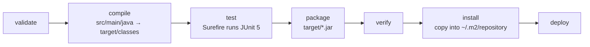

So `./mvnw test` **also** compiles, and `./mvnw package` **also** compiles and
tests. `clean` belongs to a separate lifecycle, which is why you often see the
two combined as `./mvnw clean package`.

Useful commands (run them from this project folder):

```bash
./mvnw compile                      # compile the main sources
./mvnw test                         # compile + run the tests
./mvnw package                      # compile + test + build the jar
./mvnw clean                        # delete the target/ folder
./mvnw clean package                # the "when in doubt" command
./mvnw compile exec:java            # run the demo
./mvnw compile exec:exec@show-generated   # print what Lombok generated (7.7)
./mvnw dependency:tree              # show every library and why it is here
./mvnw help:effective-pom           # your pom PLUS everything Maven defaults
```

The last two are genuinely useful when learning: `dependency:tree` explains
where a library came from, and `effective-pom` reveals just how much Maven is
doing for you that is not written in your file.

> **Phases vs goals.** `test` is a *phase*. `exec:java` is a *goal* —
> `plugin:goal` — which you can invoke directly without running a lifecycle.
> That is why the demo command is `compile exec:java`: a phase to build the
> classes, then a goal to run them.

### 7.5 Where the output goes

Everything Maven produces lands in `target/` (which is git-ignored):

```
target/
├── classes/…                       compiled .class files
├── test-classes/…                  compiled test classes
├── linkedlist-reverse-between-1.0-SNAPSHOT.jar
├── surefire-reports/*.txt          human-readable test results
└── surefire-reports/*.xml          machine-readable results
```

Maven does not write an HTML test report by default. If you want one:

```bash
./mvnw surefire-report:report       # then open target/reports/surefire.html
```

### 7.6 Rebuilds

Maven is far less clever about skipping work than some tools: `./mvnw test`
generally re-runs your tests every time, which is simple and predictable. It
does skip *recompiling* files that have not changed. When anything looks stale
or inexplicable, `./mvnw clean package` gives you a guaranteed-fresh build.

### 7.7 Lombok (annotation processing)

**What it is.** [Lombok](https://projectlombok.org) is an *annotation
processor*: a plugin that runs **inside the Java compiler** and writes ordinary
Java code for you. You annotate a class, and the generated constructors,
getters, `equals`, `hashCode` and `toString` appear in the compiled `.class`
file. This is the single most important thing to understand about it:

> **The code you read is not the code that runs.** There is no `getName()`
> anywhere in `Main.java`, but there is one in `Main$Student.class`.

**Seeing it with your own eyes.** Do not take that on faith — run:

```bash
./mvnw compile exec:exec@show-generated
```

which uses the JDK's own `javap` tool to list what is really in the class files:

```
final class org.jk.dsa.learning.Node<T> {
  T value;
  org.jk.dsa.learning.Node<T> next;
  org.jk.dsa.learning.Node(T);                              ← written by hand
  public org.jk.dsa.learning.Node(T, Node<T>);              ← @AllArgsConstructor
  public java.lang.String toString();                       ← @ToString
}
class org.jk.dsa.learning.Main$Student {
  private java.lang.String name;
  private int marks;
  public java.lang.String toString();                       ← written by hand
  public java.lang.String getName();                        ← @Getter
  public int getMarks();                                    ← @Getter
  public void setName(java.lang.String);                    ← @Setter
  public void setMarks(int);                                ← @Setter
  public Main$Student(java.lang.String, int);               ← @AllArgsConstructor
}
```

**How it is wired up.** Two places in [`pom.xml`](pom.xml), and **both** are
required:

| Where | Why |
| --- | --- |
| the `<dependency>` with `<scope>provided</scope>` | puts the Lombok jar on the **compile** classpath, but keeps it out of the finished jar — Maven's equivalent of "compile only" |
| `<annotationProcessorPaths>` inside `maven-compiler-plugin` | what actually **switches the generation on** |

Unlike some build tools, Maven needs no separate test-side wiring: the same
compiler plugin configuration applies to `src/test/java`, which is why the
`Book` class in the tests compiles too.

> **The classic beginner error:** declaring the dependency and forgetting
> `<annotationProcessorPaths>`. Everything looks right, but nothing is generated
> and you get a wall of `cannot find symbol: method getName()`.
>
> A second, subtler trap: if you *also* leave the dependency at the default
> `compile` scope, Lombok gets packaged into your jar and shipped to users who
> have no use for it.

[`lombok.config`](lombok.config) then controls *how* it generates:
`config.stopBubbling = true` keeps the project self-contained, and
`lombok.addLombokGeneratedAnnotation = true` marks generated methods so coverage
tools skip code you did not write.

**Where this project uses it — and where it deliberately does not.**

| File | Lombok? | Why |
| --- | --- | --- |
| [`Node.java`](src/main/java/org/jk/dsa/learning/Node.java) | `@AllArgsConstructor`, `@ToString(of = "value")` | removes a constructor body and a `toString` |
| [`Main.Student`](src/main/java/org/jk/dsa/learning/Main.java#L216) | `@Getter @Setter @AllArgsConstructor` | a realistic mutable bean |
| `Book` in the tests | `@Data` | one annotation for getters, setters, `equals`, `hashCode`, `toString` |
| [`SinglyLinkedList.java`](src/main/java/org/jk/dsa/learning/SinglyLinkedList.java) | **none** | this is the code you are here to study. Every assignment stays visible, because the diagrams, the animation and the debugger all step through these exact lines. |

**A trap worth learning from.** `Node` is annotated
`@ToString(of = "value")`, not a plain `@ToString`. A plain one would include
the `next` field, whose `toString` prints *its* `next`, and so on — one debugger
hover would render the entire list, or loop forever if the chain ever contains a
cycle. Excluding the link field is the standard fix for linked structures, and
the test `nodeToStringDoesNotFollowTheChain` locks the behaviour in.

**The honest trade-off.** Lombok removes real boilerplate from domain classes,
which is why it is everywhere in Spring codebases. The cost is that your source
is no longer the whole truth: the debugger steps into methods that do not exist
in the file, and your IDE needs a plugin before it stops showing red squiggles
on code that compiles perfectly. For a *data-structure* class, where reading
every line is the entire point, plain Java wins — which is exactly why
`SinglyLinkedList` has no annotations on it.

---

## 8. How to run the demo

From this folder:

```bash
# macOS / Linux
./mvnw compile exec:java

# Windows (Command Prompt or PowerShell)
mvnw.cmd compile exec:java
```

Remember from [section 7.4](#74-the-build-lifecycle--phases-not-tasks) why there
are two words: `compile` is a lifecycle *phase* that produces the class files,
and `exec:java` is a plugin *goal* that runs them.

Add `-q` (quiet) to hide Maven's own chatter and see only the program output:

```bash
./mvnw -q compile exec:java
```

The demo lives in [`Main.java`](src/main/java/org/jk/dsa/learning/Main.java) and
prints seven sections. Expected output (abridged):

```
======================================================================
1. Reversing just the middle of the list
======================================================================
before                : [A -> B -> C -> D -> E]
reverseBetween(1, 3)  : [A -> D -> C -> B -> E]
A and E never moved. Only the slice B C D was flipped.

...

======================================================================
6. Step-by-step trace of reverseBetween(1, 3) on A B C D E
======================================================================
beforeSlice = A   (the node that must point at the new first node)
sliceTail   = B   (starts the slice, so it will END the slice)

flip 1   previous=B    current=C    reversed slice=B -> null
flip 2   previous=C    current=D    reversed slice=C -> B -> null
flip 3   previous=D    current=E    reversed slice=D -> C -> B -> null

stitch  beforeSlice(A) -> D
stitch  sliceTail(B) -> E
result  A -> D -> C -> B -> E -> null
```

Section 2 prints **every** slice of `A B C D E`, which is the quickest way to
convince yourself the bounds are right. Compare the trace above with the flip
loop at
[`SinglyLinkedList.java#L506-L511`](src/main/java/org/jk/dsa/learning/SinglyLinkedList.java#L506-L511)
and the two stitches at
[`L516-L517`](src/main/java/org/jk/dsa/learning/SinglyLinkedList.java#L516-L517)
— it is the same four steps, plus the bookkeeping.

### Running the jar directly (optional)

```bash
./mvnw package
java -cp target/classes org.jk.dsa.learning.Main
```

The jar Maven builds (`target/linkedlist-reverse-between-1.0-SNAPSHOT.jar`) has
no `Main-Class` entry, so `java -jar` will not work on it. Adding one is a job
for `maven-jar-plugin` — a good exercise once you are comfortable with the pom.

---

## 9. How to run the tests

```bash
./mvnw test
```

Surefire prints one summary line per test class, and a total at the end:

```
[INFO] Tests run: 19, Failures: 0, Errors: 0, Skipped: 0 -- in ...SinglyLinkedListTest$ReverseBetween
[INFO] Tests run:  6, Failures: 0, Errors: 0, Skipped: 0 -- in ...SinglyLinkedListTest$WithoutSentinel
[INFO] Tests run:  8, Failures: 0, Errors: 0, Skipped: 0 -- in ...SinglyLinkedListTest$Removals
...
[INFO] Tests run: 52, Failures: 0, Errors: 0, Skipped: 0
[INFO] BUILD SUCCESS
```

Per-test detail is written to `target/surefire-reports/` — a `.txt` file per
test class (readable) and a `.xml` file (for tools). For a browsable HTML
report, run `./mvnw surefire-report:report`.

### Running just some tests

```bash
# one test method
./mvnw test -Dtest='SinglyLinkedListTest$ReverseBetween#reversesOnlyTheSlice'

# one nested group (the $ separates the outer class from the @Nested class)
./mvnw test -Dtest='SinglyLinkedListTest$ReverseBetween'

# several at once, comma-separated
./mvnw test -Dtest='SinglyLinkedListTest$ReverseBetween,SinglyLinkedListTest$WithoutSentinel'
```

**Quote the argument.** In bash and zsh an unquoted `$ReverseBetween` is read as
an empty shell variable, and Surefire then reports "No tests were executed".

### How a test is written

Every test in
[`SinglyLinkedListTest.java`](src/test/java/org/jk/dsa/learning/SinglyLinkedListTest.java)
follows **arrange → act → assert**:

```java
@Test
@DisplayName("reverses only the middle slice, leaving the ends alone")
void reversesOnlyTheSlice() {
    SinglyLinkedList<String> list =
            SinglyLinkedList.of("A", "B", "C", "D", "E");        // arrange
    list.reverseBetween(1, 3);                                   // act
    assertEquals(List.of("A", "D", "C", "B", "E"), list.toList()); // assert
}
```

JUnit 5 pieces used here:

| Annotation / method | Meaning |
| --- | --- |
| `@Test` | this method is a test |
| `@DisplayName` | a readable name for the report |
| `@Nested` | groups related tests (see the `Reverse`, `Removals`, … inner classes) |
| `@ParameterizedTest` + `@ValueSource` | runs the *same* test for list sizes 1, 2, 3, 5 and 8 — and inside each, **every** `(from, to)` pair. See [L169](src/test/java/org/jk/dsa/learning/SinglyLinkedListTest.java#L169) |
| `assertEquals(expected, actual)` | fails if they differ (**expected comes first**) |
| `assertThrows(Type.class, () -> …)` | fails unless that exception is thrown |

### Prove the tests actually test something

Open
[`SinglyLinkedList.java#L522`](src/main/java/org/jk/dsa/learning/SinglyLinkedList.java#L522)
and delete `tail = sliceTail;`. Run `./mvnw test`. You should see
`sliceAtTailFixesTail` fail — the list still *prints* correctly, but the next
`addLast` appends to the wrong node. Put the line back.

Then try a second one: delete the sentinel at
[L489](src/main/java/org/jk/dsa/learning/SinglyLinkedList.java#L489) and start
the walk from `head` instead. Every slice with `from > 0` still works; only
`from == 0` breaks. **Do both once — it is the fastest way to understand why the
sentinel is there.**

---

## 10. How to debug the code

Debugging means pausing the program and inspecting variables. For a linked list
this is the best way to *see* the pointers move.

### 10.1 In IntelliJ IDEA (easiest)

1. **Open the project:** *File → Open* and select this folder (the one with
   `pom.xml`). IntelliJ detects Maven and imports it. Wait for the
   bottom progress bar to finish.
2. **Set a breakpoint:** open
   [`SinglyLinkedList.java`](src/main/java/org/jk/dsa/learning/SinglyLinkedList.java)
   and click in the left gutter next to **line 500**
   (`Node<T> sliceTail = beforeSlice.next;`). A red dot appears. That is the
   single most important line to watch.
3. **Start debugging:** open
   [`Main.java`](src/main/java/org/jk/dsa/learning/Main.java), right-click inside
   `main` → **Debug 'Main.main()'**.
4. **When it pauses**, look at the *Variables* pane. You will see `sentinel`,
   `beforeSlice` and `sliceTail`. Expand any of them to see `value` and `next` —
   you can literally unfold the whole chain, sentinel included.
5. **Step through** with these keys:
   * `F8` **Step Over** — run the current line, stay in this method
   * `F7` **Step Into** — jump inside the method being called
   * `Shift+F8` **Step Out** — finish this method and come back
   * `F9` **Resume** — run until the next breakpoint hit
6. Move the breakpoint into the flip loop (line 507) and press `F9` repeatedly.
   Watch `previous` grow while `current` walks to the end of the slice — and
   watch `beforeSlice` and `sliceTail` sit perfectly still, waiting to be
   stitched back. That is exactly the animation in
   [`docs/animation.html`](docs/animation.html).

**Debugging a test instead:** open
[`SinglyLinkedListTest.java`](src/test/java/org/jk/dsa/learning/SinglyLinkedListTest.java),
click the green arrow next to `reversesOnlyTheSlice` and choose **Debug**.
Tests are usually the nicest thing to debug because the setup is tiny.

> **Conditional breakpoints** are great for long lists: right-click the red dot
> and enter a condition such as `current.value.equals("C")`. Execution pauses
> only on that node.

### 10.2 In VS Code

1. Install the **Extension Pack for Java** (Microsoft).
2. Open this folder. Click the gutter to set a breakpoint at line 500.
3. Open `Main.java`; a **Run | Debug** CodeLens appears above `main`. Click
   **Debug**.
4. Use the floating toolbar: Step Over `F10`, Step Into `F11`, Continue `F5`.

### 10.3 From the command line (no IDE)

Maven can pause and wait for a debugger to attach on port 5005:

```bash
# debug the TESTS (Surefire has a dedicated switch for exactly this)
./mvnw test -Dmaven.surefire.debug

# debug the DEMO
./mvnw compile exec:exec -Dexec.executable=java \
  -Dexec.args="-agentlib:jdwp=transport=dt_socket,server=y,suspend=y,address=5005 \
               -cp target/classes org.jk.dsa.learning.Main"
```

Both print `Listening for transport dt_socket at address: 5005` and then wait.

In IntelliJ: *Run → Edit Configurations → + → Remote JVM Debug*, port `5005`,
then press Debug.

### 10.4 Poor-man's debugging: print statements

Perfectly legitimate while learning. Temporarily add a line inside the flip loop in
[`reverseBetween()`](src/main/java/org/jk/dsa/learning/SinglyLinkedList.java#L506):

```java
for (int i = 0; i <= to - from; i++) {
    System.out.println("i=" + i + " previous=" + previous + " current=" + current);
    ...
}
```

Then `./mvnw -q compile exec:java`. (This is exactly what
[`Main.demoSliceTrace()`](src/main/java/org/jk/dsa/learning/Main.java#L142)
does permanently, without polluting the data structure.)

### 10.5 Reading a failing test

```
expected: <[A, D, C, B, E]> but was: <[A, B, C, D, E]>
    at SinglyLinkedListTest.reversesOnlyTheSlice(SinglyLinkedListTest.java:43)
```

Read it as: *"at line 43 of the test, I wanted `[A, D, C, B, E]` and got the
unchanged list."*
Click the file:line in the console — IntelliJ and VS Code both make it a
hyperlink — then debug that test.

---

## 11. Exercises

Try these in order; each one has a test you can write yourself.

1. **Break it on purpose.** Delete `tail = sliceTail;` at
   [L522](src/main/java/org/jk/dsa/learning/SinglyLinkedList.java#L522), run the
   tests, and explain why the list still *prints* correctly.
2. **Remove the sentinel.** Rewrite `reverseBetween` to walk from `head`
   instead. Which tests fail, and why only those?
3. **One-based indexing.** Add `reverseBetweenOneBased(int m, int n)` that
   matches the classic interview statement. It should be a two-line wrapper — if
   it is longer, you are duplicating logic.
4. **`reverseKGroup(int k)`** — reverse *every* consecutive block of k nodes.
   This is `reverseBetween` in a loop; leftover nodes at the end stay put.
5. **`swapPairs()`** — swap every two adjacent nodes. That is `reverseKGroup`
   with k = 2, so write it in terms of #4 and check they agree.
6. **`rotateRight(int k)`** — move the last k nodes to the front. Hint: join the
   list into a ring, then break it in the right place.
7. **Use the sentinel everywhere else.** Refactor
   [`insertAt`](src/main/java/org/jk/dsa/learning/SinglyLinkedList.java#L295) and
   [`removeAt`](src/main/java/org/jk/dsa/learning/SinglyLinkedList.java#L377) to
   use a sentinel and watch their `index == 0` special cases disappear.
8. **Make it a doubly linked list** — add a `previous` field to
   [`Node`](src/main/java/org/jk/dsa/learning/Node.java) and see which parts of
   `reverseBetween` get easier, and which get *harder* (hint: you now have twice
   as many arrows to fix).

---

## 12. Troubleshooting

| Symptom | Fix |
| --- | --- |
| `zsh: permission denied: ./mvnw` | `chmod +x mvnw` |
| `mvn: command not found` | use `./mvnw`, not `mvn` — the wrapper needs no installed Maven |
| Downloads hang on first run | the wrapper is fetching Maven, JUnit and Lombok into `~/.m2`; you need internet **once**. After that it works offline (`-o`). |
| `invalid target release: 21` or `release version 21 not supported` | your JDK is older than 21. Maven uses whatever `JAVA_HOME` points at — install a JDK 21+ (e.g. Temurin) and set `JAVA_HOME`. Check with `./mvnw -version`. |
| `No tests were executed!` with `-Dtest=...` | your shell ate the `$`. Quote it: `-Dtest='SinglyLinkedListTest$ReverseBetween'`. |
| `StackOverflowError` in `reverseRecursive` | expected on very long lists — that is the O(n) space cost. Use `reverse()`. |
| Mermaid diagrams show as raw text | view this file on GitHub, or in an editor with a Mermaid preview plugin. |
| IDE shows red errors on `getName()` / `getTitle()` but `./mvnw package` succeeds | you are missing the **Lombok IDE plugin**. IntelliJ: it is bundled — just enable *Settings → Build → Compiler → Annotation Processors → Enable annotation processing*. VS Code: the Extension Pack for Java handles it after a *Java: Clean Language Server Workspace*. |
| `cannot find symbol: method getMarks()` from Maven | the `<annotationProcessorPaths>` block is missing from `pom.xml` — the Lombok dependency alone generates nothing (section 7.7) |
| Debugger steps into a constructor that is not in the file | that is Lombok-generated code. Run `./mvnw compile exec:exec@show-generated` to see what exists. |
| Weird, unexplainable build errors | `./mvnw clean package` |

---

## License / intent

Written for **demo and study purposes**. Read it, break it, fix it, and then
write it again from a blank file — that last step is where the learning happens.
