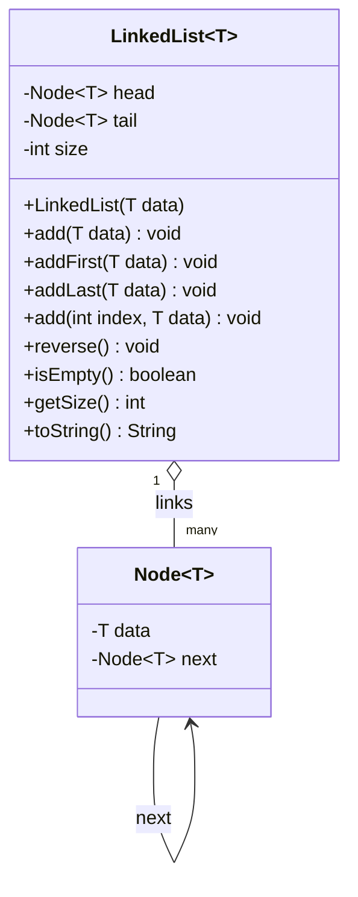
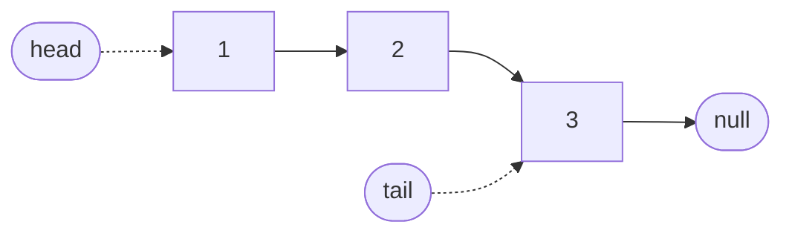
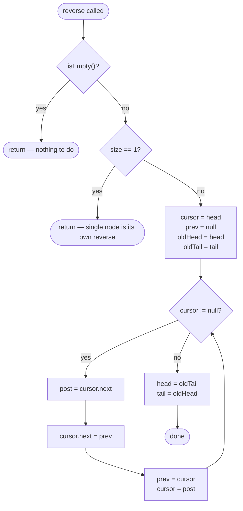
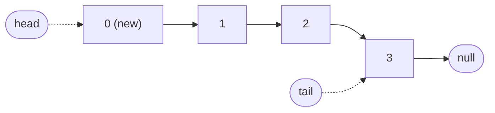
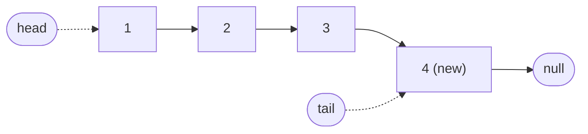
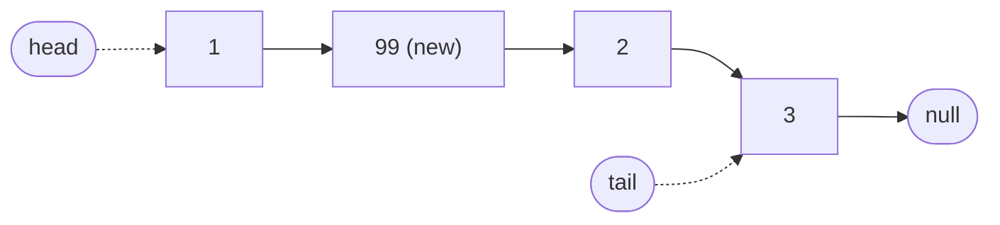

# 🔁 Singly Linked List — `reverse()` Deep Dive

Companion doc for
[`com.jk.explore.dsa.linkedlists.single.reverse.LinkedList`](../src/main/java/com/jk/explore/dsa/linkedlists/single/reverse/LinkedList.java).

For an interactive, step-by-step animation of everything on this page, open
[`linked-list-reverse-demo.html`](./linked-list-reverse-demo.html) in a browser.

---

## Quick demo script

A ~2-minute walkthrough if you're presenting this live.

1. Open `linked-list-reverse-demo.html` — starts on **Build & Modify** with the list `[1]`.
2. Click `+ addLast()` twice, then `+ addFirst()` once. Point out the code panel: it highlights whichever branch actually ran.
3. Click `+ add(middle, data)` once — the complexity line flips to `O(n)`, and the code panel highlights the traversal loop.
4. Switch to **Reverse Animation**, click `demo: 5 nodes`.
5. Press `→` a few times (keyboard shortcut) and call out `prev`, `cursor`, and the red "link being rewritten" arc.
6. Click `▶ play` to run it end-to-end, or `⏭` to jump straight to the final swapped `head`/`tail`.
7. For the *why*, switch to this doc's section 3 — the frame table matches exactly what just played.

---

## 1. Structure

A list of `[1, 2, 3]` before reversal:

---

## 2. Control flow of `reverse()`

This is the classic **iterative 3-pointer reversal**: `prev`, `cursor`, and a
saved `post` pointer walk the list once, flipping every `next` reference as
they go.

| Aspect | Value | Why |
|---|---|---|
| Time | **O(n)** | Each node is visited and relinked exactly once |
| Space | **O(1)** | Reversal happens in place with a fixed number of pointers — no extra list, stack, or recursion |

---

## 3. Frame-by-frame trace

Reversing `[1, 2, 3]`. The three nodes always sit in the same three
columns below (by their **original** position, not their list order) —
only each node's own `next` value changes, so you can watch one row
instead of re-reading a diagram that rearranges itself every frame.

`head` and `tail` don't move until the very last step, so they stay
pinned on node `1` and node `3` through Frames 0–3 — watch the bottom two
rows flip only in Frame 4.

**Frame 0 — before the loop starts**

`prev = null`, `cursor = 1`

| node | `1` | `2` | `3` |
|---|---|---|---|
| `next` | `2` | `3` | `null` |
| `head` | ✅ | | |
| `tail` | | | ✅ |

**Frame 1 — after processing node `1`**

`cursor.next = prev` rewired node `1`'s pointer. `prev = 1`, `cursor = 2`.

| node | `1` | `2` | `3` |
|---|---|---|---|
| `next` | `null` ⬅ changed | `3` | `null` |
| `head` | ✅ | | |
| `tail` | | | ✅ |

**Frame 2 — after processing node `2`**

`prev = 2`, `cursor = 3`.

| node | `1` | `2` | `3` |
|---|---|---|---|
| `next` | `null` | `1` ⬅ changed | `null` |
| `head` | ✅ | | |
| `tail` | | | ✅ |

**Frame 3 — after processing node `3` (loop exits, `cursor` is `null`)**

`prev = 3`, `cursor = null`.

| node | `1` | `2` | `3` |
|---|---|---|---|
| `next` | `null` | `1` | `2` ⬅ changed |
| `head` | ✅ | | |
| `tail` | | | ✅ |

Reading the `next` column now from whichever node has no other node
pointing at it (that's node `3` — nothing points to it) gives the new
order: `3 → 2 → 1 → null`. `head`/`tail` still haven't moved yet, though —
they're still pointing at the *old* ends.

**Frame 4 — after `head = oldTail; tail = oldHead;`**

`next` values are unchanged from Frame 3 — only `head`/`tail` swap ends:

| node | `1` | `2` | `3` |
|---|---|---|---|
| `next` | `null` | `1` | `2` |
| `head` | | | ✅ changed |
| `tail` | ✅ changed | | |

`[1, 2, 3]` has become `[3, 2, 1]` — same nodes, same `size`, only the
`next` references (and `head`/`tail`) changed.

---

## 4. Other operations at a glance

Same running list, `[1, 2, 3]`, each time. `head` and `tail` are always
shown; only one of them actually moves per operation (the other stays
pinned to its old node).

**`addFirst(0)` — O(1), only `head` moves**

**`addLast(4)` — O(1), only `tail` moves**

**`add(1, 99)` — O(n), walks from `head` to index `1` first (`head`/`tail` unchanged)**

| Method | Time | Space | Notes |
|---|---|---|---|
| `LinkedList(T data)` | O(1) | O(1) | one node allocated |
| `add(T data)` / `addLast(T data)` | O(1) | O(1) | tail pointer avoids traversal |
| `addFirst(T data)` | O(1) | O(1) | only `head` moves |
| `add(int index, T data)` | O(n) worst case, O(1) at the ends | O(1) | must walk to `index` unless it's `0` or `size` |
| `reverse()` | O(n) | O(1) | single pass, in-place pointer flip |
| `isEmpty()` | O(1) | O(1) | cached `size` field |
| `toString()` | O(n) | O(n) | builds a string proportional to node count |

---

## 5. See it move

Static diagrams only show snapshots. Open
[`linked-list-reverse-demo.html`](./linked-list-reverse-demo.html) to step
or auto-play through every micro-operation of `reverse()` — including the
exact source line executing at each moment — for a list you can edit
yourself.
