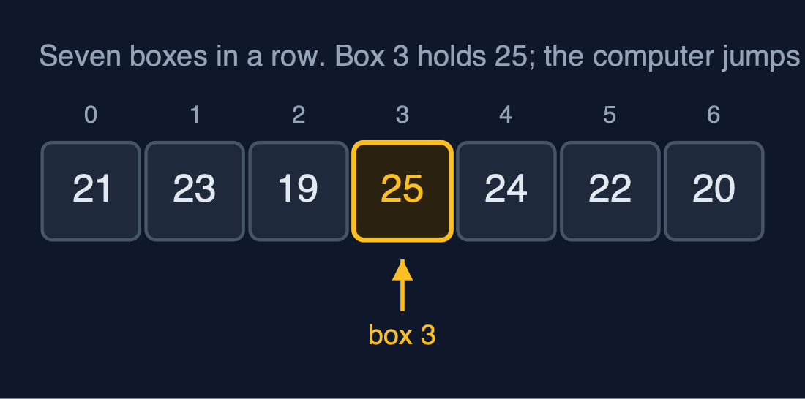
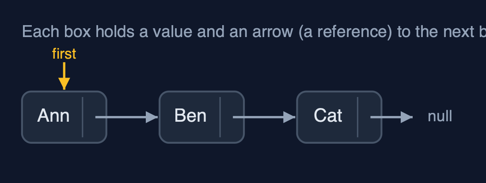
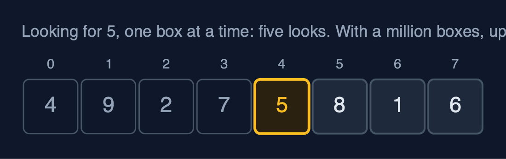
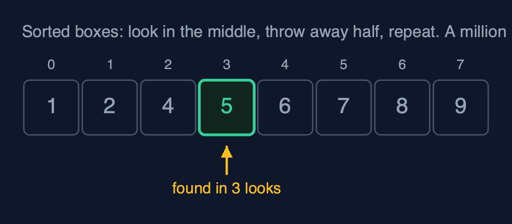

# Start Here

Ten minutes before the first data structure. Everything in the course rests on
the five ideas on this page, and each one is explained from nothing.

## 1. What a data structure is

A **data structure** is a way of arranging data so that the jobs you do most
often are quick.

Think of a kitchen. Cutlery goes in a drawer with a slot for each kind, so you
can grab a spoon without looking. Spices go on a rack in alphabetical order, so
you can find the cumin. Letters go on a spike, newest on top. Each is arranged
for the job it is used for, and none of them is best at everything.

Data works the same way. The course is a tour of the arrangements people have
found useful, what each is good at, and what each is bad at.

## 2. Memory is a row of numbered boxes

A computer's memory is a very long row of boxes, and every box has a number,
called its **address** or **index**. Putting values next to each other in
boxes numbered 0, 1, 2 and so on is called an **array**.



The important thing: if you know a box's number, the computer goes straight
to it. Box 3 takes one step to reach, and so does box 3,000,000. That one fact
explains why arrays are fast to read.

## 3. A reference is an arrow

Sometimes the next value is not in the next box. Instead, a box holds its value
**and** the address of where to go next. That stored address is called a
**reference** (in Java, every variable of an object type holds one). In the
pictures, a reference is drawn as an arrow. `null` means the arrow points
nowhere: this is the end.



Arrows make it cheap to insert something in the middle (change two arrows,
move nothing) and slow to find the tenth item (follow ten arrows). Many data
structures in the course are arrays, arrows, or a clever mix of both.

## 4. Counting steps

We compare data structures by counting **steps**: one look at, or one change to,
one box. A stopwatch would tell you about your computer; counting steps tells
you about the idea, and it is the same on every machine.

Looking for a number in unsorted boxes means checking them one at a time:



If the boxes are sorted, you can look in the middle, throw away the half that
cannot contain it, and repeat:



Every project prints the steps it takes, so you can check the counts yourself.

## 5. Names for how the steps grow

What matters most is how the number of steps **grows** when the data grows.
Only after counting do we give that growth a short name, written with a big O
and the letter *n* for the number of items:

| Name | Said as | Steps for 10 items | For 1,000 | For 1,000,000 | Everyday example |
| --- | --- | ---: | ---: | ---: | --- |
| O(1) | constant | 1 | 1 | 1 | Opening box number 3 |
| O(log n) | logarithmic | about 3 | about 10 | about 20 | Halving a sorted row |
| O(n) | linear | 10 | 1,000 | 1,000,000 | Checking every box once |
| O(n log n) | n log n | about 33 | about 10,000 | about 20,000,000 | Sorting well |
| O(n²) | quadratic | 100 | 1,000,000 | 1,000,000,000,000 | Comparing every box with every other |

You never need the formulas. The table is enough: each row is dramatically
worse than the one above it once the data is large.

## How each project is laid out

Every data structure is its own folder, and every folder has the same parts:

| Where | What |
| --- | --- |
| `README.md` | The picture, the everyday idea, new words, the operations and their costs, common mistakes, and exercises |
| `docs/<name>-explained.md` | Every act of the demo, picture by picture |
| `docs/animation.html` | Open it in a browser: the structure changes on screen, step by step, with narration |
| `docs/cheat-sheet.md` | The whole structure on one page |
| `docs/exercises.md` | Practice, with the answers kept below |
| `src/main/java/...` | The structure, written from scratch |

To run a project's demo and its tests, from its folder:

```bash
./gradlew run
./gradlew test
```

You need only a JDK installed; the build fetches everything else, including
JDK 25 if your machine does not have it.

## Colours in the pictures

Every picture in the course uses the same colours:

| Colour | Means |
| --- | --- |
| Amber | Just changed, or being looked at now |
| Green | Correct, or found |
| Red | Wrong, removed, or a problem |
| Purple | New |
| Faded, dashed | Empty or not in use |

In the animations you can switch between Light, Dim and Dark, step backwards
and forwards, jump to any step, and turn on **Predict first**, which asks you
to guess the next picture before it appears. Guessing first is the fastest way
to learn.

Now open the [course index](index.md) and start with the first data structure.
