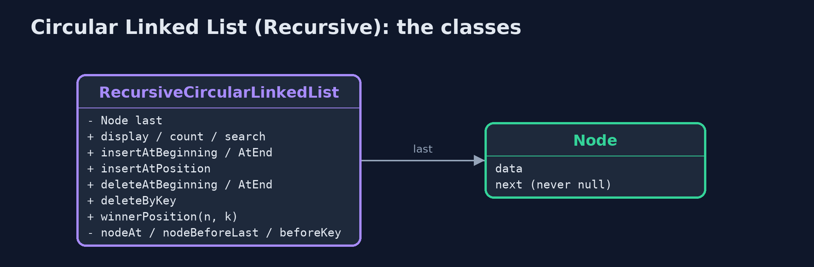
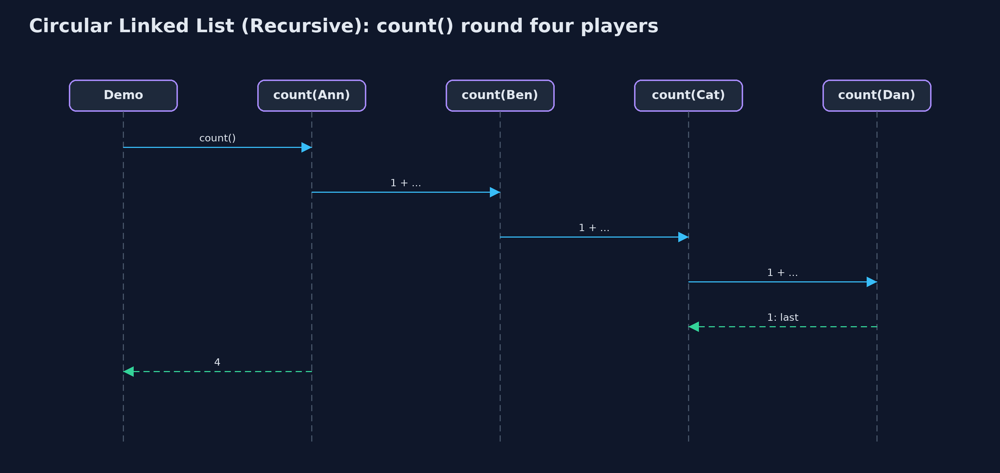

# Circular Linked List (Recursive)

**A recursion over a circular linked list cannot stop at null, because there is none: its base case is reaching last, the end of one lap; work at both ends needs no recursion, finding a node is recursive, and the counting-out winner has a recursive formula of its own.**


*count(Ann) waits for count(Ben) ... count(Dan) is 1: Dan is last, the lap is over*

A **circular linked list** points its last node back to its first and keeps a single pointer, **last**; the first node is `last.next`. This project writes its walks **recursively**. The important difference from other lists is the **base case**: there is no `null` in a circle, so a recursion stops when it reaches **last**, the end of one **lap**. Work at the beginning and the end needs no recursion. Finding a node (to search, to insert at a position, to delete by key, or to find the node before last) is recursive, and linking it is O(1). The counting-out game gets a second, recursive solution: the **Josephus formula**, which finds the winner without building the circle at all. Every recursive lap uses one call-stack frame per node.

> New to data structures? Read [Start here](../../START-HERE.md) first: it explains memory, references and counting steps in ten minutes.

## The everyday idea

Picture the players round the table, and the dealer wants to know how many are playing. The dealer asks the player on the left, "how many from you round to me?", and waits. Each player asks the next and waits. The player just before the dealer, the last one, answers "one: just me", and does not ask further: that is the base case. If the players waited for someone with nobody to their left, the question would go round for ever.

## The worked example: Players round a board game, every lap walked recursively

The board game from `circular-linked-list`: Ann, Ben, Cat and Dan round the table, then Eve, Fay and Gus. The demo traces a recursive count, displays one lap, works at both ends, searches, inserts, deletes by key and at the end recursively, solves counting-out by formula, and counts a million players.

## Why it exists

Every recursion needs a base case the recursion is sure to reach. On a straight list that is `null`; on a circular list it cannot be, and choosing the wrong one means infinite recursion and a stack overflow. Writing the circular list recursively forces that choice into the open. The Josephus formula also shows that some problems stated on a circle have a recursive solution that needs no list at all.

## New words

| Word | What it means here |
| --- | --- |
| **last** | The only pointer the list keeps; the first node is `last.next`. |
| **lap** | One trip round the circle, from `last.next` to `last`. |
| **base case** | Here: reaching `last`, the end of the lap, or the node being looked for. Never `null`, which does not exist. |
| **Josephus formula** | J(1) = 0, J(n) = (J(n - 1) + k) mod n: the winner's position (from 0) when every k-th of n players leaves. |
| **recursion depth** | One frame per node visited in the lap. |

## What you will see, act by act

Run the demo and it tells the story in 5 acts, printing the real numbers that the tests check:

```bash
./gradlew run
```

| Act | What it shows |
| --- | --- |
| 1. The base case is last, not null | count(Ann) = 1 + count(Ben), and so on until count(Dan) = 1, because Dan is last: count() = 4 at depth 4. |
| 2. One lap, recursively | display() goes one lap, 4 calls deep; inserting at both ends needs no recursion: depth 0, 5 pointer changes. |
| 3. Find recursively, link in O(1) | search("Dan"): 5 comparisons, depth 5; insertAtPosition(3): depth 2; deleteByKey("Cat"): 5 comparisons, depth 5; deleteAtEnd: the node before last at depth 4. |
| 4. Counting out, by a recursive formula | J(1) = 0, J(n) = (J(n - 1) + k) mod n gives position 3, Dan, for 5 players and k = 3, depth 5; for 41 players, position 30, depth 41. |
| 5. The limit of recursion | A million players joined with insertAtEnd (no recursion); a recursive count throws StackOverflowError. |

Each act is drawn step by step in [the explained walkthrough](docs/circular-linked-list-recursive-explained.md) and in [the animation](docs/animation.html).

## The operations, and what they cost

Time is given for the best, average and worst case in Big-O notation (START-HERE.md explains it by counting steps); the last column is what the demo actually counted, so every formula can be checked against a real number.

| Operation | What it does | Time: best / average / worst | Extra space (call stack) | Same operation as a loop | Steps counted in the demo |
| --- | --- | --- | --- | --- | --- |
| Display / count | This node, then the rest of the lap; stop at last | O(n) / O(n) / O(n) | O(n) | O(1) | depth 4 for 4 players |
| Insert at beginning / end, delete at beginning | Through last and last.next; no recursion | O(1) / O(1) / O(1) | O(1) | O(1) | depth 0 |
| Insert at position | Find the node before recursively, then 2 pointers | O(1) at 0 / O(n) / O(n) | O(pos) | O(1) | depth 2 |
| Delete at end | Find the node before last recursively; it becomes last | O(n) / O(n) / O(n) | O(n) | O(1) | depth 4 |
| Delete by key / search | Recurse round one lap; stop at a match or at last | O(1) / O(n) / O(n) | O(n) | O(1) | 5 comparisons, depth 5 |
| Counting-out winner (formula) | J(n) = (J(n - 1) + k) mod n, J(1) = 0 | O(n) / O(n) / O(n) | O(n) | O(1) as a loop | depth 5 for 5 players, 41 for 41 |

Extra space is the memory an operation needs besides the structure itself. A loop needs a fixed amount, O(1); a recursive operation needs one call-stack frame for every call still waiting, so its extra space is the depth of the recursion.

## The operations in code

### Count

```java
/** Count: 1 for last, otherwise 1 + the count of the rest of the lap. O(n) time and stack. */
public int count() {
    return last == null ? 0 : count(last.next);
}

private int count(Node node) {
    steps.enter();
    steps.step();
    int c = node == last ? 1 : 1 + count(node.next);
    steps.exit();
    return c;
}
```

`count(last)` is 1: the end of the lap. Every other node counts 1 plus the rest of the lap. Writing `if (node == null)` instead would never be true, and the recursion would go round until the call stack overflowed.

### Search

```java
/** Search: the position of the first node holding {@code key} in one lap, or -1. O(n) time and stack. */
public int search(String key) {
    return last == null ? -1 : search(last.next, key, 0);
}

private int search(Node node, String key, int pos) {
    steps.enter();
    steps.compare();
    int result;
    if (node.data.equals(key)) {
        result = pos;
    } else if (node == last) {
        result = -1;               // base case: the lap is over
    } else {
        result = search(node.next, key, pos + 1);
    }
    steps.exit();
    return result;
}
```

Two base cases: a match, and reaching `last` without one. The lap is searched once.

### Deletion at the end

```java
/**
 * Deletion at the end: find the node before last recursively; it points to the first node and
 * becomes last. O(n) time and stack.
 */
public String deleteAtEnd() {
    if (last == null) {
        throw new IllegalStateException("underflow: the list is empty");
    }
    String data = last.data;
    if (last.next == last) {
        last = null;
        steps.pointer(1);
        return data;
    }
    Node prev = nodeBeforeLast(last.next);
    prev.next = last.next;
    last = prev;
    steps.pointer(2);
    return data;
}

private Node nodeBeforeLast(Node node) {
    if (node.next == last) {
        return node;               // base case: the next node is last
    }
    steps.enter();
    steps.step();
    Node result = nodeBeforeLast(node.next);
    steps.exit();
    return result;
}
```

`nodeBeforeLast` recurses until the next node is `last`. That node points to the first node and becomes the new `last`: O(n), because a singly linked circle cannot step back.

### The Josephus formula

```java
/**
 * The counting-out game worked out without the list: the winner's position (from 0) among
 * {@code n} players when every {@code k}-th leaves, by the recursive formula
 * J(1) = 0, J(n) = (J(n - 1) + k) mod n. O(n) time and stack.
 */
public int winnerPosition(int n, int k) {
    steps.enter();
    int result = n == 1 ? 0 : (winnerPosition(n - 1, k) + k) % n;
    steps.exit();
    return result;
}
```

With one player, the winner is at position 0. With n players, the first to leave is at position k - 1; the game then continues with n - 1 players starting just after, so the winner is J(n - 1) positions further on, wrapped round with mod n. No list is needed, and the recursion is n deep.

## Compared with related structures

The recursive circular list against the loop version and the recursive singly list (n nodes):

| Property | Recursive circular list | Circular list (loops) | Recursive singly list |
| --- | --- | --- | --- |
| Base case of a walk | reaching last | do-while back at the start | null |
| Insert at both ends | O(1), no recursion | O(1) | O(1) at the beginning, O(n) at the end |
| Delete at the end | O(n) time and stack | O(n) time, O(1) space | O(n) time and stack |
| Search, display, count | O(n) time and stack | O(n) time, O(1) space | O(n) time and stack |
| A million nodes | StackOverflowError | fine | StackOverflowError |

## The code

```
src/main/java/com/jk/explore/circularlinkedlistrecursive/
├── Lines.java                            The demo's printed lines, kept in one {@code StringBuilder} so the tests can check them
├── Node.java                             A node of a circular linked list: the data it holds and a pointer to the next node
├── RecursiveCircularLinkedList.java      A circular singly linked list whose walks are written recursively
├── RecursiveCircularLinkedListDemo.java  Tells the story of the recursive circular linked list in five acts, printing the real counts and the real depth of every recursion
└── StepCounter.java                      Counts what a circular-linked-list operation costs: traversal steps (following one next pointer), comparisons (checking one node's data against a key), and pointer changes (setting one last or next pointer), and the deepest recursion reached: the most call-stack frames alive at once, which is the extra space a recursive operation uses
```

## Test

```bash
./gradlew test
```

16 tests in `DemoRunsTest`, `RecursiveCircularLinkedListTest`. Every number the demo prints is asserted, and nothing depends on the clock, so every run gives the same result.

## Common mistakes

| The mistake | What goes wrong | The fix |
| --- | --- | --- |
| Base case `node == null` | There is no null in a circle, so the recursion goes round until the call stack overflows. | Stop at `node == last`, the end of the lap. |
| Starting the lap at last | The recursion stops at once and counts one node. | Start at `last.next`, the first node. |
| Recursing to reach the end | O(n) for something `last` gives in O(1). | Use `last` and `last.next` for work at the ends. |
| Recursing round long circles | StackOverflowError. | Use do-while loops. |

## Try it yourself

1. **Easy.** Write a recursive `boolean contains(Node node, String key)` for one lap starting at `node`. What are its base cases?
2. **Medium.** Write a recursive `String displayFrom(Node start, Node node)` that displays one lap starting at any node, not just the first. What is the base case now?
3. **Harder.** Rewrite `winnerPosition(n, k)` as a loop. Why can every tail-recursive or simple linear recursion like this be turned into a loop, and what does it save?

The answers are in [docs/exercises.md](docs/exercises.md), below the questions, so they are not given away.

## When to use it

- Learning how to choose a base case when there is no null.
- Short circles, such as the players at one table.
- The counting-out winner for any n, by the O(n) recursive formula.

## When not to

- Long circles: one frame per node overflows the call stack. Use the do-while loops of `circular-linked-list`.

## Where you have already met this

- `circular-linked-list`: the same structure with do-while loops.
- The Josephus problem, from recreational mathematics.

## Technologies and versions

| Technology | Version | Used for |
| --- | --- | --- |
| Java | 25 | the code (toolchain set in `build.gradle`; Gradle fetches JDK 25 if it is missing) |
| Gradle | 9.8.0 (wrapper) | build and run, nothing to install |
| JUnit | 6.1.3 | the tests |
| videokit | course tool | the narrated video and animation: Piper `en_US-amy-medium`, speed 0.8, longer pauses (the `amy-slow` voice) |

## Learning material

| Document | What it is for |
| --- | --- |
| [Start here](../../START-HERE.md) | the ideas every project relies on |
| [Problem statement](docs/problem-statement.md) | the situation and what the project must show |
| [Prerequisites](docs/prerequisites.md) | what you need to know first |
| [Circular Linked List (Recursive), explained](docs/circular-linked-list-recursive-explained.md) | every act, picture by picture |
| [Animated walkthrough](docs/animation.html) | the structure changing step by step, narrated |
| [Cheat sheet](docs/cheat-sheet.md) | the whole structure on one page |
| [Exercises and answers](docs/exercises.md) | practice, easy to harder |
| [Session guide](docs/session.md) | a one-hour lesson |
| [Specification](docs/spec.md) | what this project must be true of |

### How the pieces fit

Recursive laps from last.next to last; O(1) work at the ends through last.


### The classes

Public operations; recursive helpers that stop at last.



### How the data moves

The base case is last.


### Who calls whom, in order

Each call waits; Dan, the last node, answers 1.



### Video

`video/circular-linked-list-recursive-explained.mp4` (with `.m4a` audio and `.srt` subtitles) is built by `video/build_video.sh`. Rendered media is not committed.

## Where this sits

Part of the [data structures course](../../index.md), in *arrays-and-lists*.
