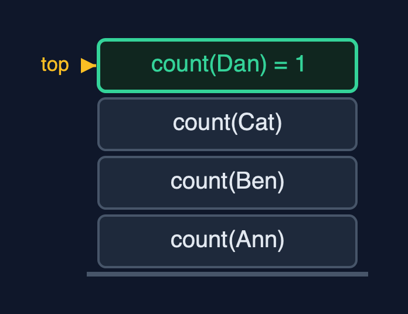
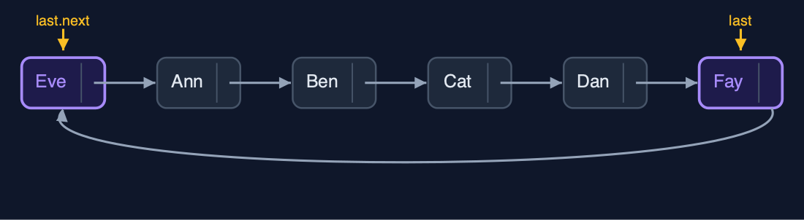
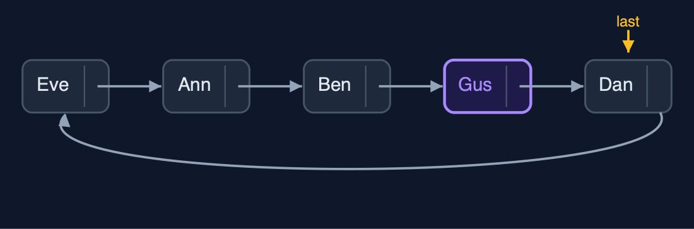
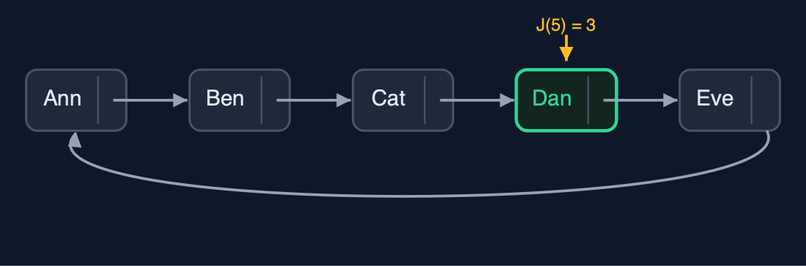
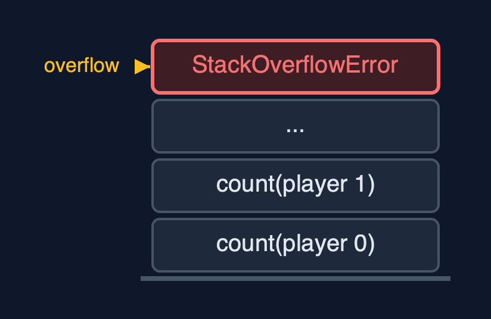

# Circular Linked List (Recursive), Explained

## In one sentence

A recursive circular linked list stops each recursion at last, the end of one lap, because a circle has no null; it works at both ends without recursion and finds the counting-out winner by the formula J(n) = (J(n - 1) + k) mod n.

## The picture


*count(Ann) waits for count(Ben) ... count(Dan) is 1: Dan is last, the lap is over*

## The everyday idea

Picture the players round the table, and the dealer wants to know how many are playing. The dealer asks the player on the left, "how many from you round to me?", and waits. Each player asks the next and waits. The player just before the dealer, the last one, answers "one: just me", and does not ask further: that is the base case. If the players waited for someone with nobody to their left, the question would go round for ever.

## The 5 acts

### Act 1: The base case is last, not null

Counting recursively round the table: `count(Ann) = 1 + count(Ben)`, `count(Ben) = 1 + count(Cat)`, `count(Cat) = 1 + count(Dan)`. Dan is `last`, the end of the lap, so `count(Dan)` is simply 1: the base case. The answer is 4, with four calls waiting at the deepest point. A recursion written for a straight list, waiting for `null`, would go round the circle for ever and overflow the call stack.



**Four count calls; the base case is Dan, the last node** Here is the call stack. Four calls, one per player. On top, Dan: the last node.

What the demo printed:

```
count(Ann) = 1 + count(Ben)
  count(Ben) = 1 + count(Cat), count(Cat) = 1 + count(Dan)
    count(Dan) = 1   <- base case: this is last, the lap is over
count() = 4, depth 4; waiting for null would recurse for ever and overflow
```

### Act 2: One lap, recursively

`display` appends each player and recurses on the next until it has appended `last`: one lap, four calls deep. Inserting "Eve" at the beginning and "Fay" at the end uses `last` and `last.next` directly: depth 0, 5 pointer changes.



**Eve at the beginning, Fay at the end: both through last** Here is the table now. Eve is first, Fay is last.

What the demo printed:

```
display(): Ann -> Ben -> Cat -> Dan -> (back to Ann), depth 4
insertAtBeginning("Eve") and insertAtEnd("Fay"): depth 0, 5 pointer changes
```

### Act 3: Find recursively, link in O(1)

Operations inside the circle find their node recursively and then link it. `search("Dan")` compares five players, five calls deep. `insertAtPosition(3, "Gus")` finds Ben, the node before the position, two calls deep, and links Gus with two pointers. `deleteByKey("Cat")` looks for the node before Cat, starting from `last`: five comparisons. `deleteAtEnd` finds Dan, the node before Fay, four calls deep; Dan then points to Eve and becomes `last`.



**After the changes: Gus in, Cat and Fay out; Dan is last** Here is the table now. Dan is last, and points back to Eve.

What the demo printed:

```
search("Dan") = position 4: 5 comparisons, depth 5
insertAtPosition(3, "Gus"): the node before found at depth 2, 2 pointers changed
deleteByKey("Cat"): 5 comparisons, depth 5
deleteAtEnd() removed Fay: the node before last found at depth 4
Eve -> Ann -> Ben -> Gus -> Dan -> (back to Eve)
```

### Act 4: Counting out, by a recursive formula

The counting-out game can be solved without the circle. With one player, the winner is at position 0. With n players, the first to leave is at position k - 1, and the game carries on with n - 1 players starting just after; so the winner is J(n - 1) places further on, wrapped round with mod n. For five players and k = 3 the formula gives position 3: Dan, the same winner the list simulation finds. For 41 players it gives position 30, the classic answer, 41 calls deep.



**The formula's winner: position 3, Dan** Here is the circle of five. The formula picks position three: Dan.

What the demo printed:

```
J(1) = 0, J(n) = (J(n - 1) + k) mod n: winner at position 3 of 5 with k = 3, depth 5
position 3 is Dan: the same winner the list simulation finds, without the list
41 players, k = 3: winner at position 30, depth 41
```

### Act 5: The limit of recursion

A million `insertAtEnd` calls use `last` and never recurse. A recursive count of the million needs one frame per player in the lap, and Java throws `StackOverflowError`. The do-while loops of `circular-linked-list` go round in O(1) extra space, and the Josephus formula can be rewritten as a loop the same way.



**One frame per player: a million-player lap overflows** One call per player. Far too many.

What the demo printed:

```
1,000,000 players, joined with insertAtEnd: no recursion, O(1) each
count(): StackOverflowError, one frame per player in the lap
the do-while loops of the circular-linked-list project need O(1) extra space
```

## The operations in code

### Count

```java
/** Count: 1 for last, otherwise 1 + the count of the rest of the lap. O(n) time and stack. */
public int count() {
    return last == null ? 0 : count(last.next);
}

private int count(Node node) {
    steps.enter();
    steps.step();
    int c = node == last ? 1 : 1 + count(node.next);
    steps.exit();
    return c;
}
```

`count(last)` is 1: the end of the lap. Every other node counts 1 plus the rest of the lap. Writing `if (node == null)` instead would never be true, and the recursion would go round until the call stack overflowed.

### Search

```java
/** Search: the position of the first node holding {@code key} in one lap, or -1. O(n) time and stack. */
public int search(String key) {
    return last == null ? -1 : search(last.next, key, 0);
}

private int search(Node node, String key, int pos) {
    steps.enter();
    steps.compare();
    int result;
    if (node.data.equals(key)) {
        result = pos;
    } else if (node == last) {
        result = -1;               // base case: the lap is over
    } else {
        result = search(node.next, key, pos + 1);
    }
    steps.exit();
    return result;
}
```

Two base cases: a match, and reaching `last` without one. The lap is searched once.

### Deletion at the end

```java
/**
 * Deletion at the end: find the node before last recursively; it points to the first node and
 * becomes last. O(n) time and stack.
 */
public String deleteAtEnd() {
    if (last == null) {
        throw new IllegalStateException("underflow: the list is empty");
    }
    String data = last.data;
    if (last.next == last) {
        last = null;
        steps.pointer(1);
        return data;
    }
    Node prev = nodeBeforeLast(last.next);
    prev.next = last.next;
    last = prev;
    steps.pointer(2);
    return data;
}

private Node nodeBeforeLast(Node node) {
    if (node.next == last) {
        return node;               // base case: the next node is last
    }
    steps.enter();
    steps.step();
    Node result = nodeBeforeLast(node.next);
    steps.exit();
    return result;
}
```

`nodeBeforeLast` recurses until the next node is `last`. That node points to the first node and becomes the new `last`: O(n), because a singly linked circle cannot step back.

### The Josephus formula

```java
/**
 * The counting-out game worked out without the list: the winner's position (from 0) among
 * {@code n} players when every {@code k}-th leaves, by the recursive formula
 * J(1) = 0, J(n) = (J(n - 1) + k) mod n. O(n) time and stack.
 */
public int winnerPosition(int n, int k) {
    steps.enter();
    int result = n == 1 ? 0 : (winnerPosition(n - 1, k) + k) % n;
    steps.exit();
    return result;
}
```

With one player, the winner is at position 0. With n players, the first to leave is at position k - 1; the game then continues with n - 1 players starting just after, so the winner is J(n - 1) positions further on, wrapped round with mod n. No list is needed, and the recursion is n deep.

## The operations, and what they cost

| Operation | What it does | Time: best / average / worst | Extra space (call stack) | Same operation as a loop | Steps counted in the demo |
| --- | --- | --- | --- | --- | --- |
| Display / count | This node, then the rest of the lap; stop at last | O(n) / O(n) / O(n) | O(n) | O(1) | depth 4 for 4 players |
| Insert at beginning / end, delete at beginning | Through last and last.next; no recursion | O(1) / O(1) / O(1) | O(1) | O(1) | depth 0 |
| Insert at position | Find the node before recursively, then 2 pointers | O(1) at 0 / O(n) / O(n) | O(pos) | O(1) | depth 2 |
| Delete at end | Find the node before last recursively; it becomes last | O(n) / O(n) / O(n) | O(n) | O(1) | depth 4 |
| Delete by key / search | Recurse round one lap; stop at a match or at last | O(1) / O(n) / O(n) | O(n) | O(1) | 5 comparisons, depth 5 |
| Counting-out winner (formula) | J(n) = (J(n - 1) + k) mod n, J(1) = 0 | O(n) / O(n) / O(n) | O(n) | O(1) as a loop | depth 5 for 5 players, 41 for 41 |

## Compared with related structures

The recursive circular list against the loop version and the recursive singly list (n nodes):

| Property | Recursive circular list | Circular list (loops) | Recursive singly list |
| --- | --- | --- | --- |
| Base case of a walk | reaching last | do-while back at the start | null |
| Insert at both ends | O(1), no recursion | O(1) | O(1) at the beginning, O(n) at the end |
| Delete at the end | O(n) time and stack | O(n) time, O(1) space | O(n) time and stack |
| Search, display, count | O(n) time and stack | O(n) time, O(1) space | O(n) time and stack |
| A million nodes | StackOverflowError | fine | StackOverflowError |

## The verdict

Use it to learn how to choose a base case; in real code, go round with do-while loops.

## How to recognise it in code you did not write

- `if (node == last) return ...;` in a recursive method on a circular list.
- `(winner(n - 1, k) + k) % n`.

## Where you have already met this

- `circular-linked-list`: the same structure with do-while loops.
- The Josephus problem, from recreational mathematics.
