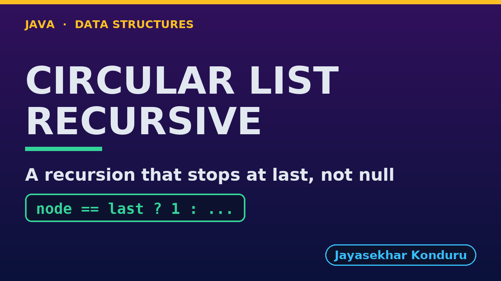

# YouTube — Circular Linked List (Recursive)

Everything needed to publish `video/circular-linked-list-recursive-explained.mp4`. Copy the fields straight out of this file.

Chapter timings come from the video's `.srt`; they are regenerated whenever the video is rebuilt.

## Title

```
Circular Linked List in Java, Recursively - Base Case, Laps and Josephus
```

72 characters (YouTube shows about 60 before cutting a title off in search).

## Description

The first two lines are what a viewer sees above the fold, so they carry the hook rather than the boilerplate.

```
Circular Linked List in Java, written recursively, explained with players taking turns round a board game. We trace count(Ann) = 1 + count(Ben) round the table and see why the base case must be reaching last, the end of one lap: a recursion waiting for null would never stop. We display one lap recursively, insert at both ends with no recursion, and find nodes recursively before linking them in O(1): search, insertAtPosition, deleteByKey and deleteAtEnd, each with its depth. Then we solve the counting-out game without the list, by the recursive Josephus formula J(n) = (J(n - 1) + k) mod n, and finish at the limit: counting a million players recursively throws a real StackOverflowError.

CHAPTERS
00:00 Introduction
00:43 The Everyday Idea
01:11 The Words
01:31 Act One — The base case is last, not null
01:59 The base case is last, not null
02:08 Act Two — One lap, recursively
02:22 One lap, recursively
02:28 Act Three — Find recursively, link in O(1)
02:54 Find recursively, link in O(1)
03:01 Act Four — Counting out, by a recursive formula
03:28 Counting out, by a recursive formula
03:35 Act Five — The limit of recursion
03:52 The limit of recursion
03:56 Time and Space Complexity
04:18 Recursive or Loop?
04:35 Common Mistakes
04:54 Thanks for Watching

SOURCE CODE, WRITTEN NOTES AND AN INTERACTIVE ANIMATION
https://github.com/jk-boot-up/datastructures/tree/main/gradle-java/arrays-and-lists/circular-linked-list-recursive

WHAT YOU NEED FIRST
Java basics: variables, loops, classes and methods. No data-structures knowledge is assumed; START-HERE.md in the repository explains memory, references and counting steps.
```

## Chapters

YouTube shows these as chapters because there are at least three and the first is at `00:00`.

```
00:00 Introduction
00:43 The Everyday Idea
01:11 The Words
01:31 Act One — The base case is last, not null
01:59 The base case is last, not null
02:08 Act Two — One lap, recursively
02:22 One lap, recursively
02:28 Act Three — Find recursively, link in O(1)
02:54 Find recursively, link in O(1)
03:01 Act Four — Counting out, by a recursive formula
03:28 Counting out, by a recursive formula
03:35 Act Five — The limit of recursion
03:52 The limit of recursion
03:56 Time and Space Complexity
04:18 Recursive or Loop?
04:35 Common Mistakes
04:54 Thanks for Watching
```

## Tags

```
circular linked list, recursion, josephus problem, base case, call stack, stack overflow, data structures, java data structures, java, java 25, algorithms, computer science, programming tutorial, beginner, big o
```

211 characters, under YouTube's 500 limit.

## Thumbnail



Upload `docs/thumbnail.png` (1280×720) under **Details → Thumbnail → Upload file**. It is made for the small size YouTube shows in search: the name, one line of promise and one piece of code.

## Upload checklist

- [ ] Upload `video/circular-linked-list-recursive-explained.mp4` (1080p, H.264, 30 fps, AAC 48 kHz)
- [ ] Set the video language to **English**, then add subtitles: *Upload file → With timing* → `video/circular-linked-list-recursive-explained.srt`
- [ ] Upload `docs/thumbnail.png` as the thumbnail
- [ ] Paste the title, description and tags from above
- [ ] Add to the **Data Structures in Java** playlist
- [ ] Wait for 1080p processing before sharing the link

## Runtime

05:36.
