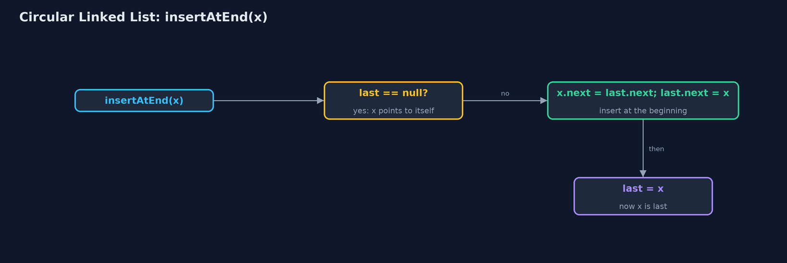
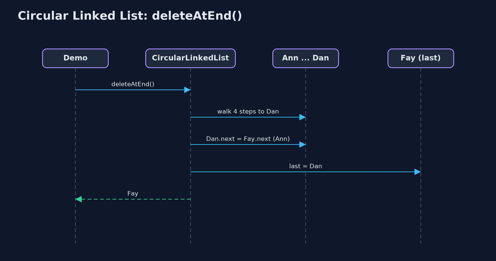

# Circular Linked List

**A circular linked list points its last node back at its first, so there is no end: moving on is always one step, which suits anything that goes round and round; the price is that nothing tells a loop when to stop.**


*The last node points back to the first; the list keeps only last, and last.next is the first node*

A **circular linked list** is a linked list whose last node points back at its first. There is no `null` at the end, because there is no end: follow the pointers and you go round and round. It suits anything that takes turns, such as players round a table, tasks sharing a processor, or a playlist on repeat. As in C textbooks, the list keeps a single pointer, `last`, to the last node; the first node is `last.next`, so both ends are one step away, and insertion at the beginning and at the end are both O(1). It is built by hand with the textbook operations: insertAtBeginning, insertAtEnd, insertAtPosition, deleteAtBeginning, deleteAtEnd, deleteByKey, search, display and count.

> New to data structures? Read [Start here](../../START-HERE.md) first: it explains memory, references and counting steps in ten minutes.

## The everyday idea

Picture friends sitting round a table playing a board game. When your turn ends, you pass the dice to your left. After the last person, the dice simply carry on to the first person again, because a circle has no last seat. A newcomer squeezes in between two players; someone who is out leaves their seat, and the person before them passes straight to the person after. Nobody ever has to say "we have reached the end, go back to the start".

## The worked example: Taking turns in a board game, round and round

Four players, Ann, Ben, Cat and Dan, take turns round a board game. The demo moves the turn on round the table, lets newcomers join at the beginning, the end and a position, removes players at the beginning, the end and by name, and finally plays a counting-out game in which every third player leaves until one is left.

## Why it exists

In a straight list, the turn falls off the end after the last player: the next pointer is `null`, and a special case has to send the turn back to the first player every round. In a circular list there is no end and no special case: the last node's next simply points to the first, so taking a turn is always the same one step.

## New words

| Word | What it means here |
| --- | --- |
| **circular linked list** | A linked list whose last node's next points back to the first node: it has no end and no null. |
| **last** | The only pointer the list keeps: the last node. The first node is `last.next`. |
| **node** | One element: its `data` and a `next` pointer, which for the last node is the first node. |
| **do-while loop** | A loop that runs its body first and checks afterwards; the natural way to go once round a circular list and stop back at the first node. |
| **counting out** | A game where every k-th player round the circle leaves; also known as the Josephus problem. |

## What you will see, act by act

Run the demo and it tells the story in 5 acts, printing the real numbers that the tests check:

```bash
./gradlew run
```

| Act | What it shows |
| --- | --- |
| 1. Players in a straight line | Four players in a straight list: after Dan the next pointer is null, and a special case sends the turn back to Ann. |
| 2. Join the ends: last.next is the first node | Built with insertAtEnd: 0 steps, 12 pointer changes; the list keeps only last, Dan, and last.next is Ann. |
| 3. Turns, insertion and deletion | 6 turns in 6 steps; insertAtBeginning and insertAtEnd in 0 steps; insertAtPosition(3) in 2 steps; deleteAtBeginning 1 pointer; deleteAtEnd 4 steps; deleteByKey 4 comparisons. |
| 4. Waiting for null | A while (current != null) loop walks 1,000 steps and never stops by itself; a do-while stops back at the first node; one node points to itself, and deleting it sets last to null. |
| 5. Counting out, and the bill | Five players, every third out: Cat, Ann, Eve, Ben; winner Dan, in 8 steps and 4 pointer changes. |

Each act is drawn step by step in [the explained walkthrough](docs/circular-linked-list-explained.md) and in [the animation](docs/animation.html).

## The operations, and what they cost

Time is given for the best, average and worst case in Big-O notation (START-HERE.md explains it by counting steps); the last column is what the demo actually counted, so every formula can be checked against a real number.

| Operation | What it does | Time: best / average / worst | Extra space | Steps counted in the demo |
| --- | --- | --- | --- | --- |
| Display / count | do-while from last.next until back at last.next | O(n) / O(n) / O(n) | O(1) | 4 steps for 4 players |
| Next turn | current = current.next, always, with no special case | O(1) / O(1) / O(1) | O(1) | 6 turns in 6 steps |
| Insert at beginning | newNode.next = last.next; last.next = newNode | O(1) / O(1) / O(1) | O(1) | 0 steps, 2 pointer changes |
| Insert at end | Insert at the beginning, then last = the new node | O(1) / O(1) / O(1) | O(1) | 0 steps, 3 pointer changes |
| Insert at position | Walk to the node before, then 2 pointers | O(1) at 0 / O(n) / O(n) | O(1) | 2 steps, 2 pointer changes |
| Delete at beginning | last.next = last.next.next | O(1) / O(1) / O(1) | O(1) | 1 pointer change |
| Delete at end | Walk round to the node before last; it points to the first and becomes last | O(n) / O(n) / O(n) | O(1) | 4 steps on 6 nodes |
| Delete by key / search | Go round once with prev and current | O(1) / O(n) / O(n) | O(1) | 4 comparisons, 1 pointer change |
| Counting out (k) | Count k round the circle, unlink, repeat until one is left | O(n k) / O(n k) / O(n k) | O(1) | 8 steps, 4 pointer changes for 5 players, k = 3 |

Extra space is the memory an operation needs besides the structure itself. A loop needs a fixed amount, O(1); a recursive operation needs one call-stack frame for every call still waiting, so its extra space is the depth of the recursion.

## The operations in code

### Insertion at the beginning

```java
/**
 * Insertion at the beginning: the new node goes between last and the old first node. O(1).
 * In an empty list, the new node points to itself and becomes last.
 */
public void insertAtBeginning(String data) {
    Node newNode = new Node(data);
    if (last == null) {
        newNode.next = newNode;     // a list of one node points to itself
        last = newNode;
        steps.pointer(2);
        return;
    }
    newNode.next = last.next;       // the new node points to the old first node
    last.next = newNode;            // last points to the new first node
    steps.pointer(2);
}
```

The new node goes between `last` and the old first node: it points to `last.next`, and `last` points to it. An empty list is the special case: the new node points to itself and becomes `last`.

### Insertion at the end

```java
/** Insertion at the end: insert at the beginning, then move last on to the new node. O(1). */
public void insertAtEnd(String data) {
    insertAtBeginning(data);
    last = last.next;               // the new node, now after last, becomes last
    steps.pointer(1);
}
```

The textbook trick: in a circle, the beginning and the end are the same place. Insert at the beginning, then move `last` on one node, and the new node is last instead of first. O(1).

### Display

```java
/** Display: from the first node round to the last, then back to the first. O(n). */
public String display() {
    if (last == null) {
        return "(empty)";
    }
    StringBuilder s = new StringBuilder();
    Node current = last.next;
    do {
        s.append(current.data).append(" -> ");
        current = current.next;
        steps.step();
    } while (current != last.next);     // stop when back at the first node
    return s.append("(back to ").append(last.next.data).append(')').toString();
}
```

There is no `null` to stop at, so the traversal is a do-while that starts at `last.next` and stops when it comes back to it. The body runs before the check, so a list of one node is displayed once.

### Deletion at the end

```java
/**
 * Deletion at the end: walk round to the node before last, point it at the first node, and make
 * it last. O(n): the node before last can only be found by walking.
 *
 * @throws IllegalStateException "underflow" when the list is empty
 */
public String deleteAtEnd() {
    if (last == null) {
        throw new IllegalStateException("underflow: the list is empty");
    }
    String data = last.data;
    if (last.next == last) {
        last = null;
        steps.pointer(1);
        return data;
    }
    Node prev = last.next;
    while (prev.next != last) {
        prev = prev.next;
        steps.step();
    }
    prev.next = last.next;
    last = prev;
    steps.pointer(2);
    return data;
}
```

The one end operation that is not O(1): the node before `last` must point to the first node and become `last`, and in a singly linked circle it can only be found by walking round.

### The counting-out game

```java
/**
 * The counting-out game: starting from the first node, count {@code k} players round the
 * circle and delete the k-th, again and again, until one is left. Returns the players in the
 * order they left, then the winner.
 */
public String countOut(int k) {
    StringBuilder out = new StringBuilder();
    Node prev = last;
    while (last != null && last.next != last) {
        for (int i = 1; i < k; i++) {
            prev = prev.next;
            steps.step();
        }
        Node gone = prev.next;
        prev.next = gone.next;              // the player before points past the one who is out
        steps.pointer(1);
        if (gone == last) {
            last = prev;
        }
        out.append(out.length() > 0 ? ", " : "").append(gone.data);
    }
    return "out: " + out + "; winner " + (last == null ? "none" : last.data);
}
```

`prev` counts k - 1 steps round the circle; the node after it is out, and `prev.next = gone.next` removes it. The circle never ends, so counting simply carries on past the last player.

## Compared with related structures

How a circular linked list compares with its neighbours (n nodes):

| Operation | Circular list (last pointer) | Singly list (head only) | Doubly list (head, tail) |
| --- | --- | --- | --- |
| Insert at the beginning | O(1) | O(1) | O(1) |
| Insert at the end | O(1) | O(n) | O(1) |
| Delete at the beginning | O(1) | O(1) | O(1) |
| Delete at the end | O(n) | O(n) | O(1) |
| Next after the last node | the first node | null | null |
| Loop end condition | back at the start (do-while) | null | null |
| Pointers per node | 1 | 1 | 2 |

## The code

```
src/main/java/com/jk/explore/circularlinkedlist/
├── CircularLinkedList.java      A circular singly linked list: the last node's next pointer points back to the first node, so the list has no end and no {@code null}
├── CircularLinkedListDemo.java  Tells the story of the circular linked list in five acts, printing the real step counts
├── Lines.java                   The demo's printed lines, kept in one {@code StringBuilder} so the tests can check them
├── Node.java                    A node of a circular linked list: the data it holds and a pointer to the next node
└── StepCounter.java             Counts what a circular-linked-list operation costs: traversal steps (following one next pointer), comparisons (checking one node's data against a key), and pointer changes (setting one last or next pointer)
```

## Test

```bash
./gradlew test
```

19 tests in `CircularLinkedListTest`, `DemoRunsTest`. Every number the demo prints is asserted, and nothing depends on the clock, so every run gives the same result.

## Common mistakes

| The mistake | What goes wrong | The fix |
| --- | --- | --- |
| Looping `while (current != null)` | There is no null, so the loop never ends. | Use a do-while that stops when `current` is back at the first node. |
| Using a while loop that checks first | `while (current != last.next)` starting at `last.next` never runs its body. | Check after the body: `do { ... } while (current != last.next);`. |
| Forgetting the one-node list | A single node must point to itself; deleting it must set `last` to null. | Handle `last.next == last` separately. |
| Deleting the last node without moving `last` | `last` keeps pointing at a deleted node. | When the deleted node is `last`, set `last` to the node before it. |

## Try it yourself

1. **Easy.** Write `String playerAfter(String name, int k)` that returns the player k turns after `name`, going round as often as needed. What is its time complexity?
2. **Medium.** Write `void split(CircularLinkedList a, CircularLinkedList b)` that splits a circular list with an even number of nodes into two circular halves. How many pointers change?
3. **Harder.** In the counting-out game with n players and k = 2, where should you sit to win? Work out n = 5 and n = 8 with the list, then find the pattern.

The answers are in [docs/exercises.md](docs/exercises.md), below the questions, so they are not given away.

## When to use it

- Something goes round and round: turns, round-robin scheduling, a looping playlist.
- You keep your place in the circular list and move on one step at a time.
- Players or tasks join and leave while the circular list keeps turning.

## When not to

- The data has a real beginning and end: a plain list is clearer.
- You read by position: position n is still n steps.
- The code is shared with people who expect `null` at the end: loops that wait for `null` never stop.

## Where you have already met this

- Players taking turns, a carousel, the hands of a clock.
- Operating systems giving each program a turn of the processor (round-robin scheduling).
- `java.util.ArrayDeque` and circular buffers use the same wrap-around idea on an array.

## Technologies and versions

| Technology | Version | Used for |
| --- | --- | --- |
| Java | 25 | the code (toolchain set in `build.gradle`; Gradle fetches JDK 25 if it is missing) |
| Gradle | 9.8.0 (wrapper) | build and run, nothing to install |
| JUnit | 6.1.3 | the tests |
| videokit | course tool | the narrated video and animation: Piper `en_US-amy-medium`, speed 0.8, longer pauses (the `amy-slow` voice) |

## Learning material

| Document | What it is for |
| --- | --- |
| [Start here](../../START-HERE.md) | the ideas every project relies on |
| [Problem statement](docs/problem-statement.md) | the situation and what the project must show |
| [Prerequisites](docs/prerequisites.md) | what you need to know first |
| [Circular Linked List, explained](docs/circular-linked-list-explained.md) | every act, picture by picture |
| [Animated walkthrough](docs/animation.html) | the structure changing step by step, narrated |
| [Cheat sheet](docs/cheat-sheet.md) | the whole structure on one page |
| [Exercises and answers](docs/exercises.md) | practice, easy to harder |
| [Session guide](docs/session.md) | a one-hour lesson |
| [Specification](docs/spec.md) | what this project must be true of |

### How the pieces fit

The list keeps only last; last.next is the first node; the nodes form a circle.


### The classes

`CircularLinkedList` holds last; each `Node` holds data and next.


### How the data moves

Insert at the beginning, then move last on.



### Who calls whom, in order

Walk round to the node before last, then two pointer changes.



### Video

`video/circular-linked-list-explained.mp4` (with `.m4a` audio and `.srt` subtitles) is built by `video/build_video.sh`. Rendered media is not committed.

## Where this sits

Part of the [data structures course](../../index.md), in *arrays-and-lists*.
