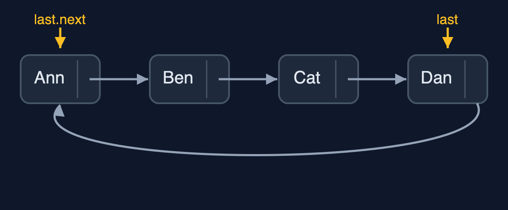

# Circular Linked List — Cheat Sheet

**A circular linked list points its last node back at its first, so there is no end: moving on is always one step, which suits anything that goes round and round; the price is that nothing tells a loop when to stop.**

| | |
| --- | --- |
| **What it is** | A circular linked list points its last node back to its first and keeps only last, so both ends are one step away, turns need no special case, and traversals stop when they come back round rather than at null. |
| **Everyday picture** | Players sitting round a table, passing the turn to the left |
| **Use it when** | Something goes round and round: turns, round-robin scheduling, a looping playlist; You keep your place in the circular list and move on one step at a time; Players or tasks join and leave while the circular list keeps turning |
| **Avoid it when** | The data has a real beginning and end: a plain list is clearer; You read by position: position n is still n steps; The code is shared with people who expect `null` at the end: loops that wait for `null` never stop |
| **Already in Java** | None in `java.util`; `ArrayDeque` goes round a circular array instead (see the circular buffer) |

## Costs

| Operation | What it does | Time: best / average / worst | Extra space | Steps counted in the demo |
| --- | --- | --- | --- | --- |
| Display / count | do-while from last.next until back at last.next | O(n) / O(n) / O(n) | O(1) | 4 steps for 4 players |
| Next turn | current = current.next, always, with no special case | O(1) / O(1) / O(1) | O(1) | 6 turns in 6 steps |
| Insert at beginning | newNode.next = last.next; last.next = newNode | O(1) / O(1) / O(1) | O(1) | 0 steps, 2 pointer changes |
| Insert at end | Insert at the beginning, then last = the new node | O(1) / O(1) / O(1) | O(1) | 0 steps, 3 pointer changes |
| Insert at position | Walk to the node before, then 2 pointers | O(1) at 0 / O(n) / O(n) | O(1) | 2 steps, 2 pointer changes |
| Delete at beginning | last.next = last.next.next | O(1) / O(1) / O(1) | O(1) | 1 pointer change |
| Delete at end | Walk round to the node before last; it points to the first and becomes last | O(n) / O(n) / O(n) | O(1) | 4 steps on 6 nodes |
| Delete by key / search | Go round once with prev and current | O(1) / O(n) / O(n) | O(1) | 4 comparisons, 1 pointer change |
| Counting out (k) | Count k round the circle, unlink, repeat until one is left | O(n k) / O(n k) / O(n k) | O(1) | 8 steps, 4 pointer changes for 5 players, k = 3 |

## Compared with related structures

How a circular linked list compares with its neighbours (n nodes):

| Operation | Circular list (last pointer) | Singly list (head only) | Doubly list (head, tail) |
| --- | --- | --- | --- |
| Insert at the beginning | O(1) | O(1) | O(1) |
| Insert at the end | O(1) | O(n) | O(1) |
| Delete at the beginning | O(1) | O(1) | O(1) |
| Delete at the end | O(n) | O(n) | O(1) |
| Next after the last node | the first node | null | null |
| Loop end condition | back at the start (do-while) | null | null |
| Pointers per node | 1 | 1 | 2 |

## Watch out for

- **Looping `while (current != null)`**: Use a do-while that stops when `current` is back at the first node.
- **Using a while loop that checks first**: Check after the body: `do { ... } while (current != last.next);`.
- **Forgetting the one-node list**: Handle `last.next == last` separately.
- **Deleting the last node without moving `last`**: When the deleted node is `last`, set `last` to the node before it.
