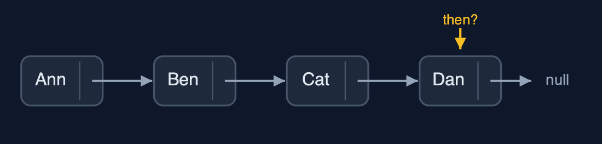
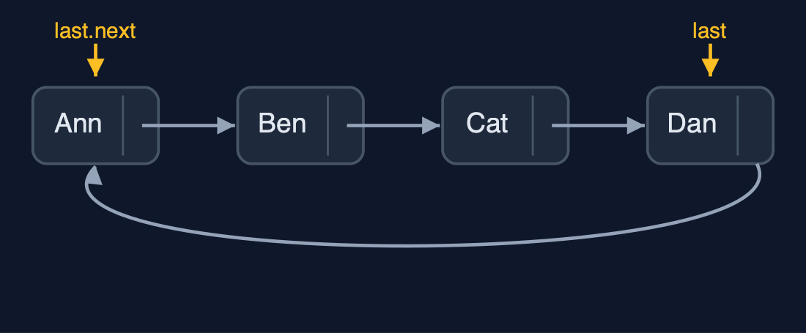
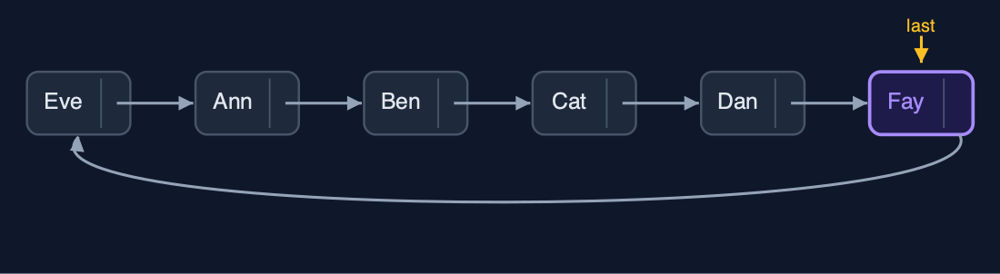
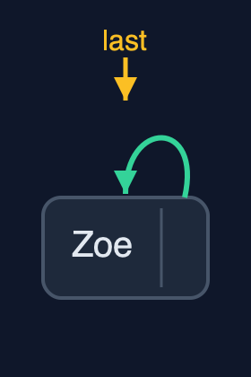
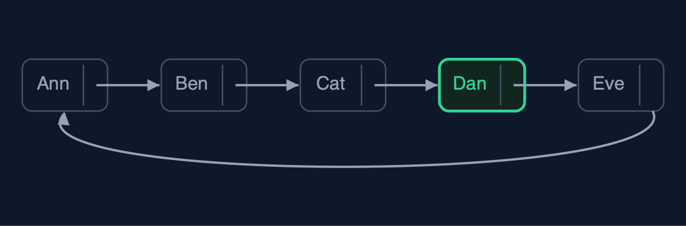

# Circular Linked List, Explained

## In one sentence

A circular linked list points its last node back to its first and keeps only last, so both ends are one step away, turns need no special case, and traversals stop when they come back round rather than at null.

## The picture


*The last node points back to the first; the list keeps only last, and last.next is the first node*

## The everyday idea

Picture friends sitting round a table playing a board game. When your turn ends, you pass the dice to your left. After the last person, the dice simply carry on to the first person again, because a circle has no last seat. A newcomer squeezes in between two players; someone who is out leaves their seat, and the person before them passes straight to the person after. Nobody ever has to say "we have reached the end, go back to the start".

## The 5 acts

### Act 1: Players in a straight line

With the players in an ordinary list, Ann -> Ben -> Cat -> Dan -> null, taking turns works until Dan. Dan's next is `null`: the line has ended, and every round a special case must send the turn back to Ann. In six turns that special case is needed once; in a long game, once every round.



**A straight line: Dan's next is null** Here is the straight line. Dan's next pointer is null. The turn has nowhere to go.

What the demo printed:

```
Ann -> Ben -> Cat -> Dan -> null
6 turns: Ann, Ben, Cat, Dan, Ann, Ben; after Dan the line ends, and 1 special case sends it back to Ann
```

### Act 2: Join the ends: last.next is the first node

In the circular list, Dan's next points back to Ann. The list keeps a single pointer, `last`, to Dan; the first node is `last.next`, Ann. So both ends are one step from one pointer, and building the table with `insertAtEnd` walks nowhere: 12 pointer changes for four players, and 0 steps. The display is a do-while from Ann round to Ann.



**A circle: Dan is last, and Dan's next is Ann** Here is the circle. Last points at Dan. Dan points back to Ann.

What the demo printed:

```
built with insertAtEnd: 0 steps, 12 pointer changes; the list keeps only last
display(): Ann -> Ben -> Cat -> Dan -> (back to Ann)
last = Dan, last.next = Ann: both ends are one step from one pointer
```

### Act 3: Turns, insertion and deletion

Six turns take six steps, with no special case: after Dan comes Ann. `insertAtBeginning("Eve")` puts Eve between Dan and Ann: 2 pointer changes. `insertAtEnd("Fay")` does the same and then moves `last` on to Fay: 3 pointer changes, no walking. `insertAtPosition(3, "Gus")` walks 2 steps to Ben and links Gus in after Ben. `deleteAtBeginning` removes Eve by pointing `last` past Eve's node: 1 pointer. `deleteAtEnd` must find the node before Fay, walking 4 steps round from Ann to Dan, because a singly linked circle cannot step back. `deleteByKey("Cat")` goes round comparing: 4 comparisons, 1 pointer change.



**insertAtEnd("Fay"): Fay goes in after Dan, then last moves on to Fay** Here is the insertion at the end. Fay goes in between Dan and the first player. Then last moves on to Fay. No walking at all.

What the demo printed:

```
6 turns: Ann, Ben, Cat, Dan, Ann, Ben; 6 steps, no special case
insertAtBeginning("Eve"): 0 steps, 2 pointer changes
insertAtEnd("Fay"): 0 steps, 3 pointer changes: insert at the beginning, then move last on
insertAtPosition(3, "Gus"): 2 steps, 2 pointer changes
deleteAtBeginning() removed Eve: 1 pointer change
deleteAtEnd() removed Fay: 4 steps round to the node before last
deleteByKey("Cat"): 4 comparisons, 1 pointer change
Ann -> Ben -> Gus -> Dan -> (back to Ann)
```

### Act 4: Waiting for null

Code written for a straight list waits for `null`, and a circular list has none: the loop went round the four players 250 times, 1,000 steps, until the demo stopped it. A circular traversal is a do-while: visit, move on, and stop when back at the first node. A list of one node is a circle of one, pointing to itself; when that node is deleted, `last` becomes `null` and the list is empty.



**A list of one node: Zoe's next is Zoe** Here is a circle of one. Zoe's node points to itself.

What the demo printed:

```
a loop "while (current != null)" walked 1000 steps and never found null; it was stopped
a circular traversal is a do-while that stops when it is back at the first node
a list of one node: Zoe -> (back to Zoe); its next points to itself
and when that player leaves: (empty), last is null
```

### Act 5: Counting out, and the bill

In the counting-out game, the players count round the circle and every third one leaves: Cat, then Ann, then Eve, then Ben, and Dan wins. Each removal is one pointer change, `prev.next = gone.next`, and the counting simply carries on past the last player, because there is no end: 8 steps and 4 pointer changes for the whole game. The bill: with no end to stop at, every traversal needs a starting node to come back to, and deleting at the end still walks. `java.util` has no circular linked list; `ArrayDeque` goes round a circular array instead.



**Every third player out; Dan is the winner** Here is the circle as the game ends. Four players out, in grey. Dan, in green, is left.

What the demo printed:

```
counting out every third player: out: Cat, Ann, Eve, Ben; winner Dan
8 steps and 4 pointer changes for the whole game
the bill: no end to stop at, so every traversal needs a starting node to come back to
already in Java: no circular linked list in java.util; ArrayDeque goes round a circular array instead
```

## The operations in code

### Insertion at the beginning

```java
/**
 * Insertion at the beginning: the new node goes between last and the old first node. O(1).
 * In an empty list, the new node points to itself and becomes last.
 */
public void insertAtBeginning(String data) {
    Node newNode = new Node(data);
    if (last == null) {
        newNode.next = newNode;     // a list of one node points to itself
        last = newNode;
        steps.pointer(2);
        return;
    }
    newNode.next = last.next;       // the new node points to the old first node
    last.next = newNode;            // last points to the new first node
    steps.pointer(2);
}
```

The new node goes between `last` and the old first node: it points to `last.next`, and `last` points to it. An empty list is the special case: the new node points to itself and becomes `last`.

### Insertion at the end

```java
/** Insertion at the end: insert at the beginning, then move last on to the new node. O(1). */
public void insertAtEnd(String data) {
    insertAtBeginning(data);
    last = last.next;               // the new node, now after last, becomes last
    steps.pointer(1);
}
```

The textbook trick: in a circle, the beginning and the end are the same place. Insert at the beginning, then move `last` on one node, and the new node is last instead of first. O(1).

### Display

```java
/** Display: from the first node round to the last, then back to the first. O(n). */
public String display() {
    if (last == null) {
        return "(empty)";
    }
    StringBuilder s = new StringBuilder();
    Node current = last.next;
    do {
        s.append(current.data).append(" -> ");
        current = current.next;
        steps.step();
    } while (current != last.next);     // stop when back at the first node
    return s.append("(back to ").append(last.next.data).append(')').toString();
}
```

There is no `null` to stop at, so the traversal is a do-while that starts at `last.next` and stops when it comes back to it. The body runs before the check, so a list of one node is displayed once.

### Deletion at the end

```java
/**
 * Deletion at the end: walk round to the node before last, point it at the first node, and make
 * it last. O(n): the node before last can only be found by walking.
 *
 * @throws IllegalStateException "underflow" when the list is empty
 */
public String deleteAtEnd() {
    if (last == null) {
        throw new IllegalStateException("underflow: the list is empty");
    }
    String data = last.data;
    if (last.next == last) {
        last = null;
        steps.pointer(1);
        return data;
    }
    Node prev = last.next;
    while (prev.next != last) {
        prev = prev.next;
        steps.step();
    }
    prev.next = last.next;
    last = prev;
    steps.pointer(2);
    return data;
}
```

The one end operation that is not O(1): the node before `last` must point to the first node and become `last`, and in a singly linked circle it can only be found by walking round.

### The counting-out game

```java
/**
 * The counting-out game: starting from the first node, count {@code k} players round the
 * circle and delete the k-th, again and again, until one is left. Returns the players in the
 * order they left, then the winner.
 */
public String countOut(int k) {
    StringBuilder out = new StringBuilder();
    Node prev = last;
    while (last != null && last.next != last) {
        for (int i = 1; i < k; i++) {
            prev = prev.next;
            steps.step();
        }
        Node gone = prev.next;
        prev.next = gone.next;              // the player before points past the one who is out
        steps.pointer(1);
        if (gone == last) {
            last = prev;
        }
        out.append(out.length() > 0 ? ", " : "").append(gone.data);
    }
    return "out: " + out + "; winner " + (last == null ? "none" : last.data);
}
```

`prev` counts k - 1 steps round the circle; the node after it is out, and `prev.next = gone.next` removes it. The circle never ends, so counting simply carries on past the last player.

## The operations, and what they cost

| Operation | What it does | Time: best / average / worst | Extra space | Steps counted in the demo |
| --- | --- | --- | --- | --- |
| Display / count | do-while from last.next until back at last.next | O(n) / O(n) / O(n) | O(1) | 4 steps for 4 players |
| Next turn | current = current.next, always, with no special case | O(1) / O(1) / O(1) | O(1) | 6 turns in 6 steps |
| Insert at beginning | newNode.next = last.next; last.next = newNode | O(1) / O(1) / O(1) | O(1) | 0 steps, 2 pointer changes |
| Insert at end | Insert at the beginning, then last = the new node | O(1) / O(1) / O(1) | O(1) | 0 steps, 3 pointer changes |
| Insert at position | Walk to the node before, then 2 pointers | O(1) at 0 / O(n) / O(n) | O(1) | 2 steps, 2 pointer changes |
| Delete at beginning | last.next = last.next.next | O(1) / O(1) / O(1) | O(1) | 1 pointer change |
| Delete at end | Walk round to the node before last; it points to the first and becomes last | O(n) / O(n) / O(n) | O(1) | 4 steps on 6 nodes |
| Delete by key / search | Go round once with prev and current | O(1) / O(n) / O(n) | O(1) | 4 comparisons, 1 pointer change |
| Counting out (k) | Count k round the circle, unlink, repeat until one is left | O(n k) / O(n k) / O(n k) | O(1) | 8 steps, 4 pointer changes for 5 players, k = 3 |

## Compared with related structures

How a circular linked list compares with its neighbours (n nodes):

| Operation | Circular list (last pointer) | Singly list (head only) | Doubly list (head, tail) |
| --- | --- | --- | --- |
| Insert at the beginning | O(1) | O(1) | O(1) |
| Insert at the end | O(1) | O(n) | O(1) |
| Delete at the beginning | O(1) | O(1) | O(1) |
| Delete at the end | O(n) | O(n) | O(1) |
| Next after the last node | the first node | null | null |
| Loop end condition | back at the start (do-while) | null | null |
| Pointers per node | 1 | 1 | 2 |

## The verdict

Use a circular list for anything that goes round: turns, round-robin scheduling, a looping playlist. When there is a real beginning and end, a straight list is clearer; when deletion at the end matters, a doubly linked circle.

## How to recognise it in code you did not write

- A list class holding only `last`, with `last.next` used as the first node.
- `do { ...; current = current.next; } while (current != last.next);`.
- `newNode.next = newNode` for a list of one.

## Where you have already met this

- Players taking turns, a carousel, the hands of a clock.
- Operating systems giving each program a turn of the processor (round-robin scheduling).
- `java.util.ArrayDeque` and circular buffers use the same wrap-around idea on an array.
