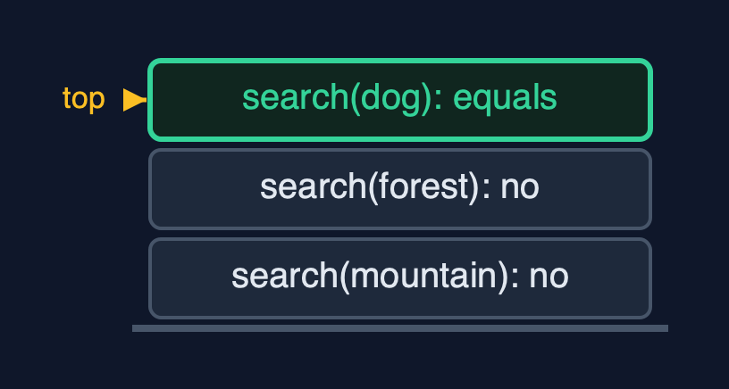

# Doubly Linked List (Generic, Recursive) — Cheat Sheet

**The generic recursive doubly linked list holds any type T in Node<T>s with prev and next, matches with equals, walks by recursion along next or prev, finds recursively and links in O(1), and works at both ends without recursion; each walk costs a frame per node.**

| | |
| --- | --- |
| **What it is** | The generic recursive doubly linked list matches Node<T> data with equals, walks by recursion along next or prev, links in O(1), and uses a frame per node walked. |
| **Everyday picture** | Guards on a train of any cargo, passing questions along either way |
| **Use it when** | Learning generic recursion over nodes with two pointers; Short lists |
| **Avoid it when** | Long lists: a million nodes overflow the call stack |
| **Already in Java** | Nothing: `java.util.LinkedList<E>` uses loops |

## Costs

| Operation | What it does | Time: best / average / worst | Extra space (call stack) | Same operation as a loop | Steps counted in the demo |
| --- | --- | --- | --- | --- | --- |
| Display forward / backward, count | Recurse along next from head, or prev from tail | O(n) / O(n) / O(n) | O(n) | O(1) | depth 5 for 5 nodes |
| Insert / delete at both ends | Through head or tail; no recursion | O(1) / O(1) / O(1) | O(1) | O(1) | depth 0 |
| Insert at position | Find the node before recursively, then 4 pointers | O(1) at 0 / O(n) / O(n) | O(pos) | O(1) | depth 2, 4 pointers |
| Delete by key / search | Recurse comparing with equals, then unlink in O(1) | O(1) / O(n) / O(n) | O(n) | O(1) | depth 3, 2 pointers; search depth 4 |
| Reverse | Swap prev and next, recurse on the old next | O(n) / O(n) / O(n) | O(n) | O(1) | depth 7, 16 pointer changes |

## Compared with related structures

The four doubly-linked-list projects side by side (n nodes):

| Property | Generic, recursive (this) | Generic, loops | String, recursive | String, loops |
| --- | --- | --- | --- | --- |
| Element types | any T | any T | String | String |
| Both ends | O(1), no recursion | O(1) | O(1), no recursion | O(1) |
| Walks | O(n) time and stack | O(n) time, O(1) space | O(n) time and stack | O(n) time, O(1) space |
| A million nodes | StackOverflowError | fine | StackOverflowError | fine |

## Watch out for

- **Matching with `==`**: Use `equals`.
- **Recursing on node.next after the swap in reverse**: Save the old next first.
- **Recursing to reach an end**: Use head and tail.
- **Recursing over long lists**: Use loops.
