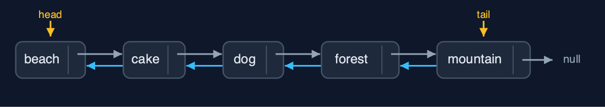
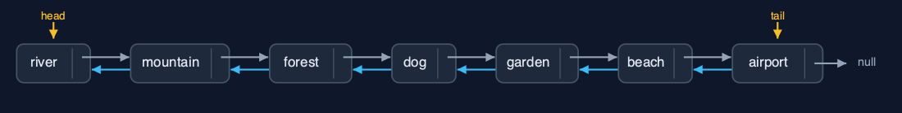

# Doubly Linked List (Generic, Recursive), Explained

## In one sentence

The generic recursive doubly linked list matches Node<T> data with equals, walks by recursion along next or prev, links in O(1), and uses a frame per node walked.

## The picture


*A recursive search along prev from the tail: mountain, forest, then dog equals*

## The everyday idea

Picture guards on a train carrying any kind of cargo. Asked whether a carriage holds a certain crate, a guard checks their own carriage and, if not, asks the next guard along, forwards or backwards, and waits. Each guard only needs to know how to compare two crates.

## The 5 acts

### Act 1: Recursion along prev, with equals

Starting at the tail, each call compares its photo with the key using `equals` and, if not equal, recurses on `prev`. Mountain and forest do not match; dog does, because a record's `equals` compares name and size: a base case. Display backward follows the same prev pointers to `null`, five calls deep.


**Three calls along prev; the third finds an equal Photo** Here are the three calls, from the tail backwards.

What the demo printed:

```
mountain 1200KB: not equal, recurse on prev
  forest 930KB: not equal, recurse on prev
    dog 610KB: equals   <- base case: found
tail -> mountain 1200KB <-> ... <-> beach 820KB <- head, depth 5
```

### Act 2: The same recursion, any type

The same recursive methods work on `Integer` sizes and `String` names: five calls deep each, whatever `T` is.



**Five names, linked both ways** Here are the names.

What the demo printed:

```
<Integer> count() = 5, depth 5
<String>  head -> beach <-> cake <-> dog <-> forest <-> mountain <- tail, depth 5
```

### Act 3: Both ends without recursion; the middle found recursively

Inserting at the beginning and the end uses head and tail: depth 0. In the middle, the node is found recursively and then linked in O(1): `search` finds the dog at depth 4; `insertAtPosition(3, garden)` finds the node before at depth 2 and sets 4 pointers; `deleteByKey(cake)` finds it at depth 3 and changes 2.


**After the changes: airport ... river, garden in, cake out** Here is the album now.

What the demo printed:

```
insertAtBeginning and insertAtEnd: depth 0, 6 pointer changes
search(new Photo("dog", 610)) = position 3: 4 equals calls, depth 4
insertAtPosition(3, garden 760KB): found at depth 2, 4 pointers set
deleteByKey(new Photo("cake", 540)): found at depth 3, 2 pointers changed
```

### Act 4: Reversal, recursively

Each call swaps its node's prev and next and recurses on the saved old next: seven calls deep for seven photos, 14 pointer changes, then head and tail swap: 16.



**The reversed album** Here is the reversed album.

What the demo printed:

```
reverse(): depth 7, 16 pointer changes
head -> river 880KB <-> mountain 1200KB <-> ... <-> airport 700KB <- tail
```

### Act 5: The limit of recursion

A million `insertAtEnd` calls need no recursion; counting the million recursively needs a frame per node and throws `StackOverflowError`. Generics change what each node refers to; recursion changes how much stack each walk needs.


**One frame per node: a million overflow** One call per node. Far too many.

What the demo printed:

```
count() of 1,000,000 nodes: StackOverflowError, one frame per node
generics change what each node refers to; recursion changes how much stack each walk needs
```

## The operations in code

### Delete by key: find recursively, unlink in O(1)

```java
/** Deletion by key: find the node recursively, then unlink it in O(1). O(n) time and stack. */
public boolean deleteByKey(T key) {
    Node<T> node = find(head, key);
    if (node == null) {
        return false;
    }
    deleteNode(node);
    return true;
}

private Node<T> find(Node<T> node, T key) {
    if (node == null) {
        return null;               // base case: not found
    }
    steps.enter();
    steps.compare();
    Node<T> result = node.data.equals(key) ? node : find(node.next, key);
    steps.exit();
    return result;
}
```

`find` compares with `equals` and recurses on `node.next`; `deleteNode` then points the neighbours at each other.

### Display backward

```java
/** Display backward: the same recursion, starting at the tail and following prev. O(n) time and stack. */
public String displayBackward() {
    StringBuilder s = new StringBuilder("tail -> ");
    if (tail == null) {
        s.append("null");
    }
    displayBackward(tail, s);
    return s.append(" <- head").toString();
}

private void displayBackward(Node<T> node, StringBuilder s) {
    if (node == null) {            // base case: past the head
        return;
    }
    steps.enter();
    steps.step();
    s.append(node.data).append(node.prev != null ? " <-> " : "");
    displayBackward(node.prev, s);
    steps.exit();
}
```

The same recursion as display forward, started at the tail and following `prev`.

### Reversal

```java
/**
 * Reverses the list: swap this node's prev and next, then reverse from the old next; finally
 * swap head and tail. O(n) time and stack.
 */
public void reverse() {
    reverse(head);
    Node<T> t = head;
    head = tail;
    tail = t;
    steps.pointer(2);
}

private void reverse(Node<T> node) {
    if (node == null) {            // base case: past the old tail
        return;
    }
    steps.enter();
    Node<T> oldNext = node.next;
    node.next = node.prev;
    node.prev = oldNext;
    steps.pointer(2);
    reverse(oldNext);
    steps.exit();
}
```

Swap `prev` and `next`, recurse on the saved old next; then swap head and tail.

## The operations, and what they cost

| Operation | What it does | Time: best / average / worst | Extra space (call stack) | Same operation as a loop | Steps counted in the demo |
| --- | --- | --- | --- | --- | --- |
| Display forward / backward, count | Recurse along next from head, or prev from tail | O(n) / O(n) / O(n) | O(n) | O(1) | depth 5 for 5 nodes |
| Insert / delete at both ends | Through head or tail; no recursion | O(1) / O(1) / O(1) | O(1) | O(1) | depth 0 |
| Insert at position | Find the node before recursively, then 4 pointers | O(1) at 0 / O(n) / O(n) | O(pos) | O(1) | depth 2, 4 pointers |
| Delete by key / search | Recurse comparing with equals, then unlink in O(1) | O(1) / O(n) / O(n) | O(n) | O(1) | depth 3, 2 pointers; search depth 4 |
| Reverse | Swap prev and next, recurse on the old next | O(n) / O(n) / O(n) | O(n) | O(1) | depth 7, 16 pointer changes |

## Compared with related structures

The four doubly-linked-list projects side by side (n nodes):

| Property | Generic, recursive (this) | Generic, loops | String, recursive | String, loops |
| --- | --- | --- | --- | --- |
| Element types | any T | any T | String | String |
| Both ends | O(1), no recursion | O(1) | O(1), no recursion | O(1) |
| Walks | O(n) time and stack | O(n) time, O(1) space | O(n) time and stack | O(n) time, O(1) space |
| A million nodes | StackOverflowError | fine | StackOverflowError | fine |

## The verdict

A study piece bridging lists and trees; use loops or `LinkedList<E>` in real code.

## How to recognise it in code you did not write

- `find(node.next, key)` or `find(node.prev, key)` with `node.data.equals(key)`.

## Where you have already met this

- `doubly-linked-list-generic` and `doubly-linked-list-recursive`.
