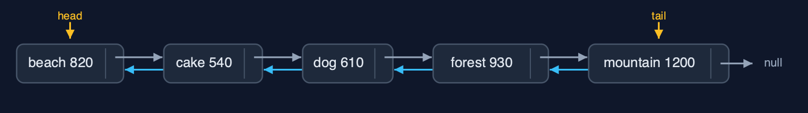
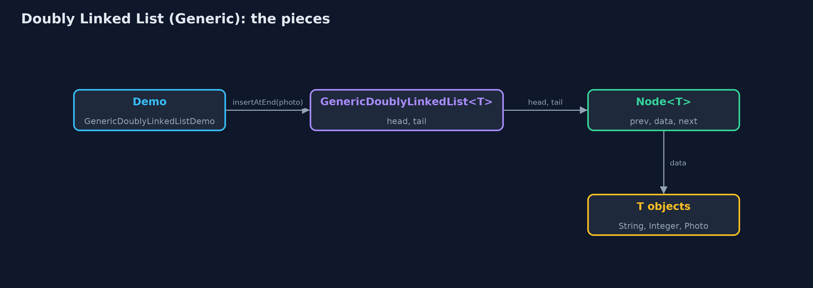
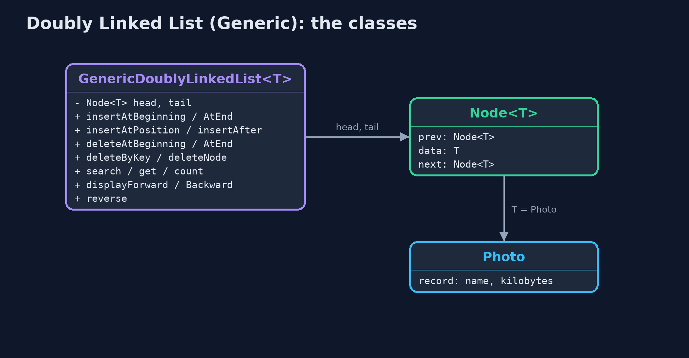
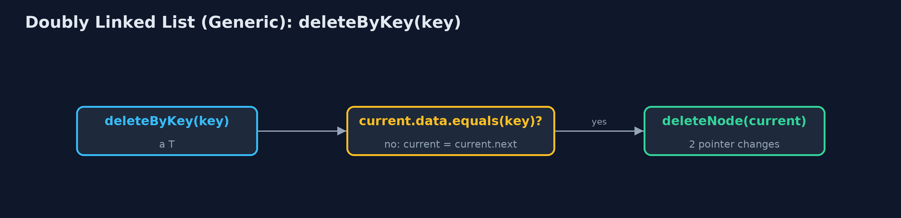
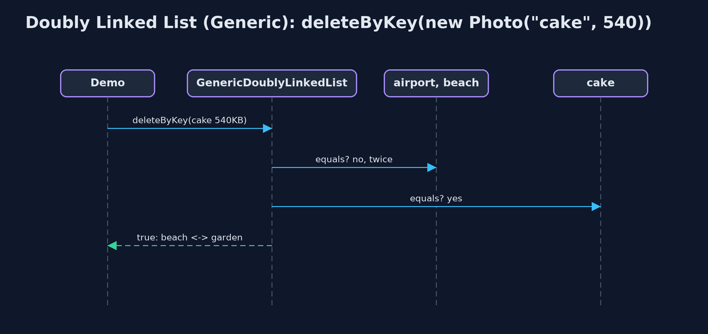

# Doubly Linked List (Generic)

**A generic doubly linked list is the doubly linked list written once with a type parameter T: each Node<T> has prev, a reference to its data, and next; the list keeps head and tail, matches with equals, and keeps every cost: O(1) at both ends, O(n) to reach a position. It is the shape of java.util.LinkedList<E>.**



*GenericDoublyLinkedList<Photo>: each Node<Photo> has prev, data and next; head and tail at the ends*

A **generic doubly linked list** is the `doubly-linked-list` project written once for **any element type**. Each `Node<T>` has a **prev** pointer, a **reference** to its `T` data, and a **next** pointer; the list keeps **head** and **tail**. The same class holds photo names (`String`), sizes (`Integer`) or `Photo` records, and the compiler checks each use. Nodes are matched with **`equals`**; `T` needs no ordering. Every operation and cost is unchanged: O(1) insertion and deletion at both ends and at a node already reached, O(n) to reach a position. This is, in outline, how `java.util.LinkedList<E>` is built.

> New to data structures? Read [Start here](../../START-HERE.md) first: it explains memory, references and counting steps in ten minutes.

## The everyday idea

Picture a train whose carriages are coupled front and back, and can carry any cargo: passengers, coal, cars. The couplings work the same whatever is inside. A guard can walk either way, carriages can be added or removed at either end, and to ask whether a carriage carries "a dog photo of 610 kilobytes" you look at the cargo's description, not at the carriage.

## The worked example: A photo viewer of Photo records, beside names and sizes

The photo viewer from `doubly-linked-list`, now holding `Photo(name, kilobytes)` records, beside the same class holding the names and the sizes. The demo inspects a node, works at both ends, searches for and deletes a separately made `Photo`, inserts at a position, and reverses the sizes and the names with the same code.

## Why it exists

A list of photos, a list of names and a list of sizes should not need three copies of the same doubly-linked-list code. A type parameter gives one class for all of them, checked by the compiler, with no casts: nodes are created as `new Node<>(data)`. Java's own `LinkedList<E>` is exactly this.

## New words

| Word | What it means here |
| --- | --- |
| **Node<T>** | A node with `prev`, `T data` and `next`. |
| **reference** | What `data` holds: the address of the object, not a copy. |
| **head and tail** | The first and last node; both ends are one step away. |
| **equals** | How nodes are matched: by contents. A record's `equals` compares its fields. |

## What you will see, act by act

Run the demo and it tells the story in 5 acts, printing the real numbers that the tests check:

```bash
./gradlew run
```

| Act | What it shows |
| --- | --- |
| 1. One class, any element type | One class holds String names, Integer sizes (displayed backward) and Photo records. |
| 2. Node<T>: prev, a reference to the data, next | The head's prev is null and its next holds cake; the tail's next is null and its prev holds forest. |
| 3. Both ends, and equals in the middle | Insert at both ends: 0 steps, 6 pointers; search finds a new Photo("dog", 610) at position 3 with 4 equals comparisons; insertAtPosition sets 4 pointers; deleteByKey finds cake in 3 comparisons and changes 2. |
| 4. Deleting at the ends through head and tail | deleteAtBeginning and deleteAtEnd: 0 steps, 4 pointer changes together; an empty list is an underflow. |
| 5. The same algorithm for every type | reverse() makes 12 pointer changes on five Integers and on five Strings, with the same code. |

Each act is drawn step by step in [the explained walkthrough](docs/doubly-linked-list-generic-explained.md) and in [the animation](docs/animation.html).

## The operations, and what they cost

Time is given for the best, average and worst case in Big-O notation (START-HERE.md explains it by counting steps); the last column is what the demo actually counted, so every formula can be checked against a real number.

| Operation | What it does | Time: best / average / worst | Extra space | Steps counted in the demo |
| --- | --- | --- | --- | --- |
| Display forward / backward | Follow next from head, or prev from tail | O(n) / O(n) / O(n) | O(1) | 5 steps each way for 5 photos |
| Insert / delete at beginning or end | Through head or tail: 3 pointers to insert, 2 to delete | O(1) / O(1) / O(1) | O(1) | 0 steps |
| Insert at position | Walk to the node before, then set 4 pointers | O(1) at the ends / O(n) / O(n) | O(1) | 4 pointer changes |
| Delete a node already reached | node.prev.next = node.next; node.next.prev = node.prev | O(1) / O(1) / O(1) | O(1) | 2 pointer changes |
| Delete by key / search | Walk comparing with equals, then unlink | O(1) / O(n) / O(n) | O(1) | 3 comparisons, 2 pointer changes |
| Count / get | Walk from head | O(n) / O(n) / O(n) | O(1) | one step per node |
| Reverse | Swap prev and next in every node, then head and tail | O(n) / O(n) / O(n) | O(1) | 12 pointer changes for 5 nodes |

Extra space is the memory an operation needs besides the structure itself. A loop needs a fixed amount, O(1); a recursive operation needs one call-stack frame for every call still waiting, so its extra space is the depth of the recursion.

## The operations in code

### Insertion at the end

```java
/** Insertion at the end, through the tail pointer: no traversal. O(1). */
public Node<T> insertAtEnd(T data) {
    Node<T> newNode = new Node<>(data);
    if (tail == null) {
        head = newNode;
        tail = newNode;
        steps.pointer(2);
    } else {
        newNode.prev = tail;        // the new node's prev is the old last node
        tail.next = newNode;        // the old last node's next is the new node
        tail = newNode;
        steps.pointer(3);
    }
    return newNode;
}
```

`new Node<>(data)` needs no cast, unlike a generic array. Then the tail's three pointers, exactly as in the String-only list.

### Deletion by key with equals

```java
/** Deletion by key: search for the first node holding {@code key}, then unlink it. O(n). */
public boolean deleteByKey(T key) {
    for (Node<T> current = head; current != null; current = current.next) {
        steps.compare();
        if (current.data.equals(key)) {
            deleteNode(current);
            return true;
        }
        steps.step();
    }
    return false;
}
```

`current.data.equals(key)` compares contents, so a separately made `Photo("cake", 540)` is found; `deleteNode` then unlinks it with two pointer changes.

### Deletion of a node

```java
/**
 * Deletes a node already reached: its predecessor's {@code next} and its successor's
 * {@code prev} are set past it (or head and tail, at the ends). O(1): the node knows its
 * predecessor, so no search is needed.
 */
public void deleteNode(Node<T> node) {
    if (node.prev == null) {
        head = node.next;           // deleting the first node
    } else {
        node.prev.next = node.next;
    }
    if (node.next == null) {
        tail = node.prev;           // deleting the last node
    } else {
        node.next.prev = node.prev;
    }
    steps.pointer(2);
}
```

The O(1) unlink every deletion ends in: neighbours pointed at each other, `head` or `tail` moved at the ends.

## Compared with related structures

The generic doubly linked list against its neighbours (n nodes):

| Property | Generic doubly list | Doubly list of String | Generic singly list |
| --- | --- | --- | --- |
| Element types | any T | String only | any T |
| Insert / delete at the end | O(1) | O(1) | O(n) |
| Delete a node already reached | O(1) | O(1) | O(n) |
| Walk backwards | yes | yes | no |
| Pointers per node | 2 | 2 | 1 |
| Java's own | LinkedList<E> | LinkedList<String> |  |

## The code

```
src/main/java/com/jk/explore/doublylinkedlistgeneric/
├── GenericDoublyLinkedList.java      A generic doubly linked list, holding data of any type {@code T}: every node has a {@code prev} and a {@code next} pointer, and the list keeps pointers to both ends, {@code head} and {@code tail}
├── GenericDoublyLinkedListDemo.java  Tells the story of the generic doubly linked list in five acts, printing the real step counts
├── Lines.java                        The demo's printed lines, kept in one {@code StringBuilder} so the tests can check them
├── Node.java                         A node of a doubly linked list: its data, a pointer to the previous node and a pointer to the next node, as {@code struct node { data; struct node prev, next; }} in a C textbook
├── Photo.java                        One photo in the viewer: a type of our own, to show that the generic list holds any type
└── StepCounter.java                  Counts what a doubly-linked-list operation costs: traversal steps (following one next or prev pointer), comparisons (checking one node's data against a key), and pointer changes (setting one head, tail, next or prev pointer)
```

## Test

```bash
./gradlew test
```

19 tests in `DemoRunsTest`, `GenericDoublyLinkedListTest`. Every number the demo prints is asserted, and nothing depends on the clock, so every run gives the same result.

## Common mistakes

| The mistake | What goes wrong | The fix |
| --- | --- | --- |
| Matching with `==` | An equal object made elsewhere is not found. | Use `equals`. |
| Forgetting one of the four insertion pointers | Forwards and backwards walks disagree. | Set all four, as in the String-only list. |
| Raw types | `Node` or `GenericDoublyLinkedList` without angle brackets switches off the compiler's checks. | Always write the type argument. |
| Not updating head or tail at the ends | A deleted node stays reachable from head or tail. | Move `head` or `tail` when the deleted node has no prev or no next. |

## Try it yourself

1. **Easy.** Write `int totalKilobytes(GenericDoublyLinkedList<Photo> album)` walking from the head with `head()`, `next()` and `data()`. What does it return for the five photos?
2. **Medium.** Write `void moveToFront(Node<T> node)` for the generic list. Why is it O(1), and which structure uses it?
3. **Harder.** Write `T removeFirstLargerThan(T limit)`, which deletes and returns the first element greater than `limit`. What must change in the class header for `compareTo` to be available, and what does that cost the class?

The answers are in [docs/exercises.md](docs/exercises.md), below the questions, so they are not given away.

## When to use it

- Any list of objects of one type that is walked both ways or changed at both ends.
- A deque or an LRU cache of any element type.

## When not to

- Reading by position: use `ArrayList<E>`.
- Memory is tight: each element costs a node with two pointers plus the object.

## Where you have already met this

- `java.util.LinkedList<E>` and `Deque<E>`.
- Browser history and music playlists holding page or track objects.

## Technologies and versions

| Technology | Version | Used for |
| --- | --- | --- |
| Java | 25 | the code (toolchain set in `build.gradle`; Gradle fetches JDK 25 if it is missing) |
| Gradle | 9.8.0 (wrapper) | build and run, nothing to install |
| JUnit | 6.1.3 | the tests |
| videokit | course tool | the narrated video and animation: Piper `en_US-amy-medium`, speed 0.8, longer pauses (the `amy-slow` voice) |

## Learning material

| Document | What it is for |
| --- | --- |
| [Start here](../../START-HERE.md) | the ideas every project relies on |
| [Problem statement](docs/problem-statement.md) | the situation and what the project must show |
| [Prerequisites](docs/prerequisites.md) | what you need to know first |
| [Doubly Linked List (Generic), explained](docs/doubly-linked-list-generic-explained.md) | every act, picture by picture |
| [Animated walkthrough](docs/animation.html) | the structure changing step by step, narrated |
| [Cheat sheet](docs/cheat-sheet.md) | the whole structure on one page |
| [Exercises and answers](docs/exercises.md) | practice, easy to harder |
| [Session guide](docs/session.md) | a one-hour lesson |
| [Specification](docs/spec.md) | what this project must be true of |

### How the pieces fit

One generic class; each Node<T> refers to its neighbours and its data object.



### The classes

`GenericDoublyLinkedList<T>` holds head and tail; `Photo` is one T.



### How the data moves

Walk matching with equals, then unlink in O(1).



### Who calls whom, in order

Three equals comparisons, then two pointer changes.



### Video

`video/doubly-linked-list-generic-explained.mp4` (with `.m4a` audio and `.srt` subtitles) is built by `video/build_video.sh`. Rendered media is not committed.

## Where this sits

Part of the [data structures course](../../index.md), in *arrays-and-lists*.
