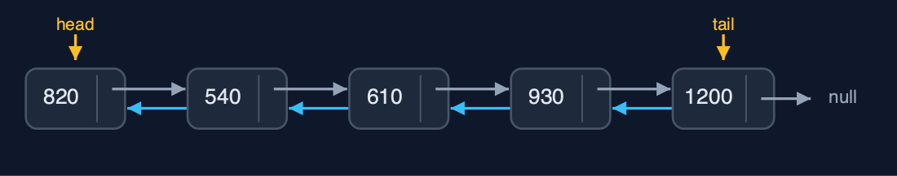
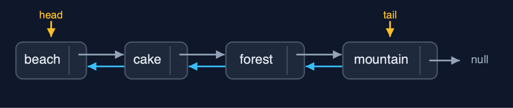
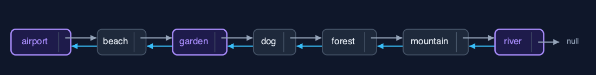
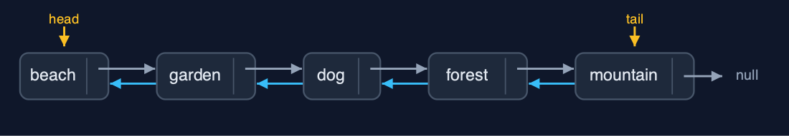
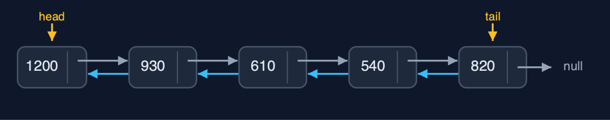

# Doubly Linked List (Generic), Explained

## In one sentence

A generic doubly linked list is the doubly linked list with a type parameter: Node<T> with prev, data and next, head and tail, equals for matching, and the same O(1) work at both ends.

## The picture


*GenericDoublyLinkedList<Photo>: each Node<Photo> has prev, data and next; head and tail at the ends*

## The everyday idea

Picture a train whose carriages are coupled front and back, and can carry any cargo: passengers, coal, cars. The couplings work the same whatever is inside. A guard can walk either way, carriages can be added or removed at either end, and to ask whether a carriage carries "a dog photo of 610 kilobytes" you look at the cargo's description, not at the carriage.

## The 5 acts

### Act 1: One class, any element type

`GenericDoublyLinkedList<String>` holds the five names, `GenericDoublyLinkedList<Integer>` the sizes in kilobytes, displayed here backward from the tail, and `GenericDoublyLinkedList<Photo>` records of our own. All three are built with `insertAtEnd` through the tail, and walked by the same code in either direction.



**Sizes as Integers, linked both ways** Here are the sizes. Integers, linked both ways, with head and tail.

What the demo printed:

```
<String>:  head -> beach <-> cake <-> dog <-> forest <-> mountain <- tail
<Integer>: tail -> 1200 <-> 930 <-> 610 <-> 540 <-> 820 <- head
<Photo>:   head -> beach 820KB <-> ... <-> mountain 1200KB <- tail
```

### Act 2: Node<T>: prev, a reference to the data, next

Each `Node<Photo>` holds three references: `prev`, `data` and `next`. The head's `prev` is `null`, and its `next` leads to the node holding the cake photo. The tail's `next` is `null`, and its `prev` leads to the forest. `data` refers to the `Photo` object itself; the node holds no copy.



**The ends: null before the head, null after the tail** Here are the two ends. Nothing before the head, nothing after the tail.

What the demo printed:

```
head.data = beach 820KB, head.prev = null, head.next.data = cake 540KB
tail.data = mountain 1200KB, tail.prev.data = forest 930KB, tail.next = null
```

### Act 3: Both ends, and equals in the middle

Inserting "airport" at the beginning and "river" at the end walks nowhere: 6 pointer changes through `head` and `tail`. A separately made `Photo("dog", 610)` is found at position 3 after 4 comparisons, because a record's `equals` compares name and size. `insertAtPosition(3, garden)` sets 4 pointers, and `deleteByKey(new Photo("cake", 540))` compares 3 nodes and unlinks cake with 2 pointer changes.



**After the changes: airport ... river, with garden in and cake out** Here is the album now.

What the demo printed:

```
insertAtBeginning and insertAtEnd: 0 steps, 6 pointer changes
search(new Photo("dog", 610)) = position 3: 4 comparisons; equals compares name and size
insertAtPosition(3, garden 760KB): 4 pointer changes
deleteByKey(new Photo("cake", 540)) = true: 3 comparisons, 2 pointer changes
```

### Act 4: Deleting at the ends through head and tail

Deleting "airport" at the beginning and "river" at the end uses `head` and `tail` directly: no walking, 2 pointer changes each. Deleting from an empty list is refused as an underflow.



**Both ends removed in O(1)** Here is the album without its two ends.

What the demo printed:

```
deleteAtBeginning() = airport 700KB, deleteAtEnd() = river 880KB: 0 steps, 4 pointer changes
an empty list, deleteAtBeginning(): underflow: the list is empty
```

### Act 5: The same algorithm for every type

`reverse` swaps each node's prev and next and then swaps head and tail: 12 pointer changes for five sizes, and the same 12 for five names. Generics change the element type, not the algorithm or its cost. Java's `LinkedList<E>` is a generic doubly linked list of exactly this kind.



**The reversed sizes** Here are the reversed sizes.

What the demo printed:

```
<Integer> reverse(): 12 pointer changes; head -> 1200 <-> 930 <-> 610 <-> 540 <-> 820 <- tail
<String>  reverse(): 12 pointer changes, the very same code
already in Java: java.util.LinkedList<E>, a generic doubly linked list with head and tail
```

## The operations in code

### Insertion at the end

```java
/** Insertion at the end, through the tail pointer: no traversal. O(1). */
public Node<T> insertAtEnd(T data) {
    Node<T> newNode = new Node<>(data);
    if (tail == null) {
        head = newNode;
        tail = newNode;
        steps.pointer(2);
    } else {
        newNode.prev = tail;        // the new node's prev is the old last node
        tail.next = newNode;        // the old last node's next is the new node
        tail = newNode;
        steps.pointer(3);
    }
    return newNode;
}
```

`new Node<>(data)` needs no cast, unlike a generic array. Then the tail's three pointers, exactly as in the String-only list.

### Deletion by key with equals

```java
/** Deletion by key: search for the first node holding {@code key}, then unlink it. O(n). */
public boolean deleteByKey(T key) {
    for (Node<T> current = head; current != null; current = current.next) {
        steps.compare();
        if (current.data.equals(key)) {
            deleteNode(current);
            return true;
        }
        steps.step();
    }
    return false;
}
```

`current.data.equals(key)` compares contents, so a separately made `Photo("cake", 540)` is found; `deleteNode` then unlinks it with two pointer changes.

### Deletion of a node

```java
/**
 * Deletes a node already reached: its predecessor's {@code next} and its successor's
 * {@code prev} are set past it (or head and tail, at the ends). O(1): the node knows its
 * predecessor, so no search is needed.
 */
public void deleteNode(Node<T> node) {
    if (node.prev == null) {
        head = node.next;           // deleting the first node
    } else {
        node.prev.next = node.next;
    }
    if (node.next == null) {
        tail = node.prev;           // deleting the last node
    } else {
        node.next.prev = node.prev;
    }
    steps.pointer(2);
}
```

The O(1) unlink every deletion ends in: neighbours pointed at each other, `head` or `tail` moved at the ends.

## The operations, and what they cost

| Operation | What it does | Time: best / average / worst | Extra space | Steps counted in the demo |
| --- | --- | --- | --- | --- |
| Display forward / backward | Follow next from head, or prev from tail | O(n) / O(n) / O(n) | O(1) | 5 steps each way for 5 photos |
| Insert / delete at beginning or end | Through head or tail: 3 pointers to insert, 2 to delete | O(1) / O(1) / O(1) | O(1) | 0 steps |
| Insert at position | Walk to the node before, then set 4 pointers | O(1) at the ends / O(n) / O(n) | O(1) | 4 pointer changes |
| Delete a node already reached | node.prev.next = node.next; node.next.prev = node.prev | O(1) / O(1) / O(1) | O(1) | 2 pointer changes |
| Delete by key / search | Walk comparing with equals, then unlink | O(1) / O(n) / O(n) | O(1) | 3 comparisons, 2 pointer changes |
| Count / get | Walk from head | O(n) / O(n) / O(n) | O(1) | one step per node |
| Reverse | Swap prev and next in every node, then head and tail | O(n) / O(n) / O(n) | O(1) | 12 pointer changes for 5 nodes |

## Compared with related structures

The generic doubly linked list against its neighbours (n nodes):

| Property | Generic doubly list | Doubly list of String | Generic singly list |
| --- | --- | --- | --- |
| Element types | any T | String only | any T |
| Insert / delete at the end | O(1) | O(1) | O(n) |
| Delete a node already reached | O(1) | O(1) | O(n) |
| Walk backwards | yes | yes | no |
| Pointers per node | 2 | 2 | 1 |
| Java's own | LinkedList<E> | LinkedList<String> |  |

## The verdict

This is `java.util.LinkedList<E>`, built by hand; use the library one in real code, and choose it over `ArrayList<E>` only for heavy work at both ends or at nodes already reached.

## How to recognise it in code you did not write

- `class Node<T> { Node<T> prev; T data; Node<T> next; }`.
- `head` and `tail` fields in a generic list class.

## Where you have already met this

- `java.util.LinkedList<E>` and `Deque<E>`.
- Browser history and music playlists holding page or track objects.
