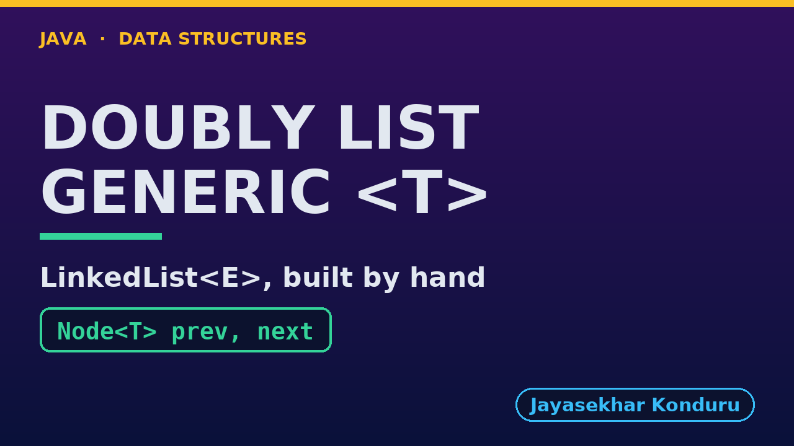

# YouTube — Doubly Linked List (Generic)

Everything needed to publish `video/doubly-linked-list-generic-explained.mp4`. Copy the fields straight out of this file.

Chapter timings come from the video's `.srt`; they are regenerated whenever the video is rebuilt.

## Title

```
Generic Doubly Linked List in Java - Build Your Own LinkedList<E>
```

65 characters (YouTube shows about 60 before cutting a title off in search).

## Description

The first two lines are what a viewer sees above the fold, so they carry the hook rather than the boilerplate.

```
Generic Doubly Linked List in Java, explained with a photo viewer of Photo records, beside the same class holding names and sizes. We look inside Node<T>: a prev pointer, a reference to the data, and a next pointer, with null at both ends. We insert at both ends through head and tail with no walking, search for a separately made Photo that equals finds because a record compares its fields, insert at a position with four pointers, delete by key with two, and delete at both ends in O(1). We finish by reversing a list of Integers and a list of Strings with the very same code: the shape of java.util.LinkedList.

CHAPTERS
00:00 Introduction
00:37 The Everyday Idea
00:55 The Words
01:13 Act One — One class, any element type
01:33 One class, any element type
01:40 Act Two — Node<T>: prev, a reference to the data, next
01:57 Node<T>: prev, a reference to the data, next
02:04 Act Three — Both ends, and equals in the middle
02:23 Both ends, and equals in the middle
02:26 Act Four — Deleting at the ends through head and tail
02:40 Deleting at the ends through head and tail
02:44 Act Five — The same algorithm for every type
03:03 The same algorithm for every type
03:07 Time and Space Complexity
03:30 Compared With Related Structures
03:53 Common Mistakes
04:08 Thanks for Watching

SOURCE CODE, WRITTEN NOTES AND AN INTERACTIVE ANIMATION
https://github.com/jk-boot-up/datastructures/tree/main/gradle-java/arrays-and-lists/doubly-linked-list-generic

WHAT YOU NEED FIRST
Java basics: variables, loops, classes and methods. No data-structures knowledge is assumed; START-HERE.md in the repository explains memory, references and counting steps.
```

## Chapters

YouTube shows these as chapters because there are at least three and the first is at `00:00`.

```
00:00 Introduction
00:37 The Everyday Idea
00:55 The Words
01:13 Act One — One class, any element type
01:33 One class, any element type
01:40 Act Two — Node<T>: prev, a reference to the data, next
01:57 Node<T>: prev, a reference to the data, next
02:04 Act Three — Both ends, and equals in the middle
02:23 Both ends, and equals in the middle
02:26 Act Four — Deleting at the ends through head and tail
02:40 Deleting at the ends through head and tail
02:44 Act Five — The same algorithm for every type
03:03 The same algorithm for every type
03:07 Time and Space Complexity
03:30 Compared With Related Structures
03:53 Common Mistakes
04:08 Thanks for Watching
```

## Tags

```
generic doubly linked list, java generics, LinkedList<E>, doubly linked list, Node<T>, equals, data structures, java data structures, java, java 25, algorithms, computer science, programming tutorial, beginner, big o
```

216 characters, under YouTube's 500 limit.

## Thumbnail



Upload `docs/thumbnail.png` (1280×720) under **Details → Thumbnail → Upload file**. It is made for the small size YouTube shows in search: the name, one line of promise and one piece of code.

## Upload checklist

- [ ] Upload `video/doubly-linked-list-generic-explained.mp4` (1080p, H.264, 30 fps, AAC 48 kHz)
- [ ] Set the video language to **English**, then add subtitles: *Upload file → With timing* → `video/doubly-linked-list-generic-explained.srt`
- [ ] Upload `docs/thumbnail.png` as the thumbnail
- [ ] Paste the title, description and tags from above
- [ ] Add to the **Data Structures in Java** playlist
- [ ] Wait for 1080p processing before sharing the link

## Runtime

04:51.
