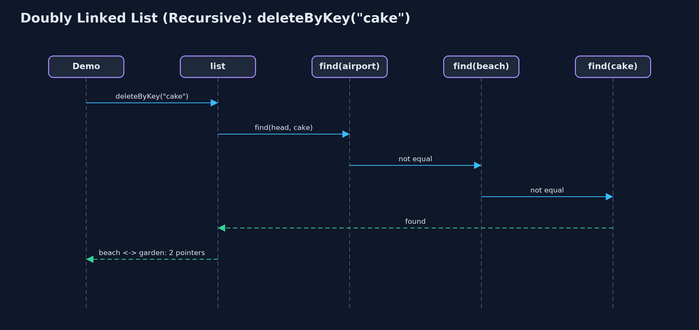

# Doubly Linked List (Recursive)

**The recursive doubly linked list walks by calling itself on node.next, or on node.prev from the tail; it finds nodes recursively and then links or unlinks them in O(1), and works at both ends with no recursion at all; each walk costs one call-stack frame per node visited.**


*displayBackward: each call prints its node, then recurses on prev, down to null*

A **doubly linked list** gives every node a **prev** and a **next** pointer and keeps **head** and **tail**. This project writes its walks **recursively**. Forwards, a list is empty or a node followed by the list from `node.next`; backwards, the same with `node.prev`, starting at the tail. So the same recursive shape displays the list in either direction. Finding a node is recursive; linking it in or unlinking it is the usual O(1) pointer work, because a doubly linked list can change a node without searching for its predecessor. Insertion and deletion at the ends need no walk and no recursion. The time of every operation is that of `doubly-linked-list`; a recursive walk costs one call-stack **frame** per node.

> New to data structures? Read [Start here](../../START-HERE.md) first: it explains memory, references and counting steps in ten minutes.

## The everyday idea

Picture a guard on a train asked how many carriages are behind them. They do not walk the train; they ask the guard in the next carriage back and wait, and so on to the last carriage, where the answer is "none behind me". The answers come back up, each guard adding one. The same could be done towards the front. Taking a carriage out, once the right one is found, is still just uncoupling two neighbours.

## The worked example: A photo viewer whose walks are recursive, forwards and backwards

The photo album from `doubly-linked-list`: beach, cake, dog, forest and mountain. The demo traces a recursive backward display, displays forward, inserts and deletes at the ends, counts, searches, inserts at a position and deletes by key, reverses the list recursively, and finally counts a million photos.

## Why it exists

A doubly linked list shows that recursion is about the walk, not the structure: the same recursion runs along `next` or along `prev`. It also separates the two costs of an operation, finding and changing, and shows that only the finding needs recursion here. The call stack is the price: one frame per node on every recursive walk.

## New words

| Word | What it means here |
| --- | --- |
| **prev and next** | The pointers to the node before and after; a recursion can follow either. |
| **base case** | `null`: past the tail going forwards, past the head going backwards; or the node being looked for. |
| **find, then link** | The recursive part finds a node; the pointer changes are then O(1), with no recursion. |
| **recursion depth** | The most frames on the call stack at once: one per node walked. |

## What you will see, act by act

Run the demo and it tells the story in 5 acts, printing the real numbers that the tests check:

```bash
./gradlew run
```

| Act | What it shows |
| --- | --- |
| 1. The same recursion in both directions | displayBackward starts at the tail and recurses on prev, 5 calls deep; displayForward does the same on next from the head. |
| 2. Both ends need no recursion | Inserting at both ends and deleting at the end: depth 0, through head and tail; count() recurses 6 deep. |
| 3. Find recursively, link in O(1) | search("forest") is 5 comparisons at depth 5; insertAtPosition(3) finds the node before at depth 2 and sets 4 pointers; deleteByKey("cake") finds it at depth 3 and changes 2. |
| 4. Reversal, recursively | reverse swaps each node's prev and next and recurses on the old next: depth 5, 12 pointer changes with head and tail. |
| 5. The limit of recursion | A million photos inserted at the end with no recursion; counting them recursively throws StackOverflowError. |

Each act is drawn step by step in [the explained walkthrough](docs/doubly-linked-list-recursive-explained.md) and in [the animation](docs/animation.html).

## The operations, and what they cost

Time is given for the best, average and worst case in Big-O notation (START-HERE.md explains it by counting steps); the last column is what the demo actually counted, so every formula can be checked against a real number.

| Operation | What it does | Time: best / average / worst | Extra space (call stack) | Same operation as a loop | Steps counted in the demo |
| --- | --- | --- | --- | --- | --- |
| Display forward / backward | This node, then recurse on next (or prev, from the tail) | O(n) / O(n) / O(n) | O(n) | O(1) | depth 5 each way for 5 photos |
| Count | 0 for null, otherwise 1 + count(node.next) | O(n) / O(n) / O(n) | O(n) | O(1) | 6, depth 6 |
| Insert / delete at beginning or end | Change head or tail and one neighbour: no walk | O(1) / O(1) / O(1) | O(1) | O(1) | depth 0; 3 pointers per insertion |
| Insert at position | Find the node before recursively, then set 4 pointers | O(1) at 0 / O(n) / O(n) | O(pos) | O(1) | depth 2, 4 pointers |
| Delete by key | Find the node recursively, then unlink it with 2 pointers | O(1) / O(n) / O(n) | O(n) | O(1) | depth 3, 2 pointers |
| Search / get | Match here, or recurse on node.next | O(1) / O(n) / O(n) | O(n) | O(1) | 5 comparisons, depth 5 |
| Reverse | Swap prev and next here, recurse on the old next; then swap head and tail | O(n) / O(n) / O(n) | O(n) | O(1) | depth 5, 12 pointer changes |

Extra space is the memory an operation needs besides the structure itself. A loop needs a fixed amount, O(1); a recursive operation needs one call-stack frame for every call still waiting, so its extra space is the depth of the recursion.

## The operations in code

### Display backward

```java
/** Display backward: the same recursion, starting at the tail and following prev. O(n) time and stack. */
public String displayBackward() {
    StringBuilder s = new StringBuilder("tail -> ");
    if (tail == null) {
        s.append("null");
    }
    displayBackward(tail, s);
    return s.append(" <- head").toString();
}

private void displayBackward(Node node, StringBuilder s) {
    if (node == null) {            // base case: past the head
        return;
    }
    steps.enter();
    steps.step();
    s.append(node.data).append(node.prev != null ? " <-> " : "");
    displayBackward(node.prev, s);
    steps.exit();
}
```

The public method starts at `tail`; the private one appends this node and recurses on `node.prev`. It is `displayForward` with `next` replaced by `prev`: the recursion does not care which way the pointers go.

### Delete by key: find recursively, unlink in O(1)

```java
/** Deletion by key: find the node recursively, then unlink it in O(1). O(n) time and stack. */
public boolean deleteByKey(String key) {
    Node node = find(head, key);
    if (node == null) {
        return false;
    }
    deleteNode(node);
    return true;
}

private Node find(Node node, String key) {
    if (node == null) {
        return null;               // base case: not found
    }
    steps.enter();
    steps.compare();
    Node result = node.data.equals(key) ? node : find(node.next, key);
    steps.exit();
    return result;
}
```

`find` is recursive: the empty list or a match is the base case. Once the node is found, `deleteNode` points its two neighbours at each other, with no predecessor search and no recursion.

### Reversal

```java
/**
 * Reverses the list: swap this node's prev and next, then reverse from the old next; finally
 * swap head and tail. O(n) time and stack.
 */
public void reverse() {
    reverse(head);
    Node t = head;
    head = tail;
    tail = t;
    steps.pointer(2);
}

private void reverse(Node node) {
    if (node == null) {            // base case: past the old tail
        return;
    }
    steps.enter();
    Node oldNext = node.next;
    node.next = node.prev;
    node.prev = oldNext;
    steps.pointer(2);
    reverse(oldNext);
    steps.exit();
}
```

Each call swaps its node's `prev` and `next`, then recurses on the old next, saved before the swap. When the recursion runs past the old tail, the public method swaps `head` and `tail`.

## Compared with related structures

The recursive doubly linked list against the loop version and the recursive singly list (n nodes):

| Operation | Recursive doubly list | Doubly list (loops) | Recursive singly list |
| --- | --- | --- | --- |
| Insert / delete at both ends | O(1), no recursion | O(1) | O(1) at the beginning; O(n) time and stack at the end |
| Display backward | O(n) time and stack, from tail | O(n) time, O(1) space | O(n) time and stack, after the call |
| Delete by key | find O(n) stack, unlink O(1) | O(n) time, O(1) space | O(n) time and stack |
| Reverse | O(n) time and stack | O(n) time, O(1) space | O(n) time and stack |
| A million nodes | StackOverflowError | fine | StackOverflowError |

## The code

```
src/main/java/com/jk/explore/doublylinkedlistrecursive/
├── Lines.java                          The demo's printed lines, kept in one {@code StringBuilder} so the tests can check them
├── Node.java                           A node of a doubly linked list: its data, a pointer to the previous node and a pointer to the next node, as {@code struct node { data; struct node prev, next; }} in a C textbook
├── RecursiveDoublyLinkedList.java      A doubly linked list whose walks are written recursively
├── RecursiveDoublyLinkedListDemo.java  Tells the story of the recursive doubly linked list in five acts, printing the real counts and the real depth of every recursion
└── StepCounter.java                    Counts what a doubly-linked-list operation costs: traversal steps (following one next or prev pointer), comparisons (checking one node's data against a key), and pointer changes (setting one head, tail, next or prev pointer), and the deepest recursion reached: the most call-stack frames alive at once, which is the extra space a recursive operation uses
```

## Test

```bash
./gradlew test
```

15 tests in `DemoRunsTest`, `RecursiveDoublyLinkedListTest`. Every number the demo prints is asserted, and nothing depends on the clock, so every run gives the same result.

## Common mistakes

| The mistake | What goes wrong | The fix |
| --- | --- | --- |
| Recursing on node.next after swapping in reverse | After the swap, `node.next` is the old prev, so the recursion walks backwards and stops. | Save the old next before the swap and recurse on it. |
| Recursing to reach the tail | An O(n) walk and O(n) stack for something the tail pointer gives in O(1). | Use `tail` for work at the end. |
| Forgetting to update head or tail when unlinking at an end | `head` or `tail` keeps pointing at a deleted node. | `deleteNode` moves `head` when `prev` is null and `tail` when `next` is null. |
| Recursing over long lists | One frame per node: a million overflow. | Use loops for long lists. |

## Try it yourself

1. **Easy.** Write a recursive `int countBackward(Node node)` that counts from the tail using `prev`. Does it give the same answer as `count()`?
2. **Medium.** Write a recursive `boolean isPalindrome(Node front, Node back)` that compares the data from both ends inward. What are its base cases?
3. **Harder.** Write a recursive `Node nodeAtFromNearerEnd(int pos, int size)` that recurses from the head for the first half and from the tail for the second. What is its worst-case depth?

The answers are in [docs/exercises.md](docs/exercises.md), below the questions, so they are not given away.

## When to use it

- Learning how recursion follows pointers in either direction.
- Short lists, where the recursion depth is small.

## When not to

- Long lists: a million nodes overflow the call stack. Use the loops of `doubly-linked-list`.

## Where you have already met this

- `doubly-linked-list`, the same structure with loops.
- `singly-linked-list-recursive`, the same recursions on one direction only.

## Technologies and versions

| Technology | Version | Used for |
| --- | --- | --- |
| Java | 25 | the code (toolchain set in `build.gradle`; Gradle fetches JDK 25 if it is missing) |
| Gradle | 9.8.0 (wrapper) | build and run, nothing to install |
| JUnit | 6.1.3 | the tests |
| videokit | course tool | the narrated video and animation: Piper `en_US-amy-medium`, speed 0.8, longer pauses (the `amy-slow` voice) |

## Learning material

| Document | What it is for |
| --- | --- |
| [Start here](../../START-HERE.md) | the ideas every project relies on |
| [Problem statement](docs/problem-statement.md) | the situation and what the project must show |
| [Prerequisites](docs/prerequisites.md) | what you need to know first |
| [Doubly Linked List (Recursive), explained](docs/doubly-linked-list-recursive-explained.md) | every act, picture by picture |
| [Animated walkthrough](docs/animation.html) | the structure changing step by step, narrated |
| [Cheat sheet](docs/cheat-sheet.md) | the whole structure on one page |
| [Exercises and answers](docs/exercises.md) | practice, easy to harder |
| [Session guide](docs/session.md) | a one-hour lesson |
| [Specification](docs/spec.md) | what this project must be true of |

### How the pieces fit

Walks recurse along next or prev; linking is O(1) pointer work.


### The classes

Public operations; the recursive walks take a Node.


### How the data moves

Swap, then recurse on the saved old next.


### Who calls whom, in order

Three find calls, then two pointer changes.



### Video

`video/doubly-linked-list-recursive-explained.mp4` (with `.m4a` audio and `.srt` subtitles) is built by `video/build_video.sh`. Rendered media is not committed.

## Where this sits

Part of the [data structures course](../../index.md), in *arrays-and-lists*.
