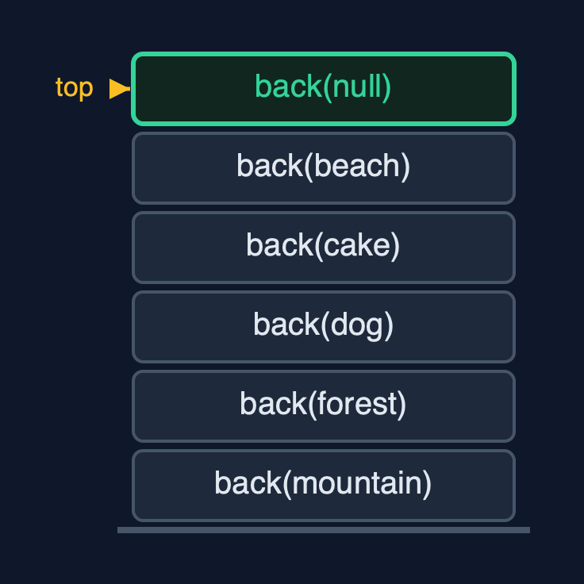
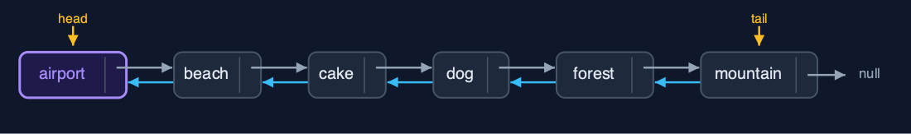
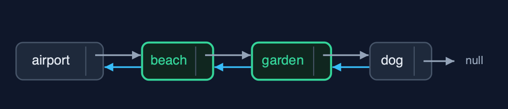

# Doubly Linked List (Recursive), Explained

## In one sentence

The recursive doubly linked list recurses along next or prev to walk and find, links and unlinks in O(1), and works at both ends without recursion; each walk costs a frame per node.

## The picture


*displayBackward: each call prints its node, then recurses on prev, down to null*

## The everyday idea

Picture a guard on a train asked how many carriages are behind them. They do not walk the train; they ask the guard in the next carriage back and wait, and so on to the last carriage, where the answer is "none behind me". The answers come back up, each guard adding one. The same could be done towards the front. Taking a carriage out, once the right one is found, is still just uncoupling two neighbours.

## The 5 acts

### Act 1: The same recursion in both directions

The recursive display backward starts at the tail, mountain, prints it, and calls itself on `mountain.prev`, forest, and so on until `beach.prev`, which is `null`: the base case. Five calls deep for five photos. `displayForward` is the same method with `next` in place of `prev` and `head` in place of `tail`, and also goes five deep. A singly linked list can only recurse forwards; here the recursion can follow either pointer.



**Five displayBackward calls, from the tail along prev pointers** Here is the call stack. Each call waits for the call on the node before it. On top, null: past the head.

What the demo printed:

```
displayBackward(mountain): print it, then displayBackward(prev)
  ... forest, dog, cake, beach
    displayBackward(null): past the head   <- base case
tail -> mountain <-> forest <-> dog <-> cake <-> beach <- head, depth 5
head -> beach <-> cake <-> dog <-> forest <-> mountain <- tail, depth 5
```

### Act 2: Both ends need no recursion

Work at the ends uses `head` and `tail` directly: `insertAtBeginning("airport")` and `insertAtEnd("river")` set 6 pointers between them with no recursion, depth 0, and `deleteAtEnd` goes straight through the tail. Only operations that must visit nodes recurse: `count` goes six calls deep for six photos.



**Head and tail reach both ends directly** Here is the album with its new first photo. Head and tail reach both ends without a walk.

What the demo printed:

```
insertAtBeginning("airport") and insertAtEnd("river"): depth 0, 6 pointer changes
deleteAtEnd() removed "river": depth 0, through tail
count() = 6, depth 6
```

### Act 3: Find recursively, link in O(1)

Operations in the middle split into finding and changing. `search("forest")` recurses along next and finds it at position 4, five calls deep. `insertAtPosition(3, "garden")` finds the node before the position, cake, two calls deep, then sets four pointers with no recursion. `deleteByKey("cake")` finds cake three calls deep and unlinks it by pointing beach and garden at each other: two pointer changes, no predecessor search.



**deleteByKey("cake"): found recursively, then beach and garden joined** Here is the album after the deletion. Beach and garden now point at each other.

What the demo printed:

```
search("forest") = position 4: 5 comparisons, depth 5
insertAtPosition(3, "garden"): the node before found at depth 2, then 4 pointers set
deleteByKey("cake"): found at depth 3, then 2 pointers changed
head -> airport <-> beach <-> garden <-> dog <-> forest <-> mountain <- tail
```

### Act 4: Reversal, recursively

Each call of `reverse(node)` saves `node.next`, swaps `node.prev` and `node.next`, and recurses on the saved old next. Five calls deep for five photos, 10 pointer changes, and then `head` and `tail` are swapped: 12 in all. The album now runs from mountain to beach.


**After reverse: head at mountain, tail at beach** Here is the reversed album.

What the demo printed:

```
reverse(): swap this node's prev and next, then reverse from the old next: depth 5, 12 pointer changes
head -> mountain <-> forest <-> dog <-> cake <-> beach <- tail
```

### Act 5: The limit of recursion

A million `insertAtEnd` calls use the tail pointer and never recurse. Counting the million recursively needs a frame per node, and Java throws `StackOverflowError`. The loops of `doubly-linked-list` do the same walk in O(1) extra space.


**One frame per node: a million-node count overflows** One call per node. Far too many.

What the demo printed:

```
1,000,000 photos, built with insertAtEnd: no recursion, O(1) each
count(): StackOverflowError, one frame per node
the loops of the doubly-linked-list project need O(1) extra space
```

## The operations in code

### Display backward

```java
/** Display backward: the same recursion, starting at the tail and following prev. O(n) time and stack. */
public String displayBackward() {
    StringBuilder s = new StringBuilder("tail -> ");
    if (tail == null) {
        s.append("null");
    }
    displayBackward(tail, s);
    return s.append(" <- head").toString();
}

private void displayBackward(Node node, StringBuilder s) {
    if (node == null) {            // base case: past the head
        return;
    }
    steps.enter();
    steps.step();
    s.append(node.data).append(node.prev != null ? " <-> " : "");
    displayBackward(node.prev, s);
    steps.exit();
}
```

The public method starts at `tail`; the private one appends this node and recurses on `node.prev`. It is `displayForward` with `next` replaced by `prev`: the recursion does not care which way the pointers go.

### Delete by key: find recursively, unlink in O(1)

```java
/** Deletion by key: find the node recursively, then unlink it in O(1). O(n) time and stack. */
public boolean deleteByKey(String key) {
    Node node = find(head, key);
    if (node == null) {
        return false;
    }
    deleteNode(node);
    return true;
}

private Node find(Node node, String key) {
    if (node == null) {
        return null;               // base case: not found
    }
    steps.enter();
    steps.compare();
    Node result = node.data.equals(key) ? node : find(node.next, key);
    steps.exit();
    return result;
}
```

`find` is recursive: the empty list or a match is the base case. Once the node is found, `deleteNode` points its two neighbours at each other, with no predecessor search and no recursion.

### Reversal

```java
/**
 * Reverses the list: swap this node's prev and next, then reverse from the old next; finally
 * swap head and tail. O(n) time and stack.
 */
public void reverse() {
    reverse(head);
    Node t = head;
    head = tail;
    tail = t;
    steps.pointer(2);
}

private void reverse(Node node) {
    if (node == null) {            // base case: past the old tail
        return;
    }
    steps.enter();
    Node oldNext = node.next;
    node.next = node.prev;
    node.prev = oldNext;
    steps.pointer(2);
    reverse(oldNext);
    steps.exit();
}
```

Each call swaps its node's `prev` and `next`, then recurses on the old next, saved before the swap. When the recursion runs past the old tail, the public method swaps `head` and `tail`.

## The operations, and what they cost

| Operation | What it does | Time: best / average / worst | Extra space (call stack) | Same operation as a loop | Steps counted in the demo |
| --- | --- | --- | --- | --- | --- |
| Display forward / backward | This node, then recurse on next (or prev, from the tail) | O(n) / O(n) / O(n) | O(n) | O(1) | depth 5 each way for 5 photos |
| Count | 0 for null, otherwise 1 + count(node.next) | O(n) / O(n) / O(n) | O(n) | O(1) | 6, depth 6 |
| Insert / delete at beginning or end | Change head or tail and one neighbour: no walk | O(1) / O(1) / O(1) | O(1) | O(1) | depth 0; 3 pointers per insertion |
| Insert at position | Find the node before recursively, then set 4 pointers | O(1) at 0 / O(n) / O(n) | O(pos) | O(1) | depth 2, 4 pointers |
| Delete by key | Find the node recursively, then unlink it with 2 pointers | O(1) / O(n) / O(n) | O(n) | O(1) | depth 3, 2 pointers |
| Search / get | Match here, or recurse on node.next | O(1) / O(n) / O(n) | O(n) | O(1) | 5 comparisons, depth 5 |
| Reverse | Swap prev and next here, recurse on the old next; then swap head and tail | O(n) / O(n) / O(n) | O(n) | O(1) | depth 5, 12 pointer changes |

## Compared with related structures

The recursive doubly linked list against the loop version and the recursive singly list (n nodes):

| Operation | Recursive doubly list | Doubly list (loops) | Recursive singly list |
| --- | --- | --- | --- |
| Insert / delete at both ends | O(1), no recursion | O(1) | O(1) at the beginning; O(n) time and stack at the end |
| Display backward | O(n) time and stack, from tail | O(n) time, O(1) space | O(n) time and stack, after the call |
| Delete by key | find O(n) stack, unlink O(1) | O(n) time, O(1) space | O(n) time and stack |
| Reverse | O(n) time and stack | O(n) time, O(1) space | O(n) time and stack |
| A million nodes | StackOverflowError | fine | StackOverflowError |

## The verdict

A study of recursion along pointers in both directions; for real lists, the loop version or `java.util.LinkedList`.

## How to recognise it in code you did not write

- `display(node.prev, s)` or `display(node.next, s)` with `if (node == null) return;`.
- A recursive `find` followed by an O(1) `deleteNode`.

## Where you have already met this

- `doubly-linked-list`, the same structure with loops.
- `singly-linked-list-recursive`, the same recursions on one direction only.
