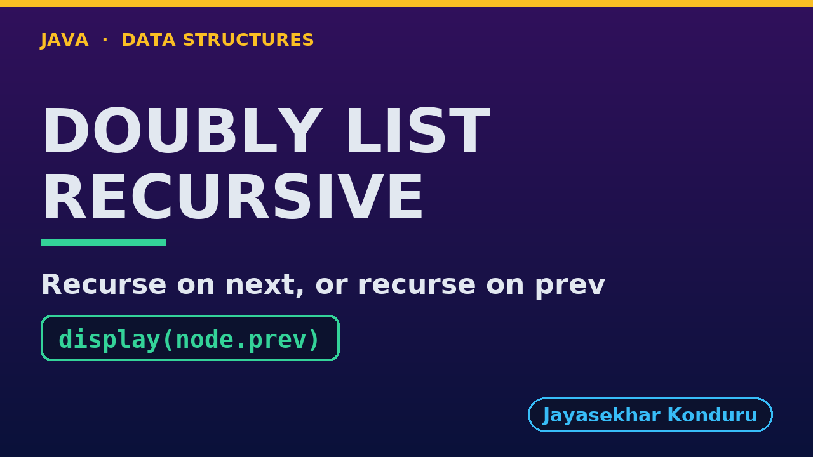

# YouTube — Doubly Linked List (Recursive)

Everything needed to publish `video/doubly-linked-list-recursive-explained.mp4`. Copy the fields straight out of this file.

Chapter timings come from the video's `.srt`; they are regenerated whenever the video is rebuilt.

## Title

```
Doubly Linked List in Java, Recursively - Both Directions and Reverse
```

69 characters (YouTube shows about 60 before cutting a title off in search).

## Description

The first two lines are what a viewer sees above the fold, so they carry the hook rather than the boilerplate.

```
Doubly Linked List in Java, written recursively, explained with a photo viewer. We trace a recursive display backward from the tail, following prev pointers five calls deep, and see display forward use the same recursion on next. We insert and delete at both ends with no recursion at all, then find nodes recursively and link or unlink them in O(1): insertAtPosition finds the node before it two calls deep and sets four pointers, deleteByKey finds cake three calls deep and changes two. We reverse the list by swapping each node's prev and next and recursing on the old next. We finish at the limit: counting a million photos recursively throws a real StackOverflowError.

CHAPTERS
00:00 Introduction
00:44 The Everyday Idea
01:11 The Words
01:30 Act One — The same recursion in both directions
01:58 The same recursion in both directions
02:09 Act Two — Both ends need no recursion
02:29 Both ends need no recursion
02:37 Act Three — Find recursively, link in O(1)
03:04 Find recursively, link in O(1)
03:11 Act Four — Reversal, recursively
03:30 Reversal, recursively
03:33 Act Five — The limit of recursion
03:51 The limit of recursion
03:56 Time and Space Complexity
04:24 Recursive or Loop?
04:41 Common Mistakes
05:01 Thanks for Watching

SOURCE CODE, WRITTEN NOTES AND AN INTERACTIVE ANIMATION
https://github.com/jk-boot-up/datastructures/tree/main/gradle-java/arrays-and-lists/doubly-linked-list-recursive

WHAT YOU NEED FIRST
Java basics: variables, loops, classes and methods. No data-structures knowledge is assumed; START-HERE.md in the repository explains memory, references and counting steps.
```

## Chapters

YouTube shows these as chapters because there are at least three and the first is at `00:00`.

```
00:00 Introduction
00:44 The Everyday Idea
01:11 The Words
01:30 Act One — The same recursion in both directions
01:58 The same recursion in both directions
02:09 Act Two — Both ends need no recursion
02:29 Both ends need no recursion
02:37 Act Three — Find recursively, link in O(1)
03:04 Find recursively, link in O(1)
03:11 Act Four — Reversal, recursively
03:30 Reversal, recursively
03:33 Act Five — The limit of recursion
03:51 The limit of recursion
03:56 Time and Space Complexity
04:24 Recursive or Loop?
04:41 Common Mistakes
05:01 Thanks for Watching
```

## Tags

```
doubly linked list, recursion, recursive linked list, reverse doubly linked list, call stack, stack overflow, data structures, java data structures, java, java 25, algorithms, computer science, programming tutorial, beginner, big o
```

231 characters, under YouTube's 500 limit.

## Thumbnail



Upload `docs/thumbnail.png` (1280×720) under **Details → Thumbnail → Upload file**. It is made for the small size YouTube shows in search: the name, one line of promise and one piece of code.

## Upload checklist

- [ ] Upload `video/doubly-linked-list-recursive-explained.mp4` (1080p, H.264, 30 fps, AAC 48 kHz)
- [ ] Set the video language to **English**, then add subtitles: *Upload file → With timing* → `video/doubly-linked-list-recursive-explained.srt`
- [ ] Upload `docs/thumbnail.png` as the thumbnail
- [ ] Paste the title, description and tags from above
- [ ] Add to the **Data Structures in Java** playlist
- [ ] Wait for 1080p processing before sharing the link

## Runtime

05:46.
