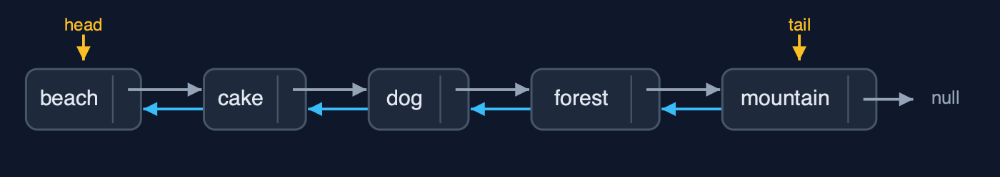

# Doubly Linked List — Cheat Sheet

**A doubly linked list gives every node a prev pointer as well as a next pointer, so you can walk either way and remove a node you are holding without searching for its neighbour; the price is a second pointer in every node and four pointers to set on every insert.**

| | |
| --- | --- |
| **What it is** | A doubly linked list gives every node prev and next pointers and keeps head and tail, so it walks both ways and inserts and deletes at either end, or at a node already reached, in O(1), at the price of a second pointer per node. |
| **Everyday picture** | A train where every carriage is coupled to the one in front and the one behind |
| **Use it when** | You need to move backwards as well as forwards; You remove or insert next to a node you already hold, such as the item on screen or the item just used; You add and remove at both ends: the list works as a queue from either side |
| **Avoid it when** | You only ever go forwards: a singly linked list does the job with one pointer per node; You read by position: position n is still a walk; Memory is tight: every node carries two pointers as well as its value |
| **Already in Java** | `java.util.LinkedList` (a doubly linked list with head and tail) |

## Costs

| Operation | What it does | Time: best / average / worst | Extra space | Steps counted in the demo |
| --- | --- | --- | --- | --- |
| Display forward / backward | Follow next from head, or prev from tail | O(n) / O(n) / O(n) | O(1) | 5 steps each way for 5 photos |
| Count | Traverse and count the nodes | O(n) / O(n) / O(n) | O(1) | one step per node |
| Insert at beginning | newNode.next = head; head.prev = newNode; head = newNode | O(1) / O(1) / O(1) | O(1) | 3 pointer changes |
| Insert at end | newNode.prev = tail; tail.next = newNode; tail = newNode | O(1) / O(1) / O(1) | O(1) | 0 steps, 3 pointer changes |
| Insert at position | Walk to the node before, then set 4 pointers | O(1) at the ends / O(n) / O(n) | O(1) | 2 steps, 4 pointer changes |
| Delete at beginning / at end | Move head on, or tail back; clear the new end's pointer | O(1) / O(1) / O(1) | O(1) | 0 steps, 2 pointer changes |
| Delete a node already reached | node.prev.next = node.next; node.next.prev = node.prev | O(1) / O(1) / O(1) | O(1) | 0 steps, 2 pointer changes |
| Delete by key / at position | Walk to the node, then delete it as above | O(1) at the head / O(n) / O(n) | O(1) | 3 comparisons, 2 pointer changes |
| Search / get | Compare each node's data / follow pos next pointers | O(1) / O(n) / O(n) | O(1) | one comparison per node looked at |
| Reverse | Swap prev and next in every node, then swap head and tail | O(n) / O(n) / O(n) | O(1) | 12 pointer changes for 5 nodes |

## Compared with related structures

How a doubly linked list compares with the structures it is usually weighed against (n nodes):

| Operation | Doubly linked list | Singly linked list | Dynamic array |
| --- | --- | --- | --- |
| Access position i | O(n) | O(n) | O(1) |
| Insert / delete at the beginning | O(1) | O(1) | O(n) shifts |
| Insert at the end | O(1) with tail | O(n) (O(1) with a tail) | O(1) amortised |
| Delete at the end | O(1): tail.prev | O(n): find the second-to-last | O(1) |
| Delete a node already reached | O(1) | O(n): find the node before | O(n) shifts |
| Walk backwards | yes | no | yes |
| Pointers per node | 2 (prev, next) | 1 (next) | none |
| Pointers set by an insertion in the middle | 4 | 2 | none, but O(n) shifts |

## Watch out for

- **Forgetting one of the four pointers of an insertion**: Set all four: `newNode.prev`, `newNode.next`, `node.next`, `following.prev`.
- **Not updating head or tail at the ends**: When `node.prev` is null, move `head`; when `node.next` is null, move `tail`.
- **Reversing without swapping head and tail**: After the loop, swap `head` and `tail`.
- **Walking on with `current.next` after swapping in reverse**: Save the old next before the swap and continue from it.
