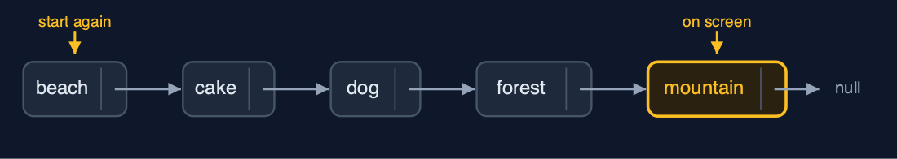
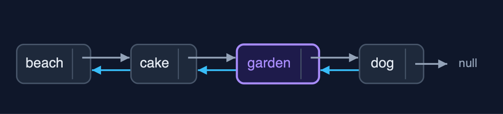
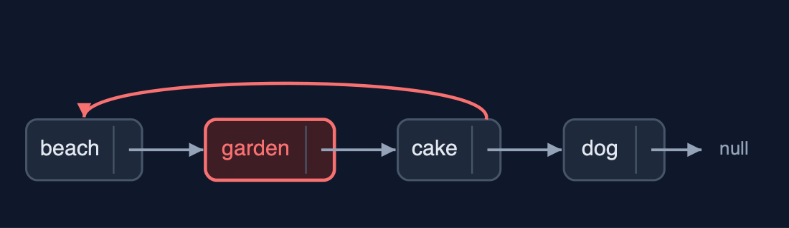
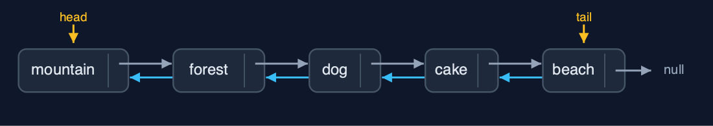

# Doubly Linked List, Explained

## In one sentence

A doubly linked list gives every node prev and next pointers and keeps head and tail, so it walks both ways and inserts and deletes at either end, or at a node already reached, in O(1), at the price of a second pointer per node.

## The picture


*every node has a prev and a next pointer; the list keeps head and tail*

## The everyday idea

Think of a train. Every carriage is coupled to the one in front and the one behind. A guard in any carriage can step forwards or backwards one carriage at a time. To take a carriage out of the middle, you uncouple it from both neighbours and couple those neighbours to each other: two couplings, and the rest of the train does not move. To add one, there are four couplings to make, and forgetting one leaves a carriage that can be reached from one direction but not the other.

## The 5 acts

### Act 1: A viewer with next pointers only

Suppose each photo only knew the next one. Looking at "mountain" and pressing Previous, the viewer cannot step back: it must start at "beach" and walk forward until the next photo is "mountain", three steps, to find "forest". The longer the album, the longer the walk. Deleting the photo on screen has the same problem, because the photo before it must be found to point past it.



**One-way pointers: to go back from mountain, start again at beach** Here is the one-way album. Every arrow points forward. From the mountain, there is no arrow back.

What the demo printed:

```
looking at "mountain", press Previous: walk from "beach", 3 steps to "forest"
deleting the photo on screen means finding the one before it the same way
```

### Act 2: Pointers both ways, and both ends

Each photo becomes a node with `data`, `prev` and `next`, and the list keeps `head` and `tail`. Building the album with `insertAtEnd` walks nowhere: the tail pointer is already at the last node, so each insertion sets three pointers, 14 pointer changes in all for five photos (the first sets just head and tail). `displayForward` follows next pointers from the head; `displayBackward` follows prev pointers from the tail, which a singly linked list cannot do.


**Five nodes, each linked both ways; head at beach, tail at mountain** Here is the album. Each pair of neighbours is linked both ways. Head points at the beach, and tail at the mountain.

What the demo printed:

```
built with insertAtEnd through tail: 0 steps, 14 pointer changes
displayForward():  head -> beach <-> cake <-> dog <-> forest <-> mountain <- tail
displayBackward(): tail -> mountain <-> forest <-> dog <-> cake <-> beach <- head
```

### Act 3: Insertion and deletion at both ends and in the middle

Both ends cost O(1): `insertAtBeginning("airport")` sets three pointers, and so does `insertAtEnd("river")`, with no walking. `insertAtPosition(3, "garden")` walks two steps to "cake", the node before the position, and sets four pointers: the garden's prev and next, cake's next and dog's prev. `deleteAtEnd` goes through the tail, no walking, and changes two pointers: a singly linked list would have had to walk to the second-to-last node. `deleteByKey("cake")` compares three nodes, then unlinks cake by pointing its two neighbours at each other, with no separate prev pointer to keep.



**insertAtPosition(3, "garden"): four pointers join garden to cake and dog** Here is the insertion. The garden's previous points to the cake, and its next to the dog. Then the cake's next and the dog's previous point to the garden. Four pointers.


**deleteByKey("cake"): beach and garden now point at each other** And the deletion. The beach's next and the garden's previous are pointed at each other. The cake is out, with two pointer changes.

What the demo printed:

```
insertAtBeginning("airport"): 3 pointer changes
insertAtEnd("river"): 0 steps, 3 pointer changes
insertAtPosition(3, "garden"): 2 steps, 4 pointer changes
deleteAtEnd() removed "river": 0 steps, 2 pointer changes, through tail
deleteByKey("cake"): 3 comparisons, 2 pointer changes, no prev pointer to keep
head -> airport <-> beach <-> garden <-> dog <-> forest <-> mountain <- tail
```

### Act 4: The pointer nobody set

An insertion in the middle needs four pointers. Inserting "garden" after "beach" but forgetting the fourth, `cake.prev`, leaves the list half-joined: walking forwards reaches six photos, beach, garden, cake, dog, forest, mountain, but walking backwards from the tail reaches only five, because cake's prev still points to beach and skips the garden. A bug like this goes unnoticed until someone presses Previous. At the other extreme, deleting the only photo must set both `head` and `tail` to null.



**The garden is reachable forwards, but cake.prev still points to beach** Here is the broken list. Forwards, beach, garden, cake. Backwards from the cake, the arrow goes straight to the beach, skipping the garden.

What the demo printed:

```
insert "garden" after "beach", setting 3 of the 4 pointers
forwards:  [beach <-> garden <-> cake <-> dog <-> forest <-> mountain], 6 photos
backwards: 5 photos; "cake".prev still points to "beach"
delete the only photo: head is null, tail is null
```

### Act 5: Reversal, and the bill

Reversing a doubly linked list needs no three-pointer dance: every node already points both ways, so each node's `prev` and `next` are simply swapped, 10 pointer changes for 5 nodes, and then `head` and `tail` are swapped, 2 more. The album now runs from mountain to beach. The bill: every node carries two pointers, one more than a singly linked list, and an insertion in the middle sets 4 pointers instead of 2. Java's `java.util.LinkedList` is a doubly linked list with head and tail.



**After reverse: head at mountain, tail at beach** Here is the reversed album. Head now points at the mountain, and tail at the beach.

What the demo printed:

```
reverse(): 12 pointer changes (prev and next swapped in 5 nodes, then head and tail)
head -> mountain <-> forest <-> dog <-> cake <-> beach <- tail
every node carries two pointers: one more pointer per photo than a singly linked list
an insertion in the middle sets 4 pointers, where a singly linked list sets 2
already in Java: java.util.LinkedList is a doubly linked list with head and tail
```

## The operations in code

### Insertion at the end

```java
/** Insertion at the end, through the tail pointer: no traversal. O(1). */
public Node insertAtEnd(String data) {
    Node newNode = new Node(data);
    if (tail == null) {
        head = newNode;
        tail = newNode;
        steps.pointer(2);
    } else {
        newNode.prev = tail;        // the new node's prev is the old last node
        tail.next = newNode;        // the old last node's next is the new node
        tail = newNode;
        steps.pointer(3);
    }
    return newNode;
}
```

Through the `tail` pointer: the new node's `prev` is the old tail, the old tail's `next` is the new node, and `tail` moves. No walking, so O(1). An empty list is the special case: the new node is both head and tail.

### Insertion after a node

```java
/**
 * Inserts a new node after {@code node}. Four pointers: the new node's {@code prev} and
 * {@code next}, then {@code node.next} and the following node's {@code prev}. O(1).
 */
public Node insertAfter(Node node, String data) {
    if (node == tail) {
        return insertAtEnd(data);
    }
    Node following = node.next;
    Node newNode = new Node(data);
    newNode.prev = node;            // 1
    newNode.next = following;       // 2
    node.next = newNode;            // 3
    following.prev = newNode;       // 4
    steps.pointer(4);
    return newNode;
}
```

Four pointers: the new node's `prev` and `next`, then the node before it and the node after it are pointed at the new node. Forgetting the fourth, `following.prev`, leaves a list that looks right walking forwards but skips the new node walking backwards.

### Deletion of a node

```java
/**
 * Deletes a node already reached: its predecessor's {@code next} and its successor's
 * {@code prev} are set past it (or head and tail, at the ends). O(1): the node knows its
 * predecessor, so no search is needed.
 */
public void deleteNode(Node node) {
    if (node.prev == null) {
        head = node.next;           // deleting the first node
    } else {
        node.prev.next = node.next;
    }
    if (node.next == null) {
        tail = node.prev;           // deleting the last node
    } else {
        node.next.prev = node.prev;
    }
    steps.pointer(2);
}
```

The node knows both neighbours, so no search is needed: the one before is pointed past it with `next`, the one after with `prev`. At the ends, `head` or `tail` moves instead. Every deletion, at the beginning, the end, a position or by key, finishes here.

### Display backward

```java
/** Display backward: follow prev pointers from tail to null. O(n); impossible in a singly linked list. */
public String displayBackward() {
    StringBuilder s = new StringBuilder("tail -> ");
    for (Node current = tail; current != null; current = current.prev) {
        s.append(current.data).append(current.prev != null ? " <-> " : "");
        steps.step();
    }
    return s.append(" <- head").toString().replace("tail ->  <- head", "tail -> null <- head");
}
```

Start at `tail` and follow `prev` pointers to `null`. A singly linked list cannot do this without first reversing itself or using a stack.

### Reversal

```java
/**
 * Reverses the list in place: swap every node's prev and next, then swap head and tail. Two
 * pointer changes per node, O(n) time, O(1) extra space.
 */
public void reverse() {
    Node current = head;
    while (current != null) {
        Node t = current.next;
        current.next = current.prev;
        current.prev = t;
        steps.pointer(2);
        current = t;                // the old next, now stored in prev
    }
    Node t = head;
    head = tail;
    tail = t;
    steps.pointer(2);
}
```

Every node already has pointers both ways, so reversing only swaps each node's `prev` and `next`, then swaps `head` and `tail`. Note `current = t`: after the swap, the old next is in `prev`, so the walk continues through the saved value.

## The operations, and what they cost

| Operation | What it does | Time: best / average / worst | Extra space | Steps counted in the demo |
| --- | --- | --- | --- | --- |
| Display forward / backward | Follow next from head, or prev from tail | O(n) / O(n) / O(n) | O(1) | 5 steps each way for 5 photos |
| Count | Traverse and count the nodes | O(n) / O(n) / O(n) | O(1) | one step per node |
| Insert at beginning | newNode.next = head; head.prev = newNode; head = newNode | O(1) / O(1) / O(1) | O(1) | 3 pointer changes |
| Insert at end | newNode.prev = tail; tail.next = newNode; tail = newNode | O(1) / O(1) / O(1) | O(1) | 0 steps, 3 pointer changes |
| Insert at position | Walk to the node before, then set 4 pointers | O(1) at the ends / O(n) / O(n) | O(1) | 2 steps, 4 pointer changes |
| Delete at beginning / at end | Move head on, or tail back; clear the new end's pointer | O(1) / O(1) / O(1) | O(1) | 0 steps, 2 pointer changes |
| Delete a node already reached | node.prev.next = node.next; node.next.prev = node.prev | O(1) / O(1) / O(1) | O(1) | 0 steps, 2 pointer changes |
| Delete by key / at position | Walk to the node, then delete it as above | O(1) at the head / O(n) / O(n) | O(1) | 3 comparisons, 2 pointer changes |
| Search / get | Compare each node's data / follow pos next pointers | O(1) / O(n) / O(n) | O(1) | one comparison per node looked at |
| Reverse | Swap prev and next in every node, then swap head and tail | O(n) / O(n) / O(n) | O(1) | 12 pointer changes for 5 nodes |

## Compared with related structures

How a doubly linked list compares with the structures it is usually weighed against (n nodes):

| Operation | Doubly linked list | Singly linked list | Dynamic array |
| --- | --- | --- | --- |
| Access position i | O(n) | O(n) | O(1) |
| Insert / delete at the beginning | O(1) | O(1) | O(n) shifts |
| Insert at the end | O(1) with tail | O(n) (O(1) with a tail) | O(1) amortised |
| Delete at the end | O(1): tail.prev | O(n): find the second-to-last | O(1) |
| Delete a node already reached | O(1) | O(n): find the node before | O(n) shifts |
| Walk backwards | yes | no | yes |
| Pointers per node | 2 (prev, next) | 1 (next) | none |
| Pointers set by an insertion in the middle | 4 | 2 | none, but O(n) shifts |

## The verdict

Use a doubly linked list when you move both ways, delete nodes you already hold, or work at both ends: browser history, playlists, LRU caches, deques. If you only ever go forwards, a singly linked list is lighter.

## How to recognise it in code you did not write

- A `Node` with `prev` and `next`, and a list with `head` and `tail`.
- `node.prev.next = node.next; node.next.prev = node.prev;`.
- A walk from `tail` following `prev`.

## Where you have already met this

- A browser's Back and Forward history, a photo gallery, a music player's previous and next track.
- `java.util.LinkedList` is a doubly linked list with a head and a tail.
- An LRU cache (later in this course) keeps a doubly linked list so it can move any entry to the front in one step.
