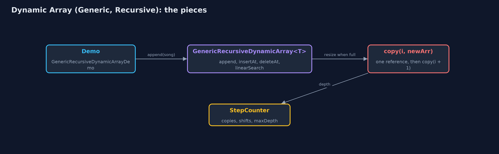
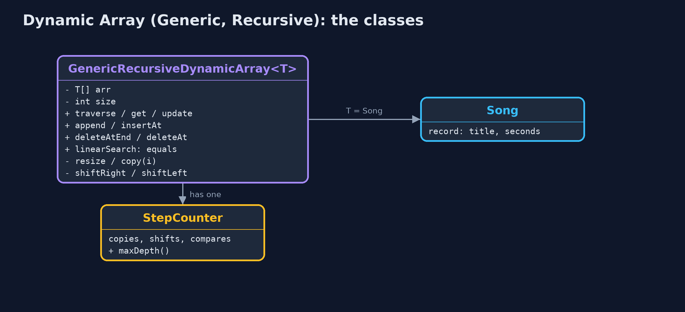
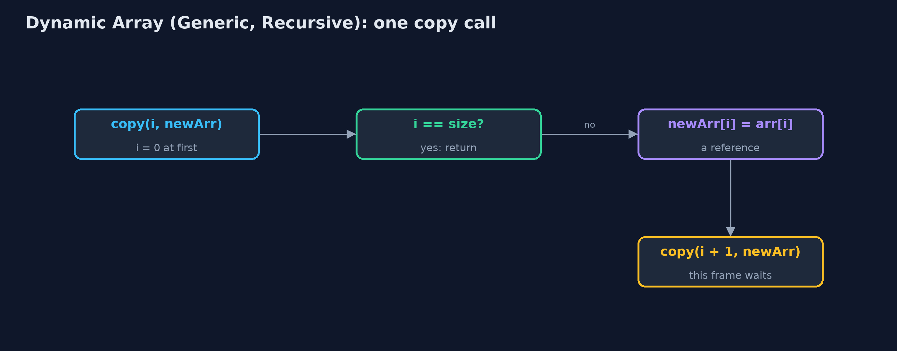

# Dynamic Array (Generic, Recursive)

**The generic recursive dynamic array holds references to any type T, doubles when full and halves when a quarter full, finds elements with equals, and does every linear pass, including the copy inside a resize, as a recursion: the time is unchanged, the extra space is one frame per element, and a large resize overflows the stack.**


*A recursive resize copies references: copy(0) ... copy(3), then the base case copy(4)*

This project combines the two variations of the **dynamic array**. Like `dynamic-array-generic`, it has a **type parameter** `T`, stores **references** on an `Object[]` cast to `T[]`, and finds elements with **`equals`**; `T` may be any type. Like `dynamic-array-recursive`, every linear pass is a **recursion** with a **base case**: traversal, linear search, the shifts of insertion and deletion, and the **copy inside a resize**. The time of every operation is the same as the plain dynamic array. The extra space is the **recursion depth**: one call-stack frame per element visited, shifted or copied, so a large enough resize overflows the call stack.

> New to data structures? Read [Start here](../../START-HERE.md) first: it explains memory, references and counting steps in ten minutes.

## The everyday idea

Picture a warehouse list of addresses being copied onto a sheet twice as long by a line of helpers. The first helper copies line 0 and asks the next helper to copy the rest, then waits. Each helper copies one address and waits for the others. The furniture never moves; only addresses are copied. When a helper finds no lines left, everyone can go home. A list of a million lines would need a million helpers waiting in the corridor at once.

## The worked example: A playlist of Song records, with every loop written as a recursion

The playlist of `Song` records, each a title and a length in seconds, grows from four places. The demo traces the recursive copy of references when the fifth song arrives, grows to nine songs, uses the same class for a list of play counts, inserts and deletes in the middle, searches for a separately made `Song` with a recursive `equals` search, shrinks to fit, and finally tries a million appends.

## Why it exists

Every recursive, generic structure later in the course, from linked lists to trees, combines these two ideas: a type parameter for the element, and a method that handles one element and calls itself for the rest. The dynamic array is the simplest place to see them together, and it carries a warning that applies everywhere: a linear recursion hidden inside a routine operation, such as the copy in a resize, becomes a crash as the data grows.

## New words

| Word | What it means here |
| --- | --- |
| **type parameter T** | The element type, filled in at each use: `GenericRecursiveDynamicArray<Song>`. |
| **reference** | What each place holds: the address of an object. A resize copies references, not objects. |
| **equals** | How elements are compared: by contents. A record's `equals` compares its fields. |
| **base case** | The call that returns without calling again: `i == size`, nothing left. |
| **recursion depth** | The most frames on the call stack at once: n for a resize of n references. |

## What you will see, act by act

Run the demo and it tells the story in 5 acts, printing the real numbers that the tests check:

```bash
./gradlew run
```

| Act | What it shows |
| --- | --- |
| 1. A recursive copy of references | The fifth Song resizes the array: copy(0) to copy(3) each copy one reference, copy(4) is the base case; 4 references at depth 4, and index 0 is still the same Song. |
| 2. Growing, and any type | Nine songs take 2 resizes and 12 reference copies, the deepest 8 frames; the same class holds Integers, traversed at depth 5. |
| 3. The middle, and equals, recursively | insertAt(0, Intro) 9 shifts at depth 9; deleteAt(5) 4 shifts at depth 4; a new Song("Echoes", 201) is found at index 6 with 7 recursive equals calls. |
| 4. Shrinking, recursively | deleteAtEnd removes Last Train and nulls its place; shrinkToFit copies 8 references at depth 8 into exactly 8 places. |
| 5. The limit of recursion | A million appends throw StackOverflowError inside a resize, long before the end. |

Each act is drawn step by step in [the explained walkthrough](docs/dynamic-array-generic-recursive-explained.md) and in [the animation](docs/animation.html).

## The operations, and what they cost

Time is given for the best, average and worst case in Big-O notation (START-HERE.md explains it by counting steps); the last column is what the demo actually counted, so every formula can be checked against a real number.

| Operation | What it does | Time: best / average / worst | Extra space (call stack) | Same operation as a loop | Steps counted in the demo |
| --- | --- | --- | --- | --- | --- |
| Traverse | Visit arr[i], then traverse from i + 1 | O(n) / O(n) / O(n) | O(n) | O(1) | depth 5 for 5 play counts |
| Access `get(i)` / update | One address calculation (not recursive) | O(1) / O(1) / O(1) | O(1) | O(1) | 1 step |
| Insert at end `append(x)` | Write arr[size]; recursive resize first when full | O(1) / O(1) amortised / O(n) when it resizes | O(1), or O(n) during a resize | O(1), plus the new array | 4 references at depth 4; 12 over 9 appends |
| Insert `insertAt(pos, x)` | shiftRight from the last element down to pos | O(1) at the end / O(n) / O(n) at the front | O(n - pos) | O(1) | 9 shifts at depth 9 |
| Delete `deleteAt(pos)` | shiftLeft from pos, clear the freed place | O(1) at the end / O(n) / O(n) at the front | O(n - pos) | O(1) | 4 shifts at depth 4 |
| Delete at end `deleteAtEnd()` | Clear arr[size-1]; recursive halving when a quarter full | O(1) / O(1) amortised / O(n) when it shrinks | O(1), or O(n) during a shrink | O(1) | 0 shifts |
| Linear search | arr[i].equals(key)? If not, search from i + 1 | O(1) / O(n) / O(n) | O(n) | O(1) | 7 equals calls at depth 7 |
| Shrink to fit | Recursive copy into exactly size places | O(n) / O(n) / O(n) | O(n) | O(1), plus the new array | 8 references at depth 8 |

Extra space is the memory an operation needs besides the structure itself. A loop needs a fixed amount, O(1); a recursive operation needs one call-stack frame for every call still waiting, so its extra space is the depth of the recursion.

## The operations in code

### Resize with a recursive copy of references

```java
/** Allocates a new array and copies the references into it recursively. O(n) time and stack. */
private void resize(int newCapacity) {
    T[] newArr = newArray(newCapacity);
    copy(0, newArr);
    arr = newArr;
    resizes++;
}

private void copy(int i, T[] newArr) {
    if (i == size) {               // base case: every element copied
        return;
    }
    steps.enter();
    newArr[i] = arr[i];
    steps.copy();
    copy(i + 1, newArr);
    steps.exit();
}
```

`newArray` makes the `T[]` from an `Object[]`. `copy(i, newArr)` copies one reference and calls itself for `i + 1`, until the base case `i == size`. The objects are not copied: after the resize, every element is still the same object.

### Linear search with equals

```java
/** Linear search with {@code equals}: is the key at i? If not, search from i + 1. O(n) time, O(n) stack. */
public int linearSearch(T key) {
    return linearSearch(key, 0);
}

private int linearSearch(T key, int i) {
    if (i == size) {
        return -1;                 // base case: searched everything
    }
    steps.enter();
    steps.compare();
    int result = arr[i].equals(key) ? i : linearSearch(key, i + 1);
    steps.exit();
    return result;
}
```

Two base cases: no elements left, and a match found with `equals`. A separately made `Song` with the same title and length is found, because a record's `equals` compares fields.

### Deletion at a position

```java
/**
 * Deletion at {@code pos}: shiftLeft from pos to the end, then clear the freed place.
 *
 * @throws IllegalStateException "underflow" when the array is empty
 */
public T deleteAt(int pos) {
    if (isEmpty()) {
        throw new IllegalStateException("underflow: the array is empty");
    }
    checkIndex(pos);
    T deleted = arr[pos];
    shiftLeft(pos);
    arr[size - 1] = null;
    size--;
    shrinkIfQuarterFull();
    return deleted;
}

private void shiftLeft(int i) {
    if (i >= size - 1) {           // base case: reached the last element
        return;
    }
    steps.enter();
    arr[i] = arr[i + 1];
    steps.shift();
    shiftLeft(i + 1);
    steps.exit();
}
```

`shiftLeft` moves one reference and recurses on `i + 1`. Afterwards the freed place is set to `null`, so the deleted object can be garbage-collected.

## Compared with related structures

The four dynamic-array projects side by side (n elements):

| Property | Generic, recursive (this) | Generic, loops | String, recursive | String, loops |
| --- | --- | --- | --- | --- |
| Element types | any T | any T | String | String |
| Append | O(1) amortised; resize O(n) stack | O(1) amortised | O(1) amortised; resize O(n) stack | O(1) amortised |
| Insert / delete at front | O(n), O(n) stack | O(n), O(1) extra | O(n), O(n) stack | O(n), O(1) extra |
| Linear search | equals, O(n) stack | equals, O(1) extra | equals, O(n) stack | equals, O(1) extra |
| A million appends | StackOverflowError | fine | StackOverflowError | fine |

## The code

```
src/main/java/com/jk/explore/dynamicarraygenericrecursive/
├── GenericRecursiveDynamicArray.java      A dynamic array (a resizable array) of any element type {@code T}, whose operations are written recursively
├── GenericRecursiveDynamicArrayDemo.java  Tells the story of the generic, recursive dynamic array in five acts, printing the real counts and the real depth of every recursion
├── Lines.java                             The demo's printed lines, kept in one {@code StringBuilder} so the tests can check them
├── Song.java                              One song in the playlist: a type of our own, to show that the generic dynamic array holds any type
└── StepCounter.java                       Counts what an array operation costs, so the demo prints real numbers instead of claims: element reads and writes, comparisons, shifts (moving an element to the next position), swaps, copies into a new array, and the deepest recursion reached (the most call-stack frames alive at once, which is the extra space a recursive version uses)
```

## Test

```bash
./gradlew test
```

23 tests in `DemoRunsTest`, `GenericRecursiveDynamicArrayTest`. Every number the demo prints is asserted, and nothing depends on the clock, so every run gives the same result.

## Common mistakes

| The mistake | What goes wrong | The fix |
| --- | --- | --- |
| Writing `new T[capacity]` | It does not compile: T is not known when the program runs. | `(T[]) new Object[capacity]`, kept inside the class. |
| Searching with `==` | An equal object made elsewhere is not found. | Compare with `equals`. |
| A recursive copy inside resize | An ordinary append overflows the call stack once the array is large. | Keep hidden linear work as a loop; recurse only where the depth is small. |
| Not clearing freed places | Deleted objects stay referenced and are never freed. | Set every place that falls out of use to `null`. |

## Try it yourself

1. **Easy.** Write a recursive `boolean contains(T key, int i)`. What are its two base cases?
2. **Medium.** Write a recursive `int count(T key, int i)` that counts the elements equal to `key`. How deep does it go on the 9-song playlist, whatever the key?
3. **Harder.** Rewrite the recursive `copy` so that its depth is O(log n): copy the middle reference, then the left half and the right half by recursive calls. Why is the time still O(n)?

The answers are in [docs/exercises.md](docs/exercises.md), below the questions, so they are not given away.

## When to use it

- Learning how generics and recursion combine, on a structure you already know.
- Small lists, where the recursion depth stays low.

## When not to

- Any list that may grow large: a recursive resize overflows the call stack. Use `dynamic-array-generic`, or `ArrayList<E>`.
- Performance-sensitive code: each call costs a frame, a jump and a return.

## Where you have already met this

- `dynamic-array-generic`: the same class with loops; Java's `ArrayList<E>`.
- `dynamic-array-recursive`: the same recursions, for strings only.
- `StackOverflowError` from a method that called itself too deeply.

## Technologies and versions

| Technology | Version | Used for |
| --- | --- | --- |
| Java | 25 | the code (toolchain set in `build.gradle`; Gradle fetches JDK 25 if it is missing) |
| Gradle | 9.8.0 (wrapper) | build and run, nothing to install |
| JUnit | 6.1.3 | the tests |
| videokit | course tool | the narrated video and animation: Piper `en_US-amy-medium`, speed 0.8, longer pauses (the `amy-slow` voice) |

## Learning material

| Document | What it is for |
| --- | --- |
| [Start here](../../START-HERE.md) | the ideas every project relies on |
| [Problem statement](docs/problem-statement.md) | the situation and what the project must show |
| [Prerequisites](docs/prerequisites.md) | what you need to know first |
| [Dynamic Array (Generic, Recursive), explained](docs/dynamic-array-generic-recursive-explained.md) | every act, picture by picture |
| [Animated walkthrough](docs/animation.html) | the structure changing step by step, narrated |
| [Cheat sheet](docs/cheat-sheet.md) | the whole structure on one page |
| [Exercises and answers](docs/exercises.md) | practice, easy to harder |
| [Session guide](docs/session.md) | a one-hour lesson |
| [Specification](docs/spec.md) | what this project must be true of |

### How the pieces fit

Appending to a full array starts a recursive copy of references into a new T[].



### The classes

Public operations, and the private recursive helpers they start.



### How the data moves

Base case first; otherwise copy one reference and call on the rest.



### Who calls whom, in order

The append triggers a resize whose recursive copy goes four calls deep.


### Video

`video/dynamic-array-generic-recursive-explained.mp4` (with `.m4a` audio and `.srt` subtitles) is built by `video/build_video.sh`. Rendered media is not committed.

## Where this sits

Part of the [data structures course](../../index.md), in *arrays-and-lists*.
