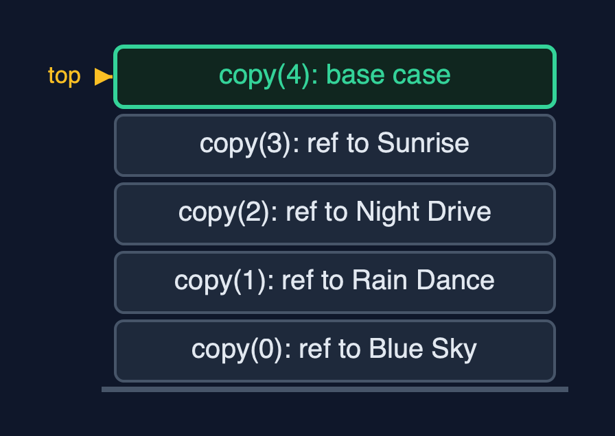
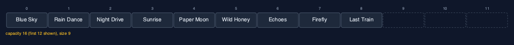
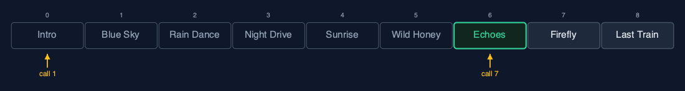
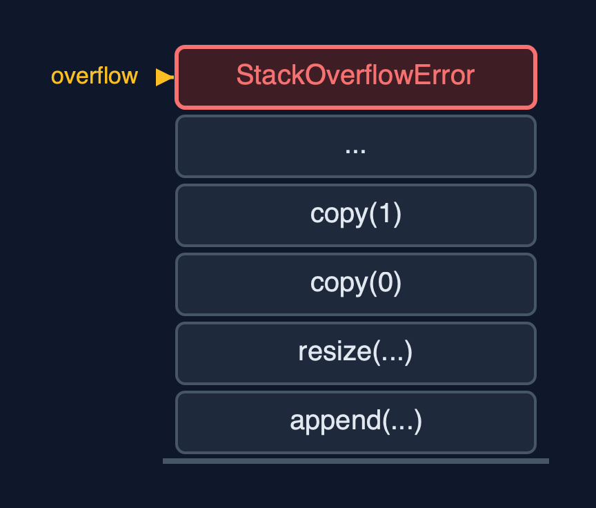

# Dynamic Array (Generic, Recursive), Explained

## In one sentence

The generic recursive dynamic array stores references to any type, finds them with equals, and does every linear pass as a recursion, so its time is unchanged and its extra space is one frame per element.

## The picture


*A recursive resize copies references: copy(0) ... copy(3), then the base case copy(4)*

## The everyday idea

Picture a warehouse list of addresses being copied onto a sheet twice as long by a line of helpers. The first helper copies line 0 and asks the next helper to copy the rest, then waits. Each helper copies one address and waits for the others. The furniture never moves; only addresses are copied. When a helper finds no lines left, everyone can go home. A list of a million lines would need a million helpers waiting in the corridor at once.

## The 5 acts

### Act 1: A recursive copy of references

With four songs the playlist is full. Appending "Paper Moon" resizes it to eight places, and the copy is recursive: `copy(0)` copies the reference to Blue Sky and calls `copy(1)`, and so on, until `copy(4)` finds nothing left. Four frames at the deepest point. Because references are copied, the Song objects are untouched: index 0 of the new array holds the very same Blue Sky object.



**Four copy calls waiting, each having copied one reference** Here is the call stack. Four copy calls, each holding one reference. On top, the base case.

What the demo printed:

```
GenericRecursiveDynamicArray<Song>: capacity 4, size 4, full
copy(0): newArr[0] = reference to Blue Sky, then copy(1)
  ... Rain Dance, Night Drive, Sunrise
    copy(4): no references left   <- base case
append(Paper Moon (2:56)): 4 references copied at depth 4; index 0 is still the same Song: true
```

### Act 2: Growing, and any type

Four more songs fill the array; the ninth resizes it again to 16, copying 8 references 8 frames deep. Twelve references copied since the first resize: the same count as every dynamic array here. The same class also holds play counts as `Integer`: traversing five of them goes five calls deep.



**Nine songs in sixteen places, after two recursive resizes** Here is the playlist, nine songs in sixteen places.

What the demo printed:

```
9 songs: 2 resizes, capacity 16, 12 references copied since the first resize, deepest copy 8
GenericRecursiveDynamicArray<Integer>: [10, 20, 30, 40, 50], depth 5
```

### Act 3: The middle, and equals, recursively

Inserting an intro at the front calls `shiftRight` nine times, nine frames deep; deleting "Paper Moon" at index 5 calls `shiftLeft` four times. Then a recursive linear search looks for a separately made `Song("Echoes", 201)`: each call asks `equals` and, if not equal, calls itself on the rest. The seventh call, at index 6, matches: 7 `equals` calls, 7 frames.



**Recursive search: calls 1 to 6 say not equal, call 7 finds Echoes** Here is the search. Six calls, six songs that are not equal. The seventh call finds Echoes.

What the demo printed:

```
insertAt(0, Intro (0:42)): 9 shifts, depth 9
deleteAt(5) removed Paper Moon (2:56): 4 shifts, depth 4
linearSearch(new Song("Echoes", 201)) = index 6: 7 equals calls, depth 7
```

### Act 4: Shrinking, recursively

`deleteAtEnd` removes "Last Train" and sets its place to `null`, so no reference to it remains. `shrinkToFit` then resizes to exactly 8 places with the same recursive copy: 8 references, 8 frames.


**After shrinkToFit: eight songs in exactly eight places** Here is the result. Eight songs, eight places, no spare room.

What the demo printed:

```
deleteAtEnd() removed Last Train (3:52) and set its place to null
shrinkToFit(): capacity 8, 8 references copied at depth 8
```

### Act 5: The limit of recursion

Appending a million Integers works until a resize must copy more references than the call stack has frames for. Then the recursive copy throws `StackOverflowError` from inside an `append`. Generics changed what is stored; recursion changed how much stack a resize needs. The loop version, `dynamic-array-generic`, and Java's `ArrayList` finish.



**One frame per reference copied: a large resize runs out of call stack** One frame per reference. For a large resize, far too many.

What the demo printed:

```
1,000,000 appends: StackOverflowError inside a resize, long before the end
generics change what is stored; recursion changes how much stack a resize needs
```

## The operations in code

### Resize with a recursive copy of references

```java
/** Allocates a new array and copies the references into it recursively. O(n) time and stack. */
private void resize(int newCapacity) {
    T[] newArr = newArray(newCapacity);
    copy(0, newArr);
    arr = newArr;
    resizes++;
}

private void copy(int i, T[] newArr) {
    if (i == size) {               // base case: every element copied
        return;
    }
    steps.enter();
    newArr[i] = arr[i];
    steps.copy();
    copy(i + 1, newArr);
    steps.exit();
}
```

`newArray` makes the `T[]` from an `Object[]`. `copy(i, newArr)` copies one reference and calls itself for `i + 1`, until the base case `i == size`. The objects are not copied: after the resize, every element is still the same object.

### Linear search with equals

```java
/** Linear search with {@code equals}: is the key at i? If not, search from i + 1. O(n) time, O(n) stack. */
public int linearSearch(T key) {
    return linearSearch(key, 0);
}

private int linearSearch(T key, int i) {
    if (i == size) {
        return -1;                 // base case: searched everything
    }
    steps.enter();
    steps.compare();
    int result = arr[i].equals(key) ? i : linearSearch(key, i + 1);
    steps.exit();
    return result;
}
```

Two base cases: no elements left, and a match found with `equals`. A separately made `Song` with the same title and length is found, because a record's `equals` compares fields.

### Deletion at a position

```java
/**
 * Deletion at {@code pos}: shiftLeft from pos to the end, then clear the freed place.
 *
 * @throws IllegalStateException "underflow" when the array is empty
 */
public T deleteAt(int pos) {
    if (isEmpty()) {
        throw new IllegalStateException("underflow: the array is empty");
    }
    checkIndex(pos);
    T deleted = arr[pos];
    shiftLeft(pos);
    arr[size - 1] = null;
    size--;
    shrinkIfQuarterFull();
    return deleted;
}

private void shiftLeft(int i) {
    if (i >= size - 1) {           // base case: reached the last element
        return;
    }
    steps.enter();
    arr[i] = arr[i + 1];
    steps.shift();
    shiftLeft(i + 1);
    steps.exit();
}
```

`shiftLeft` moves one reference and recurses on `i + 1`. Afterwards the freed place is set to `null`, so the deleted object can be garbage-collected.

## The operations, and what they cost

| Operation | What it does | Time: best / average / worst | Extra space (call stack) | Same operation as a loop | Steps counted in the demo |
| --- | --- | --- | --- | --- | --- |
| Traverse | Visit arr[i], then traverse from i + 1 | O(n) / O(n) / O(n) | O(n) | O(1) | depth 5 for 5 play counts |
| Access `get(i)` / update | One address calculation (not recursive) | O(1) / O(1) / O(1) | O(1) | O(1) | 1 step |
| Insert at end `append(x)` | Write arr[size]; recursive resize first when full | O(1) / O(1) amortised / O(n) when it resizes | O(1), or O(n) during a resize | O(1), plus the new array | 4 references at depth 4; 12 over 9 appends |
| Insert `insertAt(pos, x)` | shiftRight from the last element down to pos | O(1) at the end / O(n) / O(n) at the front | O(n - pos) | O(1) | 9 shifts at depth 9 |
| Delete `deleteAt(pos)` | shiftLeft from pos, clear the freed place | O(1) at the end / O(n) / O(n) at the front | O(n - pos) | O(1) | 4 shifts at depth 4 |
| Delete at end `deleteAtEnd()` | Clear arr[size-1]; recursive halving when a quarter full | O(1) / O(1) amortised / O(n) when it shrinks | O(1), or O(n) during a shrink | O(1) | 0 shifts |
| Linear search | arr[i].equals(key)? If not, search from i + 1 | O(1) / O(n) / O(n) | O(n) | O(1) | 7 equals calls at depth 7 |
| Shrink to fit | Recursive copy into exactly size places | O(n) / O(n) / O(n) | O(n) | O(1), plus the new array | 8 references at depth 8 |

## Compared with related structures

The four dynamic-array projects side by side (n elements):

| Property | Generic, recursive (this) | Generic, loops | String, recursive | String, loops |
| --- | --- | --- | --- | --- |
| Element types | any T | any T | String | String |
| Append | O(1) amortised; resize O(n) stack | O(1) amortised | O(1) amortised; resize O(n) stack | O(1) amortised |
| Insert / delete at front | O(n), O(n) stack | O(n), O(1) extra | O(n), O(n) stack | O(n), O(1) extra |
| Linear search | equals, O(n) stack | equals, O(1) extra | equals, O(n) stack | equals, O(1) extra |
| A million appends | StackOverflowError | fine | StackOverflowError | fine |

## The verdict

A learning exercise that joins generics and recursion; for real lists use `ArrayList<E>` or the loop version, because the recursive resize overflows on large data.

## How to recognise it in code you did not write

- `class X<T>` with `(T[]) new Object[n]` and private methods that call themselves.
- `copy(i + 1, newArr)` with `if (i == size) return;`.
- `arr[i].equals(key)` inside a recursive search.

## Where you have already met this

- `dynamic-array-generic`: the same class with loops; Java's `ArrayList<E>`.
- `dynamic-array-recursive`: the same recursions, for strings only.
- `StackOverflowError` from a method that called itself too deeply.
