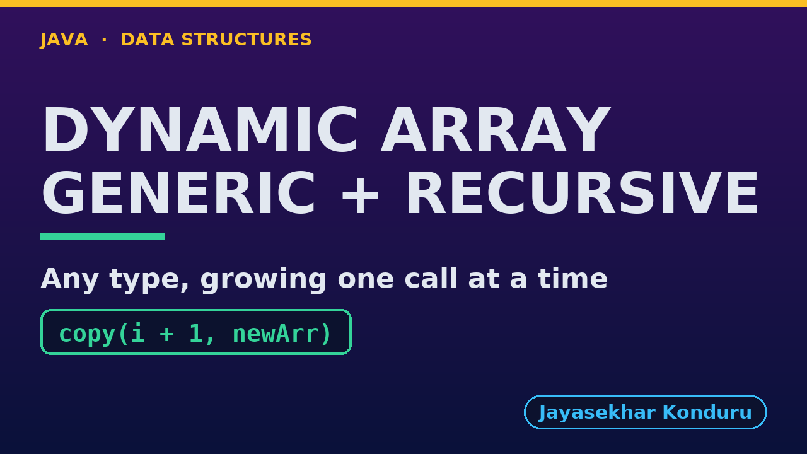

# YouTube — Dynamic Array (Generic, Recursive)

Everything needed to publish `video/dynamic-array-generic-recursive-explained.mp4`. Copy the fields straight out of this file.

Chapter timings come from the video's `.srt`; they are regenerated whenever the video is rebuilt.

## Title

```
Generic Recursive Dynamic Array in Java - References, equals and a Recursive Resize
```

83 characters (YouTube shows about 60 before cutting a title off in search).

## Description

The first two lines are what a viewer sees above the fold, so they carry the hook rather than the boilerplate.

```
Generic Recursive Dynamic Array in Java, explained with a playlist of Song records. We trace a recursive resize that copies references, not songs: copy(0) copies the reference to Blue Sky and calls copy(1), down to the base case copy(4), four frames deep, and the Song at index 0 is still the same object afterwards. We grow to 9 songs with 2 resizes, traverse a list of Integers with the same class, insert at the front with 9 recursive shifts, delete with 4, and find a separately made Song with a recursive equals search at depth 7. We shrink to fit with 8 references copied at depth 8, and finish at the limit: a million appends throw a real StackOverflowError inside a resize.

CHAPTERS
00:00 Introduction
00:44 The Everyday Idea
01:17 The Words
01:39 Act One — A recursive copy of references
02:08 A recursive copy of references
02:18 Act Two — Growing, and any type
02:38 Growing, and any type
02:43 Act Three — The middle, and equals, recursively
03:09 The middle, and equals, recursively
03:18 Act Four — Shrinking, recursively
03:34 Shrinking, recursively
03:41 Act Five — The limit of recursion
04:06 The limit of recursion
04:12 Time and Space Complexity
04:38 The Four Dynamic Arrays
05:00 Common Mistakes
05:18 Thanks for Watching

SOURCE CODE, WRITTEN NOTES AND AN INTERACTIVE ANIMATION
https://github.com/jk-boot-up/datastructures/tree/main/gradle-java/arrays-and-lists/dynamic-array-generic-recursive

WHAT YOU NEED FIRST
Java basics: variables, loops, classes and methods. No data-structures knowledge is assumed; START-HERE.md in the repository explains memory, references and counting steps.
```

## Chapters

YouTube shows these as chapters because there are at least three and the first is at `00:00`.

```
00:00 Introduction
00:44 The Everyday Idea
01:17 The Words
01:39 Act One — A recursive copy of references
02:08 A recursive copy of references
02:18 Act Two — Growing, and any type
02:38 Growing, and any type
02:43 Act Three — The middle, and equals, recursively
03:09 The middle, and equals, recursively
03:18 Act Four — Shrinking, recursively
03:34 Shrinking, recursively
03:41 Act Five — The limit of recursion
04:06 The limit of recursion
04:12 Time and Space Complexity
04:38 The Four Dynamic Arrays
05:00 Common Mistakes
05:18 Thanks for Watching
```

## Tags

```
java generics, dynamic array, recursion, arraylist, call stack, stack overflow, data structures, java data structures, java, java 25, algorithms, computer science, programming tutorial, beginner, big o
```

201 characters, under YouTube's 500 limit.

## Thumbnail



Upload `docs/thumbnail.png` (1280×720) under **Details → Thumbnail → Upload file**. It is made for the small size YouTube shows in search: the name, one line of promise and one piece of code.

## Upload checklist

- [ ] Upload `video/dynamic-array-generic-recursive-explained.mp4` (1080p, H.264, 30 fps, AAC 48 kHz)
- [ ] Set the video language to **English**, then add subtitles: *Upload file → With timing* → `video/dynamic-array-generic-recursive-explained.srt`
- [ ] Upload `docs/thumbnail.png` as the thumbnail
- [ ] Paste the title, description and tags from above
- [ ] Add to the **Data Structures in Java** playlist
- [ ] Wait for 1080p processing before sharing the link

## Runtime

06:04.
