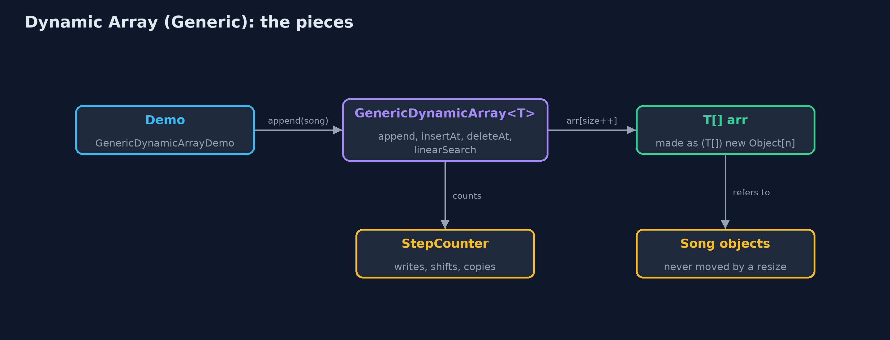
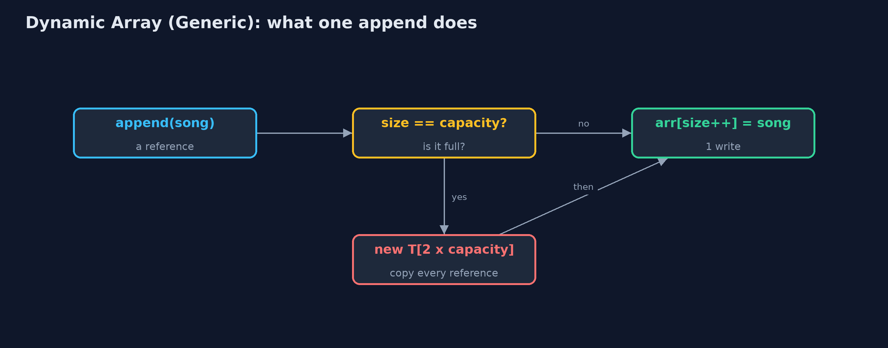
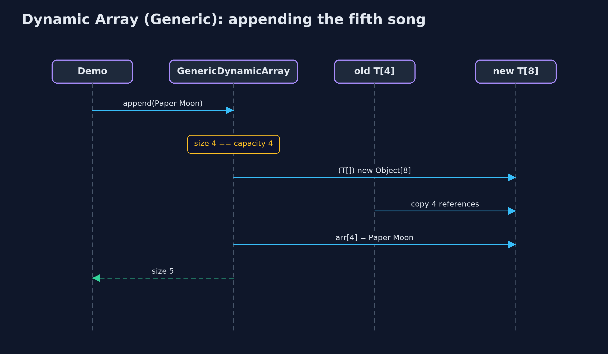

# Dynamic Array (Generic)

**A generic dynamic array is the dynamic array written once with a type parameter T: it stores references on an Object[] cast to T[], doubles when full and halves when a quarter full, copies references (not objects) when it resizes, and finds elements with equals; this is how Java's ArrayList<E> is written.**


*GenericDynamicArray<Song>: size 5, capacity 8; each place holds a reference to a Song*

A **generic dynamic array** is the `dynamic-array` project written once for **any element type**. The class has a **type parameter** `T`, so `GenericDynamicArray<Song>` holds songs, `GenericDynamicArray<String>` holds titles and `GenericDynamicArray<Integer>` holds numbers. Everything about growing is unchanged: a **size** and a **capacity**, doubling when full, halving when only a quarter is in use, O(1) amortised appends. What changes is what the places hold: **references** to objects. A resize copies the references, not the objects, so every element stays the very same object. Elements are found with **`equals`**. Since no ordering is needed, `T` may be any type at all. This is, almost line for line, how Java's `ArrayList<E>` is written.

> New to data structures? Read [Start here](../../START-HERE.md) first: it explains memory, references and counting steps in ten minutes.

## The everyday idea

Picture moving house again, but instead of carrying the furniture, you carry a list of where each piece is stored in a warehouse. When the list runs out of lines, you copy it onto a sheet twice as long, one address at a time. The furniture never moves: only the addresses are copied. And the list does not care whether the addresses point at chairs, books or bicycles.

## The worked example: A playlist of Song records, beside the same class holding titles and play counts

The music app's playlist now holds `Song` records, each with a title and a length in seconds. The same class also holds the titles as strings and the play counts as integers. The demo grows the playlist until it resizes twice, inserts an intro at the front, deletes a song from the middle, searches for a separately made `Song` with `equals`, deletes from the end, shrinks to fit, and measures a thousand appends.

## Why it exists

Without generics, a playlist of songs, a list of titles and a list of play counts would each need their own copy of the dynamic-array code, or one class storing `Object` that accepts anything and needs a cast on every read. One generic class serves every type, and the compiler checks each use. That is why every collection in Java, starting with `ArrayList<E>`, is generic.

## New words

| Word | What it means here |
| --- | --- |
| **type parameter T** | The element type, filled in at each use: `GenericDynamicArray<Song>`. |
| **size and capacity** | The number of elements in use, and the number of places in the array inside. |
| **reference** | What each place holds: the address of an object stored elsewhere. |
| **resize** | A new array of a different capacity, with every reference copied across; the objects do not move. |
| **equals** | How elements are compared: by contents. A record's `equals` compares all its fields. |
| **amortised O(1)** | The average cost of an append, counting the rare resize: about one copy per append. |

## What you will see, act by act

Run the demo and it tells the story in 5 acts, printing the real numbers that the tests check:

```bash
./gradlew run
```

| Act | What it shows |
| --- | --- |
| 1. One class, any element type | The same class holds String titles, Integer play counts and Song records; inside each is (T[]) new Object[4]. |
| 2. Full? Double it, copying references | Appending Paper Moon to 4 songs resizes to 8 and copies 4 references; the Song at index 0 is still the same object; 9 songs take 2 resizes. |
| 3. The middle, and equals | insertAt(0, Intro) shifts 9 songs; deleteAt(5) shifts 4; a new Song("Echoes", 201) is found at index 6 by equals, although it is a different object. |
| 4. Deleting clears references | 16 places, 9 in use, 7 spare and all null; deleteAtEnd sets the freed place to null so the Song can be freed; shrinkToFit copies 8 references. |
| 5. The bill | 1,000 appends copy 1,020 references, about one each; deleting down to 256 of 1,024 halves the capacity; the costs equal the String-only version. |

Each act is drawn step by step in [the explained walkthrough](docs/dynamic-array-generic-explained.md) and in [the animation](docs/animation.html).

## The operations, and what they cost

Time is given for the best, average and worst case in Big-O notation (START-HERE.md explains it by counting steps); the last column is what the demo actually counted, so every formula can be checked against a real number.

| Operation | What it does | Time: best / average / worst | Extra space | Steps counted in the demo |
| --- | --- | --- | --- | --- |
| Traverse | Visit arr[0] to arr[size-1] | O(n) / O(n) / O(n) | O(1) | one read per element |
| Access `get(i)` / `update(i, x)` | Read or replace the reference in arr[i] | O(1) / O(1) / O(1) | O(1) | 1 step |
| Insert at end `append(x)` | Store x at arr[size]; double first when full | O(1) / O(1) amortised / O(n) when it resizes | O(1) amortised; O(n) for the new array during a resize | 1,020 references copied over 1,000 appends |
| Resize (inside append) | A new T[] of twice the capacity, references copied | O(n) / O(n) / O(n), but rare | O(n) | 4 references at the 5th song, 8 at the 9th |
| Insert `insertAt(pos, x)` | Shift arr[pos..size-1] right, store x | O(1) at the end / O(n) / O(n) at the front | O(1), plus a resize when full | 9 shifts at the front of 9 songs |
| Delete at end `deleteAtEnd()` | Clear arr[size-1]; halve when a quarter full | O(1) / O(1) amortised / O(n) when it shrinks | O(1) amortised | 0 shifts |
| Delete `deleteAt(pos)` | Shift arr[pos+1..size-1] left, clear the freed place | O(1) at the end / O(n) / O(n) at the front | O(1) | 4 shifts to delete index 5 of 10 |
| Linear search | arr[i].equals(key), for each i in turn | O(1) / O(n) / O(n) | O(1) | 7 comparisons to find Echoes |
| Shrink to fit | Resize to exactly size places | O(n) / O(n) / O(n) | O(n) | 8 references copied |

Extra space is the memory an operation needs besides the structure itself. A loop needs a fixed amount, O(1); a recursive operation needs one call-stack frame for every call still waiting, so its extra space is the depth of the recursion.

## The operations in code

### Creating a T[]

```java
/** Java cannot create "new T[n]" (T is erased at run time), so an Object[] is cast to T[]. */
@SuppressWarnings("unchecked")
private static <T> T[] newArray(int capacity) {
    return (T[]) new Object[capacity];
}
```

`new T[capacity]` does not compile, because Java erases `T` when it compiles. An `Object[]` can hold a reference of any type, and the cast is safe because the class only ever stores `T`. `ArrayList` does the same: it keeps an `Object[] elementData`.

### Resize: copying references

```java
/** Allocates a new array of {@code newCapacity} places and copies the references across. O(n). */
private void resize(int newCapacity) {
    T[] newArr = newArray(newCapacity);
    for (int i = 0; i < size; i++) {
        newArr[i] = arr[i];
        steps.copy();
    }
    arr = newArr;
    resizes++;
}
```

The loop copies `arr[i]`, a reference, into the new array. The objects stay where they are, so after a resize every element is still the very same object.

### Deletion at a position

```java
/**
 * Deletion at {@code pos}: shift arr[pos+1..size-1] one place left. O(n - pos).
 *
 * @throws IllegalStateException "underflow" when the array is empty
 */
public T deleteAt(int pos) {
    if (isEmpty()) {
        throw new IllegalStateException("underflow: the array is empty");
    }
    checkIndex(pos);
    T deleted = arr[pos];
    for (int i = pos; i < size - 1; i++) {
        arr[i] = arr[i + 1];
        steps.shift();
    }
    arr[size - 1] = null;
    size--;
    shrinkIfQuarterFull();
    return deleted;
}
```

After the shift, the last place in use is set to `null`. With objects this matters: a leftover reference would keep the deleted song alive, and the garbage collector could never free it.

### Linear search with equals

```java
/** Linear search with {@code equals}: the first index holding an element equal to {@code key}, or -1. O(n). */
public int linearSearch(T key) {
    for (int i = 0; i < size; i++) {
        steps.compare();
        if (arr[i].equals(key)) {
            return i;
        }
    }
    return -1;
}
```

`arr[i].equals(key)` compares contents. A `Song` record's `equals` compares title and length, so a separately made song with the same fields is found.

## Compared with related structures

The generic dynamic array against its neighbours (n elements):

| Property | Generic dynamic array | Dynamic array of String | Generic static array |
| --- | --- | --- | --- |
| Element types | any T | String only | any Comparable T |
| Access element i | O(1) | O(1) | O(1) |
| Append | O(1) amortised | O(1) amortised | overflow when full |
| Insert or delete at the front | O(n) shifts | O(n) shifts | O(n) shifts |
| A resize copies | references | references to strings | not possible: fixed capacity |
| Finds elements with | equals | equals | equals, and compareTo for binary search |
| Java's own | ArrayList<E> | ArrayList<String> | T[] |

## The code

```
src/main/java/com/jk/explore/dynamicarraygeneric/
├── GenericDynamicArray.java      A dynamic array (a resizable array) of any element type {@code T}: a static array inside, replaced by a bigger one when it is full
├── GenericDynamicArrayDemo.java  Tells the story of the generic dynamic array in five acts, printing the real step counts
├── Lines.java                    The demo's printed lines, kept in one {@code StringBuilder} so the tests can check them
├── Song.java                     One song in the playlist: a type of our own, to show that the generic dynamic array holds any type
└── StepCounter.java              Counts the steps a dynamic array takes, so the demo can print real numbers
```

## Test

```bash
./gradlew test
```

30 tests in `DemoRunsTest`, `GenericDynamicArrayTest`. Every number the demo prints is asserted, and nothing depends on the clock, so every run gives the same result.

## Common mistakes

| The mistake | What goes wrong | The fix |
| --- | --- | --- |
| Writing `new T[capacity]` | It does not compile: T is not known when the program runs. | `(T[]) new Object[capacity]`, kept inside the class. |
| Searching with `==` | An equal song made elsewhere is a different object, so it is not found. | Compare with `equals`. |
| Not clearing freed places | Deleted objects stay referenced and are never garbage-collected: a memory leak. | Set every place that falls out of use to `null`. |
| Growing by a fixed amount | Every append near the limit copies everything: about n squared over 2 copies. | Grow by a factor: double, or one and a half as `ArrayList` does. |

## Try it yourself

1. **Easy.** Write `boolean contains(T key)` using the methods the class already has. What does `contains(new Song("Echoes", 201))` return after the demo's act three, and why?
2. **Medium.** Write `boolean deleteByKey(T key)`, which deletes the first element equal to `key`. What does it cost?
3. **Harder.** Add a constructor `GenericDynamicArray(T[] values)` that builds the array from an existing array with one resize at most. How many references does it copy for 9 songs, and how does that compare with appending them one by one from capacity 4?

The answers are in [docs/exercises.md](docs/exercises.md), below the questions, so they are not given away.

## When to use it

- A growing list of objects of one type: songs, orders, readings.
- Mostly appending at the end and reading by index.
- Whenever you would use `ArrayList<E>`; this project shows what it does inside.

## When not to

- Frequent insertion and deletion at the front: every element shifts; use a linked list or a deque.
- Millions of plain numbers: an `int[]` avoids a reference and an object per element.

## Where you have already met this

- `java.util.ArrayList<E>`, `List<E>` and `Vector<E>`.
- `StringBuilder`, which grows its character array the same way.
- C++'s `std::vector<T>` and Python's `list`.

## Technologies and versions

| Technology | Version | Used for |
| --- | --- | --- |
| Java | 25 | the code (toolchain set in `build.gradle`; Gradle fetches JDK 25 if it is missing) |
| Gradle | 9.8.0 (wrapper) | build and run, nothing to install |
| JUnit | 6.1.3 | the tests |
| videokit | course tool | the narrated video and animation: Piper `en_US-amy-medium`, speed 0.8, longer pauses (the `amy-slow` voice) |

## Learning material

| Document | What it is for |
| --- | --- |
| [Start here](../../START-HERE.md) | the ideas every project relies on |
| [Problem statement](docs/problem-statement.md) | the situation and what the project must show |
| [Prerequisites](docs/prerequisites.md) | what you need to know first |
| [Dynamic Array (Generic), explained](docs/dynamic-array-generic-explained.md) | every act, picture by picture |
| [Animated walkthrough](docs/animation.html) | the structure changing step by step, narrated |
| [Cheat sheet](docs/cheat-sheet.md) | the whole structure on one page |
| [Exercises and answers](docs/exercises.md) | practice, easy to harder |
| [Session guide](docs/session.md) | a one-hour lesson |
| [Specification](docs/spec.md) | what this project must be true of |

### How the pieces fit

The demo appends Songs to one generic class; its T[] holds references to Song objects elsewhere in memory.



### The classes

`GenericDynamicArray<T>` holds any type; `Song` is a record of our own.


### How the data moves

Write into a spare place, or resize first by copying references.



### Who calls whom, in order

The resize copies four references; the Song objects are not touched.



### Video

`video/dynamic-array-generic-explained.mp4` (with `.m4a` audio and `.srt` subtitles) is built by `video/build_video.sh`. Rendered media is not committed.

## Where this sits

Part of the [data structures course](../../index.md), in *arrays-and-lists*.
