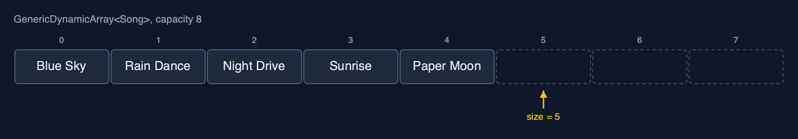
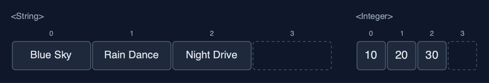
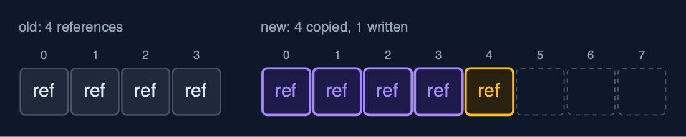
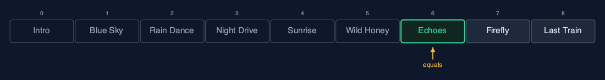
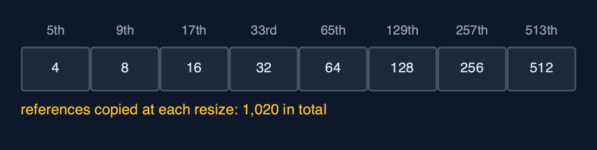

# Dynamic Array (Generic), Explained

## In one sentence

A generic dynamic array stores references to any type T on an Object[] cast to T[], doubles when full, halves when a quarter full, and finds elements with equals: Java's ArrayList, built by hand.

## The picture



*GenericDynamicArray<Song>: size 5, capacity 8; each place holds a reference to a Song*

## The everyday idea

Picture moving house again, but instead of carrying the furniture, you carry a list of where each piece is stored in a warehouse. When the list runs out of lines, you copy it onto a sheet twice as long, one address at a time. The furniture never moves: only the addresses are copied. And the list does not care whether the addresses point at chairs, books or bicycles.

## The 5 acts

### Act 1: One class, any element type

Three playlists use one class. `GenericDynamicArray<String>` holds titles, `GenericDynamicArray<Integer>` holds play counts, and `GenericDynamicArray<Song>` holds records of our own, each a title and a length. Inside each is an array created as `(T[]) new Object[4]`, because Java cannot create `new T[4]`: T is erased when the program runs. Capacity 4, size 3 in each.



**Three arrays from one class: Strings, Integers and Songs** Here are two of them. Titles and play counts. The same class, the same code, four places each, three in use.

What the demo printed:

```
GenericDynamicArray<String>:  [Blue Sky, Rain Dance, Night Drive]
GenericDynamicArray<Integer>: [10, 20, 30]
GenericDynamicArray<Song>:    [Blue Sky (3:34), Rain Dance (3:07), Night Drive (4:03)]
inside each: (T[]) new Object[4], capacity 4, size 3
```

### Act 2: Full? Double it, copying references

After the fourth song the array is full, so appending "Paper Moon" allocates an array of 8 places and copies the 4 references across, then stores the new one. The songs themselves never move: after the resize, index 0 still holds the very same `Song` object. Four more songs follow; the ninth doubles the capacity again to 16. Nine appends, two resizes, twelve references copied: the same counts as the String-only dynamic array.



**The resize copies references: the Song objects stay where they are** Here is the resize. The old array of four, and the new array of eight. Each place holds an arrow to a song. The arrows are copied, and the songs stay put.

What the demo printed:

```
append(Paper Moon (2:56)): full, new array of 8 places, 4 references copied
index 0 still holds the very same Song object: true
9 songs appended, 2 resizes, capacity 16
```

### Act 3: The middle, and equals

Inserting an intro at the front shifts all 9 song references one place right; deleting index 5, "Paper Moon", shifts the 4 after it left. Then a new `Song("Echoes", 201)` is made and searched for. Linear search compares with `equals`, and a record's `equals` compares its fields, title and length, so the search finds it at index 6 after 7 comparisons. It is not the same object as the one stored: `==` would have missed it.



**linearSearch with equals: indexes 0 to 5 do not match, index 6 does** Here is the search. Six songs compared, and not equal. The seventh, Echoes, is equal: same title, same length. Seven comparisons.

What the demo printed:

```
insertAt(0, Intro (0:42)): 9 songs shifted right
deleteAt(5) removed Paper Moon (2:56): 4 songs shifted left
linearSearch(new Song("Echoes", 201)) = index 6 after 7 comparisons: a record's equals compares title and length
but it is a different object: holdsSameObject = false
```

### Act 4: Deleting clears references

Spare places hold `null`: capacity 16, size 9, seven empty. `deleteAtEnd` removes "Last Train" and sets its place to `null`, so no reference to the song remains in the array and the garbage collector can free it. Forgetting that line is a classic memory leak in a hand-written list. `shrinkToFit` then resizes to exactly 8 places, copying 8 references.


**After deleteAtEnd: the freed place holds null, not a leftover reference** Here is the array after the deletion. Eight songs. The place that held Last Train is now null, like every spare place.

What the demo printed:

```
capacity 16, size 9: 7 places spare, all null
deleteAtEnd() removed Last Train (3:52); its place is set to null so the Song can be freed
shrinkToFit(): capacity 8, 8 references copied
```

### Act 5: The bill

A thousand appends copy 4 + 8 + ... + 512 = 1,020 references in total, about one per append: O(1) amortised, exactly as in the String-only dynamic array. Deleting from the end down to 256, a quarter of 1,024, halves the capacity to 512. Generics change the element type, not the algorithm or its costs. Java's `ArrayList<E>` is this structure on an `Object[]`, growing by half rather than doubling.



**References copied at each resize: 4, 8, 16 ... 512, about one per append** Here are the copies at each resize. Four, eight, sixteen, doubling each time, up to five hundred and twelve. One thousand and twenty in all, for a thousand appends.

What the demo printed:

```
1,000 appends: 1,020 references copied, about 1 per append
deleteAtEnd down to 256 of capacity 1024: capacity halves to 512
the same costs as the String-only dynamic array: generics change the type, not the algorithm
already in Java: java.util.ArrayList<E>, written exactly this way on an Object[]
```

## The operations in code

### Creating a T[]

```java
/** Java cannot create "new T[n]" (T is erased at run time), so an Object[] is cast to T[]. */
@SuppressWarnings("unchecked")
private static <T> T[] newArray(int capacity) {
    return (T[]) new Object[capacity];
}
```

`new T[capacity]` does not compile, because Java erases `T` when it compiles. An `Object[]` can hold a reference of any type, and the cast is safe because the class only ever stores `T`. `ArrayList` does the same: it keeps an `Object[] elementData`.

### Resize: copying references

```java
/** Allocates a new array of {@code newCapacity} places and copies the references across. O(n). */
private void resize(int newCapacity) {
    T[] newArr = newArray(newCapacity);
    for (int i = 0; i < size; i++) {
        newArr[i] = arr[i];
        steps.copy();
    }
    arr = newArr;
    resizes++;
}
```

The loop copies `arr[i]`, a reference, into the new array. The objects stay where they are, so after a resize every element is still the very same object.

### Deletion at a position

```java
/**
 * Deletion at {@code pos}: shift arr[pos+1..size-1] one place left. O(n - pos).
 *
 * @throws IllegalStateException "underflow" when the array is empty
 */
public T deleteAt(int pos) {
    if (isEmpty()) {
        throw new IllegalStateException("underflow: the array is empty");
    }
    checkIndex(pos);
    T deleted = arr[pos];
    for (int i = pos; i < size - 1; i++) {
        arr[i] = arr[i + 1];
        steps.shift();
    }
    arr[size - 1] = null;
    size--;
    shrinkIfQuarterFull();
    return deleted;
}
```

After the shift, the last place in use is set to `null`. With objects this matters: a leftover reference would keep the deleted song alive, and the garbage collector could never free it.

### Linear search with equals

```java
/** Linear search with {@code equals}: the first index holding an element equal to {@code key}, or -1. O(n). */
public int linearSearch(T key) {
    for (int i = 0; i < size; i++) {
        steps.compare();
        if (arr[i].equals(key)) {
            return i;
        }
    }
    return -1;
}
```

`arr[i].equals(key)` compares contents. A `Song` record's `equals` compares title and length, so a separately made song with the same fields is found.

## The operations, and what they cost

| Operation | What it does | Time: best / average / worst | Extra space | Steps counted in the demo |
| --- | --- | --- | --- | --- |
| Traverse | Visit arr[0] to arr[size-1] | O(n) / O(n) / O(n) | O(1) | one read per element |
| Access `get(i)` / `update(i, x)` | Read or replace the reference in arr[i] | O(1) / O(1) / O(1) | O(1) | 1 step |
| Insert at end `append(x)` | Store x at arr[size]; double first when full | O(1) / O(1) amortised / O(n) when it resizes | O(1) amortised; O(n) for the new array during a resize | 1,020 references copied over 1,000 appends |
| Resize (inside append) | A new T[] of twice the capacity, references copied | O(n) / O(n) / O(n), but rare | O(n) | 4 references at the 5th song, 8 at the 9th |
| Insert `insertAt(pos, x)` | Shift arr[pos..size-1] right, store x | O(1) at the end / O(n) / O(n) at the front | O(1), plus a resize when full | 9 shifts at the front of 9 songs |
| Delete at end `deleteAtEnd()` | Clear arr[size-1]; halve when a quarter full | O(1) / O(1) amortised / O(n) when it shrinks | O(1) amortised | 0 shifts |
| Delete `deleteAt(pos)` | Shift arr[pos+1..size-1] left, clear the freed place | O(1) at the end / O(n) / O(n) at the front | O(1) | 4 shifts to delete index 5 of 10 |
| Linear search | arr[i].equals(key), for each i in turn | O(1) / O(n) / O(n) | O(1) | 7 comparisons to find Echoes |
| Shrink to fit | Resize to exactly size places | O(n) / O(n) / O(n) | O(n) | 8 references copied |

## Compared with related structures

The generic dynamic array against its neighbours (n elements):

| Property | Generic dynamic array | Dynamic array of String | Generic static array |
| --- | --- | --- | --- |
| Element types | any T | String only | any Comparable T |
| Access element i | O(1) | O(1) | O(1) |
| Append | O(1) amortised | O(1) amortised | overflow when full |
| Insert or delete at the front | O(n) shifts | O(n) shifts | O(n) shifts |
| A resize copies | references | references to strings | not possible: fixed capacity |
| Finds elements with | equals | equals | equals, and compareTo for binary search |
| Java's own | ArrayList<E> | ArrayList<String> | T[] |

## The verdict

This is the most used data structure in Java; in real code use `ArrayList<E>`, which is exactly this. Build it once by hand to understand what `add`, `remove` and `get` cost, and why a leftover reference is a memory leak.

## How to recognise it in code you did not write

- `(T[]) new Object[capacity]` in a generic class.
- `if (size == arr.length) resize(arr.length * 2);` before storing.
- `arr[--size] = null;` or `arr[size - 1] = null;` after a deletion.

## Where you have already met this

- `java.util.ArrayList<E>`, `List<E>` and `Vector<E>`.
- `StringBuilder`, which grows its character array the same way.
- C++'s `std::vector<T>` and Python's `list`.
