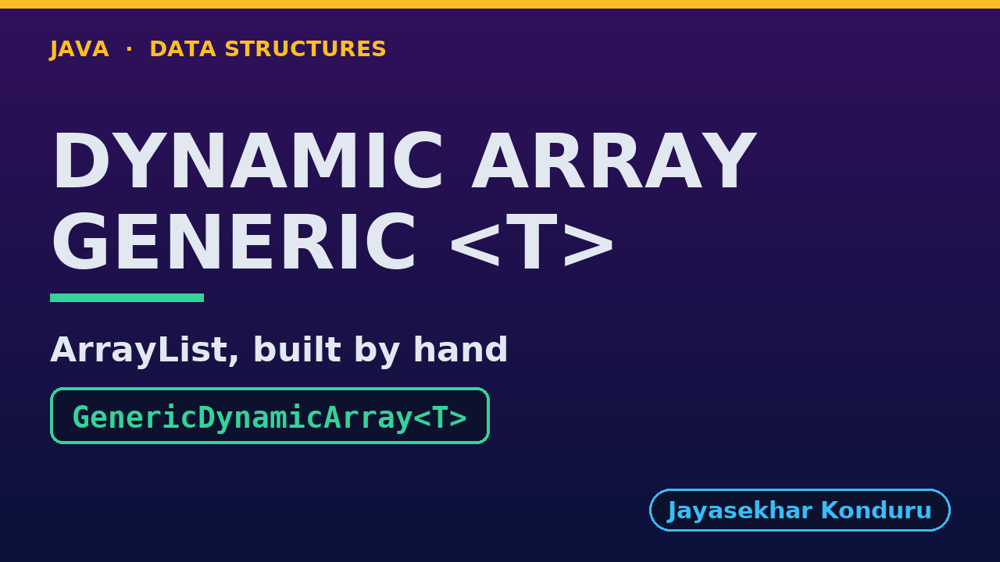

# YouTube — Dynamic Array (Generic)

Everything needed to publish `video/dynamic-array-generic-explained.mp4`. Copy the fields straight out of this file.

Chapter timings come from the video's `.srt`; they are regenerated whenever the video is rebuilt.

## Title

```
Generic Dynamic Array in Java - Build Your Own ArrayList<E>
```

59 characters (YouTube shows about 60 before cutting a title off in search).

## Description

The first two lines are what a viewer sees above the fold, so they carry the hook rather than the boilerplate.

```
Generic Dynamic Array in Java, explained with a music playlist of Song records, beside the same class holding titles and play counts. We see why the array inside is created as (T[]) new Object[4], then append until it is full and watch a resize copy 4 references, not 4 songs: the Song at index 0 is still the very same object. We grow to 9 songs with 2 resizes, insert an intro at the front with 9 shifts, delete from the middle with 4, and find a separately made Song with equals, because a record's equals compares its fields. We clear freed places so the garbage collector can reclaim deleted songs, shrink to fit, and finish with the bill: 1,020 references copied for 1,000 appends, and the capacity halving when a quarter full. This is how java.util.ArrayList is built.

CHAPTERS
00:00 Introduction
00:43 The Everyday Idea
01:12 The Words
01:39 Act One — One class, any element type
02:08 One class, any element type
02:19 Act Two — Full? Double it, copying references
02:45 Full? Double it, copying references
03:00 Act Three — The middle, and equals
03:29 The middle, and equals
03:43 Act Four — Deleting clears references
04:06 Deleting clears references
04:17 Act Five — The bill
04:43 The bill
04:58 Time and Space Complexity
05:23 Compared With Related Structures
05:49 Common Mistakes
06:10 Thanks for Watching

SOURCE CODE, WRITTEN NOTES AND AN INTERACTIVE ANIMATION
https://github.com/jk-boot-up/datastructures/tree/main/gradle-java/arrays-and-lists/dynamic-array-generic

WHAT YOU NEED FIRST
Java basics: variables, loops, classes and methods. No data-structures knowledge is assumed; START-HERE.md in the repository explains memory, references and counting steps.
```

## Chapters

YouTube shows these as chapters because there are at least three and the first is at `00:00`.

```
00:00 Introduction
00:43 The Everyday Idea
01:12 The Words
01:39 Act One — One class, any element type
02:08 One class, any element type
02:19 Act Two — Full? Double it, copying references
02:45 Full? Double it, copying references
03:00 Act Three — The middle, and equals
03:29 The middle, and equals
03:43 Act Four — Deleting clears references
04:06 Deleting clears references
04:17 Act Five — The bill
04:43 The bill
04:58 Time and Space Complexity
05:23 Compared With Related Structures
05:49 Common Mistakes
06:10 Thanks for Watching
```

## Tags

```
java generics, dynamic array, arraylist, resizable array, equals, amortized, data structures, java data structures, java, java 25, algorithms, computer science, programming tutorial, beginner, big o
```

198 characters, under YouTube's 500 limit.

## Thumbnail



Upload `docs/thumbnail.png` (1280×720) under **Details → Thumbnail → Upload file**. It is made for the small size YouTube shows in search: the name, one line of promise and one piece of code.

## Upload checklist

- [ ] Upload `video/dynamic-array-generic-explained.mp4` (1080p, H.264, 30 fps, AAC 48 kHz)
- [ ] Set the video language to **English**, then add subtitles: *Upload file → With timing* → `video/dynamic-array-generic-explained.srt`
- [ ] Upload `docs/thumbnail.png` as the thumbnail
- [ ] Paste the title, description and tags from above
- [ ] Add to the **Data Structures in Java** playlist
- [ ] Wait for 1080p processing before sharing the link

## Runtime

06:53.
