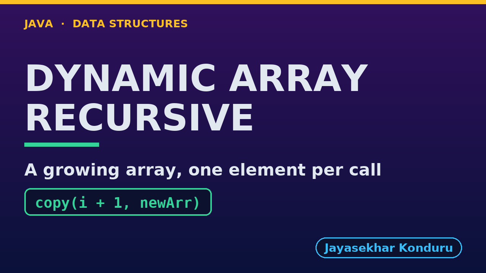

# YouTube — Dynamic Array (Recursive)

Everything needed to publish `video/dynamic-array-recursive-explained.mp4`. Copy the fields straight out of this file.

Chapter timings come from the video's `.srt`; they are regenerated whenever the video is rebuilt.

## Title

```
Dynamic Array in Java, Recursively - Recursive Resize and the Call Stack
```

72 characters (YouTube shows about 60 before cutting a title off in search).

## Description

The first two lines are what a viewer sees above the fold, so they carry the hook rather than the boilerplate.

```
Dynamic Array in Java, written recursively, explained with a music playlist that grows one song at a time. We trace a recursive resize call by call: copy(0) copies Blue Sky and calls copy(1), down to the base case copy(4), four copies at depth 4. We grow the playlist to 9 songs with 2 resizes and 12 copies, traverse it at depth 9, insert at the front with 9 recursive shifts, delete from the middle with 4, and search recursively. We shrink to fit with 9 copies at depth 9 and see the capacity halve when deletions leave it a quarter full. We finish at the limit: appending a million songs throws a real StackOverflowError inside a resize, because a recursive copy needs one frame per element. The loop version is in the Dynamic Array project.

CHAPTERS
00:00 Introduction
00:47 The Everyday Idea
01:25 The Words
01:52 Act One — A recursive copy
02:24 A recursive copy
02:39 Act Two — Growing
03:07 Growing
03:19 Act Three — The middle, recursively
03:44 The middle, recursively
03:57 Act Four — Shrinking, recursively
04:22 Shrinking, recursively
04:34 Act Five — The limit of recursion
05:03 The limit of recursion
05:14 Time and Space Complexity
05:44 Recursive or Loop?
06:05 Common Mistakes
06:29 Thanks for Watching

SOURCE CODE, WRITTEN NOTES AND AN INTERACTIVE ANIMATION
https://github.com/jk-boot-up/datastructures/tree/main/gradle-java/arrays-and-lists/dynamic-array-recursive

WHAT YOU NEED FIRST
Java basics: variables, loops, classes and methods. No data-structures knowledge is assumed; START-HERE.md in the repository explains memory, references and counting steps.
```

## Chapters

YouTube shows these as chapters because there are at least three and the first is at `00:00`.

```
00:00 Introduction
00:47 The Everyday Idea
01:25 The Words
01:52 Act One — A recursive copy
02:24 A recursive copy
02:39 Act Two — Growing
03:07 Growing
03:19 Act Three — The middle, recursively
03:44 The middle, recursively
03:57 Act Four — Shrinking, recursively
04:22 Shrinking, recursively
04:34 Act Five — The limit of recursion
05:03 The limit of recursion
05:14 Time and Space Complexity
05:44 Recursive or Loop?
06:05 Common Mistakes
06:29 Thanks for Watching
```

## Tags

```
dynamic array, recursion, resize, call stack, stack overflow, amortized, data structures, java data structures, java, java 25, algorithms, computer science, programming tutorial, beginner, big o
```

194 characters, under YouTube's 500 limit.

## Thumbnail



Upload `docs/thumbnail.png` (1280×720) under **Details → Thumbnail → Upload file**. It is made for the small size YouTube shows in search: the name, one line of promise and one piece of code.

## Upload checklist

- [ ] Upload `video/dynamic-array-recursive-explained.mp4` (1080p, H.264, 30 fps, AAC 48 kHz)
- [ ] Set the video language to **English**, then add subtitles: *Upload file → With timing* → `video/dynamic-array-recursive-explained.srt`
- [ ] Upload `docs/thumbnail.png` as the thumbnail
- [ ] Paste the title, description and tags from above
- [ ] Add to the **Data Structures in Java** playlist
- [ ] Wait for 1080p processing before sharing the link

## Runtime

07:18.
