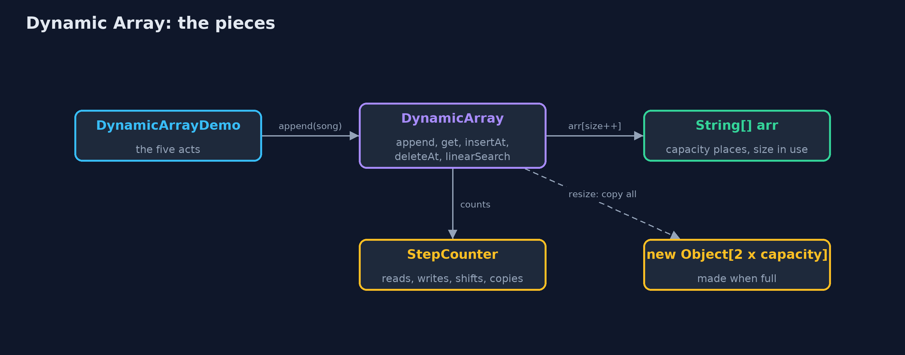
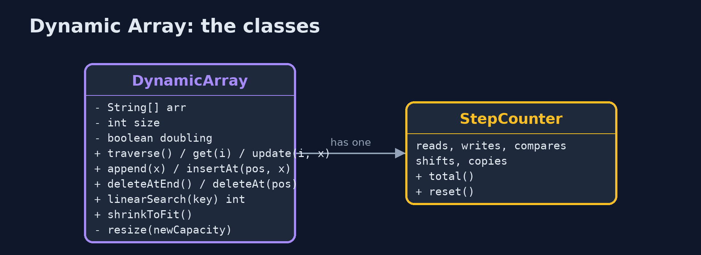
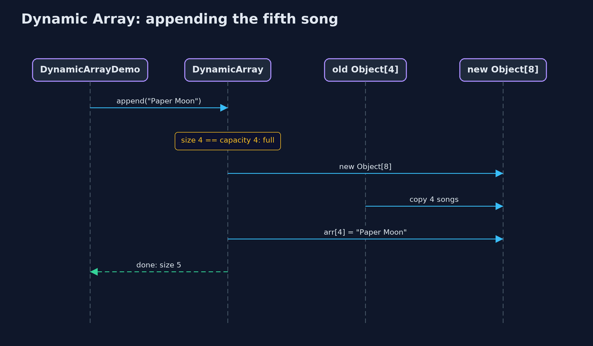

# Dynamic Array

**A dynamic array keeps a fixed array inside with some spare places; when it is full it shifts everything into a new array twice as big, so adding at the end stays cheap on average.**


*size 5, capacity 8: five songs in use and three spare places, dashed*

A **dynamic array** is an array that grows by itself. Inside, it keeps an ordinary fixed array with some spare places at the end. It remembers two numbers: the **size**, how many places are in use, and the **capacity**, how many places the inside array has. Adding a value puts it in the next spare place. When there are no spare places left, it makes a new array twice as big, copies every value across, and carries on. This is exactly what Java's `ArrayList` does, and this project builds it by hand.

> New to data structures? Read [Start here](../../START-HERE.md) first: it explains memory, references and counting steps in ten minutes.

## The everyday idea

Think of a family moving house. They buy a house with a few spare bedrooms. Each new child takes a spare room, and nothing else changes. When every room is full, they move to a house twice the size, carrying every belonging across in one big move. Moving is hard work, but because the new house is twice as big, it will be a long time before they have to move again. That is a dynamic array: cheap to add to almost every time, and an occasional big move.

## The worked example: A music playlist that grows as songs are added

A music app keeps a playlist of song titles. The listener appends songs one at a time, and nobody knows in advance how long the playlist will get. The playlist starts with room for four songs. The demo appends songs until it runs out of room, watches it grow, inserts an intro at the front, removes a song from the middle, and measures what a thousand songs cost.

## Why it exists

A static array cannot grow: a fifth song in a four-place array stops the program. The obvious fix, making a new array one place bigger every time, works but is ruinously slow: adding 1,000 songs that way copies 499,494 values, because every append copies everything already there. Doubling the capacity instead means the big copies happen rarely, and 1,000 songs cost only 1,020 copies, about one per song.

## New words

| Word | What it means here |
| --- | --- |
| **size** | How many places are in use: how many songs are in the playlist. |
| **capacity** | How many places the array inside has, used or not. Always at least the size. |
| **spare places** | Capacity minus size: room to add without growing. They are not part of the array. |
| **resize** | Making a new, bigger array inside and copying every value across. |
| **copy** | Carrying one value from the old array into the new one during a resize. The demo counts them. |
| **amortised cost** | The average cost of an operation over many uses, counting the rare expensive one. Adding is amortised one step. |

## What you will see, act by act

Run the demo and it tells the story in 5 acts, printing the real numbers that the tests check:

```bash
./gradlew run
```

| Act | What it shows |
| --- | --- |
| 1. A playlist in a fixed array | Four songs fill a `new String[4]`; the fifth throws, and growing one place at a time would cost 499,494 copies for 1,000 songs. |
| 2. Size and capacity | The dynamic array keeps 4 places but only 3 in use: size 3, capacity 4; adding the fourth song is 1 step and fills it. |
| 3. Full? Double it | The fifth song makes an 8-place array and copies 4; the ninth makes 16 and copies 8. 1,000 songs cost 1,020 copies, not 499,494. |
| 4. The middle, and the spare places | insertAt(0) shifts 9 songs; deleteAt(5) shifts 4; a spare place cannot be read; shrinkToFit gives 7 places back. |
| 5. The bill | The one append that resizes at 512 songs copies all 512; at 513 songs 511 of 1,024 places are spare; deleting down to 256 halves the capacity. |

Each act is drawn step by step in [the explained walkthrough](docs/dynamic-array-explained.md) and in [the animation](docs/animation.html).

## The operations, and what they cost

Time is given for the best, average and worst case in Big-O notation (START-HERE.md explains it by counting steps); the last column is what the demo actually counted, so every formula can be checked against a real number.

| Operation | What it does | Time: best / average / worst | Extra space | Steps counted in the demo |
| --- | --- | --- | --- | --- |
| Traverse | Visit arr[0] to arr[size-1] once | O(n) / O(n) / O(n) | O(1) | one read per element |
| Access `get(i)` | Return arr[i], by address calculation | O(1) / O(1) / O(1) | O(1) | 1 step |
| Update `update(i, x)` | Replace arr[i] | O(1) / O(1) / O(1) | O(1) | 1 step |
| Insert at end `append(x)` | Store x at arr[size]; resize to double first when full | O(1) / O(1) amortised / O(n) when it resizes | O(1) amortised; O(n) for the new array during a resize | 1 write usually; 1,020 copies over 1,000 appends |
| Resize (inside append) | Allocate an array of twice the capacity and copy every element | O(n) / O(n) / O(n), but rare | O(n) | 4 copies at the 5th song, 8 at the 9th, 512 at the 513th |
| Insert `insertAt(pos, x)` | Shift arr[pos..size-1] right, store x | O(1) at the end / O(n) / O(n) at the front | O(1), plus a resize when full | 9 shifts to insert at the front of 9 songs |
| Delete at end `deleteAtEnd()` | Clear arr[size-1]; halve the capacity when a quarter full | O(1) / O(1) amortised / O(n) when it shrinks | O(1) amortised | 0 shifts; 1 resize going from 513 songs down to 256 |
| Delete `deleteAt(pos)` | Shift arr[pos+1..size-1] left | O(1) at the end / O(n) / O(n) at the front | O(1) | 4 shifts to delete index 5 of 10 |
| Linear search | Compare each element with the key in turn | O(1) / O(n) / O(n) | O(1) | one comparison per element looked at |
| Shrink to fit | Resize to exactly size places | O(n) / O(n) / O(n) | O(n) | 9 copies for 9 songs |

Extra space is the memory an operation needs besides the structure itself. A loop needs a fixed amount, O(1); a recursive operation needs one call-stack frame for every call still waiting, so its extra space is the depth of the recursion.

## The operations in code

### Insertion at the end

```java
/** Insertion at the end: one write, after a resize when full. O(1) amortised, O(n) worst case. */
public void append(String value) {
    checkValue(value);
    if (size == arr.length) {
        resize(newCapacity());
    }
    arr[size] = value;
    steps.write();
    size++;
}
```

If `size == arr.length` the array is full, so it is replaced by a bigger one first; then the value goes into `arr[size]` and the size grows by one. Most appends are one write; the rare one that resizes costs O(n).

### Resize

```java
private int newCapacity() {
    if (!doubling) {
        return arr.length + 1;
    }
    return arr.length == 0 ? 1 : arr.length * 2;
}

/** Allocates a new array of {@code newCapacity} places and copies the elements across. O(n). */
private void resize(int newCapacity) {
    String[] newArr = new String[newCapacity];
    for (int i = 0; i < size; i++) {
        newArr[i] = arr[i];
        steps.copy();
    }
    arr = newArr;
    resizes++;
}
```

`newCapacity` doubles (or, for the measured comparison, appends one place). `resize` allocates the new array and copies the elements one by one; the old array becomes garbage. Because each resize doubles the room, the copies over n appends add up to less than 2n: O(1) amortised per append.

### Deletion at the end, and shrinking

```java
/**
 * Deletion at the end: O(1), apart from the occasional shrink.
 *
 * @throws IllegalStateException "underflow" when the array is empty
 */
public String deleteAtEnd() {
    if (isEmpty()) {
        throw new IllegalStateException("underflow: the array is empty");
    }
    String deleted = arr[size - 1];
    arr[size - 1] = null;          // clear the freed place so the string can be garbage-collected
    size--;
    shrinkIfQuarterFull();
    return deleted;
}

/** Halves the capacity when only a quarter is in use, so the next append cannot resize at once. */
private void shrinkIfQuarterFull() {
    if (doubling && size > 0 && size == arr.length / 4) {
        resize(arr.length / 2);
    }
}
```

The freed place is set to `null` so the string can be garbage-collected. When only a quarter of the array is in use, the capacity is halved. Halving at a quarter rather than at a half leaves room both ways, so appends and deletions alternating at the boundary cannot resize every time.

### Insertion at a position

```java
/**
 * Insertion at {@code pos}: resize when full, shift arr[pos..size-1] one place right, starting
 * from the end, then store the value. O(n - pos).
 */
public void insertAt(int pos, String value) {
    checkValue(value);
    if (pos < 0 || pos > size) {
        throw new IndexOutOfBoundsException("position " + pos + " outside 0.." + size);
    }
    if (size == arr.length) {
        resize(newCapacity());
    }
    for (int i = size - 1; i >= pos; i--) {
        arr[i + 1] = arr[i];
        steps.shift();
    }
    arr[pos] = value;
    steps.write();
    size++;
}
```

Resize first if full, then the same shift as a static array: from the end down to `pos`, so no element is overwritten before it has shifted.

## Compared with related structures

How a dynamic array compares with the structures it is usually weighed against (n elements):

| Operation | Dynamic array | Static array | Singly linked list |
| --- | --- | --- | --- |
| Access element i | O(1) | O(1) | O(n) |
| Insert at the end | O(1) amortised, O(n) on a resize | O(1), overflow when full | O(1) with a tail pointer |
| Insert or delete at the front | O(n) shifts | O(n) shifts | O(1) |
| Search (unsorted) | O(n) | O(n) | O(n) |
| Size | grows and shrinks by copying | fixed at creation | grows one node at a time |
| Extra memory | up to half the places spare after a resize | capacity - n places | one next pointer per node |
| Memory layout | consecutive | consecutive | scattered nodes |

## The code

```
src/main/java/com/jk/explore/dynamicarray/
├── DynamicArray.java      A dynamic array (a resizable array) of strings: a static array inside, replaced by a bigger one when it is full
├── DynamicArrayDemo.java  Tells the story of the dynamic array in five acts, printing the real step counts
├── Lines.java             The demo's printed lines, kept in one {@code StringBuilder} so the tests can check them
└── StepCounter.java       Counts the steps a dynamic array takes, so the demo can print real numbers
```

## Test

```bash
./gradlew test
```

29 tests in `DemoRunsTest`, `DynamicArrayTest`. Every number the demo prints is asserted, and nothing depends on the clock, so every run gives the same result.

## Common mistakes

| The mistake | What goes wrong | The fix |
| --- | --- | --- |
| Growing by one place at a time | Every add copies everything already stored: 1,000 songs cost 499,494 copies. | Grow by a factor (double, or one and a half as Java does), never by a fixed amount. |
| Treating capacity as size | Reading a spare place returns a value that was never added, or throws. | Only indexes 0 to size - 1 hold elements; check indexes against the size. |
| Forgetting to clear a removed place | The old value stays referenced in the array, so Java cannot free its memory. | Set the place that falls out of use to `null`, as `deleteAt` and `deleteAtEnd` do. |
| Deleting from the front in a loop | Each remove shifts every other value: removing all 1,000 songs from the front makes about half a million shifts. | Delete from the end, or use a structure made for the front, such as a deque. |

## Try it yourself

1. **Easy.** A dynamic array starts with capacity 4 and doubles. What are its size and capacity after 10 appends, and how many resizes happened?
2. **Medium.** Write `boolean deleteByKey(String key)`, which finds the first element equal to `key` and deletes it, returning whether it found one. Use the methods the class already has.
3. **Harder.** Change `newCapacity` to grow by one and a half times (`capacity + capacity / 2`, as Java's `ArrayList` does). Starting from 4 places, what capacities does it pass through for the first 20 appends, and why might Java prefer 1.5 to 2?

The answers are in [docs/exercises.md](docs/exercises.md), below the questions, so they are not given away.

## When to use it

- You do not know in advance how many values there will be.
- You mostly add at the end and read by position.
- You want one-step reads by index, like an array, without fixing the length.

## When not to

- You often insert or remove at the front or in the middle: every later value moves (a linked list or a deque suits that better).
- Every single append must be fast: the rare resize copies everything at once.
- Memory is very tight: up to half the places can sit unused.

## Where you have already met this

- `java.util.ArrayList`, the most used collection in Java, is a dynamic array.
- `StringBuilder` grows its character array the same way when you append.
- Python's `list` and C++'s `std::vector` work the same way underneath.

## Technologies and versions

| Technology | Version | Used for |
| --- | --- | --- |
| Java | 25 | the code (toolchain set in `build.gradle`; Gradle fetches JDK 25 if it is missing) |
| Gradle | 9.8.0 (wrapper) | build and run, nothing to install |
| JUnit | 6.1.3 | the tests |
| videokit | course tool | the narrated video and animation: Piper `en_US-amy-medium`, speed 0.8, longer pauses (the `amy-slow` voice) |

## Learning material

| Document | What it is for |
| --- | --- |
| [Start here](../../START-HERE.md) | the ideas every project relies on |
| [Problem statement](docs/problem-statement.md) | the situation and what the project must show |
| [Prerequisites](docs/prerequisites.md) | what you need to know first |
| [Dynamic Array, explained](docs/dynamic-array-explained.md) | every act, picture by picture |
| [Animated walkthrough](docs/animation.html) | the structure changing step by step, narrated |
| [Cheat sheet](docs/cheat-sheet.md) | the whole structure on one page |
| [Exercises and answers](docs/exercises.md) | practice, easy to harder |
| [Session guide](docs/session.md) | a one-hour lesson |
| [Specification](docs/spec.md) | what this project must be true of |

### How the pieces fit

The demo appends songs to `DynamicArray`, which keeps a `String[]` and swaps it for a bigger one when full; `StepCounter` counts every step.



### The classes

`DynamicArray` is the data structure; `StepCounter` measures it; `Lines` collects the demo's output without a Java collection.



### How the data moves

An append either writes into a spare place, or, when there is none, resizes first.


### Who calls whom, in order

The array is full, so the append resizes: a new array of 8, four copies, then the write.



### Video

`video/dynamic-array-explained.mp4` (with `.m4a` audio and `.srt` subtitles) is built by `video/build_video.sh`. Rendered media is not committed.

## Where this sits

Part of the [data structures course](../../index.md), in *arrays-and-lists*.
