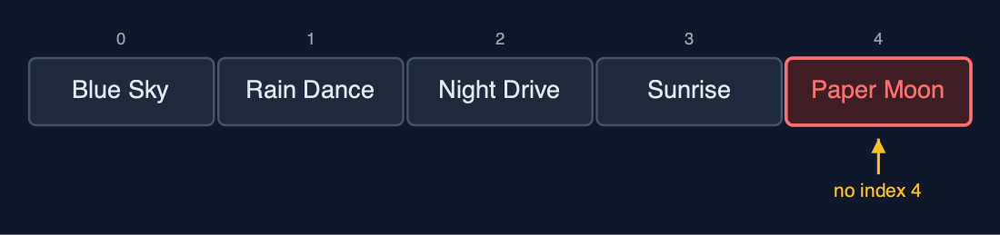
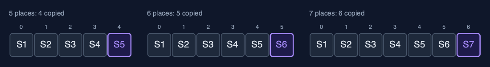
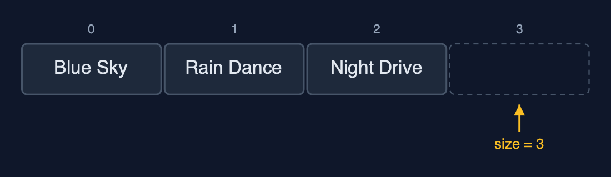
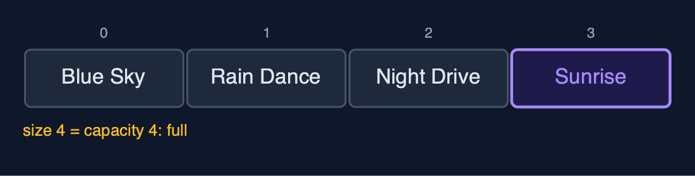
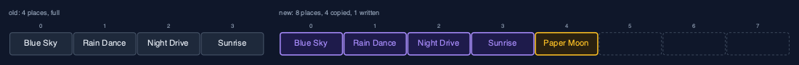
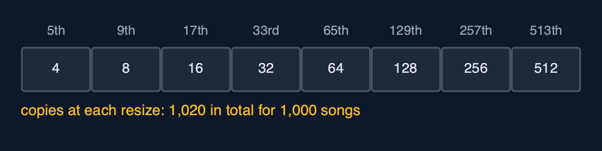
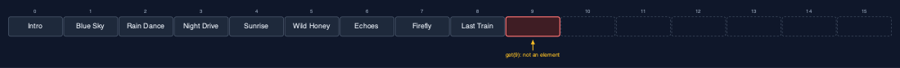
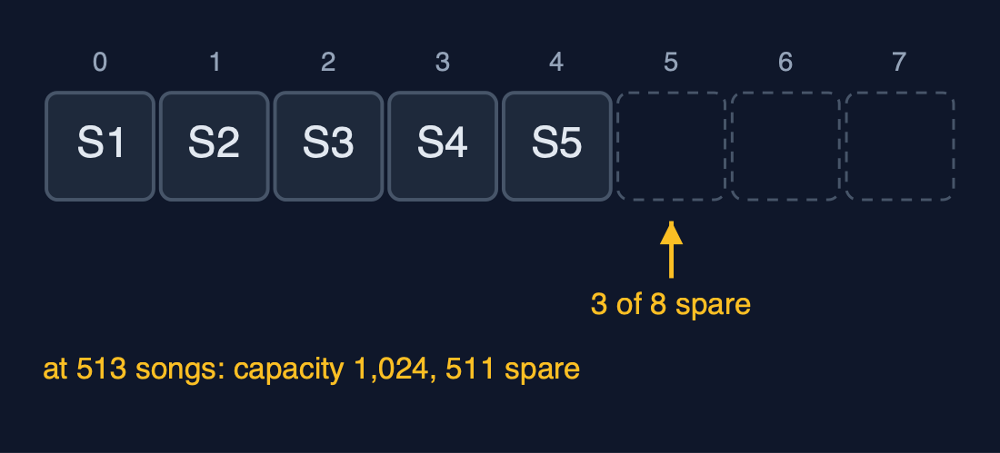

# Dynamic Array, Explained

## In one sentence

A dynamic array is an ordinary array with spare places, which it swaps for one twice as big and copies across whenever it runs out of room, so adding at the end costs one step on average.

## The picture


*size 5, capacity 8: five songs in use and three spare places, dashed*

## The everyday idea

Think of a family moving house. They buy a house with a few spare bedrooms. Each new child takes a spare room, and nothing else changes. When every room is full, they move to a house twice the size, carrying every belonging across in one big move. Moving is hard work, but because the new house is twice as big, it will be a long time before they have to move again. That is a dynamic array: cheap to add to almost every time, and an occasional big move.

## The 5 acts

### Act 1: A playlist in a fixed array

The playlist starts in a plain array of four places. Four songs fill it, and the fifth fails with `ArrayIndexOutOfBoundsException: Index 4 out of bounds for length 4`: an array's length never changes. The obvious fix is to make a new array one place bigger for every song, copying everything across each time. It works, but the copies pile up: the fifth song copies four, the sixth copies five, the seventh copies six, and 1,000 songs copy 499,494 values in total. Each append gets slower as the list grows.



**Four places, four songs, and no index 4 for the fifth** Here is the full array. Four places, numbered zero to three, and four songs. The fifth song would need index four, which does not exist. So the program stops.



**Growing by one: the fifth song copies 4, the sixth copies 5, the seventh copies 6** Growing by one place each time means copying everything, every time. The fifth song copies four. The sixth copies five. The seventh copies six. The copies grow with the array, and a thousand songs cost four hundred and ninety nine thousand, four hundred and ninety four of them.

What the demo printed:

```
String[] playlist = new String[4]: Blue Sky, Rain Dance, Night Drive, Sunrise
a fifth song: ArrayIndexOutOfBoundsException: Index 4 out of bounds for length 4
growing by one place each time, 1,000 songs cost 499,494 copies
```

### Act 2: Size and capacity

The dynamic array holds an ordinary array inside and two numbers about it. The **capacity** is how many places the inside array has; the **size** is how many are in use. After three songs, the capacity is 4 and the size is 3: one spare place, drawn dashed. Adding a song writes it into index `size` and adds one to the size: one step, no copying. After the fourth song the size equals the capacity, and the array is full.



**Capacity 4, size 3: one spare place, drawn dashed** Here it is. Four places inside, and three songs. The dashed place is spare. It is not part of the array yet. The size, three, points at it: that is where the next song will go.



**Add Sunrise: written into index 3, size becomes 4. One step, and now full** Adding Sunrise writes it into index three, and the size becomes four. One step. No copying. But now the size equals the capacity. There are no spare places left.

What the demo printed:

```
capacity 4, size 3: [Blue Sky, Rain Dance, Night Drive]
append("Sunrise"): 1 step, capacity 4, size 4, now full
```

### Act 3: Full? Double it

Adding "Paper Moon" to the full array triggers a resize: a new array of 8 places, twice the capacity, and the four songs copied across one by one, then the new song written. The next three songs each take one step. The ninth song finds the array full again and doubles it to 16, copying 8. Nine songs, two resizes, 12 copies. Because each resize doubles the room, resizes get rarer as the array grows: for 1,000 songs the copies add up to 4 + 8 + 16 + ... + 512 = 1,020, about one per song, against 499,494 when growing by one place. That is why adding is called one step "amortised": an occasional big copy, spread over many cheap appends.



**The resize: a new array of 8, the 4 songs copied across, then Paper Moon written** Here is the resize. The old array of four, and the new array of eight. The four songs are copied across, in purple. Paper Moon goes into index four. And now there are three spare places, so the next three songs cost one step each.



**Doubling: copies of 4, then 8, then 16 ... 1,000 songs cost 1,020 copies, about 1 each** Why is doubling so much cheaper? Because each resize buys as much room as everything copied so far. Four copies buy four free appends. Eight copies buy eight. For a thousand songs, the copies add up to one thousand and twenty. About one per song. Growing by one place cost almost five hundred times as much.

What the demo printed:

```
append("Paper Moon"): full, new array of 8 places, 4 songs copied, then 1 write
3 more songs: 1 step each, capacity 8, size 8
append("Last Train"): full again, new array of 16 places, 8 songs copied
9 songs appended, 2 resizes, 12 copies in total
1,000 appends by doubling: 1,020 copies, about 1 per song (growing by one: 499,494)
```

### Act 4: The middle, and the spare places

Adding at the end is cheap, but the middle is as costly as in any array. Inserting "Intro" at the front shifts all nine songs one place to the right. Deleting index 5, "Paper Moon", shifts the four songs after it one place to the left. After that the capacity is 16 and the size is 9, so 7 places are spare. Those spare places are not part of the array: `get(9)` throws `IndexOutOfBoundsException: Index 9 out of bounds for length 9`, because the array holds nine songs even though the array inside has sixteen places. When no more songs are coming, `shrinkToFit` makes an array of exactly 9 places and copies the 9 songs into it, giving the spare memory back.


**Insert Intro at index 0: all 9 songs shifted one place right** To put the intro in index zero, every song must shift one place to the right, starting from the last. Nine shifts. The dynamic array made adding at the end cheap, but the front is still expensive.



**Size 9, capacity 16: the 7 dashed places are spare, and get(9) is refused** After deleting one song, nine remain, in an array of sixteen places. The seven dashed places are spare. Asking for index nine is refused, because the array only holds nine songs, numbered zero to eight. Capacity is room. Size is what is stored.

What the demo printed:

```
insertAt(0, "Intro"): 9 songs shifted right
deleteAt(5) removed "Paper Moon": 4 songs shifted left
capacity 16, size 9: 7 places spare
get(9), a spare place: IndexOutOfBoundsException: Index 9 out of bounds for length 9
shrinkToFit(): capacity 9, 9 songs copied
```

### Act 5: The bill

Doubling has two costs. The first is memory: just after a resize, almost half the places are spare. At 513 songs the capacity is 1,024, so 511 places hold nothing. The second is the occasional slow append: most appends are one step, but the one that finds the array full copies everything. Adding the 513th song copies all 512 before it. Averaged over all the appends it is still about one step each, but a program that must never pause, such as live audio, may notice that one append. Deleting gives memory back: when `deleteAtEnd` leaves only a quarter of the array in use, 256 of 1,024, the capacity halves to 512. Java's `ArrayList` makes the same trade when growing, starting at 10 places and growing by half each time rather than doubling, which wastes less memory at the price of a few more copies; it never shrinks by itself.



**Just after a resize, nearly half the places are spare** Here is the memory cost, drawn small. Five songs, just after a resize to eight places: three are spare. At five hundred and thirteen songs, it is five hundred and eleven. Doubling trades memory for speed.

What the demo printed:

```
the one append that resizes at 512 songs copies 512 of them
513 songs: capacity 1024, 511 places spare, almost half
deleteAtEnd down to 256 songs, a quarter of 1024: capacity halves to 512 (1 resize)
already in Java: java.util.ArrayList, which starts at 10 places and grows by half each time
```

## The operations in code

### Insertion at the end

```java
/** Insertion at the end: one write, after a resize when full. O(1) amortised, O(n) worst case. */
public void append(String value) {
    checkValue(value);
    if (size == arr.length) {
        resize(newCapacity());
    }
    arr[size] = value;
    steps.write();
    size++;
}
```

If `size == arr.length` the array is full, so it is replaced by a bigger one first; then the value goes into `arr[size]` and the size grows by one. Most appends are one write; the rare one that resizes costs O(n).

### Resize

```java
private int newCapacity() {
    if (!doubling) {
        return arr.length + 1;
    }
    return arr.length == 0 ? 1 : arr.length * 2;
}

/** Allocates a new array of {@code newCapacity} places and copies the elements across. O(n). */
private void resize(int newCapacity) {
    String[] newArr = new String[newCapacity];
    for (int i = 0; i < size; i++) {
        newArr[i] = arr[i];
        steps.copy();
    }
    arr = newArr;
    resizes++;
}
```

`newCapacity` doubles (or, for the measured comparison, appends one place). `resize` allocates the new array and copies the elements one by one; the old array becomes garbage. Because each resize doubles the room, the copies over n appends add up to less than 2n: O(1) amortised per append.

### Deletion at the end, and shrinking

```java
/**
 * Deletion at the end: O(1), apart from the occasional shrink.
 *
 * @throws IllegalStateException "underflow" when the array is empty
 */
public String deleteAtEnd() {
    if (isEmpty()) {
        throw new IllegalStateException("underflow: the array is empty");
    }
    String deleted = arr[size - 1];
    arr[size - 1] = null;          // clear the freed place so the string can be garbage-collected
    size--;
    shrinkIfQuarterFull();
    return deleted;
}

/** Halves the capacity when only a quarter is in use, so the next append cannot resize at once. */
private void shrinkIfQuarterFull() {
    if (doubling && size > 0 && size == arr.length / 4) {
        resize(arr.length / 2);
    }
}
```

The freed place is set to `null` so the string can be garbage-collected. When only a quarter of the array is in use, the capacity is halved. Halving at a quarter rather than at a half leaves room both ways, so appends and deletions alternating at the boundary cannot resize every time.

### Insertion at a position

```java
/**
 * Insertion at {@code pos}: resize when full, shift arr[pos..size-1] one place right, starting
 * from the end, then store the value. O(n - pos).
 */
public void insertAt(int pos, String value) {
    checkValue(value);
    if (pos < 0 || pos > size) {
        throw new IndexOutOfBoundsException("position " + pos + " outside 0.." + size);
    }
    if (size == arr.length) {
        resize(newCapacity());
    }
    for (int i = size - 1; i >= pos; i--) {
        arr[i + 1] = arr[i];
        steps.shift();
    }
    arr[pos] = value;
    steps.write();
    size++;
}
```

Resize first if full, then the same shift as a static array: from the end down to `pos`, so no element is overwritten before it has shifted.

## The operations, and what they cost

| Operation | What it does | Time: best / average / worst | Extra space | Steps counted in the demo |
| --- | --- | --- | --- | --- |
| Traverse | Visit arr[0] to arr[size-1] once | O(n) / O(n) / O(n) | O(1) | one read per element |
| Access `get(i)` | Return arr[i], by address calculation | O(1) / O(1) / O(1) | O(1) | 1 step |
| Update `update(i, x)` | Replace arr[i] | O(1) / O(1) / O(1) | O(1) | 1 step |
| Insert at end `append(x)` | Store x at arr[size]; resize to double first when full | O(1) / O(1) amortised / O(n) when it resizes | O(1) amortised; O(n) for the new array during a resize | 1 write usually; 1,020 copies over 1,000 appends |
| Resize (inside append) | Allocate an array of twice the capacity and copy every element | O(n) / O(n) / O(n), but rare | O(n) | 4 copies at the 5th song, 8 at the 9th, 512 at the 513th |
| Insert `insertAt(pos, x)` | Shift arr[pos..size-1] right, store x | O(1) at the end / O(n) / O(n) at the front | O(1), plus a resize when full | 9 shifts to insert at the front of 9 songs |
| Delete at end `deleteAtEnd()` | Clear arr[size-1]; halve the capacity when a quarter full | O(1) / O(1) amortised / O(n) when it shrinks | O(1) amortised | 0 shifts; 1 resize going from 513 songs down to 256 |
| Delete `deleteAt(pos)` | Shift arr[pos+1..size-1] left | O(1) at the end / O(n) / O(n) at the front | O(1) | 4 shifts to delete index 5 of 10 |
| Linear search | Compare each element with the key in turn | O(1) / O(n) / O(n) | O(1) | one comparison per element looked at |
| Shrink to fit | Resize to exactly size places | O(n) / O(n) / O(n) | O(n) | 9 copies for 9 songs |

## Compared with related structures

How a dynamic array compares with the structures it is usually weighed against (n elements):

| Operation | Dynamic array | Static array | Singly linked list |
| --- | --- | --- | --- |
| Access element i | O(1) | O(1) | O(n) |
| Insert at the end | O(1) amortised, O(n) on a resize | O(1), overflow when full | O(1) with a tail pointer |
| Insert or delete at the front | O(n) shifts | O(n) shifts | O(1) |
| Search (unsorted) | O(n) | O(n) | O(n) |
| Size | grows and shrinks by copying | fixed at creation | grows one node at a time |
| Extra memory | up to half the places spare after a resize | capacity - n places | one next pointer per node |
| Memory layout | consecutive | consecutive | scattered nodes |

## The verdict

Use a dynamic array as your default sequence: fast reads by position, cheap appends at the end, and compact memory. In real Java code that means `ArrayList`. Reach for something else when you work at the front or the middle a lot, or when no single operation may ever pause.

## How to recognise it in code you did not write

- A field array plus a `size` or `count` field that is smaller than the array's length.
- `if (size == data.length) grow();` before storing a value.
- A new array of `length * 2` (or `length + length / 2`) and a copy loop.

## Where you have already met this

- `java.util.ArrayList`, the most used collection in Java, is a dynamic array.
- `StringBuilder` grows its character array the same way when you append.
- Python's `list` and C++'s `std::vector` work the same way underneath.
