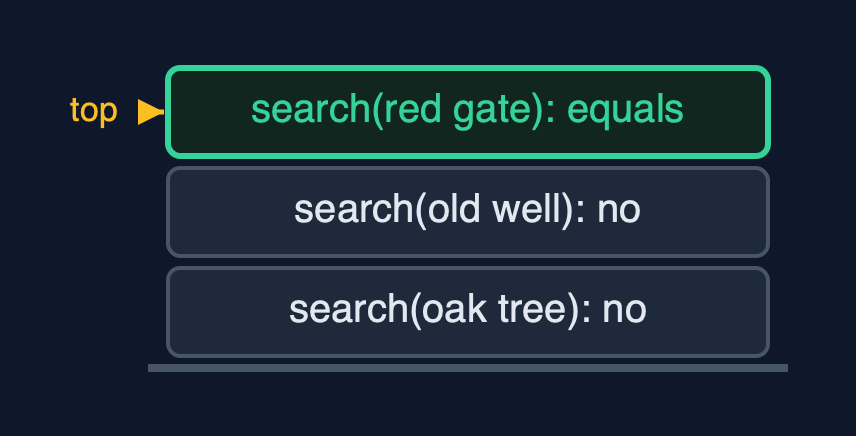
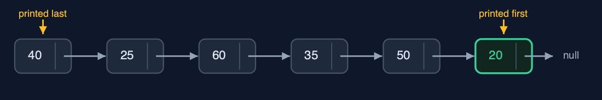
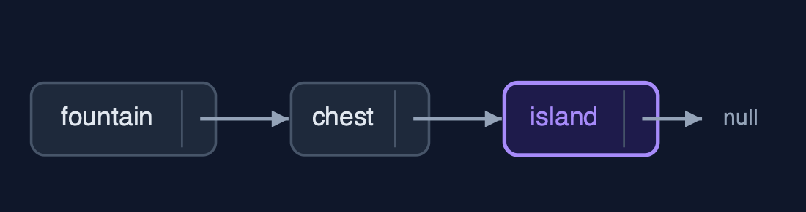
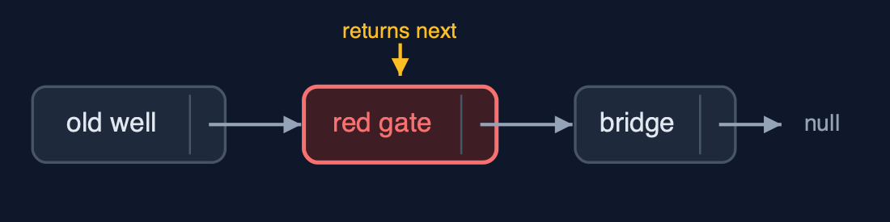

# Singly Linked List (Generic, Recursive), Explained

## In one sentence

The generic recursive singly linked list matches Node<T> data with equals and walks by calling itself on node.next, so it holds any type, keeps the loop version's time, and uses a frame per node visited.

## The picture


*search(new Clue("the red gate", 60)): each call asks equals, then passes the rest on*

## The everyday idea

Picture the line of finders from the recursive list, one per clue, but now each holds a card that could be anything: a place, a number, a photograph. You hand the first finder a card and ask where the matching one is. They compare their card with yours; if it does not match, they pass the question to the next finder and wait. Each finder only needs to know how to compare two cards of that kind.

## The 5 acts

### Act 1: Recursion over Node<T>, with equals

The recursive search asks one question per call: does this node's data equal the key? The key is a new `Clue("the red gate", 60)`, a different object from the one in the list. At the oak tree and the old well the answer is no, so each call searches the rest and waits. At the red gate, `equals` compares place and metres and says yes: a base case, returning position 2. Three calls were waiting at the deepest point.



**Three search calls; the third finds an equal Clue** Here is the call stack. Two calls that did not match, waiting. And the third, which found the red gate.

What the demo printed:

```
search(the oak tree (40 m)): not equal -> search(rest)
  search(the old well (25 m)): not equal -> search(rest)
    search(the red gate (60 m)): equals -> position 2   <- base case: found
search(new Clue("the red gate", 60)) = position 2: 3 equals calls, depth 3
```

### Act 2: The same recursion, any type

The same recursive methods work for every `T`. Counting six distances and counting six place names both go six calls deep. `displayReverse` on the distances prints 20 first and 40 last, because each call prints its node after the call on the rest returns.



**The distances, displayed in reverse: the deepest call prints first** Here are the distances. The last node's call prints first, twenty, and the head's call prints last, forty.

What the demo printed:

```
<Integer> count() = 6, depth 6
<Integer> displayReverse(): 20 <- 50 <- 35 <- 60 <- 25 <- 40 <- (head)
<String>  count() = 6, depth 6
```

### Act 3: Insertion, recursively

`insertAtEnd(the island)` recurses along six nodes; the base case, the empty list after the chest, returns `new Node<>(clue, null)`, and the chest's call stores it in its `next`. `insertAtPosition(1, the mill)` recurses once, then at position 0 of the rest returns a new node that points to the old well: 2 pointer changes.



**The island replaces the empty list after the chest** Here is the end of the list. The chest's next was null. The base case returned the island, and the chest stored it.

What the demo printed:

```
insertAtEnd(the island (70 m)): depth 6; the empty list at the end is replaced by the new node
insertAtPosition(1, the mill (30 m)): depth 1, 2 pointers changed
```

### Act 4: Deletion and reversal, recursively

`deleteByKey(new Clue("the red gate", 60))` compares four nodes with `equals`; the matching call returns `node.next`, the bridge, and the old well stores it: the red gate is skipped. `deleteAtEnd` recurses to the island, whose call returns `null`. Reversing the six place names goes five calls deep and returns the chest as the new head.



**deleteByKey: the red gate's call returns the bridge; the old well stores it** Here is the deletion. The old well now points to the bridge, and the red gate is gone.

What the demo printed:

```
deleteByKey(new Clue("the red gate", 60)) = true: 4 equals calls, depth 4; the matching call returns node.next
deleteAtEnd() = the island (70 m): depth 6
<String> reverse(): depth 5; head -> the chest -> ... -> the oak tree -> null
```

### Act 5: The limit of recursion

A million-node list built with `insertAtBeginning` needs no recursion. Counting it recursively needs a frame per node, and Java throws `StackOverflowError`. Generics change what each node refers to; recursion changes how much stack each walk needs.


**One frame per node: a million-node count overflows** One count call per node. Far too many.

What the demo printed:

```
count() of 1,000,000 nodes: StackOverflowError, one frame per node
generics change what each node refers to; recursion changes how much stack each walk needs
```

## The operations in code

### Search with equals

```java
/** Search: -1 in the empty list, pos if this node holds the key, otherwise search the rest. O(n). */
public int search(T key) {
    return search(head, key, 0);
}

private int search(Node<T> node, T key, int pos) {
    if (node == null) {
        return -1;                 // base case: not found
    }
    steps.enter();
    steps.compare();
    int result = node.data.equals(key) ? pos : search(node.next, key, pos + 1);
    steps.exit();
    return result;
}
```

Two base cases: the empty list (-1) and a match found with `equals`. Otherwise search the rest with position + 1. A separately made `Clue` with the same fields matches.

### Deletion by key

```java
/**
 * Deletion by key: if this node holds the key, the list becomes the rest; otherwise delete from
 * the rest. O(n) time and stack.
 *
 * @return true if a node was deleted
 */
public boolean deleteByKey(T key) {
    boolean[] found = new boolean[1];
    head = deleteByKey(head, key, found);
    return found[0];
}

private Node<T> deleteByKey(Node<T> node, T key, boolean[] found) {
    if (node == null) {            // base case: not found
        return null;
    }
    steps.enter();
    steps.compare();
    Node<T> result;
    if (node.data.equals(key)) {   // base case: skip this node
        found[0] = true;
        steps.pointer();
        result = node.next;
    } else {
        node.next = deleteByKey(node.next, key, found);
        result = node;
    }
    steps.exit();
    return result;
}
```

The call whose node matches returns `node.next` in its place; the caller stores it in its own `next`, and the node is skipped. No `prev` pointer is needed.

### Insertion at the end

```java
/** Insertion at the end: the end of the empty list is a new node; otherwise insert into the rest. O(n). */
public void insertAtEnd(T data) {
    head = insertAtEnd(head, data);
}

private Node<T> insertAtEnd(Node<T> node, T data) {
    if (node == null) {            // base case: reached the end
        steps.pointer();
        return new Node<>(data, null);
    }
    steps.enter();
    steps.step();
    node.next = insertAtEnd(node.next, data);
    steps.exit();
    return node;
}
```

The empty list at the end is replaced by `new Node<>(data, null)`. Each call stores the result in `node.next` and returns `node`.

## The operations, and what they cost

| Operation | What it does | Time: best / average / worst | Extra space (call stack) | Same operation as a loop | Steps counted in the demo |
| --- | --- | --- | --- | --- | --- |
| Display / display in reverse / count | This node and the rest, recursively | O(n) / O(n) / O(n) | O(n) | O(1) | depth 6 for 6 nodes |
| Insert / delete at beginning | Change head; no recursion | O(1) / O(1) / O(1) | O(1) | O(1) | 2 and 1 pointer changes |
| Insert at end / at position | Recurse to the empty list (or position 0 of the rest), return the new node | O(n) / O(n) / O(n) | O(n), O(pos) | O(1) | depth 6; depth 1 for position 1 |
| Delete at end | The last node is replaced by null | O(n) / O(n) / O(n) | O(n) | O(1) | depth 6 on 7 nodes |
| Delete by key | The matching call returns node.next (equals) | O(1) / O(n) / O(n) | O(n) | O(1) | 4 equals calls, depth 4 |
| Search / get | equals here, or search the rest | O(1) / O(n) / O(n) | O(n) | O(1) | 3 equals calls, depth 3 |
| Reverse | Reverse the rest, hang this node on its end | O(n) / O(n) / O(n) | O(n) | O(1) | depth 5 on 6 nodes |

## Compared with related structures

The four singly-linked-list projects side by side (n nodes):

| Property | Generic, recursive (this) | Generic, loops | String, recursive | String, loops |
| --- | --- | --- | --- | --- |
| Element types | any T | any T | String | String |
| Insert / delete at the beginning | O(1) | O(1) | O(1) | O(1) |
| Walks (search, count, at end) | O(n) time and stack | O(n) time, O(1) space | O(n) time and stack | O(n) time, O(1) space |
| Matching | equals | equals | equals | equals |
| A million nodes | StackOverflowError | fine | StackOverflowError | fine |

## The verdict

The bridge to generic recursive trees; for long lists in real code, use loops.

## How to recognise it in code you did not write

- `private int search(Node<T> node, T key, int pos)` calling `search(node.next, key, pos + 1)`.
- `node.data.equals(key)` inside a recursive method.

## Where you have already met this

- `singly-linked-list-generic` and `singly-linked-list-recursive`.
- Generic recursive methods such as `<T> int count(Node<T> node)` in textbooks.
