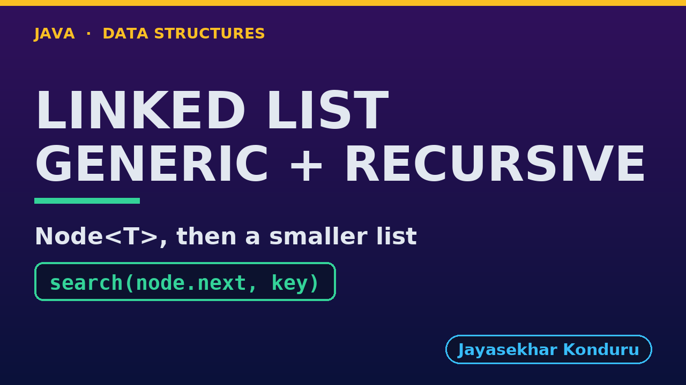

# YouTube — Singly Linked List (Generic, Recursive)

Everything needed to publish `video/singly-linked-list-generic-recursive-explained.mp4`. Copy the fields straight out of this file.

Chapter timings come from the video's `.srt`; they are regenerated whenever the video is rebuilt.

## Title

```
Generic Recursive Linked List in Java - Node<T>, equals and Recursion
```

69 characters (YouTube shows about 60 before cutting a title off in search).

## Description

The first two lines are what a viewer sees above the fold, so they carry the hook rather than the boilerplate.

```
Generic Recursive Singly Linked List in Java, explained with a treasure hunt of Clue records. We trace a recursive search for a separately made Clue("the red gate", 60): each call asks equals, and on no match searches the rest, until the match at depth 3. We count and print backwards a list of Integers with the same recursion, insert at the end by replacing the empty list at the end with a new node, delete by key by returning node.next from the matching call, delete at the end, and reverse a list of Strings recursively. We finish at the limit: counting a million nodes throws a real StackOverflowError.

CHAPTERS
00:00 Introduction
00:44 The Everyday Idea
01:11 The Words
01:34 Act One — Recursion over Node<T>, with equals
01:59 Recursion over Node<T>, with equals
02:09 Act Two — The same recursion, any type
02:29 The same recursion, any type
02:38 Act Three — Insertion, recursively
02:59 Insertion, recursively
03:09 Act Four — Deletion and reversal, recursively
03:31 Deletion and reversal, recursively
03:39 Act Five — The limit of recursion
03:58 The limit of recursion
04:02 Time and Space Complexity
04:25 The Four Singly Linked Lists
04:44 Common Mistakes
04:58 Thanks for Watching

SOURCE CODE, WRITTEN NOTES AND AN INTERACTIVE ANIMATION
https://github.com/jk-boot-up/datastructures/tree/main/gradle-java/arrays-and-lists/singly-linked-list-generic-recursive

WHAT YOU NEED FIRST
Java basics: variables, loops, classes and methods. No data-structures knowledge is assumed; START-HERE.md in the repository explains memory, references and counting steps.
```

## Chapters

YouTube shows these as chapters because there are at least three and the first is at `00:00`.

```
00:00 Introduction
00:44 The Everyday Idea
01:11 The Words
01:34 Act One — Recursion over Node<T>, with equals
01:59 Recursion over Node<T>, with equals
02:09 Act Two — The same recursion, any type
02:29 The same recursion, any type
02:38 Act Three — Insertion, recursively
02:59 Insertion, recursively
03:09 Act Four — Deletion and reversal, recursively
03:31 Deletion and reversal, recursively
03:39 Act Five — The limit of recursion
03:58 The limit of recursion
04:02 Time and Space Complexity
04:25 The Four Singly Linked Lists
04:44 Common Mistakes
04:58 Thanks for Watching
```

## Tags

```
generic linked list, recursive linked list, java generics, recursion, Node<T>, call stack, data structures, java data structures, java, java 25, algorithms, computer science, programming tutorial, beginner, big o
```

212 characters, under YouTube's 500 limit.

## Thumbnail



Upload `docs/thumbnail.png` (1280×720) under **Details → Thumbnail → Upload file**. It is made for the small size YouTube shows in search: the name, one line of promise and one piece of code.

## Upload checklist

- [ ] Upload `video/singly-linked-list-generic-recursive-explained.mp4` (1080p, H.264, 30 fps, AAC 48 kHz)
- [ ] Set the video language to **English**, then add subtitles: *Upload file → With timing* → `video/singly-linked-list-generic-recursive-explained.srt`
- [ ] Upload `docs/thumbnail.png` as the thumbnail
- [ ] Paste the title, description and tags from above
- [ ] Add to the **Data Structures in Java** playlist
- [ ] Wait for 1080p processing before sharing the link

## Runtime

05:42.
