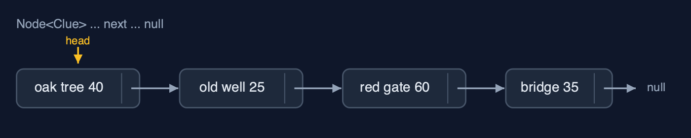
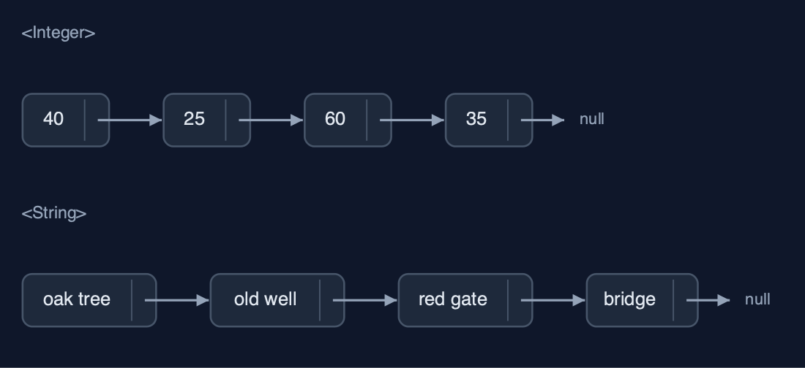
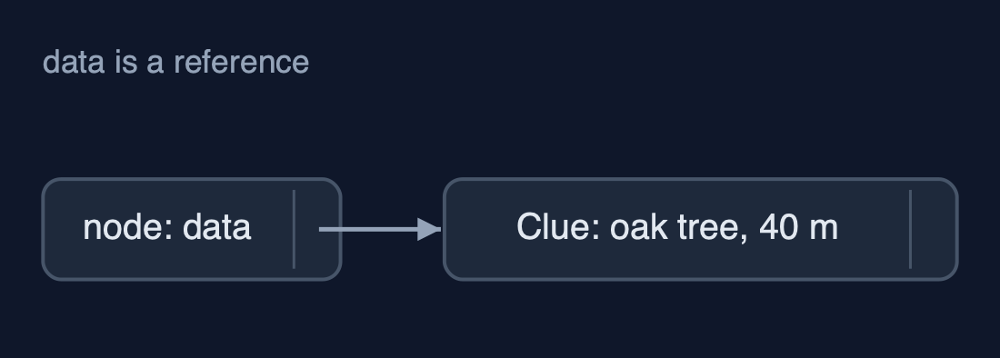
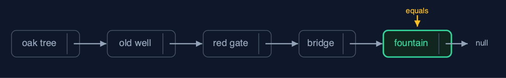
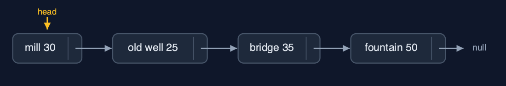
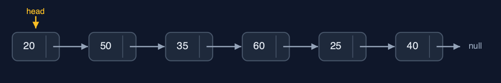

# Singly Linked List (Generic), Explained

## In one sentence

A generic singly linked list is the singly linked list with a type parameter: each Node<T> refers to a T and to the next node, elements are matched with equals, and every operation keeps its cost.

## The picture



*GenericSinglyLinkedList<Clue>: each Node<Clue> refers to a Clue and to the next node*

## The everyday idea

Picture the treasure-hunt trail again, but now each signpost holds a slip that says where the prize for this stop is kept, rather than the prize itself, plus the direction to the next signpost. The trail does not care whether the prizes are coins, books or maps: the signposts work the same for all. To ask whether a stop has "the fountain, 50 metres", you compare what the slip describes, not the slip itself.

## The 5 acts

### Act 1: One class, any element type

`GenericSinglyLinkedList<String>` holds the six place names, `GenericSinglyLinkedList<Integer>` the distances between clues in metres, and `GenericSinglyLinkedList<Clue>` records of our own, each a place and a distance. All three are built with `insertAtBeginning`, and displayed by the same loop. The type argument is checked by the compiler: `metres.insertAtEnd("far")` is refused before the program runs.



**Two of the three lists: Integer distances and String places, from the same class** Here are two of the lists. Distances, and place names. The same nodes, the same next pointers, different data.

What the demo printed:

```
<String>:  head -> the oak tree -> ... -> the chest -> null
<Integer>: head -> 40 -> 25 -> 60 -> 35 -> 50 -> 20 -> null
<Clue>:    head -> the oak tree (40 m) -> ... -> the chest (20 m) -> null
one class, three element types; metres.insertAtEnd("far") does not compile
```

### Act 2: Node<T>: data is a reference

Each `Node<Clue>` holds two references: `data`, to a `Clue` object stored elsewhere, and `next`, to the following node. Counting still means following next pointers from the head: 6 steps for 6 clues. The head's `data` is the very `Clue` object that was inserted; the node refers to it and holds no copy. Unlike a generic array, a linked list needs no cast: every node is created as `new Node<>(data, null)`.



**A Node<Clue>: data refers to a Clue object; next refers to the following node** Here is one node. Its data arrow goes to the clue. Its next arrow goes to the next node.

What the demo printed:

```
count() = 6: 6 steps; each Node<Clue> holds a reference to a Clue and a next pointer
head.data is the Clue object the oak tree (40 m); the node points at it, it does not contain a copy
```

### Act 3: Search and deletion with equals

A new `Clue("the fountain", 50)` is made and searched for. Search compares each node's data with `equals`, and a record's `equals` compares its fields, so it is found at position 4 after 5 comparisons, although `==` says it is a different object. Insertion and deletion are the plain list's pointer work: `insertAtPosition(1, the mill)` changes 2 pointers, and `deleteByKey(new Clue("the red gate", 60))` walks with `prev` and `current`, matching with `equals`, and changes 1 pointer.



**search with equals: positions 0 to 3 differ, position 4 equals the new Clue** Here is the search. Four clues that are not equal. The fifth, the fountain at fifty metres, is equal. Five comparisons.

What the demo printed:

```
search(new Clue("the fountain", 50)) = position 4: 5 comparisons; a record's equals compares place and metres
the same object? false: equals, not ==, is what matches
insertAtPosition(1, the mill (30 m)): 2 pointers changed
deleteByKey(new Clue("the red gate", 60)) = true: 4 comparisons, 1 pointer changed
```

### Act 4: Deleting at both ends

`deleteAtBeginning` moves `head` on one node: the oak tree is gone, 1 pointer changed. `deleteAtEnd` walks to the second-to-last node, 3 steps on 5 nodes, and sets its next to null: the chest is gone. Nothing refers to the removed nodes any more, so the garbage collector can free them, and the `Clue` objects too if nothing else refers to them. Deleting from an empty list is refused as an underflow.



**After both deletions: the mill is the head, the fountain the last node** Here is the list now. The mill is at the head, and the fountain's next is null.

What the demo printed:

```
deleteAtBeginning() = the oak tree (40 m): 1 pointer changed
deleteAtEnd() = the chest (20 m): 3 steps to the second-to-last node
no node refers to them now, so the garbage collector can free both nodes and both Clues
an empty list, deleteAtEnd(): underflow: the list is empty
```

### Act 5: The same algorithm for every type

`reverse` is the three-pointer loop of the plain list. On the six distances it turns six next pointers around and moves `head`: 7 pointer changes, giving 20, 50, 35, 60, 25, 40. On the six place names it does exactly the same, 7 changes. Every cost of the generic list equals the String-only list: generics change the element type, not the algorithm. Java's `java.util.LinkedList<E>` is generic in the same way, though it links both ways.



**The reversed distances: 20 -> 50 -> 35 -> 60 -> 25 -> 40 -> null** Here are the reversed distances. The last became the first, and no number moved.

What the demo printed:

```
<Integer> reverse(): 7 pointer changes; head -> 20 -> 50 -> 35 -> 60 -> 25 -> 40 -> null
<String>  reverse(): 7 pointer changes, the very same code
every cost equals the String-only list: generics change the type, not the algorithm
already in Java: java.util.LinkedList<E>, generic the same way (and linked both ways)
```

## The operations in code

### Insertion at the beginning

```java
/** Insertion at the beginning: the new node points to the old head, then becomes the head. O(1). */
public void insertAtBeginning(T data) {
    Node<T> newNode = new Node<>(data, null);
    newNode.next = head;
    steps.pointer();
    head = newNode;
    steps.pointer();
}
```

`Node<T>` holds `T data` and `Node<T> next`. Unlike an array, a linked list needs no `new T[n]`, so generics fit it with no casts at all: each node is created with `new Node<>(data, null)`, and the two pointer changes are exactly those of the String-only list.

### Search with equals

```java
/** Search: the position of the first node holding {@code key}, or -1. O(n). */
public int search(T key) {
    Node<T> current = head;
    int pos = 0;
    while (current != null) {
        steps.compare();
        if (current.data.equals(key)) {
            return pos;
        }
        current = current.next;
        steps.step();
        pos++;
    }
    return -1;
}
```

`current.data.equals(key)` compares contents, so a separately made `Clue("the fountain", 50)` is found. `current.data == key` would compare references and miss it.

### Deletion by key

```java
/**
 * Deletion by key: the first node holding {@code key}. Keeps a {@code prev} pointer one node
 * behind {@code current}, because the node before the deleted one must be changed. O(n).
 *
 * @return true if a node was deleted
 */
public boolean deleteByKey(T key) {
    Node<T> prev = null;
    Node<T> current = head;
    while (current != null) {
        steps.compare();
        if (current.data.equals(key)) {
            if (prev == null) {
                head = current.next;      // deleting the head
            } else {
                prev.next = current.next; // point past the deleted node
            }
            steps.pointer();
            return true;
        }
        prev = current;
        current = current.next;
        steps.step();
    }
    return false;
}
```

The same `prev` and `current` walk as the plain list, matching with `equals`. Once `prev.next` points past the node, nothing refers to it, and the garbage collector frees both the node and, if nothing else refers to it, its data.

## The operations, and what they cost

| Operation | What it does | Time: best / average / worst | Extra space | Steps counted in the demo |
| --- | --- | --- | --- | --- |
| Display / count | Follow next pointers from head to null | O(n) / O(n) / O(n) | O(1) | 6 steps for 6 clues |
| Insert at beginning | newNode.next = head; head = newNode | O(1) / O(1) / O(1) | O(1) | 2 pointer changes |
| Insert at end | Walk to the last node, link after it | O(n) / O(n) / O(n) | O(1) | n - 1 steps |
| Insert at position | Walk to prev; newNode.next = prev.next; prev.next = newNode | O(1) at 0 / O(n) / O(n) | O(1) | 2 pointer changes |
| Delete at beginning | head = head.next | O(1) / O(1) / O(1) | O(1) | 1 pointer change |
| Delete at end | Walk to the second-to-last node, set its next to null | O(n) / O(n) / O(n) | O(1) | 3 steps on 5 nodes |
| Delete by key / at position | Walk with prev and current (equals), then prev.next = current.next | O(1) at the head / O(n) / O(n) | O(1) | 4 comparisons, 1 pointer change |
| Search / get | Compare each node's data with equals / follow pos pointers | O(1) / O(n) / O(n) | O(1) | 5 comparisons to find position 4 |
| Reverse | prev, current, next: turn each next pointer around | O(n) / O(n) / O(n) | O(1) | 7 pointer changes on 6 nodes |

## Compared with related structures

The generic singly linked list against its neighbours (n nodes):

| Property | Generic singly list | Singly list of String | Generic dynamic array |
| --- | --- | --- | --- |
| Element types | any T | String only | any T |
| Access position i | O(n) | O(n) | O(1) |
| Insert / delete at the beginning | O(1) | O(1) | O(n) shifts |
| Insert at the end | O(n) (O(1) with a tail) | O(n) (O(1) with a tail) | O(1) amortised |
| Matches elements with | equals | equals | equals |
| Needs a cast inside | no: nodes are created as Node<T> | no | yes: (T[]) new Object[n] |
| Java's own | LinkedList<E> (doubly linked) |  | ArrayList<E> |

## The verdict

This is how every node-based structure is written in Java; learn it here, then reuse it for stacks, queues and trees. For a ready-made list, `LinkedList<E>` or, usually better, `ArrayList<E>`.

## How to recognise it in code you did not write

- `class Node<T> { T data; Node<T> next; }`.
- `new Node<>(data, null)` with no cast.
- `current.data.equals(key)` in a walk.

## Where you have already met this

- `java.util.LinkedList<E>` and every other generic collection.
- `Node<T>` in almost every textbook's generic list, stack and queue.
